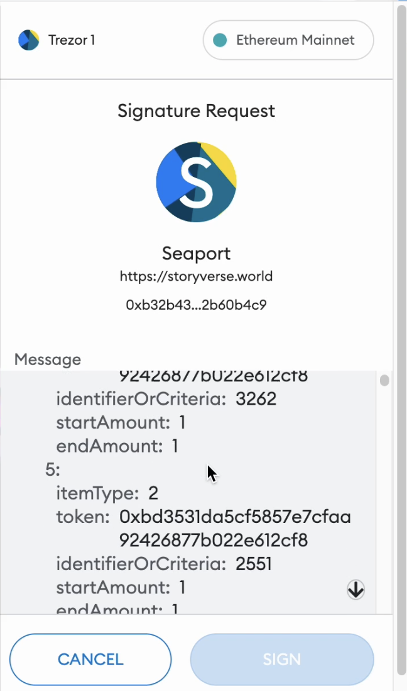
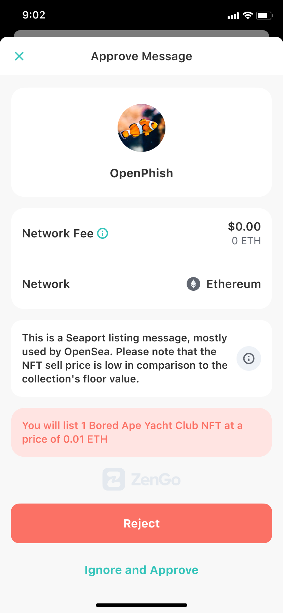

## Abstract

This EIP introduces the `evalEIP712Buffer` function, which takes an [EIP-712](./eip-712.md) buffer and returns a human-readable text description.

## Motivation

The use case of Web3 off-chain signatures intended to be used within on-chain transaction is gaining traction and being used in multiple leading protocols (e.g. OpenSea) and standards [EIP-2612](./eip-2612.md), mainly as it offers a fee-less experience.
Attackers are known to actively and successfully abuse such off-chain signatures, leveraging the fact that users are blindly signing off-chain messages, since they are not humanly readable.
While [EIP-712](./eip-712.md) originally declared in its title that being ”humanly readable” is one of its goals, it did not live up to its promise eventually and EIP-712 messages are not understandable by an average user.

In one example, victims browse a malicious phishing website. It requests the victim to sign a message that will put their NFT token for sale on OpenSea platform, virtually for free.

The user interface for some popular wallet implementations is not conveying the actual meaning of signing such transactions.

In this proposal we offer a secure and scalable method to bring true human readability to EIP-712 messages by leveraging their bound smart contracts.
As a result, once implemented this EIP wallets can upgrade their user experience from current state:



to a much clearer user experience:



The proposed solution solves the readability issues by allowing the wallet to query the `verifyingContract`. The incentives for keeping the EIP-712 message description as accurate as possible are aligned, as the responsibility for the description is now owned by the contract, that:

- Knows the message meaning exactly (and probably can reuse the code that handles this message when received on chain)
- Natively incentivized to provide the best explanation to prevent a possible fraud
- Not involving a third party that needs to be trusted
- Maintains the fee-less customer experience as the added function is in “view” mode and does not require an on-chain execution and fees.
- Maintains Web3’s composability property

## Specification

The key words “MUST”, “MUST NOT”, “REQUIRED”, “SHALL”, “SHALL NOT”, “SHOULD”, “SHOULD NOT”, “RECOMMENDED”, “MAY”, and “OPTIONAL” in this document are to be interpreted as described in RFC 2119.

EIP-712 already formally binds an off-chain signature to a contract, with the `verifyingContract` parameter. We suggest adding a “view” function (`"stateMutability":"view"`) to such contracts, that returns a human readable description of the meaning of this specific off-chain buffer.

```solidity
/**
 * @dev Returns the expected result of the offchain message.
*/

     function evalEIP712Buffer(bytes32 domainHash, string memory primaryType, bytes memory typedDataBuffer)
     external
     view
     returns (string[] memory) {
   ...

}
```

**Every compliant contract MUST implement this function.**

Using this function, wallets can submit the proposed off-chain signature to the contract and present the results to the user, allowing them to enjoy an “on-chain simulation equivalent” experience to their off-chain message.

This function will have a well known name and signature, such that there is no need for updates in the EIP-712 structure.

### Function's inputs

The inputs of the function:

- `domainHash` is the EIP-712's domainSeparator, a hashed `eip712Domain` struct.
- `primaryType`is the EIP-712's `primaryType`.
- `typedDataBuffer` is an ABI encoded message part of the EIP-712 full message.

### Function's output(s)

The output of the the function is an array of strings. The wallet SHOULD display them to its end-users. The wallet MAY choose to augment the returned strings with additional data. (e.g. resolve contract addresses to their name)

The strings SHOULD NOT be formatted (e.g. should not contain HTML code) and wallets SHOULD treat this string as an untrusted input and handle its rendering as such.

### Support for EIP-712 messages that are not meant to be used on-chain

If `verifyingContract` is not included in the EIP-712 domain separator, wallets MUST NOT retrieve a human-readable description using this EIP. In this case, wallets SHOULD fallback to their original EIP-712 display.

## Rationale

- We chose to implement the `typeDataBuffer` parameter as abi encoded as it is a generic way to pass the data to the contract. The alternative was to pass the `typedData` struct, which is not generic as it requires the contract to specify the message data.
- We chose to return an array of strings and not a single string as there are potential cases where the message is composed of multiple parts. For example, in the case of a multiple assets transfers in the same `typedDataBuffer`, the contract is advised to describe each transfer in a separate string to allow the wallet to display each transfer separately.

### Alternative solutions

#### Third party services:

Currently, the best choice for users is to rely on some 3rd party solutions that get the proposed message as input and explain its intended meaning to the user. This approach is:

- Not scalable: 3rd party provider needs to learn all such proprietary messages
- Not necessarily correct: the explanation is based on 3rd party interpretation of the original message author
- Introduces an unnecessary dependency of a third party which may have some operational, security, and privacy implications.

#### Domain name binding

Alternatively, wallets can bind domain name to a signature. i.e. only accept EIP-712 message if it comes from a web2 domain that its `name` as defined by EIP-712 is included in `eip712Domain`. However this approach has the following disadvantages:

- It breaks Web3’s composability, as now other dapps cannot interact with such messages
- Does not protect against bad messages coming from the specified web2 domain, e.g. when web2 domain is hacked
- Some current connector, such as WalletConnect do not allow wallets to verify the web2 domain authenticity

## Backwards Compatibility

For non-supporting contracts the wallets will default to showing whatever they are showing today.
Non-supporting wallets will not call this function and will default to showing whatever they are showing today.

## Reference Implementation

A reference implementation can be found [here](../assets/eip-6384/implementation/src/MyToken/MyToken.sol).
This toy example shows how an [EIP-20](./eip-20.md) contract supporting this EIP implements an EIP-712 support for "transferWithSig" functionality (a non-standard variation on Permit, as the point of this EIP is to allow readability to non-standard EIP-712 buffers).
To illustrate the usability of this EIP to some real world use case, a helper function for the actual OpenSea's SeaPort EIP-712 is implemented too in [here](../assets/eip-6384/implementation/src/SeaPort/SeaPort712ParserHelper.sol).

## Security Considerations

### The threat model:

The attack is facilitated by a rogue web2 interface (“dapp”) that provides bad parameters for an EIP-712 formatted message that is intended to be consumed by a legitimate contract. Therefore, the message is controlled by attackers and cannot be trusted, however the contract is controlled by a legitimate party and can be trusted.

The attacker intends to use that signed EIP-712 message on-chain later on, with a transaction crafted by the attackers. If the subsequent on-chain transaction was to be sent by the victim, then a regular transaction simulation would have sufficed.

The case of a rogue contract is irrelevant, as such a rogue contract can already facilitate the attack regardless of the existence of the EIP-712 formatted message.

Having said that, a rogue contract may try to abuse this functionality in order to send some maliciously crafted string in order to exploit vulnerabilities in wallet rendering of the string. Therefore wallets should treat this string as an untrusted input and handle its renderring it as such.

### Analysis of the proposed solution

The explanation is controlled by the relevant contract which is controlled by a legitimate party. The attacker must specify the relevant contract address, as otherwise it will not be accepted by it. Therefore, the attacker cannot create false explanations using this method.
Please note that if the explanation was part of the message to sign it would have been under the control of the attacker and hence irrelevant for security purposes.

Since the added functionality to the contract has the “view” modifier, it cannot change the on-chain state and harm the existing functionalities of the contract.

## Copyright

Copyright and related rights waived via [CC0](../LICENSE.md).
