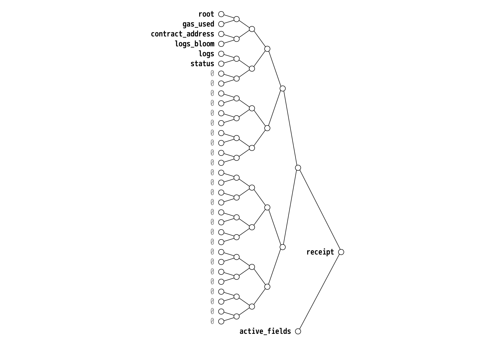

## Abstract

This EIP defines a migration process of [EIP-2718](./eip-2718.md) Recursive-Length Prefix (RLP) receipts to [Simple Serialize (SSZ)](https://github.com/ethereum/consensus-specs/blob/ef434e87165e9a4c82a99f54ffd4974ae113f732/ssz/simple-serialize.md)

## Motivation

RLP receipts have a number of shortcomings:

1. **Limited proving support:** Due to receipt data being linearly hashed as part of the `receipts_root` Merkle-Patricia Trie (MPT), it is not possible to efficiently proof individual parts of receipts, such as logs. Requiring the full receipt data to be present can be prohibitive for smart contract based applications such as L2 fraud proofs or client applications verifying log data.

2. **Unnecessary statefulness:** [EIP-658](./eip-658.md) replaced the intermediate post-state `root` from receipts with a boolean `status` code. However, `cumulativeGasUsed` is similarly stateful, unnecessarily complicating efforts to execute transactions in parallel. Furthermore, multiple receipts are required to verify the effective gas used by an individual transaction.

3. **Incomplete data:** JSON-RPC provides `contractAddress` in the receipt for a transaction creating a new contract, but the receipt does not contain the required information to verify it. Workarounds that rely on also fetching the transaction data may not be future-proof.

This EIP defines a universal receipt format based on SSZ to address these concerns.

## Specification

The key words "MUST", "MUST NOT", "REQUIRED", "SHALL", "SHALL NOT", "SHOULD", "SHOULD NOT", "RECOMMENDED", "NOT RECOMMENDED", "MAY", and "OPTIONAL" in this document are to be interpreted as described in RFC 2119 and RFC 8174.

### Existing definitions

Definitions from existing specifications that are used throughout this document are replicated here for reference.

| Name | Value |
| - | - |
| [`MAX_TRANSACTIONS_PER_PAYLOAD`](https://github.com/ethereum/consensus-specs/blob/ef434e87165e9a4c82a99f54ffd4974ae113f732/specs/bellatrix/beacon-chain.md#execution) | `uint64(2**20)` (= 1,048,576) |
| [`BYTES_PER_LOGS_BLOOM`](https://github.com/ethereum/consensus-specs/blob/ef434e87165e9a4c82a99f54ffd4974ae113f732/specs/bellatrix/beacon-chain.md#execution) | `uint64(2**8)` (= 256) |
| [`SSZ_TX_TYPE`](./eip-6404.md#networking) | `0x1f` |

| Name | SSZ equivalent |
| - | - |
| [`Root`](https://github.com/ethereum/consensus-specs/blob/ef434e87165e9a4c82a99f54ffd4974ae113f732/specs/phase0/beacon-chain.md#custom-types) | `Bytes32` |

### `Receipt` container

All receipts are represented as a single, normalized SSZ container. The definition uses the `StableContainer[N]` SSZ type and `Optional[T]` as defined in [EIP-7495](./eip-7495.md).

| Name | Value | Description |
| - | - | - |
| `MAX_TOPICS_PER_LOG` | `4` | `LOG0` through `LOG4` opcodes allow 0-4 topics per log |
| `MAX_LOG_DATA_SIZE` | `uint64(2**24)` (= 16,777,216) | Maximum `data` byte length for a log |
| `MAX_LOGS_PER_RECEIPT` | `uint64(2**21)` (= 2,097,152) | Maximum number of entries within `logs` |
| `MAX_RECEIPT_FIELDS` | `uint64(2**5)` (= 32) | Maximum number of fields to which `Receipt` can ever grow in the future |

```python
class Log(Container):
    address: ExecutionAddress
    topics: List[Bytes32, MAX_TOPICS_PER_LOG]
    data: ByteList[MAX_LOG_DATA_SIZE]

class Receipt(StableContainer[MAX_RECEIPT_FIELDS]):
    root: Optional[Hash32]
    gas_used: Optional[uint64]
    contract_address: Optional[ExecutionAddress]
    logs_bloom: Optional[ByteVector[BYTES_PER_LOGS_BLOOM]]
    logs: Optional[List[Log, MAX_LOGS_PER_RECEIPT]]

    # EIP-658
    status: Optional[boolean]

class HomesteadReceipt(Profile[Receipt]):
    root: Hash32
    gas_used: uint64
    contract_address: Optional[ExecutionAddress]
    logs_bloom: ByteVector[BYTES_PER_LOGS_BLOOM]
    logs: List[Log, MAX_LOGS_PER_RECEIPT]

class BasicReceipt(Profile[Receipt]):
    gas_used: uint64
    contract_address: Optional[ExecutionAddress]
    logs_bloom: ByteVector[BYTES_PER_LOGS_BLOOM]
    logs: List[Log, MAX_LOGS_PER_RECEIPT]
    status: boolean

def select_receipt_profile(value: Receipt) -> Type[Profile]:
    if value.status is not None:
        return BasicReceipt

    return HomesteadReceipt
```



### Execution block header changes

The [execution block header's `receipts-root`](https://github.com/ethereum/devp2p/blob/6b259a7003b4bfb18365ba690f4b00ba8a26393b/caps/eth.md#block-encoding-and-validity) is transitioned from MPT to SSZ.

```python
receipts = List[Receipt, MAX_TRANSACTIONS_PER_PAYLOAD](
    receipt_0, receipt_1, receipt_2, ...)

block_header.receipts_root = receipts.hash_tree_root()
```

### Consensus `ExecutionPayload` changes

When building a consensus `ExecutionPayload`, the [`receipts_root`](https://github.com/ethereum/consensus-specs/blob/ef434e87165e9a4c82a99f54ffd4974ae113f732/specs/deneb/beacon-chain.md#executionpayload) is now based on the `Receipt` type, changing the type of `receipts_root` from an MPT [`Hash32`](https://github.com/ethereum/consensus-specs/blob/ef434e87165e9a4c82a99f54ffd4974ae113f732/specs/phase0/beacon-chain.md#custom-types) to an SSZ [`Root`](https://github.com/ethereum/consensus-specs/blob/ef434e87165e9a4c82a99f54ffd4974ae113f732/specs/phase0/beacon-chain.md#custom-types).

```python
class ExecutionPayload(Container):
    ...
    receipts_root: Root
    ...

class ExecutionPayloadHeader(Container):
    ...
    receipts_root: Root
    ...
```

```python
payload_header.receipts_root = payload.receipts_root
```

### Networking

When exchanging SSZ receipts via the [Ethereum Wire Protocol](https://github.com/ethereum/devp2p/blob/6b259a7003b4bfb18365ba690f4b00ba8a26393b/caps/eth.md), the following [EIP-2718](./eip-2718.md) compatible envelope is used:

- `Receipt`: `SSZ_TX_TYPE || snappyFramed(ssz(Receipt))`

Objects are encoded using [SSZ](https://github.com/ethereum/consensus-specs/blob/ef434e87165e9a4c82a99f54ffd4974ae113f732/ssz/simple-serialize.md) and compressed using the Snappy framing format, matching the encoding of consensus objects as defined in the [consensus networking specification](https://github.com/ethereum/consensus-specs/blob/ef434e87165e9a4c82a99f54ffd4974ae113f732/specs/phase0/p2p-interface.md#ssz-snappy-encoding-strategy). As part of the encoding, the uncompressed object length is emitted; the RECOMMENDED limit to enforce per object is [`MAX_CHUNK_SIZE`](https://github.com/ethereum/consensus-specs/blob/e3a939e439d6c05356c9c29c5cd347384180bc01/specs/phase0/p2p-interface.md#configuration) bytes.

## Rationale

SSZ merkleization allows verification of individual chunks of receipt data, reducing complexity for client applications and smart contracts. Additionally, SSZ [`StableContainer`](./eip-7495.md) enables unification of the receipt format across all [EIP-2718](./eip-2718.md) transaction types and provides forward compatibility.

## Backwards Compatibility

Applications that rely on the replaced MPT `receipts_root` in the block header require migration to the SSZ `receipts_root`.

Applications using verified `cumulativeGasUsed` values have to compute the value from prior receipts.

## Security Considerations

None

## Copyright

Copyright and related rights waived via [CC0](../LICENSE.md).
