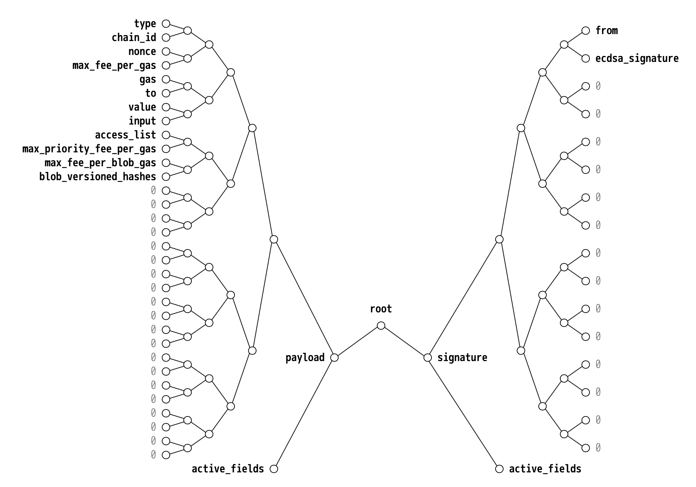
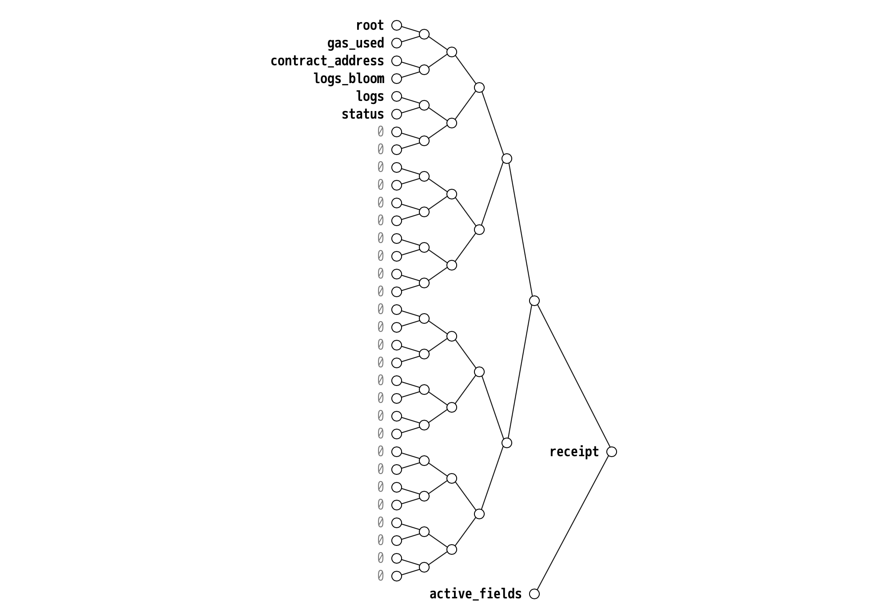

## Abstract

This EIP defines a signature scheme for [Simple Serialize (SSZ)](https://github.com/ethereum/consensus-specs/blob/ef434e87165e9a4c82a99f54ffd4974ae113f732/ssz/simple-serialize.md) encoded transactions.

## Motivation

For each transaction, two perpetual hashes are derived.

1. `sig_hash` is the hash of the unsigned transaction that is being signed. It is crucial that no two valid transactions ever share the same `sig_hash`.

2. `tx_hash` is a unique identifier to refer to a signed transaction. This hash is used to refer to a transaction within the mempool, and remains stable after a transaction is included into a block.

For existing [EIP-2718](./eip-2718.md) Recursive-Length Prefix (RLP) transactions, these hashes are based on a linear keccak256 hash across their serialization.

For [Simple Serialize (SSZ)](https://github.com/ethereum/consensus-specs/blob/ef434e87165e9a4c82a99f54ffd4974ae113f732/ssz/simple-serialize.md) transaction types, an alternative signature scheme based on SHA256 Merkle trees is defined in this EIP.

Furthermore, this EIP defines a conversion mechanism to achieve a consistent representation across both RLP and SSZ transactions and receipts.

## Specification

The key words "MUST", "MUST NOT", "REQUIRED", "SHALL", "SHALL NOT", "SHOULD", "SHOULD NOT", "RECOMMENDED", "NOT RECOMMENDED", "MAY", and "OPTIONAL" in this document are to be interpreted as described in RFC 2119 and RFC 8174.

### [EIP-2718](./eip-2718.md) transaction types

| Name | SSZ equivalent | Description |
| - | - | - |
| `TransactionType` | `uint8` | [EIP-2718](./eip-2718.md) transaction type, range `[0x00, 0x7F]` |

The values `0x00` and `0x04` are marked as reserved [EIP-2718](./eip-2718.md) transaction types.

- `0x00` indicates an [EIP-2718](./eip-2718.md) `LegacyTransaction`.
- `0x04` indicates an SSZ `SignedTransaction` as defined in this EIP.

| Name | Value | Description |
| - | - | - |
| (n/a) | `None` | Untyped [`LegacyTransaction`](./eip-2718.md#transactions) ('Homestead' scheme) |
| `TRANSACTION_TYPE_LEGACY` | `TransactionType(0x00)` | Untyped [`LegacyTransaction`](./eip-2718.md#transactions) ([EIP-155 scheme](./eip-155.md)) |
| `TRANSACTION_TYPE_EIP2930` | `TransactionType(0x01)` | [EIP-2930](./eip-2930.md#definitions) transaction |
| `TRANSACTION_TYPE_EIP1559` | `TransactionType(0x02)` | [EIP-1559](./eip-1559.md#specification) transaction |
| `TRANSACTION_TYPE_EIP4844` | `TransactionType(0x03)` | [EIP-4844](./eip-4844.md#parameters) transaction |
| `TRANSACTION_TYPE_SSZ` | `TransactionType(0x04)` | SSZ `SignedTransaction` |

Note that `0x19` is reserved to prevent collision with [ERC-191](./eip-191.md) signed data.

### Existing definitions

Definitions from existing specifications that are used throughout this document are replicated here for reference.

| Name | SSZ equivalent |
| - | - |
| [`Hash32`](https://github.com/ethereum/consensus-specs/blob/ef434e87165e9a4c82a99f54ffd4974ae113f732/specs/phase0/beacon-chain.md#custom-types) | `Bytes32` |
| [`ExecutionAddress`](https://github.com/ethereum/consensus-specs/blob/ef434e87165e9a4c82a99f54ffd4974ae113f732/specs/bellatrix/beacon-chain.md#custom-types) | `Bytes20` |
| [`KZGCommitment`](https://github.com/ethereum/consensus-specs/blob/ef434e87165e9a4c82a99f54ffd4974ae113f732/specs/deneb/polynomial-commitments.md#custom-types) | `Bytes48` |
| [`KZGProof`](https://github.com/ethereum/consensus-specs/blob/ef434e87165e9a4c82a99f54ffd4974ae113f732/specs/deneb/polynomial-commitments.md#custom-types) | `Bytes48` |
| [`Blob`](https://github.com/ethereum/consensus-specs/blob/ef434e87165e9a4c82a99f54ffd4974ae113f732/specs/deneb/polynomial-commitments.md#custom-types) | `ByteVector[BYTES_PER_FIELD_ELEMENT * FIELD_ELEMENTS_PER_BLOB]` |
| [`VersionedHash`](https://github.com/ethereum/consensus-specs/blob/ef434e87165e9a4c82a99f54ffd4974ae113f732/specs/deneb/beacon-chain.md#custom-types) | `Bytes32` |

| Name | Value |
| - | - |
| [`BYTES_PER_LOGS_BLOOM`](https://github.com/ethereum/consensus-specs/blob/ef434e87165e9a4c82a99f54ffd4974ae113f732/specs/bellatrix/beacon-chain.md#execution) | `uint64(2**8)` (= 256) |
| [`BYTES_PER_FIELD_ELEMENT`](https://github.com/ethereum/consensus-specs/blob/ef434e87165e9a4c82a99f54ffd4974ae113f732/specs/deneb/polynomial-commitments.md#constants) | `uint64(32)` |
| [`FIELD_ELEMENTS_PER_BLOB`](https://github.com/ethereum/consensus-specs/blob/ef434e87165e9a4c82a99f54ffd4974ae113f732/specs/deneb/polynomial-commitments.md#blob) | `uint64(4096)` |
| [`MAX_BLOB_COMMITMENTS_PER_BLOCK`](https://github.com/ethereum/consensus-specs/blob/ef434e87165e9a4c82a99f54ffd4974ae113f732/specs/deneb/beacon-chain.md#execution) | `uint64(2**12)` (= 4,096) |

### SSZ `SignedTransaction` container

All SSZ transactions are represented as a single, normalized SSZ container. The definition uses the `StableContainer[N]` SSZ type and `Optional[T]` as defined in [EIP-7495](./eip-7495.md).

| Name | Value | Description |
| - | - | - |
| `MAX_CALLDATA_SIZE` | `uint64(2**24)` (= 16,777,216) | Maximum `input` calldata byte length for a transaction |
| `MAX_ACCESS_LIST_STORAGE_KEYS` | `uint64(2**19)` (= 524,288) | Maximum number of storage keys within an access tuple |
| `MAX_ACCESS_LIST_SIZE` | `uint64(2**19)` (= 524,288) | Maximum number of access tuples within an `access_list` |
| `ECDSA_SIGNATURE_SIZE` | `32 + 32 + 1` (= 65) | Byte length of an ECDSA (secp256k1) signature |
| `MAX_TRANSACTION_PAYLOAD_FIELDS` | `uint64(2**5)` (= 32) | Maximum number of fields to which `TransactionPayload` can ever grow in the future |
| `MAX_TRANSACTION_SIGNATURE_FIELDS` | `uint64(2**4)` (= 16) | Maximum number of fields to which `TransactionSignature` can ever grow in the future |

```python
class AccessTuple(Container):
    address: ExecutionAddress
    storage_keys: List[Hash32, MAX_ACCESS_LIST_STORAGE_KEYS]

class TransactionPayload(StableContainer[MAX_TRANSACTION_PAYLOAD_FIELDS]):
    nonce: uint64
    max_fee_per_gas: uint256
    gas: uint64
    to: Optional[ExecutionAddress]
    value: uint256
    input_: ByteList[MAX_CALLDATA_SIZE]

    # EIP-2930
    access_list: Optional[List[AccessTuple, MAX_ACCESS_LIST_SIZE]]

    # EIP-1559
    max_priority_fee_per_gas: Optional[uint256]

    # EIP-4844
    max_fee_per_blob_gas: Optional[uint256]
    blob_versioned_hashes: Optional[List[VersionedHash, MAX_BLOB_COMMITMENTS_PER_BLOCK]]

class TransactionSignature(StableContainer[MAX_TRANSACTION_SIGNATURE_FIELDS]):
    from_: ExecutionAddress
    ecdsa_signature: ByteVector[ECDSA_SIGNATURE_SIZE]

    # EIP-2718
    type_: Optional[TransactionType]

class SignedTransaction(Container):
    payload: TransactionPayload
    signature: TransactionSignature

def check_transaction_supported(tx: SignedTransaction):
    if tx.payload.max_fee_per_blob_gas is not None:
        assert tx.payload.blob_versioned_hashes is not None
        assert tx.payload.max_priority_fee_per_gas is not None
        assert tx.payload.to is not None
    else:
        assert tx.payload.blob_versioned_hashes is None

    if tx.payload.max_priority_fee_per_gas is not None:
        assert tx.payload.access_list is not None

    if tx.signature.type_ != TRANSACTION_TYPE_SSZ:
        if tx.payload.max_fee_per_blob_gas is not None:
            assert tx.signature.type_ == TRANSACTION_TYPE_EIP4844
        elif tx.payload.max_priority_fee_per_gas is not None:
            assert tx.signature.type_ == TRANSACTION_TYPE_EIP1559
        elif tx.payload.access_list is not None:
            assert tx.signature.type_ == TRANSACTION_TYPE_EIP2930
        else:
            assert tx.signature.type_ == TRANSACTION_TYPE_LEGACY or tx.signature.type_ is None
```

Future specifications MAY:

- Add fields to the end of `TransactionPayload` and `TransactionSignature`
- Convert existing fields to `Optional`
- Relax the validation rules in `check_transaction_supported`

Such changes [do not affect](./eip-7495.md) how existing transactions serialize, merkleize, or validate.



### Transaction signature scheme

When an SSZ transaction is signed, additional information is mixed into the `sig_hash` to uniquely identify the underlying SSZ scheme as well as the operating network. This prevents hash collisions when different networks extend their corresponding `SignedTransaction` SSZ definition in incompatible ways.

| Name | SSZ equivalent | Description |
| - | - | - |
| `ChainId` | `uint256` | [EIP-155](./eip-155.md) chain ID at time of signature |

The following helper function computes the [`Domain`](https://github.com/ethereum/consensus-specs/blob/ef434e87165e9a4c82a99f54ffd4974ae113f732/specs/phase0/beacon-chain.md#custom-types) for signing an SSZ transaction for a particular network.

```python
class TransactionDomainData(Container):
    type_: TransactionType
    chain_id: ChainId

def compute_ssz_transaction_domain(chain_id: ChainId) -> Domain:
    return Domain(TransactionDomainData(
        type_=TRANSACTION_TYPE_SSZ,
        chain_id=chain_id,
    ).hash_tree_root())
```

The hash to sign `sig_hash` and the unique transaction identifier `tx_hash` are computed using [`hash_tree_root`](https://github.com/ethereum/consensus-specs/blob/ef434e87165e9a4c82a99f54ffd4974ae113f732/ssz/simple-serialize.md#merkleization).

```python
class SigningData(Container):
    object_root: Root
    domain: Domain

def compute_ssz_sig_hash(payload: TransactionPayload, chain_id: ChainId) -> Hash32:
    return Hash32(SigningData(
        object_root=payload.hash_tree_root(),
        domain=compute_ssz_transaction_domain(chain_id),
    ).hash_tree_root())

def compute_ssz_tx_hash(tx: SignedTransaction) -> Hash32:
    assert tx.signature.type_ == TRANSACTION_TYPE_SSZ
    return Hash32(tx.hash_tree_root())
```

### Transaction validation

As part of `SignedTransaction` validation, the `from` address MUST be checked for consistency with the `ecdsa_signature`.

```python
def ecdsa_pack_signature(y_parity: bool,
                         r: uint256,
                         s: uint256) -> ByteVector[ECDSA_SIGNATURE_SIZE]:
    return r.to_bytes(32, 'big') + s.to_bytes(32, 'big') + bytes([0x01 if y_parity else 0x00])

def ecdsa_unpack_signature(signature: ByteVector[ECDSA_SIGNATURE_SIZE]) -> tuple[bool, uint256, uint256]:
    y_parity = signature[64] != 0
    r = uint256.from_bytes(signature[0:32], 'big')
    s = uint256.from_bytes(signature[32:64], 'big')
    return (y_parity, r, s)

def ecdsa_validate_signature(signature: ByteVector[ECDSA_SIGNATURE_SIZE]):
    SECP256K1N = 0xfffffffffffffffffffffffffffffffebaaedce6af48a03bbfd25e8cd0364141
    assert len(signature) == 65
    assert signature[64] in (0, 1)
    _, r, s = ecdsa_unpack_signature(signature)
    assert 0 < r < SECP256K1N
    assert 0 < s < SECP256K1N

def ecdsa_recover_from_address(signature: ByteVector[ECDSA_SIGNATURE_SIZE],
                               sig_hash: Hash32) -> ExecutionAddress:
    ecdsa = ECDSA()
    recover_sig = ecdsa.ecdsa_recoverable_deserialize(signature[0:64], signature[64])
    public_key = PublicKey(ecdsa.ecdsa_recover(sig_hash, recover_sig, raw=True))
    uncompressed = public_key.serialize(compressed=False)
    return ExecutionAddress(keccak(uncompressed[1:])[12:])

def validate_transaction(tx: SignedTransaction,
                         chain_id: ChainId):
    check_transaction_supported(tx)
    ecdsa_validate_signature(tx.signature.ecdsa_signature)
    assert tx.signature.from_ == ecdsa_recover_from_address(
        tx.signature.ecdsa_signature,
        compute_sig_hash(tx, chain_id),
    )
```

See [EIP assets](../assets/eip-6493/tx_hashes.py) for a definition of `compute_sig_hash` that takes the various transaction types into account.

### SSZ `PooledTransaction` container

During transaction gossip responses ([`PooledTransactions`](https://github.com/ethereum/devp2p/blob/6b259a7003b4bfb18365ba690f4b00ba8a26393b/caps/eth.md#pooledtransactions-0x0a)), each `SignedTransaction` is wrapped into a `PooledTransaction`. The definition uses the `StableContainer[N]` SSZ type and `Optional[T]` as defined in [EIP-7495](./eip-7495.md).

| Name | Value | Description |
| - | - | - |
| `MAX_POOLED_TRANSACTION_FIELDS` | `uint64(2**3)` (= 8) | Maximum number of fields to which `PooledTransaction` can ever grow in the future |

```python
class BlobPayload(Container):
    blob: Blob
    kzg_commitment: KZGCommitment
    kzg_proof: KZGProof

class PooledTransaction(StableContainer[MAX_POOLED_TRANSACTION_FIELDS]):
    tx: SignedTransaction
    blob_payloads: Optional[List[BlobPayload, MAX_BLOB_COMMITMENTS_PER_BLOCK]]
```

The same additional validation constraints as defined in [EIP-4844](./eip-4844.md) also apply to transactions that define `tx.payload.blob_versioned_hashes` or `blob_payloads`.

Future specifications MAY:

- Add fields to the end of `PooledTransactionPayload`
- Convert existing fields to `Optional`

Such changes [do not affect](./eip-7495.md) how existing pooled transactions serialize, merkleize, or validate.

### SSZ `Receipt` container

All SSZ receipts are represented as a single, normalized SSZ container. The definition uses the `StableContainer[N]` SSZ type and `Optional[T]` as defined in [EIP-7495](./eip-7495.md).

| Name | Value | Description |
| - | - | - |
| `MAX_TOPICS_PER_LOG` | `4` | `LOG0` through `LOG4` opcodes allow 0-4 topics per log |
| `MAX_LOG_DATA_SIZE` | `uint64(2**24)` (= 16,777,216) | Maximum `data` byte length for a log |
| `MAX_LOGS_PER_RECEIPT` | `uint64(2**21)` (= 2,097,152) | Maximum number of entries within `logs` |
| `MAX_RECEIPT_FIELDS` | `uint64(2**5)` (= 32) | Maximum number of fields to which `Receipt` can ever grow in the future |

```python
class Log(Container):
    address: ExecutionAddress
    topics: List[Bytes32, MAX_TOPICS_PER_LOG]
    data: ByteList[MAX_LOG_DATA_SIZE]

class Receipt(StableContainer[MAX_RECEIPT_FIELDS]):
    root: Optional[Hash32]
    gas_used: uint64
    contract_address: Optional[ExecutionAddress]
    logs_bloom: ByteVector[BYTES_PER_LOGS_BLOOM]
    logs: List[Log, MAX_LOGS_PER_RECEIPT]

    # EIP-658
    status: Optional[boolean]
```

Future specifications MAY:

- Add fields to the end of `Receipt`
- Convert existing fields to `Optional`

Such changes [do not affect](./eip-7495.md) how existing receipts serialize, merkleize, or validate.



### Networking

When exchanging SSZ transactions and receipts via the [Ethereum Wire Protocol](https://github.com/ethereum/devp2p/blob/6b259a7003b4bfb18365ba690f4b00ba8a26393b/caps/eth.md), the following [EIP-2718](./eip-2718.md) compatible envelopes are used:

- `SignedTransaction`: `TRANSACTION_TYPE_SSZ || snappyFramed(ssz(SignedTransaction))`
- `PooledTransaction`: `TRANSACTION_TYPE_SSZ || snappyFramed(ssz(PooledTransaction))`
- `Receipt`: `TRANSACTION_TYPE_SSZ || snappyFramed(ssz(Receipt))`

Objects are encoded using [SSZ](https://github.com/ethereum/consensus-specs/blob/ef434e87165e9a4c82a99f54ffd4974ae113f732/ssz/simple-serialize.md) and compressed using the Snappy framing format, matching the encoding of consensus objects as defined in the [consensus networking specification](https://github.com/ethereum/consensus-specs/blob/ef434e87165e9a4c82a99f54ffd4974ae113f732/specs/phase0/p2p-interface.md#ssz-snappy-encoding-strategy). As part of the encoding, the uncompressed object length is emited; the RECOMMENDED limit to enforce per object is [`MAX_CHUNK_SIZE`](https://github.com/ethereum/consensus-specs/blob/e3a939e439d6c05356c9c29c5cd347384180bc01/specs/phase0/p2p-interface.md#configuration) bytes.

Implementations SHOULD continue to support accepting RLP transactions into their transaction pool. However, such transactions MUST be converted to SSZ for inclusion into an `ExecutionPayload`. See [EIP assets](../assets/eip-6493/convert.py) for a reference implementation to convert from RLP to SSZ, as well as corresponding [test cases](../assets/eip-6493/convert_tests.py). The original `sig_hash` and `tx_hash` are retained throughout the conversion process.

### Transaction gossip announcements

The semantics of the [`types` element](./eip-5793.md) in transaction gossip announcements ([`NewPooledTransactionHashes`](https://github.com/ethereum/devp2p/blob/6b259a7003b4bfb18365ba690f4b00ba8a26393b/caps/eth.md#newpooledtransactionhashes-0x08)) is changed to match `ssz(PooledTransaction.active_fields())`:

| `types` | Description |
| - | - |
| `0x00` | Untyped [`LegacyTransaction`](./eip-2718.md#transactions) ('Homestead' scheme, or [EIP-155 scheme](./eip-155.md)) |
| `0x01` | [EIP-2930](./eip-2930.md) transaction, or basic SSZ `PooledTransaction` without any additional auxiliary payloads |
| `0x02` | [EIP-1559](./eip-1559.md) transaction |
| `0x03` | [EIP-4844](./eip-4844.md) transaction, or SSZ `PooledTransaction` with `blob_payloads` |

## Rationale

### Why SSZ transactions?

1. **Transaction inclusion proofs:** Currently, there is no commitment to the transaction hash stored on chain. Therefore, proving inclusion of a certain transaction within a block requires sending the entire transaction body, and proving a list of all transaction hashes within a block requires sending _all_ transaction bodies. With SSZ, a transaction can be ["summarized"](https://github.com/ethereum/consensus-specs/blob/ef434e87165e9a4c82a99f54ffd4974ae113f732/ssz/simple-serialize.md#summaries-and-expansions) by it's [`hash_tree_root`](https://github.com/ethereum/consensus-specs/blob/ef434e87165e9a4c82a99f54ffd4974ae113f732/ssz/simple-serialize.md#merkleization), unlocking transaction root proofs without sending all transaction bodies, and compact transaction inclusion proofs by root.

2. **Better for light clients:** With SSZ, individual fields of a transaction or receipt can be proven. This allows light clients to obtain only fields relevant to them. Furthermore, common fields fields always merkleize at the same [generalized indices](https://github.com/ethereum/consensus-specs/blob/ef434e87165e9a4c82a99f54ffd4974ae113f732/ssz/merkle-proofs.md), allowing existing verification logic to continue working even when future updates introduce additional transaction or receipt fields.

3. **Better for smart contracts:** Smart contracts that validate transactions or receipts benefit from the ability to prove individual chunks of a transaction. Gas fees may be lower, and it becomes possible to process transactions and receipts that do not fully fit into calldata.

4. **Smaller data size:** SSZ objects are typically compressed using Snappy framed compression. Transaction `input` and `access_list` fields as well as receipt `logs_bloom` and `logs` fields often contain a lot of zero bytes and benefit from this compression. Snappy framed compression allows sending sequences of transactions and receipts without having to recompress, and is designed to be computationally inexpensive.

### Why include the `from` address in transactions?

For transactions converted from RLP, the `sig_hash` is computed from its original RLP representation. To avoid requiring API clients to implement the original RLP encoding and keccak hashing, the `from` address is included as part of the `SignedTransaction`.

Note that this also eliminates the need for secp256k1 public key recovery when serving JSON-RPC API requests, as the `from` address is already known.

Furthermore, this allows early rejecting transactions with sender accounts that do not have sufficient balance, as the `from` account balance can be checked without the computationally expensive `ecrecover`.

### Why include the `contract_address` in receipts?

Computing the address of a newly created contract requires RLP encoding and keccak hashing. Adding a commitment on-chain avoids requiring API clients to implement those formats.

Even though the `contract_address` is statically determinable from the corresponding `SignedTransaction` alone, including it in the `Receipt` allows the mechanism by which it is computed to change in the future.

### Why the `TransactionDomainData`?

If other SSZ objects are being signed in the future, e.g., messages, it must be ensured that their hashes do not collide with transaction `sig_hash`. Mixing in a constant that indicates that `sig_hash` pertains to an SSZ transaction prevents such hash collisions.

Mixing the chain ID into the `TransactionDomainData` further allows dropping the chain ID in the payload of each transaction, reducing their size.

### What about EIP-2718 transaction types?

All SSZ transactions (including future ones) share the single [EIP-2718](./eip-2718.md) transaction type `TRANSACTION_TYPE_SSZ`. Future features can introduce new optional fields as well as new allowed combination of optional fields, as determined by `check_transaction_supported`.

This also reduces combinatorial explosion; for example, the `access_list` property could be made optional for all SSZ transactions without having to double the number of defined transaction types.

### Why redefine `types` for `NewPooledTransactionHashes`?

The `types` element as introduced in eth/68 via [EIP-5793](./eip-5793.md) allows the receiving node better control over the data it fetches from the peer and allows throttling the download of specific types.

Current implementations primarily use `types` to distinguish type `0x03` blob transactions from basic type `0x00`, `0x01` and `0x02` transactions. However, all SSZ `SignedTransaction` use type `0x04` (`TRANSACTION_TYPE_SSZ`), eliminating this optimization potential.

To restore the optimization potential, `types` is redefined to indicate instead what auxiliary payloads are present in the `PooledTransaction`: SSZ blob transactions will share type `0x03` with RLP blob transactions, while basic SSZ transactions will be assigned type `0x01`, which is currently also used for a basic RLP transaction type. Therefore, implementations will not require changes to distinguish blob transactions from basic transactions.

### Why change from `cumulative_gas_used` to `gas_used` in receipts?

[EIP-658](./eip-658.md) replaced the intermediate post-state `root` from receipts with a boolean `status` code. Replacing `cumulative_gas_used` with `gas_used` likewise replaces the final stateful field with a stateless one, unlocking future optimization potential as transaction receipts operating on distinct state no longer depend on their order. Furthermore, API clients no longer need to fetch information from multiple receipts if they want to validate the `gas_used` of an individual transaction.

### What about `Log` data in receipts?

`Log` data is formatted according to the Ethereum contract ABI. Merkleizing log data according to its original structure would be more useful than merkleizing it as a `ByteVector`. However, the data structure is determined by the log event signature, of which only the hash is known. As the hash preimages are erased from emitted EVM logs, it is not reliably possible to recover the original log event signature. Therefore, log data and transaction input data are provided as a `ByteVector` for now.

## Backwards Compatibility

The new transaction signature scheme is solely used for SSZ transactions.

Existing RLP transactions can be converted to SSZ transactions. Their original `sig_hash` and `tx_hash` can be recovered from their SSZ representation.

Existing RLP receipts can be converted to SSZ receipts. The full sequence of accompanying transactions must be known to fill-in the new `contract_address` field. Note that because JSON-RPC exposes the `contract_address`, implementations are already required to know the transaction before queries for receipts can be served.

## Test Cases

TBD

## Reference Implementation

TBD

## Security Considerations

SSZ signatures MUST NOT collide with existing RLP transaction and message hashes.

As RLP messages are hashed using keccak256, and all SSZ objects are hashed using SHA256. These two hashing algorithms are both considered cryptographically secure and are based on fundamentally different approaches, minimizing the risk of hash collision between those two hashing algorithms.

Furthermore, RLP messages are hashed linearly across their serialization, while SSZ objects are hashed using a recursive Merkle tree. Having a different mechanism further reduce the risk of hash collisions.

## Copyright

Copyright and related rights waived via [CC0](../LICENSE.md).
