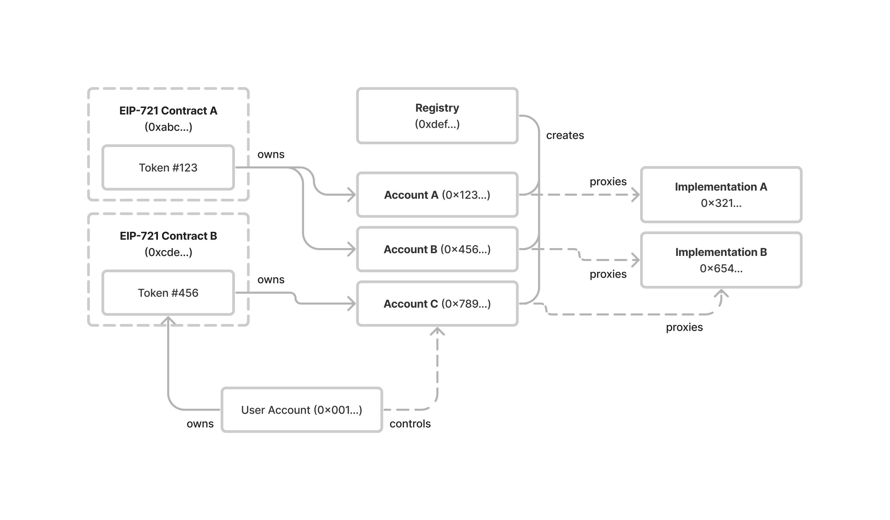

## Abstract

This proposal defines a system which assigns Ethereum accounts to all non-fungible tokens. These token bound accounts allow NFTs to own assets and interact with applications, without requiring changes to existing smart contracts or infrastructure.

## Motivation

The [ERC-721](./eip-721.md) standard enabled an explosion of non-fungible token applications. Some notable use cases have included breedable cats, generative artwork, and exchange liquidity positions.

However, NFTs cannot act as agents or associate with other on-chain assets. This limitation makes it difficult to represent many real-world non-fungible assets as NFTs. For example:

- A character in a role-playing game that accumulates assets and abilities over time based on actions they have taken
- An automobile composed of many fungible and non-fungible components
- An investment portfolio composed of multiple fungible assets
- A punch pass membership card granting access to an establishment and recording a history of past interactions

This proposal aims to give every NFT the same rights as an Ethereum user. This includes the ability to self-custody assets, execute arbitrary operations, control multiple independent accounts, and use accounts across multiple chains. By doing so, this proposal allows complex real-world assets to be represented as NFTs using a common pattern that mirrors Etherem's existing ownership model.

This is accomplished by defining a singleton registry which assigns unique, deterministic smart contract account addresses to all existing and future NFTs. Each account is permanently bound to a single NFT, with control of the account granted to the holder of that NFT.

The pattern defined in this proposal does not require any changes to existing NFT smart contracts. It is also compatible out of the box with nearly all existing infrastructure that supports Ethereum accounts, from on-chain protocols to off-chain indexers. Token bound accounts are compatible with every existing on-chain asset standard, and can be extended to support new asset standards created in the future.

By giving every NFT the full capabilities of an Ethereum account, this proposal enables many novel use cases for existing and future NFTs.

## Specification

The key words "MUST", "MUST NOT", "REQUIRED", "SHALL", "SHALL NOT", "SHOULD", "SHOULD NOT", "RECOMMENDED", "NOT RECOMMENDED", "MAY", and "OPTIONAL" in this document are to be interpreted as described in RFC 2119 and RFC 8174.

### Overview

The system outlined in this proposal has two main components:

- A singleton registry for token bound accounts
- A common interface for token bound account implementations

The following diagram illustrates the relationship between NFTs, NFT holders, token bound accounts, and the Registry:


### Registry

The registry serves as a single entry point for all token bound account address queries. It has two functions:

- `createAccount` - creates the token bound account for an NFT given an `implementation` address
- `account` - computes the token bound account address for an NFT given an `implementation` address

The registry SHALL deploy each token bound account as an [ERC-1167](./eip-1167.md) minimal proxy with immutable constant data appended to the bytecode.

The deployed bytecode of each token bound account SHALL have the following structure:

```
ERC-1167 Header               (10 bytes)
<implementation (address)>    (20 bytes)
ERC-1167 Footer               (15 bytes)
<salt (uint256)>              (32 bytes)
<chainId (uint256)>           (32 bytes)
<tokenContract (address)>     (32 bytes)
<tokenId (uint256)>           (32 bytes)
```

For example, the token bound account with implementation address `0xbebebebebebebebebebebebebebebebebebebebe`, salt `0`, chain ID `1`, token contract `0xcfcfcfcfcfcfcfcfcfcfcfcfcfcfcfcfcfcfcfcf` and token ID `123` would have the following deployed bytecode:

```
363d3d373d3d3d363d73bebebebebebebebebebebebebebebebebebebebe5af43d82803e903d91602b57fd5bf300000000000000000000000000000000000000000000000000000000000000000000000000000000000000000000000000000000000000000000000000000001000000000000000000000000cfcfcfcfcfcfcfcfcfcfcfcfcfcfcfcfcfcfcfcf000000000000000000000000000000000000000000000000000000000000007b
```

Each token bound account proxy SHALL delegate execution to a contract that implements the `IERC6551Account` interface.

The registry contract is permissionless, immutable, and has no owner. The complete source code for the registry can be found in the [Registry Implementation](#registry-implementation) section below. The registry SHALL be deployed at address `TBD` using Nick's Factory (`0x4e59b44847b379578588920cA78FbF26c0B4956C`) with salt `0x6551655165516551655165516551655165516551655165516551655165516551`.

The registry SHALL deploy all token bound accounts using the `create2` opcode so that each account address is deterministic. Each token bound account address SHALL be derived from the unique combination of its implementation address, token contract address, token ID, [EIP-155](./eip-155.md) chain ID, and salt.

The registry SHALL implement the following interface:

```solidity
interface IERC6551Registry {
    /**
     * @dev The registry SHALL emit the AccountCreated event upon successful account creation
     */
    event AccountCreated(
        address account,
        address indexed implementation,
        uint256 chainId,
        address indexed tokenContract,
        uint256 indexed tokenId,
        uint256 salt
    );

    /**
     * @dev Creates a token bound account for a non-fungible token.
     *
     * If account has already been created, returns the account address without calling create2.
     *
     * If initData is not empty and account has not yet been created, calls account with
     * provided initData after creation.
     *
     * Emits AccountCreated event.
     *
     * @return the address of the account
     */
    function createAccount(
        address implementation,
        uint256 chainId,
        address tokenContract,
        uint256 tokenId,
        uint256 salt,
        bytes calldata initData
    ) external returns (address);

    /**
     * @dev Returns the computed token bound account address for a non-fungible token
     *
     * @return The computed address of the token bound account
     */
    function account(
        address implementation,
        uint256 chainId,
        address tokenContract,
        uint256 tokenId,
        uint256 salt
    ) external view returns (address);
}
```

### Account Interface

All token bound accounts SHOULD be created via the registry.

All token bound account implementations MUST implement [ERC-165](./eip-165.md) interface detection.

All token bound account implementations MUST implement [ERC-1271](./eip-1271.md) signature validation.

All token bound account implementations MUST implement the following interface:

```solidity
/// @dev the ERC-165 identifier for this interface is `0x6faff5f1`
interface IERC6551Account {
    /**
     * @dev Allows the account to receive Ether
     *
     * Accounts MUST implement a `receive` function.
     *
     * Accounts MAY perform arbitrary logic to restrict conditions
     * under which Ether can be received.
     */
    receive() external payable;

    /**
     * @dev Returns the identifier of the non-fungible token which owns the account
     *
     * The return value of this function MUST be constant - it MUST NOT change
     * over time
     *
     * @return chainId       The EIP-155 ID of the chain the token exists on
     * @return tokenContract The contract address of the token
     * @return tokenId       The ID of the token
     */
    function token()
        external
        view
        returns (
            uint256 chainId,
            address tokenContract,
            uint256 tokenId
        );

    /**
     * @dev Returns a value that SHOULD be modified each time the account changes state
     *
     * @return The current account state
     */
    function state() external view returns (uint256);

    /**
     * @dev Returns a magic value indicating whether a given signer is authorized to act on behalf of the account
     *
     * MUST return the bytes4 magic value 0x523e3260 if the given signer is valid
     *
     * By default, the holder of the non-fungible token the account is bound to MUST be considered a valid
     * signer
     *
     * Accounts MAY implement additional authorization logic which invalidates the holder as a
     * signer or grants signing permissions to other non-holder accounts
     *
     * @param  signer     The address to check signing authorization for
     * @param  context    Additional data used to determine whether the signer is valid
     * @return magicValue Magic value indicating whether the signer is valid
     */
    function isValidSigner(address signer, bytes calldata context)
        external
        view
        returns (bytes4 magicValue);
}
```

### Execution Interface

All token bound accounts MUST implement an execution interface which allows valid signers to execute arbitrary operations on behalf of the account. Support for an execution interface MUST be signaled by the account using ERC-165 interface detection.

Token bound accounts MAY support the following execution interface:

```solidity
/// @dev the ERC-165 identifier for this interface is `0x74420f4c`
interface IERC6551Executable {
    /**
     * @dev Executes a low-level operation if the caller is a valid signer on the account
     *
     * Reverts and bubbles up error if operation fails
     *
     * @param to        The target address of the operation
     * @param value     The Ether value to be sent to the target
     * @param data      The encoded operation calldata
     * @param operation A value indicating the type of operation to perform
     *
     * Accounts implementing this interface MUST accept the following operation parameter values:
     * - 0 = CALL
     * - 1 = DELEGATECALL
     * - 2 = CREATE
     * - 3 = CREATE2
     *
     * Accounts implementing this interface MAY support additional operations or restrict a signer's
     * ability to execute certain operations
     *
     * @return The result of the operation
     */
    function execute(
        address to,
        uint256 value,
        bytes calldata data,
        uint256 operation
    ) external payable returns (bytes memory);
}
```

## Rationale

### Singleton Registry

This proposal specifies a single, canonical registry that can be permissionlessly deployed to any chain at a known address. It purposefully does not specify a common interface that can be implemented by multiple registry contracts. This approach enables several critical properties.

#### Counterfactual Accounts

All token bound accounts are created using the create2 opcode, enabling accounts to exist in a counterfactual state prior to their creation. This allows token bound accounts to receive assets prior to contract creation. A singleton account registry ensures a common addressing scheme is used for all token bound account addresses.

#### Trustless Deployments

A single ownerless registry ensures that the only trusted contract for any token bound account is the implementation. This guarantees the holder of a token access to all assets stored within a counterfactual account using a trusted implementation.

Without a canonical registry, some token bound accounts may be deployed using an owned or upgradable registry. This may lead to loss of assets stored in counterfactual accounts, and increases the scope of the security model that applications supporting this proposal must consider.

#### Cross-chain Compatibility

A singleton registry with a known address enables each token bound account to exist on multiple chains. The inclusion of `chainId` as a parameter to `createAccount` allows the contract for a token bound account to be deployed at the same address on any supported chain. Account implementations are therefore able to support cross-chain account execution, where an NFT on one chain can control its token bound account on another chain.

#### Single Entry Point

A single entry point for querying account addresses and `AccountCreated` events simplifies the complex task of indexing token bound accounts in applications which support this proposal.

#### Implementation Diversity

A singleton registry allows diverse account implementations to share a common addressing scheme. This gives developers significant freedom to implement both account-specific features (e.g. delegation) as well as alternative account models (e.g. ephemeral accounts) in a way that can be easily supported by client applications.

### Registry vs Factory

The term "registry" was chosen instead of "factory" to highlight the canonical nature of the contract and emphasize the act of querying account addresses (which occurs regularly) over the creation of accounts (which occurs only once per account).

### Variable Execution Interface

This proposal does not require accounts to implement a specific execution interface in order to be compatible, so long as they signal support for at least one execution interface via ERC-165 interface detection. Allowing account developers to choose their own execution interface allows this proposal to support the wide variety of existing execution interfaces and maintain forward compatibility with likely future standardized interfaces.

### Account Ambiguity

The specification proposed above allows NFTs to have multiple token bound accounts. During the development of this proposal, alternative architectures were considered which would have assigned a single token bound account to each NFT, making each token bound account address an unambiguous identifier.

However, these alternatives present several trade offs.

First, due to the permissionless nature of smart contracts, it is impossible to enforce a limit of one token bound account per NFT. Anyone wishing to utilize multiple token bound accounts per NFT could do so by deploying an additional registry contract.

Second, limiting each NFT to a single token bound account would require a static, trusted account implementation to be included in this proposal. This implementation would inevitably impose specific constraints on the capabilities of token bound accounts. Given the number of unexplored use cases this proposal enables and the benefit that diverse account implementations could bring to the non-fungible token ecosystem, it is the authors' opinion that defining a canonical and constrained implementation in this proposal is premature.

Finally, this proposal seeks to grant NFTs the ability to act as agents on-chain. In current practice, on-chain agents often utilize multiple accounts. A common example is individuals who use a "hot" account for daily use and a "cold" account for storing valuables. If on-chain agents commonly use multiple accounts, it stands to reason that NFTs ought to inherit the same ability.

### Proxy Implementation

ERC-1167 minimal proxies are well supported by existing infrastructure and are a common smart contract pattern. This proposal deploys each token bound account using a custom ERC-1167 proxy implementation that stores the salt, chain id, token contract address, and token ID as ABI-encoded constant data appended to the contract bytecode. This allows token bound account implementations to easily query this data while ensuring it remains constant. This approach was taken to maximize compatibility with existing infrastructure while also giving smart contract developers full flexibility when creating custom token bound account implementations.

### EIP-155 Support

This proposal uses an EIP-155 chain ID to identify each NFT along with its contract address and token ID. Token identifiers are globally unique on a single Ethereum chain, but may not be unique across multiple Ethereum chains.

## Backwards Compatibility

This proposal seeks to be maximally backwards compatible with existing non-fungible token contracts. As such, it does not extend the ERC-721 standard.

Additionally, this proposal does not require the registry to perform an ERC-165 interface check for ERC-721 compatibility prior to account creation. This maximizes compatibility with non-fungible token contracts that pre-date the ERC-721 standard (such as CryptoKitties) or only implement a subset of the ERC-721 interface (such as ENS NameWrapper names). It also allows the system described in this proposal to be used with semi-fungible or fungible tokens, although these use cases are outside the scope of the proposal.

Smart contract authors may optionally choose to enforce interface detection for ERC-721 in their account implementations.

## Reference Implementation

### Example Account Implementation

```solidity
pragma solidity ^0.8.0;

import "@openzeppelin/contracts/utils/introspection/IERC165.sol";
import "@openzeppelin/contracts/token/ERC721/IERC721.sol";
import "@openzeppelin/contracts/interfaces/IERC1271.sol";
import "@openzeppelin/contracts/utils/cryptography/SignatureChecker.sol";

contract ExampleERC6551Account is IERC165, IERC1271, IERC6551Account, IERC6551Executable {
    uint256 public state;

    receive() external payable {}

    function execute(
        address to,
        uint256 value,
        bytes calldata data,
        uint256 operation
    ) external payable returns (bytes memory result) {
        require(_isValidSigner(msg.sender), "Invalid signer");
        require(operation == 0, "Only call operations are supported");

        ++state;

        bool success;
        (success, result) = to.call{value: value}(data);

        if (!success) {
            assembly {
                revert(add(result, 32), mload(result))
            }
        }
    }

    function isValidSigner(address signer, bytes calldata) external view returns (bytes4) {
        if (_isValidSigner(signer)) {
            return IERC6551Account.isValidSigner.selector;
        }

        return bytes4(0);
    }

    function isValidSignature(bytes32 hash, bytes memory signature)
        external
        view
        returns (bytes4 magicValue)
    {
        bool isValid = SignatureChecker.isValidSignatureNow(owner(), hash, signature);

        if (isValid) {
            return IERC1271.isValidSignature.selector;
        }

        return "";
    }

    function supportsInterface(bytes4 interfaceId) external pure returns (bool) {
        return (interfaceId == type(IERC165).interfaceId ||
            interfaceId == type(IERC6551Account).interfaceId ||
            interfaceId == type(IERC6551Executable).interfaceId);
    }

    function token()
        public
        view
        returns (
            uint256,
            address,
            uint256
        )
    {
        bytes memory footer = new bytes(0x60);

        assembly {
            extcodecopy(address(), add(footer, 0x20), 0x4d, 0x60)
        }

        return abi.decode(footer, (uint256, address, uint256));
    }

    function owner() public view returns (address) {
        (uint256 chainId, address tokenContract, uint256 tokenId) = token();
        if (chainId != block.chainid) return address(0);

        return IERC721(tokenContract).ownerOf(tokenId);
    }

    function _isValidSigner(address signer) internal view returns (bool) {
        return signer == owner();
    }
}
```

### Registry Implementation

```solidity
pragma solidity ^0.8.0;

import "@openzeppelin/contracts/utils/Create2.sol";

library ERC6551BytecodeLib {
    function getCreationCode(
        address implementation_,
        uint256 chainId_,
        address tokenContract_,
        uint256 tokenId_,
        uint256 salt_
    ) internal pure returns (bytes memory) {
        return
            abi.encodePacked(
                hex"3d60ad80600a3d3981f3363d3d373d3d3d363d73",
                implementation_,
                hex"5af43d82803e903d91602b57fd5bf3",
                abi.encode(salt_, chainId_, tokenContract_, tokenId_)
            );
    }
}

contract ERC6551Registry is IERC6551Registry {
    error AccountCreationFailed();

    function createAccount(
        address implementation,
        uint256 chainId,
        address tokenContract,
        uint256 tokenId,
        uint256 salt,
        bytes calldata initData
    ) external returns (address) {
        bytes memory code = ERC6551BytecodeLib.getCreationCode(
            implementation,
            chainId,
            tokenContract,
            tokenId,
            salt
        );

        address _account = Create2.computeAddress(bytes32(salt), keccak256(code));

        if (_account.code.length != 0) return _account;

        emit AccountCreated(_account, implementation, chainId, tokenContract, tokenId, salt);

        assembly {
            _account := create2(0, add(code, 0x20), mload(code), salt)
        }

        if (_account == address(0)) revert AccountCreationFailed();

        if (initData.length != 0) {
            (bool success, bytes memory result) = _account.call(initData);

            if (!success) {
                assembly {
                    revert(add(result, 32), mload(result))
                }
            }
        }

        return _account;
    }

    function account(
        address implementation,
        uint256 chainId,
        address tokenContract,
        uint256 tokenId,
        uint256 salt
    ) external view returns (address) {
        bytes32 bytecodeHash = keccak256(
            ERC6551BytecodeLib.getCreationCode(
                implementation,
                chainId,
                tokenContract,
                tokenId,
                salt
            )
        );

        return Create2.computeAddress(bytes32(salt), bytecodeHash);
    }
}
```

## Security Considerations

### Fraud Prevention

In order to enable trustless sales of token bound accounts, decentralized marketplaces will need to implement safeguards against fraudulent behavior by malicious account owners.

Consider the following potential scam:

- Alice owns an ERC-721 token X, which owns token bound account Y.
- Alice deposits 10ETH into account Y
- Bob offers to purchase token X for 11ETH via a decentralized marketplace, assuming he will receive the 10ETH stored in account Y along with the token
- Alice withdraws 10ETH from the token bound account, and immediately accepts Bob's offer
- Bob receives token X, but account Y is empty

To mitigate fraudulent behavior by malicious account owners, decentralized marketplaces SHOULD implement protection against these sorts of scams at the marketplace level. Contracts which implement this EIP MAY also implement certain protections against fraudulent behavior.

Here are a few mitigations strategies to be considered:

- Attach the current token bound account state to the marketplace order. If the state of the account has changed since the order was placed, consider the offer void. This functionality would need to be supported at the marketplace level.
- Attach a list of asset commitments to the marketplace order that are expected to remain in the token bound account when the order is fulfilled. If any of the committed assets have been removed from the account since the order was placed, consider the offer void. This would also need to be implemented by the marketplace.
- Submit the order to the decentralized market via an external smart contract which performs the above logic before validating the order signature. This allows for safe transfers to be implemented without marketplace support.
- Implement a locking mechanism on the token bound account implementation that prevents malicious owners from extracting assets from the account while locked

Preventing fraud is outside the scope of this proposal.

### Ownership Cycles

All assets held in a token bound account may be rendered inaccessible if an ownership cycle is created. The simplest example is the case of an ERC-721 token being transferred to its own token bound account. If this occurs, both the ERC-721 token and all of the assets stored in the token bound account would be permanently inaccessible, since the token bound account is incapable of executing a transaction which transfers the ERC-721 token.

Ownership cycles can be introduced in any graph of n>0 token bound accounts. On-chain prevention of cycles with depth>1 is difficult to enforce given the infinite search space required, and as such is outside the scope of this proposal. Application clients and account implementations wishing to adopt this proposal are encouraged to implement measures that limit the possibility of ownership cycles.

## Copyright

Copyright and related rights waived via [CC0](../LICENSE.md).
