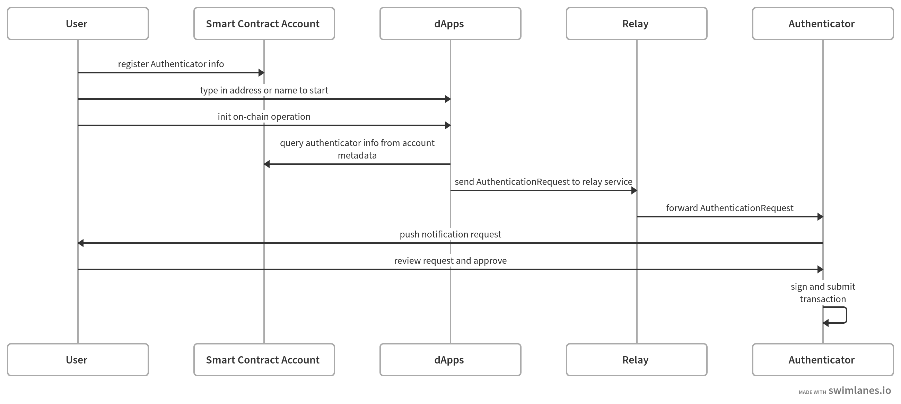

## Abstract

This ERC proposes a new **IAccountMetadata** interface as an extension for [ERC-4337](./eip-4337.md) to store authentication data on-chain to support a more user-friendly authentication model.

## Motivation

In this proposal, we propose a new **IAccountMetadata** interface as an extension for ERC-4337 **IAccount** interface. With this new interface, users can store authentication data on-chain through one-time publishing, allowing dApps to proactively fetch it from the chain to support a more flexible and user-friendly authentication model. This will serve as an alternative to the current authentication model where users need to log in with a wallet every time and push account-related information to dApps by connecting the wallet in advance.

## Specification

The key words “MUST”, “MUST NOT”, “REQUIRED”, “SHALL”, “SHALL NOT”, “SHOULD”, “SHOULD NOT”, “RECOMMENDED”, “MAY”, and “OPTIONAL” in this document are to be interpreted as described in RFC 2119.

### Authentication Flow



In the new authentication workflow, users use AA compatible smart contract accounts as their wallet addresses. **Authenticator** could be anything but holding the private key to sign users' operations. For example, it can be an offline authenticator mobile app or an online cloud service. **Relay** is an online service responsible for forwarding requests from dApps to the Authenticator. If the authenticator is online, it can play the role of Relay service and listen to dApps directly.

### Interface

To support the new authentication workflow, this ERC proposes a new **IAccountMetadata** interface as an extension of **IAccount** interface defined by ERC-4337.

```
interface IAccountMetadata {
  struct AuthenticationInfo {
    // the service URI to relay message from dApps to authenticator
    string relayURI;
    // a JSON string or URI pointing to a JSON file describing the
    // schema of AuthenticationRequest. The URI should follow ERC-4804
    // if the schema file is stored on-chain
    string schema;
  }
z
}
```

The relay endpoint should accept an AuthenticationRequest object as input. The format of the AuthenticationRequest object is defined by the schema field at AuthenticationInfo.

Following is a schema example which supports end to end encryption, where we pack all encrypted fields into an encryptedData field. The symbol **“\$e2ee”** indicates that the field is encrypted and the encrypted value is stored at the encryptedData field. Here we only list three basic fields but there may be more fields per schema definition.

```
{
    "title": "AuthenticationRequest",
    "type": "object",
    "properties": {
        "entrypoint": {
            "type": "string" | "$e2ee",
            "description": "the entrypoint contract address",
        },
        "chainId": {
            "type": "string" | "$e2ee",
            "description": "the chain id",
        },
        "userOp": {
            "type": "object" | "$e2ee",
            "description": "UserOp defined by ERC-4337 without signature",
        },
        "encryptedData": {
            "type": "string",
            "description": "contains all encrypted fields"
        },
    }
}
```

## Rationale

To enable the new authentication workflow we described above, dApp needs to know two things:

1. **Where is the authenticator?** This is solved by the **relayURI** field in struct **AuthenticationInfo**. Users can publish the uri as the account metadata which will be pulled by dApp to do service discovery.

2. **What’s the format of AuthenticationRequest?** This is solved by the **schema** field in struct **AuthenticationInfo**. The schema defines the structure of the AuthenticationRequest object which is consumed by the authenticator. It can also be used to define extra fields for the relay service to enable flexible access control.

### Future Extension

The **IAccountMetadata** interface could be extended per different requirements. For example, a new alias or avatar field could be defined for profile displaying.

## Security Considerations

### End to End Encryption

To protect the user’s privacy and prevent front-running attacks, we should keep the data encrypted during transmission from dApps to authenticators. This could be done by adopting the JWE (JSON Web Encryption, RFC-7516) method. Before sending out AuthenticationRequest, we generate a symmetric CEK(Content Encryption Key) to encrypt fields with end to end encryption enabled, then encrypt the CEK with the signer's public key. dApp will pack the request into a JWE object and send it to the authenticator through the relay service. Relay service has no access to the end to end encrypted data since only the authenticator has the key to decrypt the CEK.

### Signing

We will follow the [EIP-712](./eip-712.md) standard to improve the usability of off-chain message signing.

## Backwards Compatibility

The new interface is fully backward compatible with ERC-4337.

## Copyright

Copyright and related rights waived via [CC0](../LICENSE.md).
