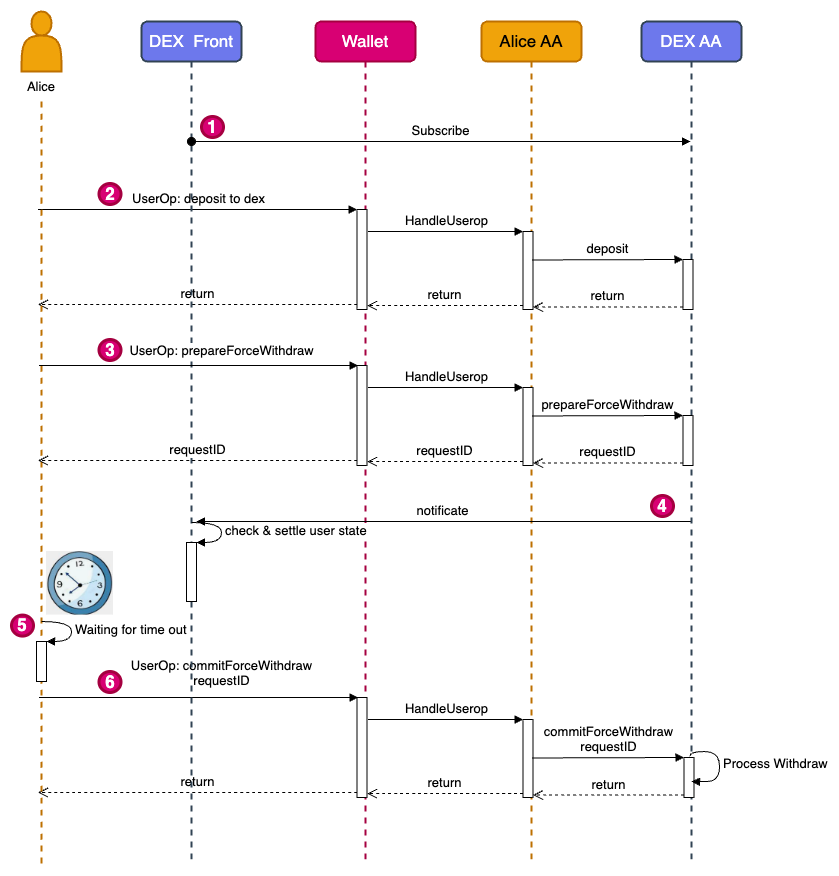

## Abstract

The Order Book DEX Standard is a proposed set of interface specifications that define a decentralized exchange (DEX) protocol for trading assets using order books. This standard provides a set of functions that allow users to deposit, withdraw, and trade assets on a decentralized exchange. Additionally, it proposes a novel two-phase withdrawal scheme to ensure the asset security of both users and the exchange, addressing users' trust issues with the exchange.

## Motivation

Decentralized exchanges (DEXs) have become increasingly popular in recent years due to their ability to provide users with greater control over their assets and reduce reliance on centralized intermediaries. However, many existing DEX protocols suffer from issues such as low liquidity and inefficient price discovery. Order book-based DEXs based Layer2 have emerged as a popular alternative, but there is currently no standardized interface for implementing such exchanges.

The Order Book DEX Standard aims to provide developers with a common interface for building interoperable order book-based DEXs that can benefit from network effects. By establishing a standard set of functions for depositing, withdrawing, and forced withdrawals, the Order Book DEX Standard can fully ensure the security of user assets. At the same time, the two-phase forced withdrawal mechanism can also prevent malicious withdrawals from users targeting the exchange.

The two phase commit protocol is an important distributed consistency protocol, aiming to ensure data security and consistency in distributed systems. In the Layer2 order book DEX system, to enhance user experience and ensure financial security, we adopt a 1:1 reserve strategy, combined with a decentralized clearing and settlement interface, and a forced withdrawal function to fully guarantee users' funds.

However, such design also faces potential risks. When users engage in perpetual contract transactions, they may incur losses. In this situation, malicious users might exploit the forced withdrawal function to evade losses. To prevent this kind of attack, we propose a two-phase forced withdrawal mechanism.

By introducing the two phase forced withdrawal function, we can protect users' financial security while ensuring the security of the exchange's assets. In the first phase, the system will conduct a preliminary review of the user's withdrawal request to confirm the user's account status. In the second phase, after the forced withdrawal inspection period, users can directly submit the forced withdrawal request to complete the forced withdrawal process. In this way, we can not only prevent users from exploiting the forced withdrawal function to evade losses but also ensure the asset security for both the exchange and the users.

In conclusion, by adopting the two phase commit protocol and the two phase forced withdrawal function, we can effectively guard against malicious behaviors and ensure data consistency and security in distributed systems while ensuring user experience and financial security.

## Specification

### Interfaces

The Order Book DEX Standard defines the following Interfaces:

#### `deposit`

`function deposit(address token, uint256 amount) external;`

The **deposit** function allows a user to deposit a specified amount of a particular token to the exchange. The *token* parameter specifies the address of the token contract, and the *amount* parameter specifies the amount of the token to be deposited.

#### `withdraw`

`function withdraw(address token, uint256 amount) external;`

The **withdraw** function allows a user to withdraw a specified amount of a particular token from the exchange. The *token* parameter specifies the address of the token contract, and the *amount* parameter specifies the amount of the token to be withdrawn.

#### `prepareForceWithdraw`

`function prepareForceWithdraw(address token, uint256 amount) external returns (uint256 requestID);`

The assets deposited by users will be stored in the exchange contract's account, and the exchange can achieve real-time 1:1 reserve proof. The **prepareForceWithdraw** function is used for users to initiate a forced withdrawal of a certain amount of a specified token. This function indicates that the user wants to perform a forced withdrawal and can submit the withdrawal after the default timeout period. Within the timeout period, the exchange needs to confirm that the user's order status meets the expected criteria, and forcibly cancel the user's order and settle the trade to avoid malicious attacks by the user. This function takes the following parameters:

1. *token*: the address of the token to be withdrawn
2. *amount*: the amount of the token to be withdrawn

Since an account may initiate multiple two phase forced withdrawals in parallel, each forced withdrawal needs to return a unique *requestID*. The function returns a unique *requestID* that can be used to submit the forced withdrawal using the commitForceWithdraw function.

#### `commitForceWithdraw`

`function commitForceWithdraw(uint256 requestID) external;`

1. *requestID*: the request ID of the two phase Withdraw

The **commitForceWithdraw** function is used to execute a forced withdrawal operation after the conditions are met. The function takes a *requestID* parameter, which specifies the ID of the forced withdrawal request to be executed. The request must have been previously initiated using the prepareForceWithdraw function.

### Events

#### `PrepareForceWithdraw`

MUST trigger when user successful call to PrepareForceWithdraw.

`event PrepareForceWithdraw(address indexed user, address indexed tokenAddress, uint256 amount);`

## Rationale

The flow charts for two-phase withdrawal are shown below:

## Backwards Compatibility

No backward compatibility issues found.

## Security Considerations

Needs discussion.

## Copyright

Copyright and related rights waived via [CC0](../LICENSE.md).
