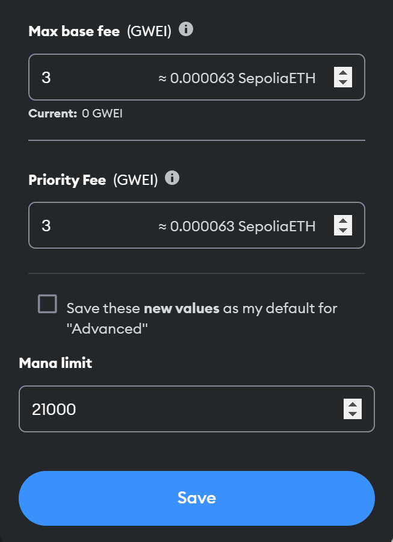

## Abstract

This EIP suggests renaming `gas` to `mana`, as proposed by Vitalik Buterin in 2015.

## Motivation

The underlying motivation for reviving Vitalik's original proposal from 2015 is that we have finally arrived at the age of Proof-of-Stake, and given the roadmap ahead (i.e. "The Surge", "The Scourge", "The Verge", "The Purge", and "The Splurge"), I consider this moment as the last opportunity to make such a far-reaching semantic change.

## Specification

The key words "MUST", "MUST NOT", "REQUIRED", "SHALL", "SHALL NOT", "SHOULD", "SHOULD NOT", "RECOMMENDED", "NOT RECOMMENDED", "MAY", and "OPTIONAL" in this document are to be interpreted as described in RFC 2119 and RFC 8174.

The core term `gas` MUST be renamed to `mana`.

The following opcodes MUST be renamed:

- `GASPRICE` to `MANAPRICE`;
- `GASLIMIT` to `MANALIMIT`; and
- `GAS` to `MANA`.

Additionally, the input parameters or outputs of the following opcodes MUST be renamed:

- `CALL`'s `gas` input parameter to `mana`;
- `CALLCODE`'s `gas` input parameter to `mana`;
- `DELEGATECALL`'s `gas` input parameter to `mana`;
- `STATICCALL`'s `gas` input parameter to `mana`;
- `GASLIMIT`'s `gasLimit` output to `manaLimit`; and
- `GAS`'s `gas` output to `mana`.

Finally, the following RPC endpoints MUST be renamed:

- `eth_estimateGas` to `eth_estimateMana`;
- `eth_gasPrice` to `eth_manaPrice`; and
- `eth_maxPriorityFeePerGas` to `eth_maxPriorityFeePerMana`.

The description of the RPC endpoints MUST be renamed accordingly:

- `eth_estimateMana`: Generates and returns an estimate of how much `mana` is necessary to allow the transaction to complete;
- `eth_manaPrice`: Returns the current price per `mana` in wei; and
- `eth_maxPriorityFeePerMana`: Returns the current `maxPriorityFeePerMana` per `mana` in wei.

## Rationale

- `mana` reflects the increased environmental friendliness of Proof-of-Stake;
- `mana` is generally understood to be ephemeral and non-transferable, which better represents the concept of `gas`; and
- `mana` is generally portrayed as renewable, while (natural) `gas` is non-renewable.

## Backwards Compatibility

This proposal is not backward compatible as it renames the core term `gas`.

## Test Cases

### Example 1

If a transaction requires more `mana` than allowed by the `manaLimit`, it is reverted as an _out-of-mana_ transaction.

### Example 2

A Solidity contract to estimate the used `mana` via the new `manaleft()` syntax (replacing `gasleft()`) for dedicated function calls.

```solidity
// SPDX-License-Identifier: AGPL-3.0
pragma solidity 0.8.19;

contract ManaMetering {
    function oldWay() external view returns (string memory, uint256 manaUsed) {
        string memory hiMom = "Hi Mom, ";
        string memory missYou = "miss you.";
        uint256 startMana = manaleft();
        string memory concat = string(abi.encodePacked(hiMom, missYou));
        manaUsed = startMana - manaleft();
        return (concat, manaUsed);
    }

    function newWay() external view returns (string memory, uint256 manaUsed) {
        string memory hiMom = "Hi Mom, ";
        string memory missYou = "miss you.";
        uint256 startMana = manaleft();
        string memory concat = string.concat(hiMom, missYou);
        manaUsed = startMana - manaleft();
        return (concat, manaUsed);
    }
}
```

In Vyper, the same behaviour can be replicated with the new transaction property `msg.mana`, which replaces `msg.gas`.

### Example 3

An example of how to set the `manaLimit` in MetaMask:



## Security Considerations

There are no security considerations directly related to the renaming of `gas` to `mana`.

## Copyright

Copyright and related rights waived via [CC0](../LICENSE.md).
