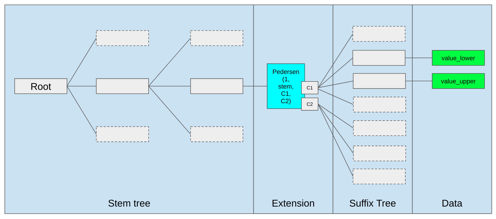

## Abstract

Introduce a new Verkle state tree alongside the existing hexary Patricia tree. After the hard fork, the Verkle tree stores all edits to state and a copy of all accessed state, and the hexary Patricia tree can no longer be modified. This is a first step in a multi-phase transition to Ethereum exclusively relying on Verkle trees to store execution state.

## Motivation

Verkle trees solve a key problem standing in the way of Ethereum being stateless-client-friendly: witness sizes. A witness accessing an account in today’s hexary Patricia tree is, in the average case, close to 3 kB, and in the worst case it may be three times larger. Assuming a worst case of 6000 accesses per block (15m gas / 2500 gas per access), this corresponds to a witness size of ~18 MB, which is too large to safely broadcast through a p2p network within a 12-second slot. Verkle trees reduce witness sizes to ~200 bytes per account in the average case, allowing stateless client witnesses to be acceptably small.

## Specification

The key words "MUST", "MUST NOT", "REQUIRED", "SHALL", "SHALL NOT", "SHOULD", "SHOULD NOT", "RECOMMENDED", "NOT RECOMMENDED", "MAY", and "OPTIONAL" in this document are to be interpreted as described in RFC 2119 and RFC 8174.

### Verkle tree definition

We define a Verkle tree here by providing the function to compute the root commitment given a set of 32-byte keys and 32-byte values. Algorithms for updating and inserting values are up to the implementer; the only requirement is that the root commitment after the update must continue to match the value computed from this specification. We will then define an embedding that provides the 32-byte key at which any particular piece of state information (account headers, code, storage) should be stored.

```
# Bandersnatch curve order
BANDERSNATCH_MODULUS = \
13108968793781547619861935127046491459309155893440570251786403306729687672801
# Bandersnatch Pedersen basis of length 256
PEDERSEN_BASIS = [....]
VERKLE_NODE_WIDTH = len(PEDERSEN_BASIS)

def group_to_scalar_field(point: Point) -> int:
    # Not collision resistant. Not random oracle. 
    # Binding for Pedersen commitments.
    assert isinstance(point, Point)
    if point == bandersnatch.Z:
        return 0
    else:
        return point.map_to_base_field() % BANDERSNATCH_MODULUS
    
def compute_commitment_root(children: Sequence[int]) -> Point:
    o = bandersnatch.Z
    for generator, child in zip(PEDERSEN_BASIS, children):
        o = bandersnatch.add(o, bandersnatch.mul(generator, child))
    return o

def extension_and_suffix_tree(stem: bytes31, values: Dict[byte, bytes32]) -> int:
    sub_leaves = [0] * 512
    for suffix, value in values.items():
        sub_leaves[2 * suffix] = int.from_bytes(value[:16], 'little') + 2**128
        sub_leaves[2 * suffix + 1] = int.from_bytes(value[16:], 'little')
    C1 = compute_commitment_root(sub_leaves[:256])
    C2 = compute_commitment_root(sub_leaves[256:])
    return compute_commitment_root([1, # Extension marker
                                    int.from_bytes(stem, "little"),
                                    group_to_scalar_field(C1),
                                    group_to_scalar_field(C2)] +
                                    [0] * 252)

def compute_main_tree_root(data: Dict[bytes32, int],
                           prefix: bytes) -> int:
    # Empty subtree: 0
    if len(data) == 0:
        return 0
    elif len(data) == 1:
        return list(data.values())[0]
    else:
        sub_commitments = [
            compute_main_tree_root({
                    key: value for key, value in data.items() if
                    key[:len(prefix) + 1] == prefix + bytes([i])
                }, prefix + bytes([i]))
            for i in range(VERKLE_NODE_WIDTH)
        ]
        return group_to_scalar_field(compute_commitment_root(sub_commitments))

def compute_verkle_root(data: Dict[bytes32, bytes32]) -> Point:
    stems = set(key[:-1] for key in data.keys())
    data_as_stems = {}
    for stem in stems:
        commitment_data = Dict[byte, bytes32]()
        for i in range(VERKLE_NODE_WIDTH):
            if stem + bytes([i]) in data:
                commitment_data[i] = data[stem + bytes([i])]
        data_as_stems[stem] = extension_and_suffix_tree(stem, commitment_data)
    sub_commitments = [
        compute_main_tree_root({
                key: value for key, value in data.items() if
                key[0] == i
            }, bytes([i]))
        for i in range(VERKLE_NODE_WIDTH)
    ]
    return compute_commitment_root(sub_commitments)
```

Note that a value of zero is not the same thing as a position being empty; a position being empty is represented as 0 in the bottom layer commitment, but a position being zero is represented by a different value in the suffix tree commitment (2**128 is added to value_lower to distinguish it from empty). This distinction between zero and empty is not a property of the existing Patricia tree, but it is a property of the proposed Verkle tree.

In the rest of this document, saving or reading a number at some position in the Verkle tree will mean saving or reading the 32-byte little-endian encoding of that number.

### Illustration

This is an illustration of the tree structure.



### Tree embedding

Instead of a two-layer structure as in the Patricia tree, in the Verkle tree we will embed all information into a single `key: value` tree. This section specifies which tree keys store the information (account header data, code, storage) in the state.

| Parameter             | Value   |
| --------------------- | ------- |
| BASIC_DATA_LEAF_KEY   | 0       |
| CODE_HASH_LEAF_KEY    | 1       |
| HEADER_STORAGE_OFFSET | 64      |
| CODE_OFFSET           | 128     |
| VERKLE_NODE_WIDTH     | 256     |
| MAIN_STORAGE_OFFSET   | 256**31 |

_It’s a required invariant that `VERKLE_NODE_WIDTH > CODE_OFFSET > HEADER_STORAGE_OFFSET` and that `HEADER_STORAGE_OFFSET` is greater than the leaf keys. Additionally, `MAIN_STORAGE_OFFSET` must be a power of `VERKLE_NODE_WIDTH`._

Note that addresses are always passed around as an `Address32`. To convert existing addresses to `Address32`, prepend with 12 zero bytes:

```
def old_style_address_to_address32(address: Address) -> Address32:
    return b'\x00' * 12 + address
```

#### Header values

These are the positions in the tree at which block header fields of an account are stored.

```
def hash_point_to_bytes(point: Point) -> int:
    return group_to_scalar_field(point).to_bytes(32, 'little')

def pedersen_hash(inp: bytes) -> bytes32:
    assert len(inp) <= 255 * 16
    # Interpret input as list of 128 bit (16 byte) integers
    ext_input = inp + b"\0" * (255 * 16 - len(inp))
    ints = [2 + 256 * len(inp)] + \
           [int.from_bytes(ext_input[16 * i:16 * (i + 1)], 'little') for i in range(255)]
    return compute_commitment_root(ints).hash_point_to_bytes()

def get_tree_key(address: Address32, tree_index: int, sub_index: int):
    # Assumes VERKLE_NODE_WIDTH = 256
    return (
        pedersen_hash(address + tree_index.to_bytes(32, 'little'))[:31] +
        bytes([sub_index])
    )
    
def get_tree_key_for_basic_data(address: Address32):
    return get_tree_key(address, 0, BASIC_DATA_LEAF_KEY)

# Backwards compatibility for EXTCODEHASH    
def get_tree_key_for_code_hash(address: Address32):
    return get_tree_key(address, 0, CODE_HASH_LEAF_KEY)
```

An account's `version`, `balance`, `nonce` and `code_size` fields are packed with big-endian encoding in the value found at `BASIC_DATA_LEAF_KEY`:

| Name        | Offset | Size |
| ----------- | ------ | ---- |
| `version`   | 0      | 1    |
| `code_size` | 5      | 3    |
| `nonce`     | 8      | 8    |
| `balance`   | 16     | 16   |

Bytes `1..4` are reserved for future use.

The current layout and encoding allow for an extension of `code_size` to 4 bytes without changing the account version.

When any account header field is set, the `version` field is also set to zero. The `codehash` and `code_size` fields are set upon contract or EoA creation.

#### Code

```
def get_tree_key_for_code_chunk(address: Address32, chunk_id: int):
    return get_tree_key(
        address,
        (CODE_OFFSET + chunk_id) // VERKLE_NODE_WIDTH,
        (CODE_OFFSET + chunk_id)  % VERKLE_NODE_WIDTH
    )
```

Chunk `i` stores a 32 byte value, where bytes 1…31 are bytes `i*31...(i+1)*31 - 1` of the code (ie. the i’th 31-byte slice of it), and byte 0 is the number of leading bytes that are part of PUSHDATA (eg. if part of the code is `...PUSH4 99 98 | 97 96 PUSH1 128 MSTORE...` where `|` is the position where a new chunk begins, then the encoding of the latter chunk would begin `2 97 96 PUSH1 128 MSTORE` to reflect that the first 2 bytes are PUSHDATA).

For precision, here is an implementation of code chunkification:

```
PUSH_OFFSET = 95
PUSH1 = PUSH_OFFSET + 1
PUSH32 = PUSH_OFFSET + 32

def chunkify_code(code: bytes) -> Sequence[bytes32]:
    # Pad to multiple of 31 bytes
    if len(code) % 31 != 0:
        code += b'\x00' * (31 - (len(code) % 31))
    # Figure out how much pushdata there is after+including each byte
    bytes_to_exec_data = [0] * (len(code) + 32)
    pos = 0
    while pos < len(code):
        if PUSH1 <= code[pos] <= PUSH32:
            pushdata_bytes = code[pos] - PUSH_OFFSET
        else:
            pushdata_bytes = 0
        pos += 1
        for x in range(pushdata_bytes):
            bytes_to_exec_data[pos + x] = pushdata_bytes - x
        pos += pushdata_bytes
    # Output chunks
    return [
        bytes([min(bytes_to_exec_data[pos], 31)]) + code[pos: pos+31]
        for pos in range(0, len(code), 31)
    ]
```

#### Storage

```
def get_tree_key_for_storage_slot(address: Address32, storage_key: int):
    if storage_key < (CODE_OFFSET - HEADER_STORAGE_OFFSET):
        pos = HEADER_STORAGE_OFFSET + storage_key
    else:
        pos = MAIN_STORAGE_OFFSET + storage_key
    return get_tree_key(
        address,
        pos // VERKLE_NODE_WIDTH,
        pos % VERKLE_NODE_WIDTH
    )
```

Note that storage slots in the same size `VERKLE_NODE_WIDTH` range (ie. a range the form `x*VERKLE_NODE_WIDTH ... (x+1)*VERKLE_NODE_WIDTH-1)` are all, with the exception of the `HEADER_STORAGE_OFFSET` special case, part of a single commitment. This is an optimization to make witnesses more efficient when related storage slots are accessed together. If desired, this optimization can be exposed to the gas schedule, making it more gas-efficient to make contracts that store related slots together (however, Solidity already stores in this way by default).

#### Fork

Described in [EIP-7612](./eip-7612.md).

#### Access events

Described in [EIP-4762](./eip-4762.md).

## Rationale

This implements all of the logic in transitioning to a Verkle tree, and at the same time reforms gas costs, but does so in a minimally disruptive way that does not require simultaneously changing the whole tree structure. Instead, we add a new Verkle tree that starts out empty, and only new changes to state and copies of accessed state are stored in the tree. The Patricia tree continues to exist, but is frozen.

This sets the stage for a future hard fork that swaps the Patricia tree in-place with a Verkle tree storing the same data. Unlike [EIP-2584](./eip-2584.md), this replacement Verkle tree does not need to be computed by clients in real time. Instead, because the Patricia tree would at that point be fixed, the replacement Verkle tree can be computed off-chain.

### Verkle tree design


The Verkle tree uses a single-layer tree structure with 32-byte keys and values for several reasons:

 * **Simplicity**: working with the abstraction of a key/value store makes it easier to write code dealing with the tree (eg. database reading/writing, caching, syncing, proof creation and verification) as well as to upgrade it to other trees in the future. Additionally, witness gas rules can become simpler and clearer.
 * **Uniformity**: the state is uniformly spread out throughout the tree; even if a single contract has many millions of storage slots, the contract’s storage slots are not concentrated in one place. This is useful for state syncing algorithms. Additionally, it helps reduce the effectiveness of unbalanced tree filling attacks.
 * **Extensibility**: account headers and code being in the same structure as storage makes it easier to extend the features of both, and even add new structures if later desired.

### Gas reform

Gas costs for reading storage and code are reformed to more closely reflect the gas costs under the new Verkle tree design. WITNESS_CHUNK_COST is set to charge 6.25 gas per byte for chunks, and WITNESS_BRANCH_COST is set to charge ~13,2 gas per byte for branches on average (assuming 144 byte branch length) and ~2.5 gas per byte in the worst case if an attacker fills the tree with keys deliberately computed to maximize proof length.

The main differences from gas costs in Berlin are:

 * 200 gas charged per 31 byte chunk of code. This has been estimated to increase average gas usage by ~6-12%
 * Cost for accessing adjacent storage slots (`key1 // 256 == key2 // 256`) decreases from 2100 to 200 for all slots after the first in the group,
 * Cost for accessing storage slots 0…63 decreases from 2100 to 200, including the first storage slot. This is likely to significantly improve performance of many existing contracts, which use those storage slots for single persistent variables.

Gains from the latter two properties have not yet been analyzed, but are likely to significantly offset the losses from the first property. It’s likely that once compilers adapt to these rules, efficiency will increase further.

The precise specification of when access events take place, which makes up most of the complexity of the gas repricing, is necessary to clearly specify when data needs to be saved to the period 1 tree.

## Backwards Compatibility

The main backwards-compatibility-breaking changes are:

 * (1) Gas costs for code chunk access making some applications less economically viable
 * (2) Tree structure change makes in-EVM proofs of historical state no longer work

(1) can be mitigated by increasing the gas limit at the same time as implementing this EIP, reducing the risk that applications will no longer work at all due to transaction gas usage rising above the block gas limit.

## Test Cases

TODO

## Reference Implementation

 * github.com/gballet/go-ethereum, branch beverly-hills-just-after-pbss - a geth implementation
 * github.com/NethermindEth/nethermind, branch verkle/tree - a nethermind implementation

## Security Considerations

Needs discussion.

## Copyright

Copyright and related rights waived via [CC0](../LICENSE.md).
