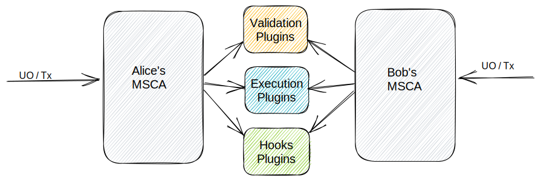
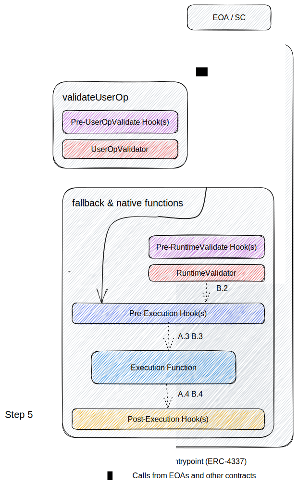

## Abstract

This proposal standardizes smart contract accounts and account plugins, which are smart contract interfaces that allow for composable logic within smart contract accounts. This proposal is compliant with [ERC-4337](./eip-4337.md), and takes inspiration from [ERC-2535](./eip-2535.md) when defining interfaces for updating and querying modular function implementations.

This modular approach splits account functionality into three categories, implements them in external contracts, and defines an expected execution flow from accounts.

## Motivation

One of the goals that ERC-4337 accomplishes is abstracting the logic for execution and validation to each smart contract account.

Many new features of accounts can be built by customizing the logic that goes into the validation and execution steps. Examples of such features include session keys, subscriptions, spending limits, and role-based access control. Currently, some of these features are implemented natively by specific smart contract accounts, and others are able to be implemented by plugin systems. Examples of proprietary plugin systems include Safe modules and ZeroDev plugins.

However, managing multiple account instances provides a worse user experience, fragmenting accounts across supported features and security configurations. Additionally, it requires plugin developers to choose which platforms to support, causing either platform lock-in or duplicated development effort.

We propose a standard that coordinates the implementation work between plugin developers and wallet developers. This standard defines a modular smart contract account capable of supporting all standard-conformant plugins. This allows users to have greater portability of their data, and for plugin developers to not have to choose specific account implementations to support.



We take inspiration from ERC-2535's diamond pattern for routing execution based on function selectors, and create a similarly composable account. However, the standard does not require the multi-facet proxy pattern.

These plugins can contain execution logic, validation schemes, and hooks. Validation schemes define the circumstances under which the smart contract account will approve actions taken on its behalf, while hooks allow for pre- and post-execution controls.

Accounts adopting this standard will support modular, upgradable execution and validation logic. Defining this as a standard for smart contract accounts will make plugins easier to develop securely and will allow for greater interoperability.

Goals:

- Provide standards for how validation, execution, and hook functions for smart contract accounts should be written.
- Provide standards for how compliant accounts should add, update, remove, and inspect plugins.

## Specification

The key words "MUST", "MUST NOT", "REQUIRED", "SHALL", "SHALL NOT", "SHOULD", "SHOULD NOT", "RECOMMENDED", "NOT RECOMMENDED", "MAY", and "OPTIONAL" in this document are to be interpreted as described in RFC 2119 and RFC 8174.

### Terms

- An **account** (or **smart contract account, SCA**) is a smart contract that can be used to send transactions and hold digital assets. It implements the `IAccount` interface from ERC-4337.
- A **modular account** (or **modular smart contract account, MSCA**) is an account that supports modular functions. There are three types of modular functions:
  - **Validation functions** validate the caller's authenticity and authority to the account.
  - **Execution functions** execute any custom logic allowed by the account.
  - **Hooks** execute custom logic and checks before and/or after an execution function or validation function.
- A **validation function** is a function that validates authentication and authorization of a caller to the account. There are two types of validation functions:
  - **User Operation Validator** functions handle calls to `validateUserOp` and check the validity of an ERC-4337 user operation.
  - **Runtime Validator** functions run before an execution function when not called via a user operation, and enforce checks. Common checks include allowing execution only by an owner.
- An **execution function** is a smart contract function that defines the main execution step of a function for a modular account.
- The **standard execution functions** are two specific execution functions that are implemented natively by the modular account, and not on a plugin. These allow for open-ended execution.
- A **hook** is a smart contract function executed before or after another function, with the ability to modify state or cause the entire call to revert. There are four types of hooks:
  - **Pre User Operation Validation Hook** functions run before user operation validators. These can enforce permissions on what actions a validator may perform via user operations.
  - **Pre Runtime Validation Hook** functions run before runtime validators. These can enforce permissions on what actions a validator may perform via direct calls.
  - **Pre Execution Hook** functions run before an execution function. They may optionally return data to be consumed by their related post execution hook functions.
  - **Post Execution Hook** functions run after an execution function. They may optionally take returned data from their related pre execution hook functions.
- An **associated function** refers to either a validation function or a hook.
- A **native function** refers to a function implemented natively by the modular account, as opposed to a function added by a plugin.
- A **plugin** is a deployed smart contract that hosts any amount of the above three kinds of modular functions: execution functions, validation functions, or hooks.

### Overview

A modular account handles two kinds of calls: either from the `Entrypoint` through ERC-4337, or through direct calls from externally owned accounts (EOAs) and other smart contracts. This standard supports both use cases.

A call to the smart contract account can be decomposed into 5 steps as shown in the diagram below. The validation steps (Steps 1 and 2) validate if the caller is allowed to call. The pre execution hook step (Step 3) can be used to do any pre execution checks or updates. It can also be used with the post execution hook step (Step 5) to perform additional actions or verification. The execution step (Step 4) performs a defined task or collection of tasks.



Each step is modular, supporting different implementations for each execution function, and composable, supporting multiple steps through hooks. Combined, these allow for open-ended programmable accounts.

### Interfaces

Modular Smart Contract Accounts MUST implement the `IAccount` interface from [ERC-4337](./eip-4337.md).

Plugins MUST implement the `IPlugin` interface described below and implement [ERC-165](./eip-165.md) for `IPlugin`, whose interface ID is `0x848b838e`.

#### `IPluginManager.sol`

Plugin manager interface. Modular Smart Contract Accounts MUST implement this interface to support installing and uninstalling plugins.

```solidity
interface IPluginManager {
    event PluginInstalled(address plugin);
    event PluginUninstalled(address plugin);

    function installPlugin(address plugin, bytes32 manifestHash, bytes calldata installData, address[] calldata dependencies) external;

    function uninstallPlugin(address plugin, bytes calldata uninstallData) external;
}
```

#### `IPluginLoupe.sol`

Plugin inspection interface. Modular Smart Contract Accounts MAY implement this interface to support visibility in plugin configuration on-chain.

```solidity
interface IPluginLoupe {
    struct AssociatedFunction {
        address plugin;
        uint8 functionId;
    }

    struct ExecutionFunctionConfig {
        address plugin;
        AssociatedFunction userOpValidator;
        AssociatedFunction runtimeValidator;
    }

    struct ExecutionHook {
        AssociatedFunction preExecHook;
        AssociatedFunction postExecHook;
    }

    function getExecutionFunctionConfig(bytes4 executionSelector) external view returns (ExecutionFunctionConfig memory);

    function getExecutionHooks(bytes4 executionSelector) external view returns (ExecutionHook[] memory);

    function getStandardExecutionHooks(bytes4 executionSelector, AssociatedFunction calldata validator) external view returns (ExecutionHook[] memory);

    function getPreUserOpValidatorHooks(bytes4 executionSelector, AssociatedFunction calldata userOpValidator) external view returns (AssociatedFunction[] memory);

    function getPreRuntimeValidatorHooks(bytes4 executionSelector, AssociatedFunction calldata runtimeValidator) external view returns (AssociatedFunction[] memory);

    function getInstalledPlugins() external view returns (address[] memory);
}
```

#### `IStandardExecutor.sol`

Standard execution interface. Modular Smart Contract Accounts MUST implement this interface to support open-ended execution.

```solidity
struct Execution {
    address target;
    uint256 value;
    bytes data;
}

interface IStandardExecutor {
    function execute(address target, uint256 value, bytes calldata data, address validationPlugin, uint8 validationFunctionId) external payable;

    function executeBatch(Execution[] calldata executions, address validationPlugin, uint8 validationFunctionId) external payable;
}
```

Standard execution functions SHOULD check whether the call's target implements the `IPlugin` interface via ERC-165. If the target is a plugin, the call SHOULD revert. This prevents accidental misconfiguration or misuse of plugins (both installed and uninstalled).

#### `IPluginExecutor.sol`

Execution interface for calls made from plugins. Modular Smart Contract Accounts MUST implement this interface to support execution from plugins.

```solidity
interface IPluginExecutor {
    function executeFromPlugin(bytes calldata data) external payable;

    function executeFromPluginExternal(address target, uint256 value, bytes calldata data) external payable;
}
```

The `executeFromPluginExternal` function SHOULD check whether the call's target implements the `IPlugin` interface via ERC-165. If the target is a plugin, the call SHOULD revert. This prevents accidental misconfiguration or misuse of plugins (both installed and uninstalled). Installed plugins MAY interact with other installed plugins via the `executeFromPlugin` function.

#### `IPlugin.sol`

Plugin interface. Plugins MUST implement this interface to support plugin management and interactions with MSCAs.

```solidity
interface IPlugin {
    /// @notice Initialize plugin data for the modular account.
    /// @dev Called by the modular account during `installPlugin`.
    /// @param data Optional bytes array to be decoded and used by the plugin to setup initial plugin data for the modular account.
    function onInstall(bytes calldata data) external;

    /// @notice Clear plugin data for the modular account.
    /// @dev Called by the modular account during `uninstallPlugin`.
    /// @param data Optional bytes array to be decoded and used by the plugin to clear plugin data for the modular account.
    function onUninstall(bytes calldata data) external;

    /// @notice Run the pre user operation validation hook specified by the `functionId`.
    /// @dev Pre user operation validation hooks MUST NOT return an authorizer value other than 0 or 1.
    /// @param functionId An identifier that routes the call to different internal implementations, should there be more than one.
    /// @param userOp The user operation.
    /// @param userOpHash The user operation hash.
    /// @return Packed validation data for validAfter (6 bytes), validUntil (6 bytes), and authorizer (20 bytes).
    function preUserOpValidationHook(uint8 functionId, UserOperation memory userOp, bytes32 userOpHash) external returns (uint256);

    /// @notice Run the user operation validator specified by the `functionId`.
    /// @param functionId An identifier that routes the call to different internal implementations, should there be more than one.
    /// @param userOp The user operation.
    /// @param userOpHash The user operation hash.
    /// @return Packed validation data for validAfter (6 bytes), validUntil (6 bytes), and authorizer (20 bytes).
    function userOpValidator(uint8 functionId, UserOperation memory userOp, bytes32 userOpHash) external returns (uint256);

    /// @notice Run the pre runtime validation hook specified by the `functionId`.
    /// @dev To indicate the entire call should revert, the function MUST revert.
    /// @param functionId An identifier that routes the call to different internal implementations, should there be more than one.
    /// @param sender The caller address.
    /// @param value The call value.
    /// @param data The calldata sent.
    function preRuntimeValidationHook(uint8 functionId, address sender, uint256 value, bytes calldata data) external;

    /// @notice Run the runtime validator specified by the `functionId`.
    /// @dev To indicate the entire call should revert, the function MUST revert.
    /// @param functionId An identifier that routes the call to different internal implementations, should there be more than one.
    /// @param sender The caller address.
    /// @param value The call value.
    /// @param data The calldata sent.
    function runtimeValidator(uint8 functionId, address sender, uint256 value, bytes calldata data) external;

    /// @notice Run the pre execution hook specified by the `functionId`.
    /// @dev To indicate the entire call should revert, the function MUST revert.
    /// @param functionId An identifier that routes the call to different internal implementations, should there be more than one.
    /// @param sender The caller address.
    /// @param value The call value.
    /// @param data The calldata sent.
    /// @return Context to pass to a post execution hook, if present. An empty bytes array MAY be returned.
    function preExecutionHook(uint8 functionId, address sender, uint256 value, bytes calldata data) external returns (bytes memory);

    /// @notice Run the post execution hook specified by the `functionId`.
    /// @dev To indicate the entire call should revert, the function MUST revert.
    /// @param functionId An identifier that routes the call to different internal implementations, should there be more than one.
    /// @param preExecHookData The context returned by its associated pre execution hook.
    function postExecutionHook(uint8 functionId, bytes calldata preExecHookData) external;

    /// @notice Describe the contents and intended configuration of the plugin.
    /// @dev The manifest MUST stay constant over time.
    /// @return A manifest describing the contents and intended configuration of the plugin.
    function pluginManifest() external pure returns (PluginManifest memory);
}
```

### Plugin manifest

The plugin manifest is responsible for describing the execution functions, validation functions, and hooks that will be configured on the MSCA during installation, as well as the plugin's metadata, dependencies, and permissions.

```solidity
enum ManifestFunctionType {
    // Function is not defined.
    NONE,
    // Function belongs to this plugin.
    SELF,
    // Function belongs to an external plugin provided as a dependency during plugin installation.
    DEPENDENCY,
    // Resolve to a magic value to always bypass validation for a given function.
    VALIDATION_ALWAYS_ALLOW,
    // Resolve to a magic value to always fail validation for a given function.
    VALIDATION_ALWAYS_DENY
}

// For functions of type `ManifestFunctionType.DEPENDENCY`, the MSCA MUST find the plugin address
// of the function at `dependencies[dependencyIndex]` during the call to `installPlugin(...)`.
struct ManifestFunction {
    ManifestFunctionType functionType;
    uint8 functionId;
    uint256 dependencyIndex;
}

struct ManifestValidator {
    bytes4 executionSelector;
    ManifestFunction validator;
}

struct ManifestPreValidationHook {
    bytes4 executionSelector;
    ManifestFunction validator;
    ManifestFunction hook;
}

struct ManifestExecutionHook {
    bytes4 executionSelector;
    ManifestFunction preExecHook;
    ManifestFunction postExecHook;
}

struct ManifestStandardExecutionHook {
    bytes4 executionSelector;
    ManifestFunction validator;
    ManifestFunction preExecHook;
    ManifestFunction postExecHook;
}

struct ManifestExternalCallPermission {
    address[] contracts;
    bytes4[] functionSelectors;
    bool permitAnyContract;
    bool permitAnySelector;
}

struct PluginManifest {
    // A human-readable name of the plugin.
    string name;
    // The version of the plugin, following the semantic versioning scheme.
    string version;
    // The author field SHOULD be a username representing the identity of the user or organization
    // that created this plugin.
    string author;

    // If this plugin depends on other plugins' validation functions and/or hooks, the interface IDs of
    // those plugins MUST be provided here, with its position in the array matching the `dependencyIndex`
    // members of `ManifestFunction` structs used in the manifest.
    bytes4[] dependencyInterfaceIds;

    // Execution functions defined in this plugin to be installed on the MSCA.
    bytes4[] executionSelectors;
    // Native functions or execution functions already installed on the MSCA that this plugin will be
    // able to call.
    bytes4[] permittedExecutionSelectors;
    // External contract calls that this plugin will be able to make.
    ManifestExternalCallPermission[] permittedExternalCalls;

    ManifestValidator[] userOpValidators;
    ManifestValidator[] runtimeValidators;
    ManifestPreValidationHook[] preUserOpValidationHooks;
    ManifestPreValidationHook[] preRuntimeValidationHooks;
    ManifestExecutionHook[] executionHooks;
    ManifestExecutionHook[] pluginExecutionHooks;
    ManifestStandardExecutionHook[] standardExecutionHooks;
}
```

### Expected behavior

#### Calls to `installPlugin`

The function `installPlugin` accepts 4 parameters: the address of the plugin to install, the Keccak-256 hash of the plugin's manifest, ABI-encoded data to pass to the plugin's `onInstall` callback, and an array of addresses that represent the plugin's install dependencies.

The function MUST retrieve the plugin's manifest by calling `pluginManifest()` using `staticcall`.

The function MUST perform the following preliminary checks:

- Revert if the plugin has already been installed on the modular account.
- Revert if the plugin does not implement ERC-165 or does not support the `IPlugin` interface.
- Revert if `manifestHash` does not match the computed Keccak-256 hash of the plugin's returned manifest. This prevents installation of plugins that attempt to install a different plugin configuration than the one that was approved by the client.
- Revert if any address in `dependencies` does not support the interface at its matching index in the manifest's `dependencyInterfaceIds`, or if the two array lengths do not match, or if any of the dependencies are not already installed on the modular account.

The function SHOULD store a record of the manifest hash and dependencies that were used for the plugin's installation. Each dependency's record SHOULD also be updated to reflect that it has a new dependent. These records facilitate the uninstall process.

The function MUST store the plugin's permitted execution selectors and external contract calls to be able to validate calls to `executeFromPlugin` and `executeFromPluginExternal`.

The function MUST parse through the execution functions, validation functions, and hooks in the manifest and add them to the modular account after resolving each `ManifestFunction` type.

- Each execution selector MUST be added as a valid execution function on the modular account. If the execution selector has already been added or matches the selector of a native function, the function SHOULD revert.
- If an associated function that is to be added already exists, the function SHOULD revert.

Finally, the function MUST call the plugin's `onInstall` callback with the data provided in the `installData` parameter. This serves to initialize the plugin state for the modular account. If `onInstall` reverts, the `installPlugin` function MUST revert.

#### Calls to `uninstallPlugin`

The function `uninstallPlugin` accepts 2 parameters: the address of the plugin to uninstall and ABI-encoded data to pass to the plugin's `onUninstall` callback.

The function MUST revert if the plugin is not installed on the modular account.

The function SHOULD perform the following additional checks:

- Revert if the hash of the manifest used at install time does not match the computed Keccak-256 hash of the plugin's current manifest. This prevents unclean removal of plugins that attempt to force a removal of a different plugin configuration than the one that was originally approved by the client for installation. To allow for removal of such plugins, the modular account MAY implement another uninstall function that accepts the original plugin manifest as a parameter.
- Revert if there is at least 1 other installed plugin that depends on execution functions, validation functions, or hooks added by this plugin.

The function SHOULD update account storage to reflect the uninstall via inspection functions, such as those defined by `IPluginLoupe`. Each dependency's record SHOULD also be updated to reflect that it has no longer has this plugin as a dependent.

The function MUST remove records for the plugin's previously permitted execution selectors and external contract calls.

The function MUST parse through the execution functions, validation functions, and hooks in the manifest and remove them from the modular account after resolving each `ManifestFunction` type. If any resolved function to be removed no longer exists on the modular account, execution SHOULD NOT revert to allow the uninstall to complete.

Finally, the function MUST call the plugin's `onUninstall` callback with the data provided in the `uninstallData` parameter. This serves to clear the plugin state for the modular account. If `onUninstall` reverts, execution SHOULD continue to allow the uninstall to complete.

> **⚠️ The ability to install and uninstall plugins is very powerful. The security of these functions determines the security of the account. It is critical for modular account implementers to make sure the implementation of the functions in `IPluginManager` have the proper security consideration and access control in place.**

#### Calls to `validateUserOp`

When the function `validateUserOp` is called on modular account by the `EntryPoint`, it MUST find the user operation validator defined for the selector in `userOp.callData`, which is in the first four bytes. If there is no function defined for the selector, or if `userOp.callData.length < 4`, then execution MUST revert.

If the execution selector has associated pre user operation validation hooks, then those hooks MUST be run sequentially. If any revert, the outer call MUST revert. If any are set to `VALIDATION_ALWAYS_DENY`, the call must revert. If any return an `authorizer` value other than 0 or 1, execution MUST revert. If any return an `authorizer` value of 1, indicating an invalid signature, the returned validation data of the outer call MUST also be 1. If any return time-bounded validation by specifying either a `validUntil` or `validBefore` value, the resulting validation data MUST be the intersection of all time bounds provided.

If the call is to a standard execution function, then the modular account MUST verify that the provided `validator` in calldata has previously been associated with either of the standard execution functions. If it was previously added, the specified user operation validator MUST be run.

Then, the MSCA MUST execute the validator function with the user operation and its hash as parameters using the `call` opcode. The returned validation data from the user operation validator MUST be updated, if necessary, by the return values of any pre user operation validation hooks, then returned by `validateUserOp`.

#### Calls to execution functions

When a function other than a native function is called on an MSCA, it MUST find the plugin configuration for the corresponding selector added via plugin installation. If no corresponding plugin is found, the MSCA MUST revert. Otherwise, the following steps MUST be performed.

Additionally, when the modular account natively implements functions in `IPluginManager` and `IStandardExecutor`, the same following steps MUST be performed for those functions. Other native functions MAY perform these steps.

The steps to perform are:

- If the call is not from the `EntryPoint`, then find an associated runtime validator function. If one does not exist, execution MUST revert. The modular account MUST execute all pre runtime validation hooks, then the runtime validator function, with the `call` opcode. All of these functions MUST receive the caller, value, and execution function's calldata as parameters. If any of these functions revert, execution MUST revert. If any are set to `VALIDATION_ALWAYS_DENY`, execution MUST revert. If any are set to `VALIDATION_ALWAYS_ALLOW`, those must not be run and treated as though they did not revert.
- If there are pre execution hooks defined for the execution function, execute those hooks with the caller, value, and execution function's calldata as parameters. If any of these hooks returns data, it MUST be preserved until the call to the post execution hook. The operation MUST be done with the `call` opcode. If any of these functions revert, execution MUST revert.
- Run the execution function.
- If any associated post execution hooks are defined, run the functions. If a pre execution hook returned data to the account, that data MUST be passed as a parameter to the associated post execution hook. The operation MUST be done with the `call` opcode. If any of these functions revert, execution MUST revert. Notably, for the `uninstallPlugin` native function, the post execution hooks defined for it prior to the uninstall MUST run afterwards.

#### Calls made from plugins

Plugins MAY interact with other plugins and external contracts through the modular account using the special functions defined in the `IPluginExecutor` interface. These functions MAY be called without a defined validation function, but the modular account MUST enforce these checks and behaviors:

The `executeFromPlugin` function MUST allow plugins to call functions (either native or execution functions installed by plugins) on the MSCA. Hooks matching the function selector provided in `data` MUST be called. If the calling plugin's manifest did not include the provided function selector within `permittedExecutionSelectors` at the time of installation, execution MUST revert.

The `executeFromPluginExternal` function MUST allow plugins to call external contracts as specified by its parameters on behalf of the MSCA. If the calling plugin's manifest did not explicitly allow the external contract call within `permittedExternalCalls` at the time of installation, execution MUST revert.

## Rationale

ERC-4337 compatible accounts must implement the `IAccount` interface, which consists of only one method that bundles validation with execution: `validateUserOp`. A primary design rationale for this proposal is to extend the possible functions for a smart contract account beyond this single method by unbundling these and other functions, while retaining the benefits of account abstraction.

The function routing pattern of ERC-2535 is the logical starting point for achieving this extension into multi-functional accounts. It also meets our other primary design rationale of generalizing execution calls across multiple implementing contracts. However, a strict diamond pattern is constrained by its inability to customize validation schemes for specific execution functions in the context of `validateUserOp`, and its requirement of `delegatecall`.

This proposal includes several interfaces that build on ERC-4337 and are inspired by ERC-2535. First, we standardize a set of modular functions that allow smart contract developers greater flexibility in bundling validation, execution, and hook logic. We also propose interfaces that take inspiration from the diamond standard and provide methods for querying execution functions, validation functions, and hooks on a modular account. The rest of the interfaces describe a plugin's methods for exposing its modular functions and desired configuration, and the modular account's methods for installing and removing plugins and allowing execution across plugins and external contracts.

## Backwards Compatibility

No backward compatibility issues found.

## Reference Implementation

TBD.

## Security Considerations

Needs discussion.

## Copyright

Copyright and related rights waived via [CC0](../LICENSE.md).
