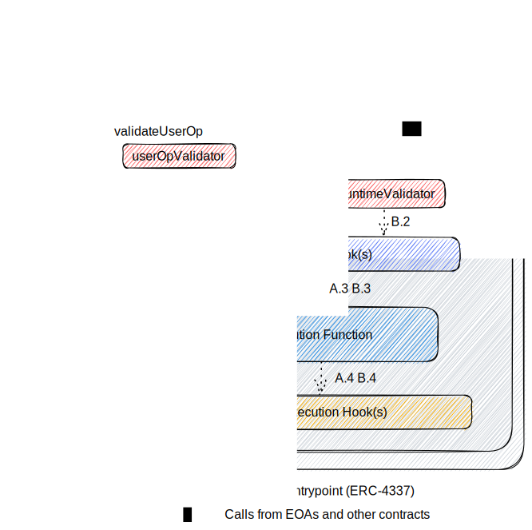

## Abstract

This proposal standardizes smart contract accounts and account plugins, which are smart contract interfaces that allow for composable logic within smart contract accounts. This proposal is compliant with [ERC-4337](./eip-4337.md), and builds on the existing work from [ERC-2535](./eip-2535.md) when defining interfaces for updating and querying modular function implementations.

This modular approach splits account functionality into three categories, delegates them to external contracts, and defines an expected execution flow from accounts.

## Motivation

One of the goals that ERC-4337 accomplishes is abstracting the logic for execution and validation to each smart contract wallet.

Many new features of wallets can be built by customizing the logic that goes into the validation and execution steps. Examples of such features include session keys, subscriptions, spending limits, and role-based access control. Currently, some of these features are implemented natively by specific smart contract accounts, and others are able to be implemented by plugin systems. Examples of proprietary plugin systems include Safe modules and ZeroDev plugins.

However, managing multiple wallet instances provides a worse user experience, fragmenting accounts across supported features and security configurations. Additionally, it requires plugin developers to choose which platforms to support, causing either platform lock-in or duplicated development effort.

We propose a standard that coordinates the implementation work between plugin developers and wallet developers. This standard defines a modular smart contract account capable of supporting all standard-conformant plugins. This allows users to have greater portability of their data, and for plugin developers to not have to choose specific wallet implementations to support.


We take inspiration from ERC-2535’s diamond pattern and adopt a similar composability by proposing three types of plugins. However, you are not required to implement the account with a multi-facet proxy pattern. These plugins contain execution logic. They also incorporate validation schemes and hooks. Validation schemes define the circumstances under which the smart contract account will approve actions taken on its behalf, while hooks allow for pre- and post-execution controls. Accounts adopting this ERC will support modular, upgradable execution and validation logic.

Defining this as a standard for smart contract accounts will make plugins easier to develop securely and will allow for greater interoperability.

Goals:

- Provide standards for how validation, execution, and hook functions for smart contract accounts should be written.
- Provide standards for how compliant accounts should add, update, remove, and inspect plugins.

## Specification

The key words "MUST", "MUST NOT", "REQUIRED", "SHALL", "SHALL NOT", "SHOULD", "SHOULD NOT", "RECOMMENDED", "NOT RECOMMENDED", "MAY", and "OPTIONAL" in this document are to be interpreted as described in RFC 2119 and RFC 8174.

### Terms

- An **account** (or **smart contract account, SCA**) is a smart contract that can be used to send transactions and hold digital assets. It implements the `IAccount` interface from ERC-4337.
- A **modular account** (or **modular smart contract account, MSCA**) is an account that supports modular functions. There are three types of modular functions:
  - **Validation functions** validate the caller’s authenticity and authority to the account.
  - **Execution functions** execute any custom logic allowed by the account.
  - **Hooks** execute custom logic and checks before and/or after an execution function.
- A **validation function** is a function that validates authentication and authorization of a caller to the account. There are two types of validation functions:
  - **User Operation Validator** functions handle calls to `validateUserOp` and check the validity of an ERC-4337 user operation. The function may have any function name, but MUST take in the parameters `(UserOperation calldata, bytes32, uint256)`, representing the user operation, user operation hash, and required prefund. It MUST return `(uint256)`, representing packed validation data for `authorizer`, `validUntil`, and `validAfter`.
  - **Runtime Validator** functions run before an execution function, and enforce checks. Common checks include enforcing only calls from `EntryPoint` or an owner.
- An **execution function** is a smart contract function that defines the execution of a function for a **modular account**.
- A **hook** is a smart contract function executed before or after an **execution function**, with the ability to modify state or cause the entire call to revert. There are two types of **hooks**.
  - **preHook** functions run before an **execution function;**. They map optionally return data to be consumed the **postHook**.
  - **postHook** functions run after an **execution function**. They can optionally take returned data from **preHook**.
- **Associated function** refers to either a validation function or a hook.
- A **plugin** is a deployed smart contract that hosts any amount of the above three kinds of modular functions: execution functions, validation functions, or hooks.

### Overview

A smart contract account handles two kinds of calls: one from `Entrypoint` through ERC-4337, the other are direct calls from EOA and other smart contracts. The proposal supports both use cases.

A call to the smart contract account can be decomposed into 4 steps as shown in the diagram below. The validation step (Step 1) validates if the caller is allowed to call. The pre execution hook step (Step 2) can be used to do any pre execution checks or updates. It can also be used with the post execution hook step (Step 4) to perform certain verifications. The execution step (Step 3) performs a performs a call-defined task or collection of tasks.



Each step is modularized and can have different combinations and infinite functionalities. **The smart contract account SHOULD orchestrate the above 4 steps.** For example, a MSCA has a fallback functions that orchestrate the above 4 steps for the account.

### Interfaces

Modular Smart Contract Accounts MUST implement the `IAccount` interface from [ERC-4337](./eip-4337.md).

#### `IModularAccount.sol`

Modular Smart Contract Accounts MAY implement `IModularAccount` to support view functions without the need to add view functions selectors into storage through updatePlugins.

```solidity
interface IModularAccount {
   /**
    * view function calls to the account
    * @param implAddress the address of the implmentation contract
    * @param data params to pass to the view function
    */
   function viewCall(address implAddress, bytes calldata data) external returns (bytes memory);
}
```

#### `IPluginUpdate.sol`

Plugin modification interface. Modular Smart Contract Accounts MAY implement this interface to support updates to plugins.

```solidity
interface IPluginUpdate {
    enum PluginAction {
        ADD,
        REPLACE,
        REMOVE
    }

    enum AssociatedFunctionType {
        USER_OP_VALIDATOR,
        RUNTIME_VALIDATOR,
        PRE_HOOK,
        POST_HOOK
    }

    struct PluginUpdate {
        address executionPluginAddress;
        PluginAction action;
        ExecutionUpdate[] executionUpdates;
    }

    struct GlobalPluginUpdate {
        PluginAction action;
        AssociatedFunction globalPlugin;
    }

    struct ExecutionUpdate {
        bytes4 executionSelector;
        AssociatedFunction[] associatedFunctions;
    }

    struct AssociatedFunction {
        AssociatedFunctionType functionType;
        address implAddress;
        bytes4 implSelector;
    }

    event PluginsUpdated(PluginUpdate[] pluginUpdates, address init, bytes callData);

    event GlobalPluginsUpdated(AssociatedFunction[] globalPluginUpdates, address init, bytes callData);

    /**
        * @notice Add/replace/remove any number of plugins and optionally execute a function
        * @param pluginUpdates Contains the plugin addresses and function selectors.
        *        executionPluginAddress specifies the plugin containing the execution functions defined within
        *        pluginAction denotes what operation to perform
        *        executionUpdates denote which execution function and associated function to perform the opeartion on.
        * @param init The address of the contract or facet to execute calldata
        * @param callData A function call, including function selector and arguments
        */
    function updatePlugins(PluginUpdate[] memory pluginUpdates, address init, bytes calldata callData) external;

    /**
     * @notice Add/replace/remove any number of global plugins and optionally execute a function
     * @param globalPluginUpdates Contains the plugin addresses and function selectors.
     * @param init The address of the contract or facet to execute calldata
     * @param callData A function call, including function selector and arguments
     */
   function updateGlobalPlugins(GlobalPluginUpdate[] memory globalPluginUpdates, address init, bytes calldata callData)
       external;
}
```

#### `IPluginLoupe.sol`

Plugin inspection interface. Modular Smart Contract Accounts MAY implement this interface to support visibility in plugin configuration on-chain. Note this will require extra storage.

```solidity
interface IPluginLoupe {
    struct PluginInfo {
        address executionPluginAddress;
        FunctionConfig[] configs;
    }

    struct FunctionConfig {
        bytes4 executionSelector;
        FunctionReference userOpValidator;
        FunctionReference runtimeValidator;
        FunctionReference preHook;
        FunctionReference postHook;
    }

    struct FunctionReference {
        address implAddress;
        bytes4 implSelector;
    }

    function getPlugins() external view returns (PluginInfo[] memory);

    function getPlugin(address executionPluginAddress) external view returns (FunctionConfig[] memory functions);

    function getFunctionConfig(bytes4 executionSelector) external view returns (FunctionConfig memory);
}
```

#### `IPlugin.sol`

Plugin interface. Plugins MUST implement the following interface.

```solidity
interface IPlugin {
  // Returns the starting storage slot owned by the plugin.
  // Storage may extend past this slot, or to other locations
  // when used through mappings or dynamically-sized arrays
  function pluginStorageRoot() external view returns (bytes32 slot);
}
```

### Expected behavior

#### Calls to `updatePlugins`

The function `updatePlugins` takes in an array of updates to perform, and an optional initialization function. The function MUST perform the update operation sequentially, then, if the address provided in `init` is not `address(0)`, MUST execute `init` with the calldata `callData`.

> **⚠️ The ability to update a plugin is very powerful. The security of the updatePlugins determines the security of the account. It is critical for Account builders to make sure updatePlugins has the proper security consideration and access control in place.**

#### Calls to `validateUserOp`

When the function `validateUserOp` is called on an MSCA by the `EntryPoint`, it MUST find the user operation validator defined for the selector in `userOp.callData`, which is in the first four bytes. If there is no function defined for the selector, or if `userOp.callData.length < 4`, then execution MUST revert. Otherwise, the MSCA MUST execute the validator function with the user operation, its hash, and the required prefund as parameters. The returned validation data from the user operation validator MUST be returned by `validateUserOp`.

#### Calls to execution functions

When a function other than `validateUserOp` is called on an MSCA, it MUST find the plugin configuration for the corresponding selector added via `updatePlugins`. If no corresponding plugin is found, the MSCA MUST revert. Otherwise, the MSCA MUST perform the following steps:

- If a `runtimeValidator` function is defined, execute the function with the execution function’s calldata as parameter.
- If there are global `preHook`s, execute each with the execution function’s calldata.
- If an associated `preHook` is defined, execute the associated function with the execution function’s calldata. If the `preHook` returns data, it MUST be preserved until the call to `postHook`.
- execute the execution function.
- If an associated `postHook` is defined, execute the associated function with the execution function’s calldata. If the `preHook` function returned data, the MSCA MUST pass that data in to `postHook`.
- If there are global `postHook`s, execute each with the execution function’s calldata.

> **⚠️ If the execution function does not have a definition for either `runtimeValidator`, `preHook`, or `postHook`, the undefined functions will be skipped. The execution function will be executed and it may change account state.**
>
> **💡 If, during the execution of `runtimeValidator`, the caller can be established as the EntryPoint contract, it is guaranteed the associated user operation validator has returned a valid signature. Validation MAY be skipped.**

#### Plugin update operations

When `updatePlugins` is called with `PluginAction.ADD`, the following MUST occur:

- Each `executionSelector` must be added their parent `executionPluginAddress` as a valid implementation contract to forward calls to.
- Each `AssociatedFunction` must be added to their parent execution function in the role specified by `associatedFunctionType`.

Execution function selectors MUST be unique when added.

When `updatePlugins` is called with `PluginAction.REPLACE`, each `executionSelector` MUST override any previous execution definition for said function selector. Any associated function defined MUST override previously defined function selectors. Existing associated functions not specified in this operation MUST NOT be modified.

When `updatePlugins` is called with `PluginAction.REMOVE`, both execution function definitions and associated function definitions MUST be removed. The contents of the `associatedFunctions` array MUST be ignored.

When adding a plugin function of any type, the MSCA MAY call `pluginStorageRoot()` on the plugin. If the returned `bytes32` value has ever been returned by a previously added plugin, the MSCA MAY revert and reject the operation.

#### Plugins Storage Management

Plugins MAY access the storage of other plugins. If a plugin does not have any plugin-specific storage, it MUST return `0` for the method `pluginStorageRoot()`.

Plugin contracts MUST NOT define or access storage structs growing from slot 0.

Plugin storage management is managed by plugin implementations. Here is an example where storage management is done through statically linked Solidity libraries.

`LibMyPlugin.sol`

```solidity
library LibMyPlugin {
    bytes32 constant MY_PLUGIN_POSITION = keccak256("plugin.standard.my.plugin");

    struct MyPluginStorage {
        // Any storage fields you need
    }

    // Return my plugin storage struct for reading and writing
    function getStorage() internal pure returns (MyPluginStorage storage storageStruct) {
        bytes32 position = MY_PLUGIN_POSITION;
        assembly {
            storageStruct.slot := position
        }
    }
}
```

#### Plugin Functions

Execution functions may have any function signature, but must be unique for the account. When added to an MSCA via `updatePlugins`, the function selector of the execution function will be mapped from the modular account to the plugin.

User Operation Validation functions may have any function name, and MUST take in the parameters `(UserOperation calldata, bytes32)`, representing the user operation and the user operation hash. The functions MUST return `(uint256)`, representing packed validation data for `authorizer`, `validUntil`, and `validAfter`.

> Here is an example function signature of a conformant user operation validator function:
>
> ```solidity
> function validateSignature(UserOperation calldata userOp, bytes32 userOpHash) external returns (uint256 validationData);
> ```

Runtime Validation Functions may have any function name, and MUST take in the parameters `(bytes calldata)`.

> Here is an example function signature of a conformant runtime validator function:
>
> ```solidity
> function validateOwnership(bytes calldata) external;
> ```

Hooks MAY have any function name.
Global hooks MUST be executed for every incoming call.
The global preHook function MUST take in the parameters `(bytes calldata data)`.
The global postHook function MUST take in the parameters `(bytes calldata data)`.
For sets of hooks that are used specifically with execution funtions, they MAY be paired and share information through returned value.
The preHook function MUST take in the parameters `(bytes calldata data)` and return `(bytes calldata preHookReturnedData)`.
The postHook function MUST take in the parameters `(bytes calldata data, bytes calldata preHookReturnedData)`.

## Rationale

ERC-4337 compatible accounts must implement the `IAccount` interface, which consists of only one method that bundles validation with execution: `validateUserOp`. A primary design rationale for this proposal is to extend the possible functions for a smart contract account beyond this single method by unbundling these and other functions, while retaining the benefits of account abstraction.

The diamond pattern of ERC-2535 is the logical starting point for achieving this extension into multiple functionality, given its suitability for implementing multiple execution calls to ERC-4337 compatible accounts from EntryPoint. It also meets our other primary design rationale of generalizability to calls to EOA/SC accounts. However, a strict diamond pattern is constrained by its inability to customize validation schemes and other logic linked to specific execution functions in the context of `validateUserOp`.

This proposal includes several interfaces that build on ERC-4337 and is ispired by ERC-2535. First, we standardize a set of modular plugins that allow smart contract developers greater flexibility in bundling validation, execution and hook logic. We also propose interfaces like `IPluginUpdate` that take inspiration from the diamond standard, and provide methods for updating and querying execution functions, validation schemes, and hooks.

The diamond standard's interfaces are not required or enforced by this standard. An MSCA implementation is considered compliant with this standard as long as it satisfies the interface requirements and expected behaviors.

## Backwards Compatibility

No backward compatibility issues found.

## Reference Implementation

TBD.

## Security Considerations

Needs discussion.

## Copyright

Copyright and related rights waived via [CC0](../LICENSE.md).
