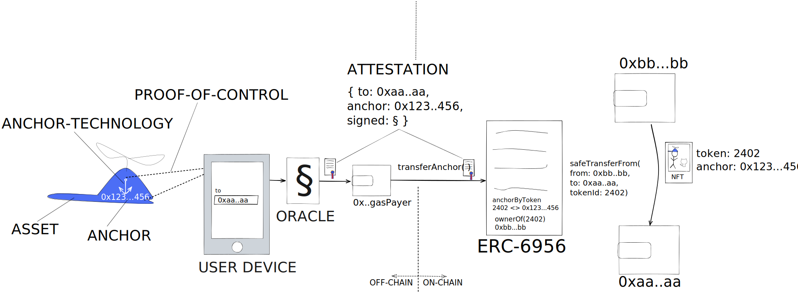

## Abstract

This standard allows integrating physical and digital ASSETS without signing capabilities into dApps/web3 by extending [ERC-721](eip-721.md).

An ASSET, for example a physical object, is marked with a uniquely identifiable ANCHOR. The ANCHOR is bound in a secure and inseperable manner 1:1 to an NFT on-chain - over the complete life cylce of the ASSET. 

Through an ATTESTATION, an ORACLE testifies that a particular ASSET associated with an ANCHOR has been CONTROLLED when defining the `to`-address for certain operations (mint, transfer, burn, approve, ...). The ORACLE signs the ATTESTATION off-chain. The operations are authorized through verifying on-chain that ATTESTATION has been signed by a trusted ORACLE. Note that authorization is solely provided through the ATTESTATION, or in other words, through PROOF-OF-CONTROL over the ASSET. The controller of the ASSET is guaranteed to be the controller of the Asset-Bound NFT.

The proposed ATTESTATION-authorized operations such as `transferAnchor(attestation)` are permissionless, meaning neither the current owner (`from`-address) nor the receiver (`to`-address) need to sign. 

Figure 1 shows the data flow of an ASSET-BOUND NFT transfer. The simplified system is utilizing a smartphone as user-device to interact with a physical ASSET and specify the `to`-address.



## Motivation

The well-known [ERC-721](eip-721.md) establishes that NFTs may represent "ownership over physical properties [...] as well as digital collectables and even more abstract things such as responsibilities" - in a broader sense, we will refer to all those things as ASSETS, which typically have value to people.

### The Problem

ERC-721 outlines that "NFTs can represent ownership over digital or physical assets". ERC-721 excels in this task when used to represent ownership over digital, on-chain assets, that is when the asset is "holding a token of a specific contract" or the asset is an NFT's metadata. Today, people commonly treat an NFT's metadata (images, traits, ...) as asset-class, with their rarity often directly defining the value of an invididual NFT. 

However, we see integrity issues not solveable with ERC-721, primarily when NFTS are used to represent off-chain ASSETS ("ownership over physical products", "digital collectables", "in-game assets", "responsibilities", ...). Over an ASSET's lifecycle, the ASSET's ownership and posession state changes multiple, sometimes thousands, of times. Each of those state changes may result in shifting obligations and privileges for the involved parties. Therefore tokenization of an ASSET *without* enforcably anchoring the ASSET's associated obligation and properties to the token is not complete. Nowadays, off-chain ASSETs are often "anchored" through adding an ASSET-identifier to a NFT's metadata. 

**NFT-ASSET integrity:** Contrary to a popular belief among NFT-investors, metadata is data that is, more often than not, mutable and off-chain. Therefore the link between an ASSET through an asset-identifier stored in mutable metadata, which is only linked to the NFT through tokenURI, can be considered weak at best.

Approaches to ensure integrity between metadata (=reference to ASSET) and a token exist. This is most commonly achieved by storing metadata-hashes onchain. Additional problems arise through hashing; For many applications, metadata (besides the asset-identifier) should be update-able. Therefore making metadata immutable through storing a hash is problematic. Further the offchain metadata-resource specified via tokenURI must be made available until eternity, which has historically been subject to failure (IPFS bucket disappears, central tokenURI-provider has downtimes, ...)

**Off-chain-on-chain-integrity:** There are approaches where off-chain ASSET ownership is enforced or conditioned through having ownership over the on-chain representation. A common approach is to burn tokens in order to get the (physical) ASSET, as the integrity cannot be maintained. However, there are no approaches known, where on-chain ownership is enforced through having off-chain ownership of the ASSET. Especially when the current owner of an NFT is incooperative or incapacitated, integrity typically fail due to lack of signing-power from the current NFT owner.

Metadata is off-chain. The majority of implementations completely neglect that metadata is mutable. More serious implementations strive to preserve integrity by for example hashing metadata and storing the hash mapped to the tokenId on-chain. However, this approach does not allow for use-case, where metadata besides the asset-identifier, for example traits, "hours played", ... shall be mutable or evolvable.

### ASSET-BOUND NON-FUNGIBLE TOKENS

In this standard we propose to

1. Elevate the concept of representing physical or digital off-chain ASSETS by on-chain ANCHORING the ASSET inseperably into an NFT.
1. Being off-chain in control over the ASSET must mean being on-chain in control over the anchored NFT.
1. (Related) A change in off-chain ownership over the ASSET inevitably should be reflected by a change in on-chain ownership over the anchored NFT, even if the current owner is uncooperative or incapacitated.

As 2. and 3. indicate, the control/ownership/posession of the ASSET should be the single source of truth, *not* the posession of an NFT. Hence, we propose an ASSET-BOUND NFT, where off-chain CONTROL over the ASSET enforces on-chain CONTROL over the anchored NFT.
Also the proposed ASSET-BOUND NFTs allow to anchor digital metadata inseperably to the ASSET. When the ASSET is a physical asset, this allows to design "phygitals" in their purest form, namely creating a "phygital" asset with a physical and digital component that are inseperable. Note that metadata itself can still change, for instance for "Evolvable NFT".

We propose to complement the existing transfer control mechanisms of a token according to ERC-721, `Approval` according to [ERC-721](eip-721.md) and `Permit` according to [ERC-4494](eip-4494.md), by another mechanism; ATTESTATION. An ATTESTATION is signed off-chain by the ORACLE and must only be issued when the ORACLE verified that whoever specifies the `to` address or beneficiary address has simultanously been in control over the ASSET. The `to` address of an attestation may be used for Transfers as well as for approvals and other authorizations.

Transactions authorized via ATTESTATION shall not require signature or approval from neither the `from` (donor, owner, sender) nor `to` (beneficiary, receiver) account, namely making transfers permissionless. Ideally, transaction are signed independent from the ORACLE as well, allowing different scenarios in terms of gas-fees.

Lastly we want to mention two major side-benefits of using the proposed standard, which drastically lowers hurdles in onboarding web2 users and increase their security;

- New users, e.g `0xaa...aa` (Fig.1), can use gasless wallets, hence participate in Web3/dApps/DeFi and mint+transfer tokens without ever owning crypto currency. Gas-fees may be paid through a third-party account `0x..gasPayer` (Fig.1). The gas is typically covered by the ASSET issuer, who signs `transferAnchor()` transactions
- Users cannot get scammed. Common attacks (for example wallet-drainer scams) are no longer possible or easily reverted, since only the anchored NFT can be stolen, not the ASSET itself. Also mishaps like transferring the NFT to the wrong account, losing access to an account etc can be mitigated by executing another `transferAnchor()` transaction based on proofing control over the ASSET, namely the physical object.

### Related work

We primarily aim to onboard physical or digital ASSETS into dApps, which do not signing-capabilities of their own (contrary to [ERC-5791](eip-5791.md) approach using crypto-chip based solutions). Note that we do not see any restrictions preventing to use ERC-5791 in combination with this standard, as the address of the crypto-chip qualifies as an ANCHOR.

<!-- TO BE EXTENDED -->

## Specification

The key words "MUST", "MUST NOT", "REQUIRED", "SHALL", "SHALL NOT", "SHOULD", "SHOULD NOT", "RECOMMENDED", "NOT RECOMMENDED", "MAY", and "OPTIONAL" in this document are to be interpreted as described in RFC 2119 and RFC 8174.

### Definitions (alphabetical)

- **ANCHOR** uniquely identifies the off-chain ASSET, whether it is physical or digital.
- **ANCHOR-TECHNOLOGY** MUST ensure that
  - the ANCHOR is inseperable from the ASSET (physically or otherwise)
  - an ORACLE can establish PROOF-OF-CONTROL over the ASSET beyond reasonable doubt
  - For physical ASSETS, additional [Security considerations for Physical Assets](#security-considerations-for-physical-assets) MUST be taken into account 

- **ASSET** refers to the "thing", being it physical or digital, which is represented through NFTs according to the proposed standard. Typically, an ASSET does not have signing capabilities.

- **ATTESTATION** is the confirmation that PROOF OF CONTROL was established when specifying the `to` (receiver, beneficiary) address.

- **PROOF-OF-CONTROL** over the ASSET means owning or otherwise controlling an ASSET. How Proof of Control is established depends on the ASSET and may be implemented using technical, legal or other means. For physical ASSETS, CONTROL is typically verified by proofing physical proximity between a physical ASSET and an input device (for example a smartphone) used to specify the `to` address.

- An **ORACLE** has signing capabilities. MUST be able to sign ATTESTATIONS off-chain in a way such that signatures can be verified on-chain.


### Base Interface

Every contract compliant to this standard MUST implement the [the proposed standard interface](../assets/eip-6956/contracts/IERC6956.sol), [ERC-721](eip-721.md) and [ERC-165](eip-165.md) interfaces and is subject to [Caveats](#caveats-for-base-interface) below:

```solidity
// SPDX-License-Identifier: MIT OR CC0-1.0
pragma solidity ^0.8.18;

/**
 * @title IERC6956 Asset-Bound Non-Fungible Tokens 
 * @notice Asset-bound Non-Fungible Tokens anchor a token 1:1 to a (physical or digital) asset and token transfers are authorized through attestation of control over the asset
 * @dev See https://eips.ethereum.org/EIPS/eip-6956
 *      Note: The ERC-165 identifier for this interface is 0xa9cf7635
 */
interface IERC6956 {
   
    /** @dev Authorization, typically mapped to authorizationMaps, where each bit indicates whether a particular ERC6956Role is authorized 
     *      Typically used in constructor (hardcoded or params) to set burnAuthorization and approveAuthorization
     *      Also used in optional updateBurnAuthorization, updateApproveAuthorization, I
     */ 
    enum Authorization {
        NONE,               // = 0,      // None of the above
        OWNER,              // = (1<<OWNER), // The owner of the token, i.e. the digital representation
        ISSUER,             // = (1<<ISSUER), // The issuer of the tokens, i.e. this smart contract
        ASSET,              // = (1<<ASSET), // The asset, i.e. via attestation
        OWNER_AND_ISSUER,   // = (1<<OWNER) | (1<<ISSUER),
        OWNER_AND_ASSET,    // = (1<<OWNER) | (1<<ASSET),
        ASSET_AND_ISSUER,   // = (1<<ASSET) | (1<<ISSUER),
        ALL                 // = (1<<OWNER) | (1<<ISSUER) | (1<<ASSET) // Owner + Issuer + Asset
    }
    
    /**
     * @notice This emits when approved address for an anchored tokenId is changed or reaffirmed via attestation
     * @dev This emits when approveAnchor() is called and corresponds to ERC-721 behavior
     * @param owner The owner of the anchored tokenId
     * @param approved The approved address, address(0) indicates there is no approved address
     * @param anchor The anchor, for which approval has been chagned
     * @param tokenId ID (>0) of the anchored token
     */
    event AnchorApproval(address indexed owner, address approved, bytes32 indexed anchor, uint256 tokenId);

    /**
     * @notice This emits when the ownership of any anchored NFT changes by any mechanism
     * @dev This emits together with tokenId-based ERC-721.Transfer and provides an anchor-perspective on transfers
     * @param from The previous owner, address(0) indicate there was none.
     * @param to The new owner, address(0) indicates the token is burned
     * @param anchor The anchor which is bound to tokenId
     * @param tokenId ID (>0) of the anchored token
     */
    event AnchorTransfer(address indexed from, address indexed to, bytes32 indexed anchor, uint256 tokenId);
    /**
     * @notice This emits when an attestation has been used indicating no second attestation with the same attestationHash will be accepted
     * @param to The to address specified in the attestation
     * @param anchor The anchor specificed in the attestation
     * @param attestationHash The hash of the attestation, see ERC-6956 for details
     * @param totalUsedAttestationsForAnchor The total number of attestations already used for the particular anchor
     */
    event AttestationUse(address indexed to, bytes32 indexed anchor, bytes32 indexed attestationHash, uint256 totalUsedAttestationsForAnchor);

    /**
     * @notice This emits when the trust-status of an oracle changes. 
     * @dev Trusted oracles must explicitely be specified. 
     *      If the last event for a particular oracle-address indicates it's trusted, attestations from this oracle are valid.
     * @param oracle Address of the oracle signing attestations
     * @param trusted indicating whether this address is trusted (true). Use (false) to no longer trust from an oracle.
     */
    event OracleUpdate(address indexed oracle, bool indexed trusted);

    /**
     * @notice Returns the 1:1 mapped anchor for a tokenId
     * @param tokenId ID (>0) of the anchored token
     * @return anchor The anchor bound to tokenId, 0x0 if tokenId does not represent an anchor
     */
    function anchorByToken(uint256 tokenId) external view returns (bytes32 anchor);
    /**
     * @notice Returns the ID of the 1:1 mapped token of an anchor.
     * @param anchor The anchor (>0x0)
     * @return tokenId ID of the anchored token, 0 if no anchored token exists
     */
    function tokenByAnchor(bytes32 anchor) external view returns (uint256 tokenId);

    /**
     * @notice The number of attestations already used to modify the state of an anchor or its bound tokens
     * @param anchor The anchor(>0)
     * @return attestationUses The number of attestation uses for a particular anchor, 0 if anchor is invalid.
     */
    function attestationsUsedByAnchor(bytes32 anchor) view external returns (uint256 attestationUses);
    /**
     * @notice Decodes and returns to-address, anchor and the attestation hash, if the attestation is valid
     * @dev MUST throw when
     *  - Attestation has already been used (an AttestationUse-Event with matching attestationHash was emitted)
     *  - Attestation is not signed by trusted oracle (the last OracleUpdate-Event for the signer-address does not indicate trust)
     *  - Attestation is not valid yet or expired
     *  - [if IERC6956AttestationLimited is implemented] attestationUsagesLeft(attestation.anchor) <= 0
     *  - [if IERC6956ValidAnchors is implemented] validAnchors(data) does not return true. 
     * @param attestation The attestation subject to the format specified in ERC-6956
     * @param data Optional additional data, may contain proof as the first abi-encoded argument when IERC6956ValidAnchors is implemented
     * @return to Address where the ownership of an anchored token or approval shall be changed to
     * @return anchor The anchor (>0)
     * @return attestationHash The attestation hash computed on-chain as `keccak256(attestation)`
     */
    function decodeAttestationIfValid(bytes memory attestation, bytes memory data) external view returns (address to, bytes32 anchor, bytes32 attestationHash);

    /**
     * @notice Indicates whether any of ASSET, OWNER, ISSUER is authorized to burn
     */
    function burnAuthorization() external view returns(Authorization burnAuth);

    /**
     * @notice Indicates whether any of ASSET, OWNER, ISSUER is authorized to approve
     */
    function approveAuthorization() external view returns(Authorization approveAuth);

    /**
     * @notice Corresponds to transferAnchor(bytes,bytes) without additional data
     * @param attestation Attestation, refer ERC-6956 for details
     */
    function transferAnchor(bytes memory attestation) external;

    /**
     * @notice Changes the ownership of an NFT mapped to attestation.anchor to attestation.to address.
     * @dev Permissionless, i.e. anybody invoke and sign a transaction. The transfer is authorized through the oracle-signed attestation.
     *  - Uses decodeAttestationIfValid()
     *  - When using a centralized "gas-payer" recommended to implement IERC6956AttestationLimited.
     *  - Matches the behavior of ERC-721.safeTransferFrom(ownerOf[tokenByAnchor(attestation.anchor)], attestation.to, tokenByAnchor(attestation.anchor), ..) and mint an NFT if `tokenByAnchor(anchor)==0`.
     *  - Throws when attestation.to == ownerOf(tokenByAnchor(attestation.anchor))
     *  - Emits AnchorTransfer  
     *  
     * @param attestation Attestation, refer EIP-6956 for details
     * @param data Additional data, may be used for additional transfer-conditions, may be sent partly or in full in a call to safeTransferFrom
     * 
     */
    function transferAnchor(bytes memory attestation, bytes memory data) external;

     /**
     * @notice Corresponds to approveAnchor(bytes,bytes) without additional data
     * @param attestation Attestation, refer ERC-6956 for details
     */
    function approveAnchor(bytes memory attestation) external;

     /**
     * @notice Approves attestation.to the token bound to attestation.anchor. .
     * @dev Permissionless, i.e. anybody invoke and sign a transaction. The transfer is authorized through the oracle-signed attestation.
     *  - Uses decodeAttestationIfValid()
     *  - When using a centralized "gas-payer" recommended to implement IERC6956AttestationLimited.
     *  - Matches the behavior of ERC-721.approve(attestation.to, tokenByAnchor(attestation.anchor)).
     *  - Throws when ASSET is not authorized to approve.
     * 
     * @param attestation Attestation, refer EIP-6956 for details 
     */
    function approveAnchor(bytes memory attestation, bytes memory data) external;

    /**
     * @notice Corresponds to burnAnchor(bytes,bytes) without additional data
     * @param attestation Attestation, refer ERC-6956 for details
     */
    function burnAnchor(bytes memory attestation) external;
   
    /**
     * @notice Burns the token mapped to attestation.anchor. Uses ERC-721._burn.
     * @dev Permissionless, i.e. anybody invoke and sign a transaction. The transfer is authorized through the oracle-signed attestation.
     *  - Uses decodeAttestationIfValid()
     *  - When using a centralized "gas-payer" recommended to implement IERC6956AttestationLimited.
     *  - Throws when ASSET is not authorized to burn
     * 
     * @param attestation Attestation, refer EIP-6956 for details
     */
    function burnAnchor(bytes memory attestation, bytes memory data) external;
}
```

#### Caveats for Base Interface

- MUST implement ERC-721 and ERC-165
- MUST have bidirectional mapping `tokenByAnchor(anchor)` and `anchorByToken(tokenId)`. This implies that a maximum of one token per ANCHOR exists.
- MUST have a mechnism to determine whether an ANCHOR is valid for the contract. RECOMMENDED to implement the proposed [ValidAnchors-Interface](#validanchors-interface)
- MUST implement `decodeAttestationIfValid(attestation, data)` to validate and decode ATTESTATIONS as specified in the [ORACLE-Section](#oracle)
  - MUST return `attestation.to`, `attestation.anchor`, `attestation.attestationHash`.
  - MUST not modify state, as this function can be used to check an ATTESTATION's validity without redeeming it.
  - MUST throw when
    - ATTESTATION is not signed from a trusted ORACLE.
    - ATTESTATION has expired or is not valid yet
    - ATTESTATION has not been reedemed. "Redeemed" being defined in at least one state-changing operation has been authorized through a particular ATTESTATION.
    - If [AttestationLimited-Interface](#attestationlimited-interface) implemented: When `attestationUsagesLeft(attestation.to) <= 0`  
    - If [ValidAnchors-Interface](#validanchors-interface) implemented: When `validAnchor() != true`.
  - If [ValidAnchors-Interface](#validanchors-interface) implemented: MUST call `validAnchor(attestation.to, abi.decode('bytes32[]',data))`, meaning the first abi-encoded value in the `data` parameter corresponds to `proof`.
- MUST have a ANCHOR-RELEASED mechanism, indicating whether the anchored NFT is released/transferable. 
  - Any ANCHOR MUST NOT be released by default.
- MUST extend any ERC-721 token transfer mechanism by:
  - MUST throw when `ANCHOR` is not released.
  - MUST throw when batchSize > 1, namely no batch transfers are supported with this contract.
  - MUST emit `AnchorTransfer(from, to, anchorByToken[tokenId], tokenId)`

- MUST implement `attestationsUsedByAnchor(anchor)`, returning how many attestations have already been used for a specific anchor.

- MUST implement the state-changing `transferAnchor(..)`, `burnAnchor(..)`, `approveAnchor(..)` and OPTIONAL MAY implement additional state-changing operations which
  - MUST use the `decodeAttestationIfValid()` to determine `to`, `anchor` and `attestationHash`
  - MUST redeem each ATTESTATION in the same transaction as any authorized state-changing operation. RECOMMENDED by storing each used `attestationHash`
  - MUST increment `attestationsUsedByAnchor[anchor]`
  - MUST emit `AttestationUsed`
  - `transferAnchor(attestation)` MUST behave and emit events like `ERC-721.safeTransferFrom(ownerOf[tokenByAnchor(attestation.anchor)], attestation.to, tokenByAnchor(attestation.anchor), ..)` and mint an NFT if `tokenByAnchor(anchor)==0`.
 
- RECOMMENDED to implement `tokenURI(tokenId)` to return an anchorBased-URI, namely `baseURI/anchor`. This anchoring metadata to ASSET. Before an anchor is not used for the first time, the ANCHOR's mapping to tokenId is unknown. Hence, using the anchor in instead of the tokenId is preferred.


### ORACLE

- MUST provide an ATTESTATION. Below we define the format how an ORACLE testifies that the `to` address of a transfer has been specified under the pre-condition of PROOF-OF-CONTROL associated with the particular ANCHOR being transferred to `to`.
- The ATTESTATION MUST abi-encode the following:
  - `to`, MUST be address, specifying the beneficiary, for example the to-address, approved account etc.
  - ANCHOR, aka the ASSET identifier, MUST have a 1:1 relation to the ASSET
  - `attestationTime`, UTC seconds, time when attestation was signed by ORACLE,
  - `validStartTime` UTC seconds, start time of the ATTESTATION's validity timespan
  - `validEndTime`, UTC seconds, end time of the ATTESTATION's validity timespan
  - `signature`, ETH-signature (65 bytes). Output of an ORACLE signing the `attestationHash = keccak256([to, anchor, attestationTime, validStartTime, validEndTime])`.
- How PROOF-OF-CONTROL is establish in detail through an ANCHOR-TECHNOLOGY is not subject to this standard. Some ORACLE requirements and ANCHOR-TECHNOLOGY requirements when using PHYSICAL ASSETS are outlined in [Security considerations for Physical Assets](#security-considerations-for-physical-assets).

Minimal Typescript sample to generate an ATTESTATION using ethers library:

```typescript
export async function minimalAttestationSample() {
    // #################################### ACCOUNTS
  // Alice shall get the NFT, oracle signs the attestation off-chain 
  // Oracle needs to be a trusted Oracle of the smart-contract that shall accept the generated attestation
  const [alice, oracle] = await ethers.getSigners();

  // #################################### CREATE AN ATTESTATION
  const to = alice.address;
  const anchor = '0x4cc52563699fb1e3333b8aab3ecf016f8fd084e6fc48edf8603d83d4c5b97536'

  const attestationTime = Math.floor(Date.now() / 1000.0); // Now in seconds UTC
  const validStartTime = 0;
  const validEndTime = attestationTime + 15 * 60; // 15 minutes valid from attestation

  const messageHash = ethers.utils.solidityKeccak256(
    ["address", "bytes32", "uint256", 'uint256', "uint256"], 
    [to, anchor, attestationTime, validStartTime, validEndTime]
  );
  const sig = await signer.signMessage(ethers.utils.arrayify(messageHash));

  return ethers.utils.defaultAbiCoder.encode(
    ['address', 'bytes32', 'uint256', 'uint256', 'uint256', 'bytes'], 
    [to, anchor, attestationTime,  validStartTime, validEndTime, sig]
  );
}
```

### AttestationLimited-Interface

Every contract compliant to this standard MAY implement the [proposed AttestationLimited interface](../assets/eip-6956/contracts/IERC6956AttestationLimited.sol) and is subject to [Caveats](#caveats-for-attestationlimited-interface) below:

```solidity
// SPDX-License-Identifier: MIT OR CC0-1.0
pragma solidity ^0.8.18;
import "./IERC6956.sol";

/**
 * @title Attestation-limited Asset-Bound NFT
 * @dev See https://eips.ethereum.org/EIPS/eip-6956
 *      Note: The ERC-165 identifier for this interface is 0x75a2e933
 */
interface IERC6956AttestationLimited is IERC6956 {
  enum AttestationLimitPolicy {
    IMMUTABLE,
    INCREASE_ONLY,
    DECREASE_ONLY,
    FLEXIBLE
  }
      
  /// @notice Returns the attestation limit for a particular anchor
  /// @dev MUST return the global attestation limit per default
  ///      and override the global attestation limit in case an anchor-based limit is set
  function attestationLimit(bytes32 anchor) external view returns (uint256 limit);

  /// @notice Returns number of attestations left for a particular anchor
  /// @dev Is computed by comparing the attestationsUsedByAnchor(anchor) and the current attestation limit 
  ///      (current limited emitted via GlobalAttestationLimitUpdate or AttestationLimt events)
  function attestationUsagesLeft(bytes32 anchor) external view returns (uint256 nrTransfersLeft);

  /// @notice Indicates the policy, in which direction attestation limits can be updated (globally or per anchor)
  function attestationLimitPolicy() external view returns (AttestationLimitPolicy policy);

  /// @notice This emits when the global attestation limt is updated
  event GlobalAttestationLimitUpdate(uint256 indexed transferLimit, address updatedBy);

  /// @notice This emits when an anchor-specific attestation limit is updated
  event AttestationLimitUpdate(bytes32 indexed anchor, uint256 indexed tokenId, uint256 indexed transferLimit, address updatedBy);

  /// @dev This emits in the transaction, where attestationUsagesLeft becomes 0
  event AttestationLimitReached(bytes32 indexed anchor, uint256 indexed tokenId, uint256 indexed transferLimit);
}
```

#### Caveats for AttestationLimited-Interface

- MUST extend the proposed standard interface
- MUST define one of the above listed AttestationLimit update policies and expose it via `attestationLimitPolicy()`
  - MUST support different update modes, namely FIXED, INCREASE_ONLY, DECREASE_ONLY, FLEXIBLE (= INCREASABLE and DECREASABLE)
  - RECOMMENDED to have a global transfer limit, which can be overwritten on a token-basis (when `attestationLimitPolicy() != FIXED`)
- MUST implement `attestationLimit(anchor)`, specifying how often an ANCHOR can be transferred in total. Changes in the return value MUST reflect the AttestationLimit-Policy.
- MUST implement `attestationUsagesLeft(anchor)`, returning the number of usages left (namely `attestationLimit(anchor)-attestationsUsedByAnchor[anchor]`) for a particular anchor


### Floatable-Interface

Every contract compliant to this extension MAY implement the proposed [Floatable interface](../assets/eip-6956/contracts/IERC6956Floatable.sol) and is subject to [Caveats](#caveats-for-floatable-interface) below:

```solidity
// SPDX-License-Identifier: MIT OR CC0-1.0
pragma solidity ^0.8.18;
import "./IERC6956.sol";

/**
 * @title Floatable Asset-Bound NFT
 * @notice A floatable Asset-Bound NFT can (temporarily) be transferred without attestation
 * @dev See https://eips.ethereum.org/EIPS/eip-6956
 *      Note: The ERC-165 identifier for this interface is 0xf82773f7
 */
interface IERC6956Floatable is IERC6956 {
  enum FloatState {
    Default, // 0, inherits from floatAll
    Floating, // 1
    Anchored // 2
  }

  /// @notice Indicates that an anchor-specific floating state changed
  event FloatingStateChange(bytes32 indexed anchor, uint256 indexed tokenId, FloatState isFloating, address operator);
  /// @notice Emits when FloatingAuthorization is changed.
  event FloatingAuthorizationChange(Authorization startAuthorization, Authorization stopAuthorization, address maintainer);
  /// @notice Emits, when the default floating state is changed
  event FloatingAllStateChange(bool areFloating, address operator);

  /// @notice Indicates whether an anchored token is floating, namely can be transferred without attestation
  function floating(bytes32 anchor) external view returns (bool);
  
  /// @notice Indicates whether any of OWNER, ISSUER, (ASSET) is allowed to start floating
  function floatStartAuthorization() external view returns (Authorization canStartFloating);
  
  /// @notice Indicates whether any of OWNER, ISSUER, (ASSET) is allowed to stop floating
  function floatStopAuthorization() external view returns (Authorization canStartFloating);

  /**
    * @notice Allows to override or reset to floatAll-behavior per anchor
    * @dev Must throw when newState == Floating and floatStartAuthorization does not authorize msg.sender
    * @dev Must throw when newState == Anchored and floatStopAuthorization does not authorize msg.sender
    * @param anchor The anchor, whose anchored token shall override default behavior
    * @param newState Override-State. If set to Default, the anchor will behave like floatAll
    */
  function float(bytes32 anchor, FloatState newState) external;    
}
```


#### Caveats for Floatable-Interface

If `floating(anchor)` returns true, the token identified by `tokenByAnchor(anchor)` MUST be transferable without attestation, typically authorized via `ERC721.isApprovedOrOwner(msg.sender, tokenId)` 

### ValidAnchors-Interface

Every contract compliant to this extension MAY implement the proposed [ValidAnchors interface](../assets/eip-6956/contracts/IERC6956ValidAnchors.sol) and is subject to [Caveats](#caveats-for-validanchors-interface) below:

```solidity
// SPDX-License-Identifier: MIT OR CC0-1.0
pragma solidity ^0.8.18;
import "./IERC6956.sol";

/**
 * @title Anchor-validating Asset-Bound NFT
 * @dev See https://eips.ethereum.org/EIPS/eip-6956
 *      Note: The ERC-165 identifier for this interface is 0x051c9bd8
 */
interface IERC6956ValidAnchors is IERC6956 {
    /**
     * @notice Emits when the valid anchors for the contract are updated.
     * @param validAnchorHash Hash representing all valid anchors. Typically Root of Merkle-Tree
     * @param maintainer msg.sender when updating the hash
     */
    event ValidAnchorsUpdate(bytes32 indexed validAnchorHash, address indexed maintainer);

    /**
     * @notice Indicates whether an anchor is valid in the present contract
     * @dev Typically implemented via MerkleTrees, where proof is used to verify anchor is part of the MerkleTree 
     *      MUST return false when no ValidAnchorsUpdate-event has been emitted yet
     * @param anchor The anchor in question
     * @param proof Proof that the anchor is valid, typically MerkleProof
     * @return isValid True, when anchor and proof can be verified against validAnchorHash (emitted via ValidAnchorsUpdate-event)
     */
    function anchorValid(bytes32 anchor, bytes32[] memory proof) external view returns (bool isValid);        
}
```

#### Caveats for ValidAnchors-Interface

- MUST implement `validAnchor(anchor, proof)` which returns true when anchor is valid, namely MerkleProof is correct, false otherwise.


## Rationale

**Why do you use an anchor<>tokenId mapping and not simply use tokenIds directly?**
Especially for collectable use-cases, special or sequential tokenIds (for example low numbers), have value. Holders may be proud to have claimed tokenId=1 respectively the off-chain ASSET with tokenId=1 may increase in value, because it was the first ever claimed. Or an Issuer may want to address the first 100 owners who claimed their ASSET-BOUND NFT. While these use-cases technically can certainly be covered by observing the blockchain state-changes, we consider reflecting the order in the tokenIds to be the user-friendly way. Please refer [Security considerations](#security-considerations) on why sequential anchors shall be avoided.

**Why is tokenId=0 and anchor=0x0 invalid?**
For gas efficiency. This allows to omit checks and state-variables for the existence of a token or anchor, since mappings of a non-existent key return 0 and cannot be easily distinguised from anchor=0 or tokenId=0.

**ASSETS are often batch-produced with the goal of identical properties, for example a batch of automotive spare parts. Why should do you extend ERC-721 and not Multi-Token standards?**
Even if a (physical) ASSET is mass produced with fungible characteristics, each ASSET has an individual property/ownership graph and thus shall be represented in a non-fungible way. Hence this EIP follows the design decision that ASSET (represented via a unique asset identifier called ANCHOR) and token are always mapped 1-1 and not 1-N, so that a token represents the individual property graph of the ASSET.

**Why is there a burnAnchor() and approveAnchor()?**
Due to the permissionless nature ASSET-BOUND NFTs can even be transferred to or from any address. This includes arbitrary and randomly generated accounts (where the private key is unknown) and smart-contracts which would traditionally not support ERC-721 NFTs. Following that owning the ASSET must be equivalent to owning the NFT, this means that we also need to support ERC-721 operations like approval and burning in such instances through authorizing the operations with an attestation.

**Implementation alternatives considered** Soulbound burn+mint combination, for example through Consensual Soulbound Tokens ([ERC-5484](eip-5484.md)). Disregarded because appearance is highly dubious, when the same asset is represented through multiple tokens over time. An predecessor of this EIP has used this approach and can be found deployed to Mumbai Testnet under address `0xd04c443913f9ddcfea72c38fed2d128a3ecd719e`.

**When should I implement AttestationLimited-Interface**
Naturally, when your use-case requires each ASSET being transferable only a limited number of times. But also for security reasons, see [Security Considerations](#security-considerations)

**Why is there the `IERC6956Floatable.FloatState` enum?** In order to allow gas-efficient implementation of floatAll(), which can be overruled by anchor-based floatability in all combinations. (See rationale for tokenId=0 above).

**Why is there no `floating(tokenId)` function?**
This would behave identically to an `isTransferable(tokenId,...)` mechanism proposed in many other EIPs (refer e.g. [ERC-6454](eip-6454.md)). Further, the proposed `floating(anchorByToken(tokenId))` can be used.

**Why are there different FloatingAuthorizations for start and stop?**
Depending on the use-case, different roles should be able to start or stop floating. Note that for many applications the ISSUER may want to have control over the floatability of the collection.


### Example Use Cases and recommended combination of interfaces

Posession based use cases are covered by the standard interface `IERC6956`: The holder of ASSET is in posession of ASSET. Possession is an important social and economical tool: In many sports games posession of ASSET, commonly referred to as "the ball", is of essence. Posession can come with certain obligations and privileges. Ownership over an ASSET can come with rights and benefits as well as being burdened with liens and obligations. For example, an owned ASSET can be used for collateral, can be rented or can even yield a return. Example use-cases are

- **Posession based token gating:** Club guest in posession of limited T-Shirt (ASSET) gets a token which allows him to open the door to the VIP lounge.

- **Posession based digital twin:** A gamer is in posession of a pair of physical sneakers (ASSET), and gets a digital twin (NFT) to wear them in metaverse.

- **Scarce posession based digital twin:** The producer of the sneakers (ASSET) decided that the product includes a limit of 5 digital twins (NFTs), to create scarcity.

- **Lendable digital twin:** The gamer can lend his sneaker-tokens (NFT) to a friend in the metaverse, so that the friend can run faster.

- **Securing ownership from theft:** If ASSET is owned off-chain, the owner wants to secure the anchored NFT, namely not allow transfers to prevent theft or recover the NFT easily through the ASSET.

- **Selling a house with a mortage:** The owner holds NFT as proof of ownership. The DeFi-Bank finances the house and puts a lock on the transfer of NFT. Allow Transfers of the NFT require the mortage to be paid off. Selling the ASSET (house) off-chain will be impossible, as it's no longer possible to finance the house.

- **Selling a house with a lease:** A lease contract puts a lien on an ASSET's anchored NFT. The old owner removes the lock, the new owner buys and refinances the house. Transfer of NFT will also transfer the obligations and benefits of the lien to the new owner. As a lien-interface, the proposed EIP can for example be extended with [ERC-5604](eip-5604.md)

- **Buying a brand new car with downpayment:** A buyer configures a car and provides a downpayment, for a car that will have an ANCHOR. As long as the car is not produced, the NFT can float and be traded on NFT market places. The owner of the NFT at time of delivery of the ASSET has the the permission to pick up the car and the obligation to pay full price.

- **Buying a barrel of oil by forward transaction:** A buyer buys an oil option on a forward contract for one barrel of oil (ASSET). On maturity date the buyer has the obligation to pick up the oil.

The use case matrix below shows which extensions and settings must (additionally to `IERC6956`!) be implemented for the example use-cases together with relevant configurations.

Note that for `Lockable` listed in the table below, the proposed EIP can be extended with any Lock- or Lien-Mechanism known to extend for ERC-721. Suitable extensions to achieve `Lockable` are for example [ERC-5058](eip-5058.md) or [ERC-5753](eip-5753.md). We recommend to verify whether a token is locked in the `_beforeTokenTransfer()`-hook, as this is called from `safeTransferFrom()` as well as `transferAnchor()`, hence suitable to block "standard" ERC-721 transfers as well as the proposed attestation-based transfers.

| Use Case | approveAuthorization | burnAuthorization | `IERC6956Floatable` | `IERC6956AttestationLimited` | Lockable |
|---------------|---|---|---|---|---|
| **Managing Posession** |
| Token gating  | ASSET | ANY | incompatible | - | - |
| Digital twin  | ASSET | ANY | incompatible | - | - |
| Scarce digital twin | ASSET | ANY | incompatible | required | - |
| Lendable digital twin         | OWNER_AND_ASSET | ASSET | required | - | - |
| **Managing Ownership** |
| Securing ownership from theft   | OWNER or OWNER_AND_ASSET | ANY | optional | - | required |
| Selling an house with a mortage  | ASSET  or OWNER_AND_ASSET | ANY | optional | optional | required |
| Selling a house with a lease | ASSET or OWNER_AND_ASSET | ANY | optional | optional | required |
| Buying a brand new car with downpayment | ASSET or OWNER_AND_ASSET | ANY | optional | optional | required |
| Buying a barrel of oil by forward transaction | ASSET or OWNER_AND_ASSET | ANY | optional | optional | required |

Legend:

- required ... we don't see a way how to implement the use-case without it
- incompatible ... this MUSTN'T be implemented, as it is a security risk for the use-case
- optional ... this MAY optionally be implemented

## Backwards Compatibility

<!-- NEEDS FURTHER DISCUSSION -->

No backward compatibility issues found. 

This EIP is fully compatible with ERC-721 and (when extended with the `IERC6956Floatable`-interface) corresponds to the well-known ERC-721 behavior with an additional authorization-mechanism via attestations. Therefore we recommend - especially for physical assets - to use the present EIP instead of ERC-721 and amend it with extensions designed for ERC-721.

However, it is RECOMMENDED to extend implementations of the proposed standard with an interface indicating transferability of NFTs for market places. Examples include [ERC-6454](eip-6454.md) and [ERC-5484](eip-5484.md).

Many ERC-721 extensions suggest to add additional throw-conditions to transfer methods. This standard is fully compatible, as

- The often-used ERC-721 `_beforeTokenTransfer()` hook must be called for all transfers including attestation-authorized transfers.
- A `_beforeAnchorUse()` hook is suggested in the reference implementation, which only is called when using attestation as authorization.

## Test Cases

Test cases are available:

- For only implementing [the proposed standard interface](../assets/eip-6956/contracts/IERC6956.sol) can be found [here](../assets/eip-6956/test/ERC6956.ts)
- For implementing [the proposed standard interface](../assets/eip-6956/contracts/IERC6956.sol), [the Floatable extension](../assets/eip-6956/contracts/IERC6956Floatable.sol), [the ValidAnchors extension](../assets/eip-6956/contracts/IERC6956ValidAnchors.sol) and [the AttestationLimited extension](../assets/eip-6956/contracts/IERC6956AttestationLimited.sol) can be found [here](../assets/eip-6956/test/ERC6956Full.ts)

## Reference Implementation

- Minimal implementation, only supporting [the proposed standard interface](../assets/eip-6956/contracts/IERC6956.sol) can be found [here](../assets/eip-6956/contracts/ERC6956.sol)
- Full implementation, with support for [the proposed standard interface](../assets/eip-6956/contracts/IERC6956.sol), [the Floatable extension](../assets/eip-6956/contracts/IERC6956Floatable.sol), [the ValidAnchors extension](../assets/eip-6956/contracts/IERC6956ValidAnchors.sol) and [the AttestationLimited extension](../assets/eip-6956/contracts/IERC6956AttestationLimited.sol) can be found [here](../assets/eip-6956/contracts/ERC6956Full.sol)

## Security Considerations

<!-- NEEDS FURTHER DISCUSSION -->

**If the asset is stolen, does this mean the thief has control over the NFT?**
Yes.The standard aims to anchor an NFT to the asset inseperably and unconditionally. This includes reflecting theft, as the ORACLE will testify that PROOF-OF-CONTROL over the ASSET is established. The ORACLE does not testify whether the controller is the legitimate owner,
Note that this may even be a benefit. If the thief (or somebody receiving the asset from the thief) should interact with the anchor, an on-chain address of somebody connected to the crime (directly or another victim) becomes known. This can be a valuable starting point for investigation.
Also note that the proposed standard can be combined with any lock-mechanism, which could lock attestation-based action temporarily or permamently (after mint).

**How to use AttestationLimits to avoid fund-draining**
A central security mechanism in blockchain applications are gas fees. Gas fees ensure that executing a high number of transactions get penalized, hence all DoS or other large-scale attacks are discouraged. Due to the permissionless nature of attestation-authorized operations, many use-cases will arise, where the issuer of the ASSET (which normally is also the issuer of the ASSET-BOUND NFT) will pay for all transactions - contrary to the well-known ERC-721 behavior, where either from- or to-address are paying. So a user with malicious intent may just let the ORACLE approve PROOF-OF-CONTROL multiple times with specifying alternating account addresses. These ATTESTATIONS will be handed to the central gas-payer, who will execute them in a permissionless way, paying gas-fees for each transactions. This effectively drains the funds from the gas-payer, making the system unusable as soon as the gas-payer can no longer pay for transactions.

**Why do you recommend hashing serial numbers over using them plain?**
Using any sequential identifier allows to at least conclude of the number between the lowest and highest ever used serial number. This therefore provides good indication over the total number of assets on the market. While a limited number of assets is often desireable for collectables, publishing exact production numbers of assets is undesireable for most industries, as it equals to publishing sales/revenue numbers per product group, which is often considered confidential. Within supply chains, serial numbers are often mandatory due to their range-based processing capability. The simplest approach to allow using physical serial numbers and still obfuscating the actual number of assets is through hashing/encryption of the serial number.

**Why is anchor-validation needed, why not simply trust the oracle to attest only valid anchors?**
The oracle testifies PROOF-OF-CONTROL. As the ORACLE has to know the merkle-tree of valid anchors, it could also modify the merkle-tree with malicious intent. Therefore, having an on-chain verification, whether the original merkle-tree has been used, is needed. Even if the oracle gets compromised, it should not have the power to introduce new anchors. This is achieved by requiring that the oracle knows the merkle-tree, but updateValidAnchors() can only be called by a maintainer. Note that the oracle must not be the maintainer. As a consequence, care shall be taken off-chain, in order to ensure that compromising one system-part not automatically compromises oracle and maintainer accounts. 

**Why do you use merkle-trees for anchor-validation?**
For security- and gas-reasons. Except for limited collections, anchors will typically be added over time, e.g. when a new batch of the asset is produced or issued. While it is already ineffective to store all available anchors on-chain gas-wise, publishing all anchors would also expose the total number of assets. When using the data from anchor-updates one could even deduce the production capabilities of that asset, which is usually considered confidential information. 

**Assume you have N anchors. If all anchored NFTs are minted, what use is a merkle-tree?**
If all anchored NFTs are minted this implies that all anchors have been published and could be gathered on-chain. Consequently, the merkle-tree can be reconstructed. While this may not be an issue for many use cases (all supported anchors are minted anyway), we still recommend to add one "salt-leave" to the merkle-tree, characterized in that the ORACLE will never issue an attestation for an ANCHOR matching that salt-leave. Therefore, even if all N anchors are 

### Security Considerations for PHYSICAL ASSETS

In case the ASSET is a physical object, good or property, the following ADDITIONAL specifications MUST be satisifed:

#### ORACLE for Physical Anchors

- Issuing an ATTESTATION requires that the ORACLE
  - MUST proof physical proximity between an input device (for example smartphone) specifying the `to` address and a particular physical ANCHOR and it's associated physical object. Typical acceptable proximity is ranges between some millimeters to several meters.
  - The physical presence MUST be verified beyond reasonable doubt, in particular the employed method
    - MUST be robust against duplication or reproduction attempts of the physical ANCHOR,
    - MUST be robust against spoofing (for example presentation attacks) etc.
  - MUST be implemented under the assumption that the party defining the `to` address has malicious intent and to acquire false ATTESTATION, without currently or ever having access to the physical object comprising the physical ANCHOR.

#### Physical ASSET

- MUST comprise an ANCHOR, acting as the unique physical object identifier, typically a serial number (plain (NOT RECOMMENDED) or hashed (RECOMMENDED))
- MUST comprise a physical security device, marking or any other feature that enables proofing physical presence for ATTESTATION through the ORACLE
- Is RECOMMENDED to employ ANCHOR-TECHNOLOGIES featuring irreproducible security features.
- In general it is NOT RECOMMENDED to employ ANCHOR-TECHNOLOGIES that can easily be replicated (for example barcodes, "ordinary" NFC chips, .. ). Replication includes physical and digital replication.


### Security Considerations for DIGITAL ASSETS

<!-- NEEDS DISCUSSION -->

<!--
- TODO formal definition, shall extend to digital-only AND abstract assets (for example memberships)
- Maybe use Physical and non-physical assets (to extend to abstract assets)?
- Requirements on Oracles and Proof-of-Control for Digital ASSETs will not be defined in this EIP
- Valid anchors
  - Outline merkle-tree salt leaves
  - Why using merkle-trees and not simply store all available anchors on-chain (besides memory issues)
- Maintainance-role over using ownership (Ownable is used by marketplaces to manage the collection)
-->

## Copyright

Copyright and related rights waived via [CC0](../LICENSE.md).
