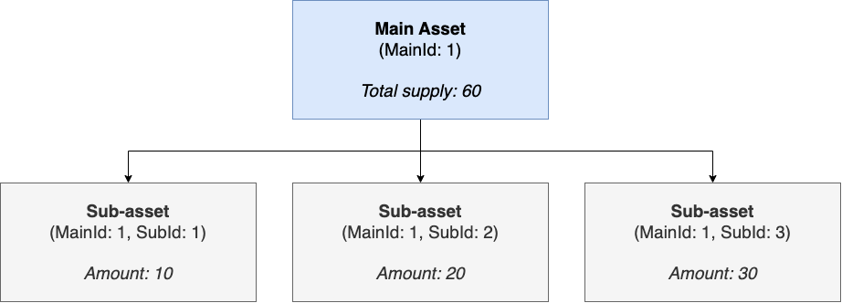

## Abstract

The dual-layer token combines the functionalities of [ERC-20](./eip-20.md), [ERC-721](./eip-721.md), and [ERC-1155](./eip-1155.md) while adding a classification layer that uses `mainId` as the main asset type identifier and `subId` as the unique attributes or variations of the main asset.


The proposed token aims to offer more granularity in token management, facilitating a well-organized token ecosystem and simplifying the process of tracking tokens within a contract. This standard is particularly useful for tokenizing and enabling the fractional ownership of Real World Assets (RWAs). It also allows for efficient and flexible management of both fungible and non-fungible assets.

The following are examples of assets that the DLT standard can represent fractional ownership of:

- Invoices
- Company stocks
- Digital collectibles
- Real estate

## Motivation

The [ERC-1155](./eip-1155.md) standard has experienced considerable adoption within the Ethereum ecosystem; however, its design exhibits constraints when handling tokens with multiple classifications, particularly in relation to Real World Assets (RWAs) and fractionalization of assets.

This EIP strives to overcome this limitation by proposing a token standard incorporating a dual-layer classification system, allowing for enhanced organization and management of tokens, especially in situations where additional sub-categorization of token types is necessary.

## Specification

The key words "MUST", "MUST NOT", "REQUIRED", "SHALL", "SHALL NOT", "SHOULD", "SHOULD NOT", "RECOMMENDED", "NOT RECOMMENDED", "MAY", and "OPTIONAL" in this document are to be interpreted as described in RFC 2119 and RFC 8174.

### DLT Interface

```solidity
// SPDX-License-Identifier: CC0-1.0
pragma solidity 0.8.17;

/**
 * @title DLT token standard interface
 * @dev Interface for any contract that wants to implement the DLT standard
 */
interface IDLT {

    /**
     * @dev MUST emit when `subId` token is transferred from `sender` to `recipient`
     * @param sender is the address of the previous holder whose balance is decreased
     * @param recipient is the address of the new holder whose balance is increased
     * @param mainId is the main token type ID to be transferred
     * @param subId is the token subtype ID to be transferred
     * @param amount is the amount to be transferred of the token subtype
     */
    event Transfer(
        address indexed sender,
        address indexed recipient,
        uint256 indexed mainId,
        uint256 subId,
        uint256 amount
    );

    /**
     * @dev MUST emit when `subIds` token array is transferred from `sender` to `recipient`
     * @param sender is the address of the previous holder whose balance is decreased
     * @param recipient is the address of the new holder whose balance is increased
     * @param mainIds is the main token type ID array to be transferred
     * @param subIds is the token subtype ID array to be transferred
     * @param amounts is the amount array to be transferred of the token subtype                
    */
    event TransferBatch(
        address indexed sender,
        address indexed recipient,
        uint256[] mainIds,
        uint256[] subIds,
        uint256[] amounts
    );

    /**
     * @dev MUST emit when `owner` enables `operator` to manage the `subId` token
     * @param owner is the address of the token owner
     * @param operator is the authorized address to manage the allocated amount for an owner address 
     * @param mainId is the main token type ID to be approved
     * @param subId is the token subtype ID to be approved
     * @param amount is the amount to be approved of the token subtype
     */
    event Approval(
        address indexed owner,
        address indexed operator,
        uint256 mainId,
        uint256 subId,
        uint256 amount
    );

    /**
     * @dev MUST emit when `owner` enables or disables (`approved`) `operator` to manage all of its assets
     * @param owner is the address of the token owner
     * @param operator is the authorized address to manage all tokens for an owner address
     * @param approved true if the operator is approved, false to revoke approval
     */
    event ApprovalForAll(
        address indexed owner,
        address indexed operator,
        bool approved
    );
    
    /**
     * @dev MUST emit when the URI is updated for a main token type ID.
     * URIs are defined in RFC 3986.
     * The URI MUST point to a JSON file that conforms to the "DLT Metadata URI JSON Schema".
     * @param oldValue is the old URI value
     * @param newValue is the new URI value
     * @param mainId is the main token type ID
     */
    event URI(string oldValue, string newValue, uint256 indexed mainId);

    /**
     * @dev Approve or remove `operator` as an operator for the caller.
     * Operators can call {transferFrom} or {safeTransferFrom} for any subId owned by the caller.
     * The `operator` MUST NOT be the caller.
     * MUST emit an {ApprovalForAll} event.     
     * @param operator is the authorized address to manage all tokens for an owner address
     * @param approved true if the operator is approved, false to revoke approval
     */
    function setApprovalForAll(address operator, bool approved) external;

    /**
     * @dev Moves `amount` tokens from `sender` to `recipient` using the
     * allowance mechanism. `amount` is then deducted from the caller's
     * allowance.
     * MUST revert if `sender` or `recipient` is the zero address.
     * MUST revert if balance of holder for token `subId` is lower than the `amount` sent.
     * MUST emit a {Transfer} event.
     * @param sender is the address of the previous holder whose balance is decreased
     * @param recipient is the address of the new holder whose balance is increased
     * @param mainId is the main token type ID to be transferred
     * @param subId is the token subtype ID to be transferred
     * @param amount is the amount to be transferred of the token subtype
     * @param data is additional data with no specified format
     * @return True if the operation succeeded, false if operation failed
     */
    function safeTransferFrom(
        address sender,
        address recipient,
        uint256 mainId,
        uint256 subId,
        uint256 amount,
        bytes calldata data
    ) external returns (bool);

    /**
     * @dev Sets `amount` as the allowance of `spender` over the caller's tokens.
     * The `operator` MUST NOT be the caller.
     * MUST revert if `operator` is the zero address.
     * MUST emit an {Approval} event.
     * @param operator is the authorized address to manage tokens for an owner address
     * @param mainId is the main token type ID to be approved
     * @param subId is the token subtype ID to be approved
     * @param amount is the amount to be approved of the token subtype
     * @return True if the operation succeeded, false if operation failed
     */
    function approve(
        address operator,
        uint256 mainId,
        uint256 subId,
        uint256 amount
    ) external returns (bool);

    /**
     * @notice Get the token with a particular subId balance of an `account`
     * @param account is the address of the token holder
     * @param mainId is the main token type ID
     * @param subId is the token subtype ID
     * @return The amount of tokens owned by `account` in subId
     */
    function subBalanceOf(
        address account,
        uint256 mainId,
        uint256 subId
    ) external view returns (uint256);

    /**
     * @notice Get the tokens with a particular subIds balance of an `accounts` array
     * @param accounts is the address array of the token holder
     * @param mainIds is the main token type ID array
     * @param subIds is the token subtype ID array
     * @return The amount of tokens owned by `accounts` in subIds
     */
    function balanceOfBatch(
        address[] calldata accounts,
        uint256[] calldata mainIds,
        uint256[] calldata subIds
    ) external view returns (uint256[] calldata);

    /** 
     * @notice Get the allowance allocated to an `operator`
     * @dev This value changes when {approve} or {transferFrom} are called
     * @param owner is the address of the token owner
     * @param operator is the authorized address to manage assets for an owner address
     * @param mainId is the main token type ID
     * @param subId is the token subtype ID
     * @return The remaining number of tokens that `operator` will be
     * allowed to spend on behalf of `owner` through {transferFrom}. This is
     * zero by default.
     */
    function allowance(
        address owner,
        address operator,
        uint256 mainId,
        uint256 subId
    ) external view returns (uint256);

    /**
     * @notice Get the approval status of an `operator` to manage assets
     * @param owner is the address of the token owner
     * @param operator is the authorized address to manage assets for an owner address
     * @return True if the `operator` is allowed to manage all of the assets of `owner`, false if approval is revoked
     * See {setApprovalForAll}
     */
    function isApprovedForAll(
        address owner,
        address operator
    ) external view returns (bool);
}
```

### `DLTReceiver` Interface

Smart contracts MUST implement all the functions in the `DLTReceiver` interface to accept transfers.

```solidity
// SPDX-License-Identifier: CC0-1.0
pragma solidity 0.8.17;

/**
 * @title DLT token receiver interface
 * @dev Interface for any contract that wants to support safeTransfers
 * from DLT asset contracts.
 */
interface IDLTReceiver {
    /**
     * @notice Handle the receipt of a single DLT token type.
     * @dev Whenever an {DLT} `subId` token is transferred to this contract via {IDLT-safeTransferFrom}
     * by `operator` from `sender`, this function is called.
     * MUST return its Solidity selector to confirm the token transfer.
     * MUST revert if any other value is returned or the interface is not implemented by the recipient.
     * The selector can be obtained in Solidity with `IDLTReceiver.onDLTReceived.selector`.
     * @param operator is the address which initiated the transfer
     * @param from is the address which previously owned the token
     * @param mainId is the main token type ID being transferred
     * @param subId subId is the token subtype ID being transferred
     * @param amount is the amount of tokens being transferred
     * @param data is additional data with no specified format
     * @return `IDLTReceiver.onDLTReceived.selector`
     */
    function onDLTReceived(
        address operator,
        address from,
        uint256 mainId,
        uint256 subId,
        uint256 amount,
        bytes calldata data
    ) external returns (bytes4);

    /**
     * @notice Handle the receipts of a DLT token type array.
     * @dev Whenever an {DLT} `subIds` token is transferred to this contract via {IDLT-safeTransferFrom}
     * by `operator` from `sender`, this function is called.
     * MUST return its Solidity selector to confirm the token transfers.
     * MUST revert if any other value is returned or the interface is not implemented by the recipient.
     * The selector can be obtained in Solidity with `IDLTReceiver.onDLTReceived.selector`.
     * @param operator is the address which initiated the transfer
     * @param from is the address which previously owned the token
     * @param mainIds is the main token type ID being transferred
     * @param subIds subId is the token subtype ID being transferred
     * @param amounts is the amount of tokens being transferred
     * @param data is additional data with no specified format
     * @return `IDLTReceiver.onDLTReceived.selector`
     */
    function onDLTBatchReceived(
        address operator,
        address from,
        uint256[] calldata mainIds,
        uint256[] calldata subIds,
        uint256[] calldata amounts,
        bytes calldata data
    ) external returns (bytes4);
}
```

## Rationale

The two-level classification system introduced in this EIP allows for a more organized token ecosystem, enabling users to manage and track tokens with greater granularity. It is particularly useful for projects that require token classifications beyond the capabilities of the current ERC-1155 standard.

As assets can have various properties or variations, our smart contract design reflects this by assigning a mainId to each asset category and a unique subId to each derivative or sub-category. This approach expands the capabilities of ERC-1155 to support a broader range of assets with complex requirements. Additionally, it enables tracking of mainBalance for the main asset and subBalance for its sub-assets individual accounts.

The contract can be extended to support the use of subIds in two ways:

- Shared SubIds: where all mainIds share the same set of subIds.
- Mixed SubIds: where mainIds have unique sets of subIds.

DLT provides a more versatile solution compared to other token standards such as ERC-20, ERC-721, and ERC-1155 by effectively managing both fungible and non-fungible assets within the same contract.

The following are questions that we considered during the design process:

- How to name the proposal?
The standard introduces a two-level classification to tokens where one main asset (layer 1) can be further sub-divided into several sub-assets (layer 2) hence we decided to name it as "Dual-layer" token to reflect the hierarchical structure of the token classification.
- Should we limit the classification to two levels?
The standard’s implementation maintains a mapping to track the total supply of each sub-asset. If we allow sub-assets to have their own children, it would be necessary to introduce additional methods to track each sub-asset, which would be impractical and increases the complexity of the contract.
- Should we extend the ERC-1155 standard?
As the ERC-1155 standard is not designed to support a layered classification and requires significant modifications to do so, we concluded that it would not be appropriate to extend it for the dual-layer token standard. Hence, a standalone implementation would be a more suitable approach.

## Backwards Compatibility

No backward compatibility issues found.

## Security Considerations

Needs discussion.

## Copyright

Copyright and related rights waived via [CC0](../LICENSE.md).
