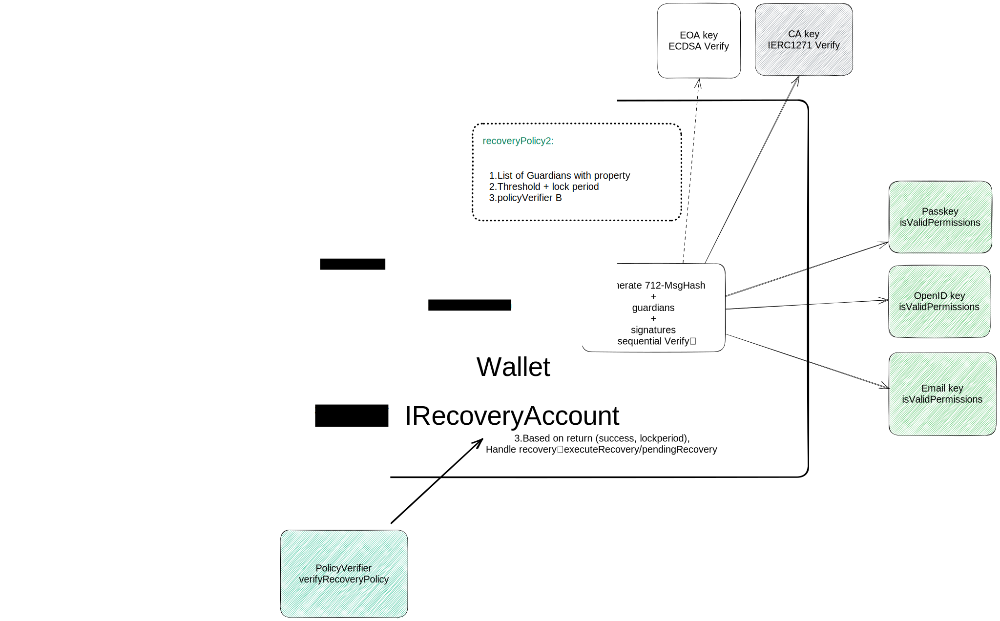

## Abstract

This ERC proposes a standard interface for social recovery of smart contract accounts. It separates identity and policy verification from the recovery process, allowing more ways to authenticate (known as Guardians) than just on-chain accounts. It also lets users customize recovery policies without changing the account’s smart contract.

## Motivation

Vitalik Buterin has long advocated for social recovery as an essential tool for user protection within the crypto space. He posits that the value of this system rests in its ability to offer users, especially those less acquainted with the technicalities of cryptography, a robust safety net when access credentials are lost. By entrusting account recovery to a network of selected individuals or entities, dubbed "Guardians," users gain a safeguard against the risk of losing access to their digital assets.

In essence, social recovery operates by verifying the identity of the user and the chosen Guardians, and then considering a set of their signatures. Should the validated signatures reach a specified threshold, account access is reestablished. This system is equipped to enforce complex policies, such as necessitating signatures from particular Guardians or reaching signature thresholds from different Guardian categories.

To overcome these limitations, this Ethereum Improvement Proposal (EIP) introduces a novel, customizable social recovery interface standard. This standard decouples identity and recovery policy verification from the recovery procedure itself, thereby enabling an independent, versatile definition and extension of both. This strategy accommodates a wider range of Guardian types and recovery policies, thereby offering users the following benefits:

1. Appoint friends or family members, who do not have blockchain accounts, as Guardians for social recovery.
2. Use NFTs/SBTs as Guardians for their accounts.
3. Personalize and implement adaptable recovery policies.
4. Support novel types of Guardians and recovery policies without needing to upgrade their account contracts.
5. Enable multiple recovery mechanism support, thereby eliminating single points of failure.

This approach enables users to customize recovery policies without the need to change the smart contract of the account itself.

## Specification

The key words "MUST", "MUST NOT", "REQUIRED", "SHALL", "SHALL NOT", "SHOULD", "SHOULD NOT", "RECOMMENDED", "NOT RECOMMENDED", "MAY", and "OPTIONAL" in this document are to be interpreted as described in RFC 2119 and RFC 8174.


This EIP consists of four key concepts:

- **Identity**: This denotes the representation of a Guardian's identity on the blockchain. It encapsulates traditional on-chain account types such as Externally Owned Accounts (EOA) and Smart Contract Accounts (SCA). More importantly, it extends to include any identity construct capable of producing construct able to be verified on-chain, like signatures and proofs. This could range from [Webauthn](https://www.w3.org/TR/2021/REC-webauthn-2-20210408/)/Passkey R1 keys to Email DomainKeys Identified Mail (DKIM) signatures [RFC 6376](https://www.rfc-editor.org/rfc/rfc6376), OpenID tokens, Zero-Knowledge Proofs (ZKP), Non-Fungible Tokens (NFTs), SoulBound Tokens (SBTs), and even types yet to be developed. This comprehensive approach ensures a broad, forward-compatible support for various identity types.
- **PermissionVerifier**: This component defines how to verify the signature or proof provided by the Guardian. Regardless of whether the Guardian's account is on-chain or off-chain, the PermissionVerifier is invoked during the recovery process of smart contract accounts that incorporate a social recovery system. Its primary role is to confirm the validity of the Guardian's signature or proof, thereby ensuring the authenticity of the Guardian during the recovery process.
- **RecoveryPolicyVerifier**: This component offers a flexible interface for validating recovery policies. The flexibility stems from allowing account holders or authorized parties to define and store their recovery policies. During the recovery process, the verification logic is implemented by invoking the specific function of the contract instance adopting this interface. Thus, a wide array of customizable social recovery scenarios can be catered to through different contract instances and policy configurations. This contract is optional, because sometimes the contract designer may not need the policy abstraction.
- **RecoveryAccount**: This component encapsulates the core of the social recovery functionality. It is designed to be flexible, composable, and extensible to adapt to various recovery needs. Each RecoveryAccount is defined by an instance contract, crafted by smart contract developers, which embeds the essential logic for the recovery process.
- **RecoveryModule**: In some contract designs, many functions are not directly added to the account contract, but are implemented in the form of Module, which is a contract outside the account contract. This component encapsulates the core of the social recovery functionality. It is designed to be flexible, composable, and extensible to adapt to various recovery needs. 



### DataTypes

### `TypesAndDecoders`

This defines the necessary data types required by this interface standard.

```solidity
/**
 * @dev Structure representing an identity with its signature/proof verification logic.
 * Represents an EOA/CA account when signer is empty, use `guardianVerifier`as the actual signer for signature verification.
 * OtherWise execute IPermissionVerifier(guardianVerifier).isValidPermission(hash, signer, signature).
 */
struct Identity {
    address guardianVerifier;
    bytes signer;
}

/**
 * @dev Structure representing a guardian with a property
 * The property of Guardian are defined by the associated RecoveryPolicyVerifier contract.
 */
struct GuardianInfo {
    Identity guardian;
    uint64 property; //eg.,Weight,Percentage,Role with weight,etc.
}

/**
 * @dev Structure representing a threshold configuration
 */
struct ThresholdConfig {
    uint64 threshold; // Threshold value
    int48 lockPeriod; // Lock period for the threshold
}

/**
 * @dev Structure representing a recovery configuration
 * A RecoveryConfig can have multiple threshold configurations for different threshold values and their lock periods, and the policyVerifier is optional.
 */
struct RecoveryConfigArg {
    address policyVerifier;
    GuardianInfo[] guardianInfos;
    ThresholdConfig[] thresholdConfigs;
}

struct Permission {
    Identity guardian;
    bytes signature;
}

```

The `Identity` structure represents various types of guardians. The process of identity verification is as follows:

- When the `signer` value in the declared entity is empty, this implies that the `Identity` entity is of EOA/SCA account type. In this case, `guardianVerifier` address should be the address of EOA/SCA (the actual signer). For permission verification of this `Identity` entity, it is recommended to utilize a secure library or built-in function capable of validating both ECDSA and [ERC-1271](./eip-1271.md) signatures. This helps in preventing potential security vulnerabilities, such as signature malleability attacks. 
- When the `signer` value in the declared entity is non-empty, this suggests that the `Identity` entity is of non-account type. In this case, permission verification can be accomplished by calling `guardianVerifier` address contract instance through `IPermissionVerifier` interface.


### Interfaces

### `IPermissionVerifier`

The Guardian Permission Verification Interface. Implementations MUST conform to this interface to enable identity verification of non-account type guardians.

```solidity
/**
 * @dev Interface for no-account type identity signature/proof verification
 */
interface IPermissionVerifier {
    /**
     * @dev Check if the signer key format is correct
     */
    function isValidSigners(bytes[] signers) external returns (bool);

    /**
     * @dev Validate permission
     */
    function isValidPermission(
        bytes32 hash,
        bytes signer,
        bytes signature
    ) external returns (bool);

    /**
     * @dev Validate permissions
     */
    function isValidPermissions(
        bytes32 hash,
        bytes[] signers,
        bytes[] signatures
    ) external returns (bool);

    /**
     * @dev Return supported signer key information, format, signature format, hash algorithm, etc.
     * MAY TODO:using ERC-3668: ccip-read
     */
    function getGuardianVerifierInfo() public view returns (bytes memory);
}

```


### `IRecoveryPolicyVerifier`

The Recovery Policy Verification Interface. Implementations MAY conform to this interface to support verification of varying recovery policies. RecoveryPolicyVerifier is optional for SocialRecoveryInterface.

```solidity
/**
 * @dev Interface for recovery policy verification
 */
interface IRecoveryPolicyVerifier {
    /**
     * @dev Verify recovery policy and return verification success and lock period
     * Verification includes checking if guardians exist in the Guardians List
     */
    function verifyRecoveryPolicy( Permission[] memory permissions, uint64[] memory properties)
        external
        view
        returns (bool succ, uint64 weight);

    /**
     * @dev Returns supported policy settings and accompanying property definitions for Guardian.
     */
    function getPolicyVerifierInfo() public view returns (bytes memory);
}

```

The `verifyRecoveryPolicy()` function is designed to validate whether the provided list of `Permissions` abides by the specified recovery properties (`properties`). This function has the following constraints and effects: For each matched `guardian`, calculations are made according to the corresponding `property` in the `properties` list (e.g., accumulating weight, distinguishing role while accumulating, etc.). 

These constraints ensure that the provided `guardians` and `properties` comply with the requirements of the recovery policy, maintaining the security and integrity of the recovery process.


### `IRecoveryAccount`

The Smart Contract Account MAY implement the `IRecoveryAccount` interface to support social recovery functionality, enabling users to customize configurations of different types of Guardians and recovery policies. In the contract design based on Module, the implementation of `RecoveryModule` is very similar to `RecoveryAccount`, except that different accounts need to be distinguished and isolated.

```solidity
interface IRecoveryAccount {
    modifier onlySelf() {
        require(msg.sender == address(this), "onlySelf: NOT_AUTHORIZED");
        _;
    }

    modifier InRecovering(address policyVerifyAddress) {
        (bool isRecovering, ) = getRecoveryStatus(policyVerifierAddress);
        require(isRecovering, "InRecovering: no ongoing recovery");
        _;
    }

    /**
     * @dev Events for updating guardians, starting for recovery, executing recovery, and canceling recovery
     */
    event RecoveryStarted(bytes newOwners, uint256 nonce, uint48 expiryTime);
    event RecoveryExecuted(bytes newOwners, uint256 nonce);
    event RecoveryCanceled(uint256 nonce);

    /**
     * @dev Return the domain separator name and version for signatures
     * Also return the domainSeparator for EIP-712 signature
     */

    /// @notice             Domain separator name for signatures
    function DOMAIN_SEPARATOR_NAME() external view returns (string memory);

    /// @notice             Domain separator version for signatures
    function DOMAIN_SEPARATOR_VERSION() external view returns (string memory);

    /// @notice             returns the domainSeparator for EIP-712 signature
    /// @return             the bytes32 domainSeparator for EIP-712 signature
    function domainSeparatorV4() external view returns (bytes32);

    /**
     * @dev Update /replace guardians and recovery policies
     * Multiple recovery policies can be set using an array of RecoveryConfigArg
     */
    function updateGuardians(RecoveryConfigArg[] recoveryConfigArgs) external onlySelf;

    // Generate EIP-712 message hash,
    // Iterate over signatures for verification,
    // Verify recovery policy,
    // Store temporary state or recover immediately based on the result returned by verifyRecoveryPolicy.
    function startRecovery(
        uint256 configIndex,
        bytes newOwner,
        Permission[] permissions
    ) external;

    /**
     * @dev Execute recovery
     * temporary state -> ownerKey rotation
     */
    function executeRecovery(uint256 configIndex) external;

    function cancelRecovery(uint256 configIndex) external onlySelf InRecovering(policyVerifier);

    function cancelRecoveryByGuardians(uint256 configIndex, Permission[] permissions)
        external
        InRecovering(policyVerifier);

    /**
     * @dev Get wallet recovery config, check if an identity is a guardian, get the nonce of social recovery, and get the recovery status of the wallet
     */
    function isGuardian(uint256 configIndex, identity guardian) public view returns (bool);

    function getRecoveryConfigs() public view returns (RecoveryConfigArg[] recoveryConfigArgs);

    function getRecoveryNonce() public view returns (uint256 nonce);

    function getRecoveryStatus(address policyVerifier) public view returns (bool isRecovering, uint48 expiryTime);
}

```

- For the `Guardian`'s signable message, it SHOULD employ [EIP-712](./eip-712.md) type signature to ensure the content of the signature is readable and can be confirmed accurately during the Guardian signing process.
- `getRecoveryNonce()` SHOULD be separated from nonces associated with account asset operations, as social recovery is a function at the account layer.


### **Recovery Account Workflow**

Note: This workflow is presented as an illustrative example to clarify the coordinated usage of the associated interface components. It does not imply a mandatory adherence to this exact process.

1. A user sets up a `recoveryPolicyConfigA` within his `RecoveryAccount`:

   ```json
    {
    "recoveryConfigA": {
        "type": "RecoveryConfig",
        "policyVerifier": "0xA",
        "guardians": [
            {
                "type": "Identity",
                "name": "A",
                "data": {
                    "guardianVerifier": "guardianVerifier1",
                    "signer": "signerA"
                },
                "property": 30
            },
            {
                "type": "Identity",
                "name": "B",
                "data": {
                    "guardianVerifier": "guardianVerifier2",
                    "signer": ""
                },
                "property": 30
            },
            {
                "type": "Identity",
                "name": "C",
                "data": {
                    "guardianVerifier": "guardianVerifier3",
                    "signer": "signerC"
                },
                "property": 40
            }
        ],
        "thresholdConfigs": [
            { "threshold": 50, "lockPeriod": "24hours"},
            { "threshold": 100,"lockPeriod": "0"}
        ]
      }
    }
   ```

2. When GuardianA and GuardianB assist the user in performing account recovery, they are to confirm the [EIP-712](./eip-712.md) structured data for signing, which might look like this:

   ```json
   {
     "types": {
       "EIP712Domain": [
         { "name": "name", "type": "string" },
         { "name": "version", "type": "string" },
         { "name": "chainId", "type": "uint256" },
         { "name": "verifyingContract", "type": "address" }
       ],
       "StartRecovery": [
         { "name": "configIndex", "type": "uint256" },
         { "name": "newOwners", "type": "bytes" },
         { "name": "nonce", "type": "uint256" }
       ]
     },
     "primaryType": "StartRecovery",
     "domain": {
       "name": "Recovery Account Contract",
       "version": "1",
       "chainId": 1,
       "verifyingContract": "0xCCCCCCCCCCCCCCCCCCCCCCCCCCCCCCCCCCCCCCCC"
     },
     "message": {
       "policyVerifier": "0xA",
       "newOwners": "0xabcdabcdabcdabcdabcdabcdabcdabcdabcdabcdabcdabcdabcdabcdabcd",
       "nonce": 10
     }
   }
   ```

   In this step, the guardians need to confirm that the domain separator's `verifyingContract` is the correct `RecoveryAccount` address for the user, the contract name, version, and chainId are correct, and the `policyVerifier` and `newOwners` fields in the `message` part match the user's provided data.

   The `msgHash` is then composed of:

   - `msgHash` = `keccak256("\\x19\\x01" + domainSeparatorV4() + dataHash)`

   Where,

   - `dataHash` = `keccak256(EXECUTE_RECOVERY_TYPEHASH + configIndex + keccak256(bytes(newOwners)) + getRecoveryNonce())`
   - `EXECUTE_RECOVERY_TYPEHASH` = `keccak256("StartRecovery(address configIndex, bytes newOwners, uint256 nonce)")`

   The guardians sign this hash to obtain the signature:

   - `signature` = `sign(msgHash)`

   The `permission` is then constructed as:

   - `permission` = `guardian + signature`

   Once each Guardian has generated their unique `permission`, all these individual permissions are collected to form `permissions`:

   `permissions`= [`guardianA+signature`, `guardianB+signature`, ...]

   The `permissions` is an array that consists of all the permissions of the Guardians who are participating in the recovery process.

3. A bundler or another relayer service calls the `RecoveryAccount.startRecovery(0xA, newOwners, permissions)` function.

4. `startRecovery()` function's processing logic is as follows:

   - Generate a message hash (`msgHash`) from the input parameters `0xA`, `newOwners` and internally generated [EIP-712](./eip-712.md) signature parameters and `RecoveryNonce`.
   - Extract `guardian` and corresponding `signature` from the input parameters `permissions` and process them as follows:
     - If `guardianA.signer` is non-empty (Identity A), call `IPermissionVerifier(guardianVerifier1).isValidPermissions(signerA, msgHash, permissionA.signature)` to validate the signature.
     - If `guardianA.signer` is empty (Identity B), call the internal function `SignatureChecker.isValidSignatureNow(guardianVerifier2, msgHash, permissionB.signature)` to validate the signature.

5. After successful verification of all `guardians` signatures, fetch the associated `config` data for policyVerifier address `0xA` and call `IRecoveryPolicyVerifier(0xA).verifyRecoveryPolicy(permissions, properties)`. The function `verifyRecoveryPolicy()` performs the following checks:

   Note that the `guardians` parameter in the function refers to the guardians whose signatures have been successfully verified.

   - Verify that `guardians` (Identity A and B) are present in `config.guardianInfos` list and are unique.
   - Accumulate the `property` values of `guardians` (30 + 30 = 60).
   - Compare the calculated result (60) with the `config.thresholdConfigs.threshold` ,the result is more than the first element (`threshold: 50, lockPeriod: 24 hours`) but less than the second element (`threshold: 100, lockPeriod: ""`), the validation is successful, and the lock period of 24 hours is returned.

6. The `RecoveryAccount` saves a temporary state `{newOwners, block.timestamp + 24 hours}` and increments `RecoveryNonce`. A `RecoveryStarted` event is emitted.

7. After the expiry time, anyone (usually a relayer) can call `RecoveryAccount.executeRecovery()` to replace `newOwners`, remove the temporary state, complete the recovery, and emit a `RecoveryExecuteed` event.


## Rationale

A primary design rationale for this proposal is to extend a greater diversity of Guardian types and more flexible, customizable recovery policies for a RecoveryAccount. This is achieved by separating the verification logic from the social recovery process, ensuring that the basic logic of the account contract remains unaltered.

The necessity of incorporating `Verifiers` from external contracts arises from the importance of maintaining the inherent recovery logic of the `RecoveryAccount`. The `Verifiers`'s logic is designed to be simple and clear, and its fixed invocation format means that any security risks posed by integrating external contracts can be effectively managed.

The `recoveryConfigs` are critical to the `RecoveryAccount` and should be securely and effectively stored. The access and modification permissions associated with these configurations must be carefully managed and isolated to maintain security. The storage and quantity of `recoveryConfigs` are not limited to ensure the maximum flexibility of the `RecoveryAccount`'s implementation.

The introduction of `recoveryNonce` into the `RecoveryAccount` serves to prevent potential replay attacks arising from the malicious use of Guardian's `permissions`. The `recoveryNonce` ensures each recovery process is unique, reducing the likelihood of past successful recovery attempts being maliciously reused.

## Backwards Compatibility

No backward compatibility issues are introduced by this standard.

## Reference Implementation

TBD.

## Security Considerations

Needs discussion.

## Copyright

Copyright and related rights waived via [CC0](../LICENSE.md).
