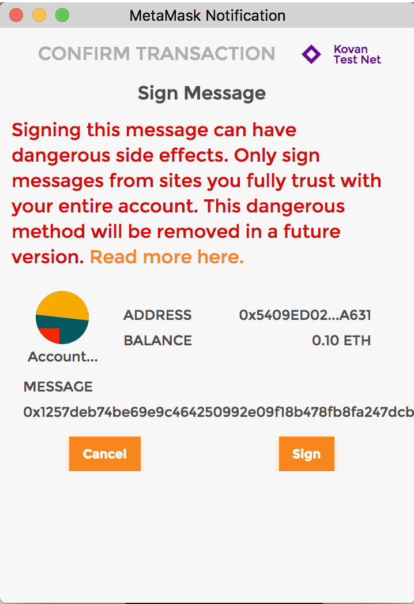
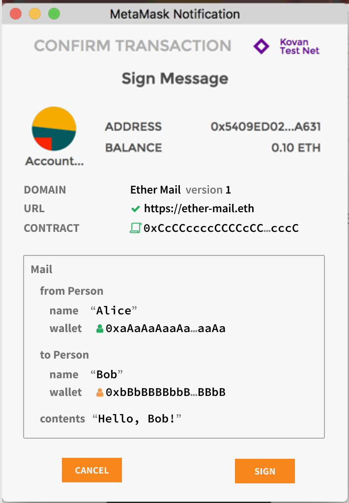

## Abstract

This is a standard for hashing and signing of typed structured data as opposed to just bytestrings. It includes a

*   theoretical framework for correctness of encoding functions,
*   specification of structured data similar to and compatible with Solidity structs,
*   safe hashing algorithm for instances of those structures,
*   safe inclusion of those instances in the set of signable messages,
*   an extensible mechanism for domain separation,
*   new RPC call `eth_signTypedData`, and
*   an optimized implementation of the hashing algorithm in EVM.

It does not include replay protection.

## Motivation

Signing data is a solved problem if all we care about are bytestrings. Unfortunately in the real world we care about complex meaningful messages. Hashing structured data is non-trivial and errors result in loss of the security properties of the system.

As such, the adage "don't roll your own crypto" applies. Instead, a peer-reviewed well-tested standard method needs to be used. This EIP aims to be that standard.

This EIP aims to improve the usability of off-chain message signing for use on-chain. We are seeing growing adoption of off-chain message signing as it saves gas and reduces the number of transactions on the blockchain. Currently signed messages are an opaque hex string displayed to the user with little context about the items that make up the message.



Here we outline a scheme to encode data along with its structure which allows it to be displayed to the user for verification when signing. Below is an example of what a user could be shown when signing a message according to the present proposal.



## Specification

The set of signable messages is extended from transactions and bytestrings `𝕋 ∪ 𝔹⁸ⁿ` to also include structured data `𝕊`. The new set of signable messages is thus `𝕋 ∪ 𝔹⁸ⁿ ∪ 𝕊`. They are encoded to bytestrings suitable for hashing and signing as follows:
*   `encode(transaction : 𝕋) = RLP_encode(transaction)`
*   `encode(message : 𝔹⁸ⁿ) = "\x19Ethereum Signed Message:\n" ‖ len(message) ‖ message` where `len(message)` is the _non-zero-padded_ ascii-decimal encoding of the number of bytes in `message`.
*   `encode(domainSeparator : 𝔹²⁵⁶, message : 𝕊) = "\x19\x01" ‖ domainSeparator ‖ hashStruct(message)` where `domainSeparator` and `hashStruct(message)` are defined below.

This encoding is deterministic because the individual components are. The encoding is injective because the three cases always differ in first byte. (`RLP_encode(transaction)` does not start with `\x19`.)

The encoding is compliant with [EIP-191][EIP-191]. The 'version byte' is fixed to `0x01`, the 'version specific data' is the 32-byte domain separator `domainSeparator` and the 'data to sign' is the 32-byte `hashStruct(message)`.

[EIP-191]: ./eip-191.md

### Definition of typed structured data `𝕊`

To define the set of all structured data, we start with defining acceptable types. Like ABIv2 these are closely related to Solidity types. It is illustrative to adopt Solidity notation to explain the definitions. The standard is specific to the Ethereum Virtual Machine, but aims to be agnostic to higher level languages. Example:

```Solidity
struct Mail {
    address from;
    address to;
    string contents;
}
```

**Definition**: A _struct type_ has valid identifier as name and contains zero or more member variables. Member variables have a member type and a name.

**Definition**: A _member type_ can be either an atomic type, a dynamic type or a reference type.

**Definition**: The _atomic types_ are `bytes1` to `bytes32`, `uint8` to `uint256`, `int8` to `int256`, `bool` and `address`. These correspond to their definition in Solidity. Note that there are no aliases `uint` and `int`. Note that contract addresses are always plain `address`. Fixed point numbers are not supported by the standard. Future versions of this standard may add new atomic types.

**Definition**: The _dynamic types_ are `bytes` and `string`. These are like the atomic types for the purpose of type declaration, but their treatment in encoding is different.

**Definition**: The _reference types_ are arrays and structs. Arrays are either fixed size or dynamic and denoted by `Type[n]` or `Type[]` respectively. Structs are references to other structs by their name. The standard supports recursive struct types.

**Definition**: The set of structured typed data `𝕊` contains all the instances of all the struct types.

### Definition of `hashStruct`

The `hashStruct` function is defined as

*   `hashStruct(s : 𝕊) = keccak256(typeHash ‖ encodeData(s))` where `typeHash = keccak256(encodeType(typeOf(s)))`

**Note**: The `typeHash` is a constant for a given struct type and does not need to be runtime computed.

### Definition of `encodeType`

The type of a struct is encoded as `name ‖ "(" ‖ member₁ ‖ "," ‖ member₂ ‖ "," ‖ … ‖ memberₙ ")"` where each member is written as `type ‖ " " ‖ name`. For example, the above `Mail` struct is encoded as `Mail(address from,address to,string contents)`.

If the struct type references other struct types (and these in turn reference even more struct types), then the set of referenced struct types is collected, sorted by name and appended to the encoding. An example encoding is `Transaction(Person from,Person to,Asset tx)Asset(address token,uint256 amount)Person(address wallet,string name)`.

### Definition of `encodeData`

The encoding of a struct instance is `enc(value₁) ‖ enc(value₂) ‖ … ‖ enc(valueₙ)`, i.e. the concatenation of the encoded member values in the order that they appear in the type. Each encoded member value is exactly 32-byte long.

The atomic values are encoded as follows: Boolean `false` and `true` are encoded as `uint256` values `0` and `1` respectively. Addresses are encoded as `uint160`. Integer values are sign-extended to 256-bit and encoded in big endian order. `bytes1` to `bytes31` are arrays with a beginning (index `0`) and an end (index `length - 1`), they are zero-padded at the end to `bytes32` and encoded in beginning to end order. This corresponds to their encoding in ABI v1 and v2.

The dynamic values `bytes` and `string` are encoded as a `keccak256` hash of their contents.

The array values are encoded as the `keccak256` hash of the concatenated `encodeData` of their contents (i.e. the encoding of `SomeType[5]` is identical to that of a struct containing five members of type `SomeType`).

The struct values are encoded recursively as `hashStruct(value)`. This is undefined for cyclical data.

### Definition of `domainSeparator`


```Solidity
domainSeparator = hashStruct(eip712Domain)
```

where the type of `eip712Domain` is a struct named `EIP712Domain` with one or more of the below fields. Protocol designers only need to include the fields that make sense for their signing domain. Unused fields are left out of the struct type.

*   `string name` the user readable name of signing domain, i.e. the name of the DApp or the protocol.
*   `string version` the current major version of the signing domain. Signatures from different versions are not compatible.
*   `uint256 chainId` the [EIP-155][EIP-155] chain id. The user-agent *should* refuse signing if it does not match the currently active chain.
*   `address verifyingContract` the address of the contract that will verify the signature. The user-agent *may* do contract specific phishing prevention.
*   `bytes32 salt` a disambiguating salt for the protocol. This can be used as a domain separator of last resort.

[EIP-155]: ./eip-155.md

Future extensions to this standard can add new fields with new user-agent behaviour constraints. User-agents are free to use the provided information to inform/warn users or refuse signing. Dapp implementers should not add private fields, new fields should be proposed through the EIP process.

The `EIP712Domain` fields should be the order as above, skipping any absent fields. Future field additions must be in alphabetical order and come after the above fields. User-agents should accept fields in any order as specified by the `EIP712Domain` type.

### Specification of the `eth_signTypedData` JSON RPC

The method `eth_signTypedData` is added to the Ethereum JSON-RPC. The method parallels `eth_sign`.

#### eth_signTypedData

The sign method calculates an Ethereum specific signature with: `sign(keccak256("\x19\x01" ‖ domainSeparator ‖ hashStruct(message)))`, as defined above.

**Note**: the address to sign with must be unlocked. 

##### Parameters

1.  `Address` - 20 Bytes - Address of the account that will sign the messages.
2.  `TypedData` - Typed structured data to be signed.

Typed data is a JSON object containing type information, domain separator parameters and the message object. Below is the json-schema definition for `TypedData` param.

```JavaScript
{
  type: 'object',
  properties: {
    types: {
      type: 'object',
      properties: {
        EIP712Domain: {type: 'array'},
      },
      additionalProperties: {
        type: 'array',
        items: {
          type: 'object',
          properties: {
            name: {type: 'string'},
            type: {type: 'string'}
          },
          required: ['name', 'type']
        }
      },
      required: ['EIP712Domain']
    },
    primaryType: {type: 'string'},
    domain: {type: 'object'},
    message: {type: 'object'}
  },
  required: ['types', 'primaryType', 'domain', 'message']
}
```

##### Returns

`DATA`: Signature. As in `eth_sign` it is a hex encoded 65 byte array starting with `0x`. It encodes the `r`, `s` and `v` parameters from appendix F of the yellow paper in big-endian format. Bytes 0...32 contain the `r` parameter, bytes 32...64 the `s` parameter and the last byte the `v` parameter. Note that the `v` parameter includes the chain id as specified in [EIP-155][eip-155].

[eip-155]: ./eip-155.md

##### Example

Request:
```shell
curl -X POST --data '{"jsonrpc":"2.0","method":"eth_signTypedData","params":["0xCD2a3d9F938E13CD947Ec05AbC7FE734Df8DD826", {"types":{"EIP712Domain":[{"name":"name","type":"string"},{"name":"version","type":"string"},{"name":"chainId","type":"uint256"},{"name":"verifyingContract","type":"address"}],"Person":[{"name":"name","type":"string"},{"name":"wallet","type":"address"}],"Mail":[{"name":"from","type":"Person"},{"name":"to","type":"Person"},{"name":"contents","type":"string"}]},"primaryType":"Mail","domain":{"name":"Ether Mail","version":"1","chainId":1,"verifyingContract":"0xCcCCccccCCCCcCCCCCCcCcCccCcCCCcCcccccccC"},"message":{"from":{"name":"Cow","wallet":"0xCD2a3d9F938E13CD947Ec05AbC7FE734Df8DD826"},"to":{"name":"Bob","wallet":"0xbBbBBBBbbBBBbbbBbbBbbbbBBbBbbbbBbBbbBBbB"},"contents":"Hello, Bob!"}}],"id":1}'
```

Result:
```JavaScript
{
  "id":1,
  "jsonrpc": "2.0",
  "result": "0x4355c47d63924e8a72e509b65029052eb6c299d53a04e167c5775fd466751c9d07299936d304c153f6443dfa05f40ff007d72911b6f72307f996231605b915621c"
}
```

An example how to use Solidity ecrecover to verify the signature calculated with `eth_signTypedData` can be found in the [Example.js][example-js]. The contract is deployed on the testnet Ropsten and Rinkeby.

[example-js]: ../assets/eip-712/Example.js

#### personal_signTypedData

There also should be a corresponding `personal_signTypedData` method which accepts the password for an account as the last argument.

### Specification of the Web3 API

Two methods are added to Web3.js version 1 that parallel the `web3.eth.sign` and `web3.eth.personal.sign` methods.

#### web3.eth.signTypedData

```JavaScript
web3.eth.signTypedData(typedData, address [, callback])
```

Signs typed data using a specific account. This account needs to be unlocked.

##### Parameters

1. ``Object`` - Domain separator and typed data to sign. Structured according to the JSON-Schema specified above in the `eth_signTypedData` JSON RPC call. 
2. ``String|Number`` - Address to sign data with. Or an address or index of a local wallet in :ref:`web3.eth.accounts.wallet <eth_accounts_wallet>`.
3. ``Function`` - (optional) Optional callback, returns an error object as first parameter and the result as second.

**Note**: The 2. ``address`` parameter can also be an address or index from the `web3.eth.accounts.wallet <eth_accounts_wallet>`. It will then sign locally using the private key of this account.

##### Returns

``Promise`` returns ``String`` - The signature as returned by `eth_signTypedData`.

##### Example

See the `eth_signTypedData` JSON-API example above for the value of `typedData`.

```JavaScript
web3.eth.signTypedData(typedData, "0xCD2a3d9F938E13CD947Ec05AbC7FE734Df8DD826")
.then(console.log);
> "0x4355c47d63924e8a72e509b65029052eb6c299d53a04e167c5775fd466751c9d07299936d304c153f6443dfa05f40ff007d72911b6f72307f996231605b915621c"
```

#### web3.eth.personal.signTypedData

```JavaScript
web3.eth.personal.signTypedData(typedData, address, password [, callback])
```

Identical to `web3.eth.signTypedData` except for an additional `password` parameter analogous to `web3.eth.personal.sign`.

## Rationale

The `encode` function is extended with a new case for the new types. The first byte of the encoding distinguishes the cases. For the same reason it is not safe to start immediately with the domain separator or a `typeHash`. While hard, it may be possible to construct a `typeHash` that also happens to be a prefix of a valid RLP encoded transaction.

The domain separator prevents collision of otherwise identical structures. It is possible that two DApps come up with an identical structure like `Transfer(address from,address to,uint256 amount)` that should not be compatible. By introducing a domain separator the DApp developers are guaranteed that there can be no signature collision.

The domain separator also allows for multiple distinct signatures use-cases on the same struct instance within a given DApp. In the previous example, perhaps signatures from both `from` and `to` are required. By providing two distinct domain separators these signatures can be distinguished from each other.

**Alternative 1**: Use the target contract address as domain separator. This solves the first problem, contracts coming up with identical types, but does not address the second use-case. The standard does suggest implementors to use the target contract address where this is appropriate.

The function `hashStruct` starts with a `typeHash` to separate types. By giving different types a different prefix the `encodeData` function only has to be injective within a given type. It is okay for `encodeData(a)` to equal `encodeData(b)` as long as `typeOf(a)` is not `typeOf(b)`.

### Rationale for `typeHash`

The `typeHash` is designed to turn into a compile time constant in Solidity. For example:

```Solidity
bytes32 constant MAIL_TYPEHASH = keccak256(
  "Mail(address from,address to,string contents)");
```

For the type hash several alternatives were considered and rejected for the reasons:

**Alternative 2**: Use ABIv2 function signatures. `bytes4` is not enough to be collision resistant. Unlike function signatures, there is negligible runtime cost incurred by using longer hashes.

**Alternative 3**: ABIv2 function signatures modified to be 256-bit. While this captures type info, it does not capture any of the semantics other than the function. This is already causing a practical collision between [EIP-20]'s and [EIP-721]'s `transfer(address,uint256)`, where in the former the `uint256` refers to an amount and the latter to a unique id. In general ABIv2 favors compatibility where a hashing standard should prefer incompatibility.

[EIP-20]: ./eip-20.md
[EIP-721]: ./eip-721.md

**Alternative 4**: 256-bit ABIv2 signatures extended with parameter names and struct names. The `Mail` example from a above would be encoded as `Mail(Person(string name,address wallet) from,Person(string name,address wallet) to,string contents)`. This is longer than the proposed solution. And indeed, the length of the string can grow exponentially in the length of the input (consider `struct A{B a;B b;}; struct B {C a;C b;}; …`). It also does not allow a recursive struct type (consider `struct List {uint256 value; List next;}`).

**Alternative 5**: Include natspec documentation. This would include even more semantic information in the schemaHash and further reduces chances of collision. It makes extending and amending documentation a breaking changes, which contradicts common assumptions. It also makes the schemaHash mechanism very verbose.

### Rationale for `encodeData`

The `encodeData` is designed to allow easy implementation of `hashStruct` in Solidity:

```Solidity
function hashStruct(Mail memory mail) pure returns (bytes32 hash) {
    return keccak256(abi.encode(
        MAIL_TYPEHASH,
        mail.from,
        mail.to,
        keccak256(mail.contents)
    ));
}
```

it also allows for an efficient in-place implementation in EVM

```Solidity
function hashStruct(Mail memory mail) pure returns (bytes32 hash) {

    // Compute sub-hashes
    bytes32 typeHash = MAIL_TYPEHASH;
    bytes32 contentsHash = keccak256(mail.contents);

    assembly {
        // Back up select memory
        let temp1 := mload(sub(mail, 32))
        let temp2 := mload(add(mail, 128))

        // Write typeHash and sub-hashes
        mstore(sub(mail, 32), typeHash)
        mstore(add(mail, 64), contentsHash)

        // Compute hash
        hash := keccak256(sub(mail, 32), 128)

        // Restore memory
        mstore(sub(mail, 32), temp1)
        mstore(add(mail, 64), temp2)
    }
}
```

The in-place implementation makes strong but reasonable assumptions on the memory layout of structs in memory. Specifically it assumes structs are not allocated below address 32, that members are stored in order, that all values are padded to 32-byte boundaries, and that dynamic and reference types are stored as a 32-byte pointers.

**Alternative 6**: Tight packing. This is the default behaviour in Solidity when calling `keccak256` with multiple arguments. It minimizes the number of bytes to be hashed but requires complicated packing instructions in EVM to do so. It does not allow in-place computation.

**Alternative 7**: ABIv2 encoding. Especially with the upcoming `abi.encode` it should be easy to use `abi.encode` as the `encodeData` function. The ABIv2 standard by itself fails the determinism security criteria. There are several valid ABIv2 encodings of the same data. ABIv2 does not allow in-place computation.

**Alternative 8**: Leave `typeHash` out of `hashStruct` and instead combine it with the domain separator. This is more efficient, but then the semantics of the Solidity `keccak256` hash function are not injective.

**Alternative 9**: Support cyclical data structures. The current standard is optimized for tree-like data structures and undefined for cyclical data structures. To support cyclical data a stack containing the path to the current node needs to be maintained and a stack offset substituted when a cycle is detected. This is prohibitively more complex to specify and implement. It also breaks composability where the hashes of the member values are used to construct the hash of the struct (the hash of the member values would depend on the path). It is possible to extend the standard in a compatible way to define hashes of cyclical data.

Similarly, a straightforward implementation is sub-optimal for directed acyclic graphs. A simple recursion through the members can visit the same node twice. Memoization can optimize this.

### Rationale for `domainSeparator`

Since different domains have different needs, an extensible scheme is used where the DApp specifies a `EIP712Domain` struct type and an instance `eip712Domain` which it passes to the user-agent. The user-agent can then apply different verification measures depending on the fields that are there.

## Backwards Compatibility

The RPC calls, web3 methods and `SomeStruct.typeHash` parameter are currently undefined. Defining them should not affect the behaviour of existing DApps.

The Solidity expression `keccak256(someInstance)` for an instance `someInstance` of a struct type `SomeStruct` is valid syntax. It currently evaluates to the `keccak256` hash of the memory address of the instance. This behaviour should be considered dangerous. In some scenarios it will appear to work correctly but in others it will fail determinism and/or injectiveness. DApps that depend on the current behaviour should be considered dangerously broken.

## Test Cases

An example contract can be found in [Example.sol][ex-sol] and an example implementation of signing in JavaScript in [Example.js][ex-js]

[ex-sol]: ../assets/eip-712/Example.sol
[ex-js]: ../assets/eip-712/Example.js

## Security Considerations

### Replay attacks

This standard is only about signing messages and verifying signatures. In many practical applications, signed messages are used to authorize an action, for example an exchange of tokens. It is _very important_ that implementers make sure the application behaves correctly when it sees the same signed message twice. For example, the repeated message should be rejected or the authorized action should be idempotent. How this is implemented is specific to the application and out of scope for this standard.

### Frontrunning attacks

The mechanism for reliably broadcasting a signature is application-specific and out of scope for this standard. When the signature is broadcast to a blockchain for use in a contract, the application has to be secure against frontrunning attacks. In this kind of attack, an attacker intercepts the signature and submits it to the contract before the original intended use takes place. The application should behave correctly when the signature is submitted first by an attacker, for example by rejecting it or simply producing exactly the same effect as intended by the signer.

## Copyright

Copyright and related rights waived via [CC0](../LICENSE.md).
