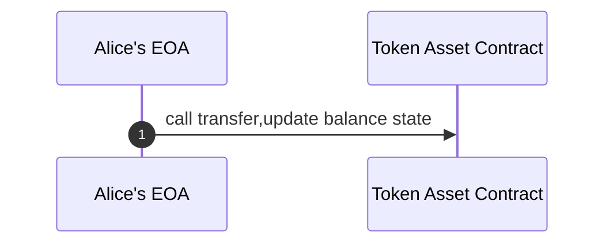
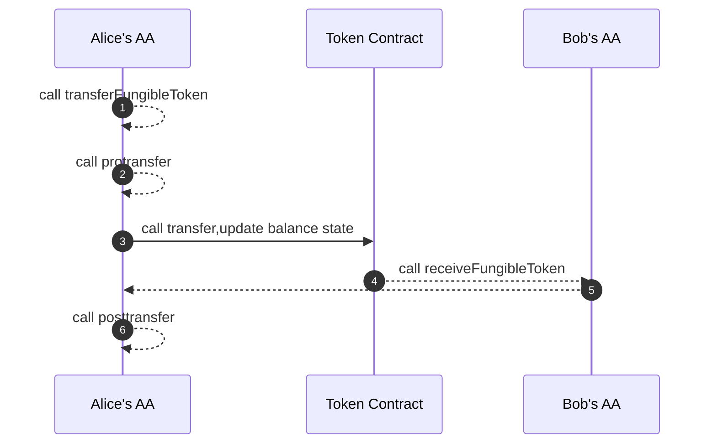
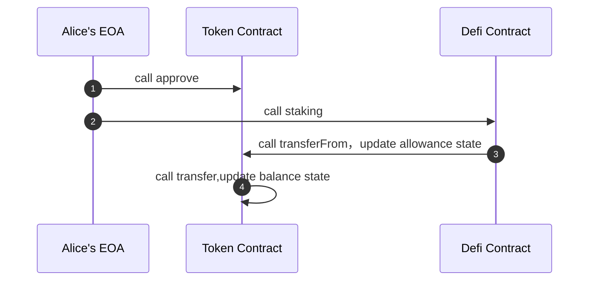
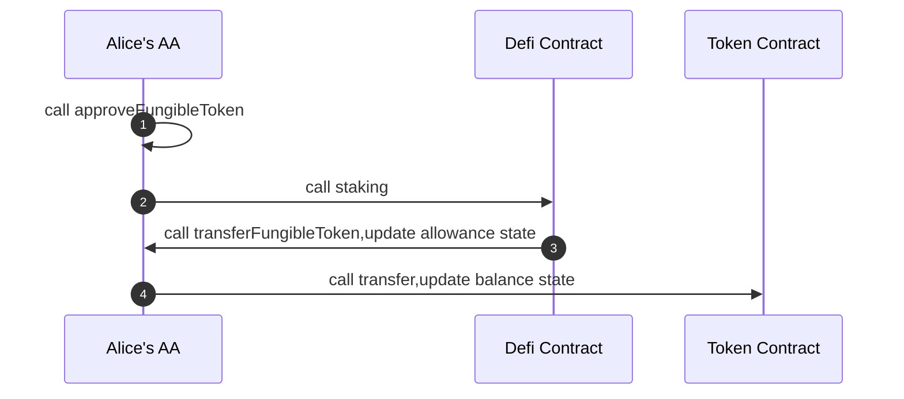
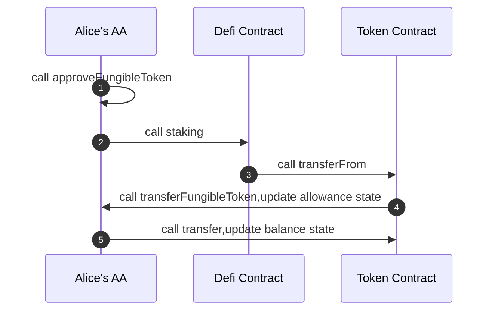

## Abstract

A proposal to manage fungible tokens by the user's smart contract wallet, which provides a new way to manage assets, utilizes the programmability of the smart contract wallet, and also provides more playability.

## Motivation

EOA wallet has no state and code storage, and the smart contract wallet is different.

AA is a direction of the smart contract wallet, which works around abstract accounts. This EIP can also be an extension based on [ERC-4337](./eip-4337.md).

The smart contract wallet allows the user's own account to have state and code, bringing programmability to the wallet. We think there are more directions to expand. For example, token asset management, functional expansion of token transactions, etc.

The smart contract wallet interface of this EIP is for asset management and asset approval. It supports the new asset EIP-X, and [ERC-20](./eip-20.md) is backward compatible with EIP-X, so it can be compatible with the management of all fungible tokens in the existing market.

The proposal aims to achieve the following goals:

1. Assets are allocated and managed by the wallet itself, such as approve and allowance, which are configured by the user’s contract wallet, rather than controlled by the token asset contract, to avoid some existing ERC-20 contract risks.
2. Add the transferFungibleToken function, the transaction initiated by the non-smart wallet itself or will verify the allowance state.
3. Users can choose batch approve and batch transfer. Batch approve can greatly reduce gas. The contract wallet itself manages the authorization status of all assets, and batch approve can be performed without calling multiple token contracts.
4. Users can choose to add hook function before and after their transferFungibleToken to increase the user's more playability.
5. User can choose to implement the receiveFungibleToken function.

## Specification

The key words "MUST", "MUST NOT", "REQUIRED", "SHALL", "SHALL NOT", "SHOULD", "SHOULD NOT", "RECOMMENDED", "NOT RECOMMENDED", "MAY", and "OPTIONAL" in this document are to be interpreted as described in RFC 2119 and RFC 8174.

**Every [ERC-7204]((./eip-7204)) compliant contract must implement the ERC-7204 and [ERC-165](./eip-165) interfaces**

```solidity
/// @title ERC-7204 
/// @dev See https://eips.ethereum.org/EIPS/eip-7204
/// @dev Note: the ERC-165 identifier for this interface is 0xf73edcda
pragma solidity ^0.8.20;

interface IERC7204 /* is ERC165 */ {

    /**
     * @notice Used to notify listeners that owner has granted approval to the user to manage assets tokens.
     * @param asset Address of the fungible token
     * @param owner Address of the account that has granted the approval for token‘s assets
     * @param spender Address of the spender
     * @param value The amount allowed to spend
     */
    event ApprovalFungibleToken(
        address indexed asset,
        address indexed owner, 
        address indexed spender, 
        uint256 value
    );

    /**
     * @notice Approve fungible token
     * @dev Allows spender address to withdraw from your account multiple times, up to the value amount.
     * @dev If this function is called again it overwrites the current allowance with value.
     * @dev Emits an {ApprovalFungibleToken} event.
     * @param asset Address of the fungible token
     * @param spender Address of the spender
     * @param value The amount allowed to spend
     * @return success The bool value returns whether the approve is successful
     */
    function approveFungibleToken(address asset, address spender, uint256 value) 
        external 
        returns (bool success);

    /**
     * @notice Transfer fungible token
     * @dev must call asset.transfer() inside the function
     * @dev If the caller is not yourself, must verify the allowance and update the allowance value
     * @param asset Address of the fungible token
     * @param to Address of the receive
     * @param value The transaction amount
     * @return success The bool value returns whether the transfer is successful
     */
    function transferFungibleToken(address asset, address to, uint256 value) 
        external 
        returns (bool success); 

    
    /**
     * @notice Transfer fungible token
     * @param asset Address of the fungible token
     * @param spender Address of the spender
     * @return remaining The asset amount which spender is still allowed to withdraw from owner.
     */
    function allowanceFungibleToken(address asset, address spender) 
        external
        view
        returns (uint256 remaining);

}
```

Batch operation extension is OPTIONAL, here allows batch transfer and batch approve. Smart contracts MUST implement the ERC-165 supportsInterface function.

```solidity
/// @title ERC-7204Batch 
/// @dev See https://eips.ethereum.org/EIPS/eip-7204
/// @dev Note: the ERC-165 identifier for this interface is 0xaae6c42c

pragma solidity ^0.8.20;

interface IERC7204Batch /* is ERC165 */ {

    /**
     * @notice Batch approve fungible token
     * @dev Allows spender address to withdraw from your account multiple times, up to the value amount.
     * @dev If this function is called again it overwrites the current allowance with value.
     * @dev Emits an {ApprovalFungibleToken} event.
     * @param assets Address of the fungible token
     * @param spenders Address of the spender
     * @param values The amount allowed to spend
     * @return success The bool value returns whether the batch approve is successful
     */
    function approveBacthFungibleToken(address[] memory assets, address[] memory spenders, uint256[] memory values) 
         external
         returns (bool success);

    /**
     * @notice Batch transfer fungible token
     * @dev If the caller is not yourself, must verify the allowance and update the allowance value
     * @param assets Addresses of the fungible token
     * @param tos Addresses of the receive
     * @param values value of the transaction amount
     * @return success The bool value returns whether the batch transfer is successful
     */
    function transferBatchFungibleToken(address[] memory assets, address[] memory tos, uint256[] memory values) 
        external 
        returns (bool success);
}
```

## Rationale

Use the sequence diagram to compare the difference between using this interface to transfer tokens.

**Alice calls the transfer herself**

The user does not use this EIP to call the transaction sequence diagram(transfer).



The user use this EIP to call the transaction sequence diagram( Alice's AA implements this EIP), dotted lines are optional.



**Alice doesn't call the transfer herself**

Sequence diagram of third party calling user transaction without using this EIP(transferForm).



Sequence diagram of third party calling user transaction using this EIP(transferFungibleToken).



The third party uses this EIP and is compatible with the old dapp protocol and EOA to call the user transaction sequence diagram(transferForm).



## Backwards Compatibility

This EIP can be used as an extension of [ERC-4337](./eip-4337.md) and is backward compatible with ERC-4337.

## Reference Implementation

```solidity
contract ERC7204 is IERC7204,IERC7204Batch,ERC165{

    mapping (address => mapping (address => uint256)) private _allowances;
  
    bytes4 constant private INTERFACE_SIGNATURE_ERC165 = 0x01ffc9a7;
    bytes4 constant private INTERFACE_SIGNATURE_ERC7204 = 0xf73edcda;
    bytes4 constant private INTERFACE_SIGNATURE_ERC7204BATCH = 0xaae6c42c;

    function supportsInterface(bytes4 _interfaceId) public pure returns (bool) {
        if (_interfaceId == INTERFACE_SIGNATURE_ERC165 ||
            _interfaceId == INTERFACE_SIGNATURE_ERC7204   ||
            _interfaceId == INTERFACE_SIGNATURE_ERC7204BATCH) {
            return true;
        }
        return false;
    }

    function transferFungibleToken(address _asset, address _to, uint256 _value) public returns (bool) {
        // msg.sender
        if (!isMyAccount(msg.sender)){
            require(_value <= _allowances[_asset][_to], "transfer amount exceeds allowance");
            approveFungibleToken(_asset, _to, _allowances[_asset][_to] - _value);
        }
        require(IERCX(_asset).transfer(_to, _value),"ERC-20 transfer failed");
        return true;
    }

    function approveFungibleToken(address _asset, address  _spender, uint256 _value) public returns (bool) {
        require(isMyAccount(msg.sender), "not my account");
        _allowances[_asset][_spender] = _value;
        emit ApprovalFungibleToken(_asset, address(this), _spender, _value);
        return true;
    }
    function transferBatchFungibleToken(address[] memory _assets, address[] memory _tos, uint256[] memory _values) external returns (bool) {
        require(_assets.length == _tos.length, "length mismatch");
        require(_tos.length == _values.length, "length mismatch");
        for (uint i = 0; i < _assets.length; i++) {
            transferFungibleToken(_assets[i],_tos[i],_values[i]);
        }
        return true;
    }

    function approveBacthFungibleToken(address[] memory _asset, address[] memory _spender, uint256[] memory _value) public returns (bool) {
        require(_asset.length == _spender.length, "length mismatch");
        require(_spender.length == _value.length, "length mismatch");
        require(isMyAccount(msg.sender), "not my account");
        for (uint i = 0; i < _asset.length; i++) {
            // Allowance for the owner to spender is already 0 in ERC-20
            // So, we don't need to set allowance to 0 before setting a new value
            _allowances[_asset[i]][_spender[i]] = _value[i];
            emit ApprovalFungibleToken(_asset[i], address(this), _spender[i], _value[i]);
        }

        return true;
    }

    function allowanceFungibleToken(address _asset, address _spender) public view returns (uint256) {
        return _allowances[_asset][_spender];
    }

    function isMyAccount(address _account) internal pure returns (bool) {
        return true;
    }

}
```


## Security Considerations

No security considerations were found.

## Copyright

Copyright and related rights waived via [CC0](../LICENSE.md).
