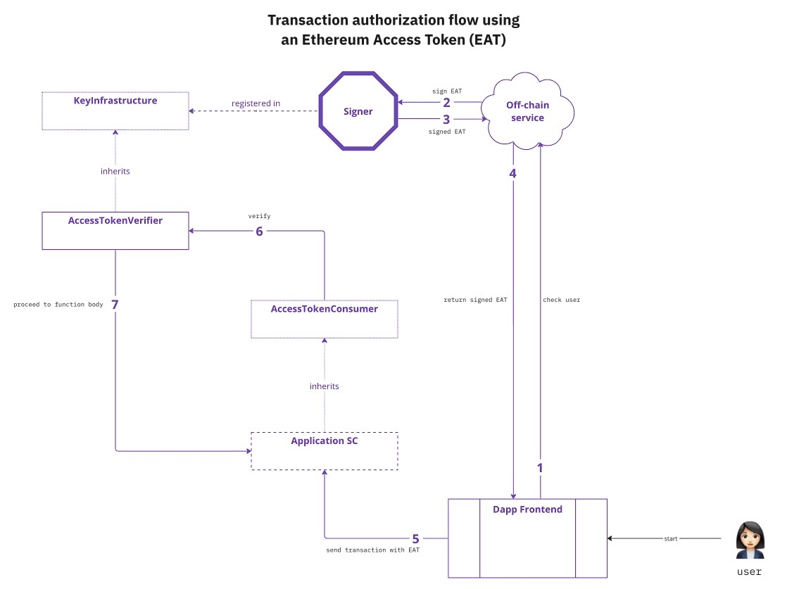

## Abstract

An Ethereum Access Token (EAT) is an [EIP-712](./eip-712.md) conformant, signed message, used by off-chain services to grant Ethereum accounts access to specific on-chain resources. EATs share similarities with JWTs; both are used for short-lived authorizations. However Ethereum Access Tokens are specifically designed to be verified on-chain and tailored to authorize smart contract function calls.

## Motivation

While other proposals tackle authentication ([ERC-4361](./eip-4361.md)) or authorization in a more narrow way ([ERC-2612](./eip-2612.md)), this specification allows developers to add a layer of access control to any function they create with minimal changes. It is best suited for use cases where end users should only be able to access specific on-chain resources themselves directly, by way of sending a transaction, provided they have been granted authorization by an off-chain service first. Examples of such scenarios include an off-chain verifier assessing eligibility requirements (e.g by verifying verifiable credentials) to mint a token or to interact with a smart contract that requires a certain compliance status.
Therefore, this proposal enables off-chain systems to authenticate the controller of an Ethereum account in any way they want, before granting an authorization bound to said account.

This specification is intended to improve interoperability in the Ethereum ecosystem, by providing a consistent machine-readable message format to achieve improved user experiences.

EATs fill a void where access control requirements differ from current standard access control mechanisms (role-based access modifiers or checking that an address owns an NFT):

- Desired acccess is short-lived
- Criteria needs to be flexible/dynamic: updating the requirements for granting access doesn't require any update on chain
- When Soulbound or other on-chain token semantics are not desired. Using any kind of "on-chain registry" to grant authorization places a burden on the owner of such registry to keep it up-to-date at all time. Otherwise, someone might be wrongly granted access in the lapse of time where their on-chain status is incorrect. With EATs, on the contrary, users come to ask for an authorization which gives EAT issuers the opportunity to perform some checks and update their records before granting authorization.  Additionally, relying purely on on-chain data comes with privacy concerns due to the public nature of most of current chains. When authorization needs to be granted based on sensitive or personally identifiable information, it is not recommended to store that information on-chain and perform a lookup. Ethereum Access Tokens provide an alternative which doesn't leak any PII on-chain.

## Specification

The key words "MUST", "MUST NOT", "REQUIRED", "SHALL", "SHALL NOT", "SHOULD", "SHOULD NOT", "RECOMMENDED", "NOT RECOMMENDED", "MAY", and "OPTIONAL" in this document are to be interpreted as described in RFC 2119 and RFC 8174.

### Overview

An example flow integrated in a DeFi application is the following:

1. A user interacts with the DeFi's off-chain service, providing sufficient input for the off-chain service to ensure the user meets its criteria (for example, authenticates the user and/or make sure they possess valid credentials)
2. If authorization is granted, an EAT is issued to the user
3. The user then interacts with the gated smart contract function within the specified period of time passing the EAT as part of the transaction
4. The EAT is verified on-chain




An Ethereum Access Token MUST guarantee granular access control by binding it to specific parameters upon issuance. Then, on-chain EAT verification ensures that:

- The function being called is the expected one
- The function parameters are the expected ones
- The function caller is the expected one
- The function is being called in the authorized timeframe (i.e checking that the EAT is not expired)
- The smart contract being called is the expected one
- The authorization has been given by a valid issuer, i.e the EAT has been signed by one of the expected issuers


### Structure of an Ethereum Access Token

An Ethereum Access Token is composed of a signature and expiry.

```
{
 uint8 v,
 bytes32 r,
 bytes32 s,
 uint256 expiry
}
```

The signature is obtained using the typed structured data hashing and signing standard (EIP-712), signing over the following EAT payload:

```
struct AccessToken {
    uint256 expiry;
    FunctionCall functionCall;
}

struct FunctionCall {
    bytes4 functionSignature;
    address target;
    address caller;
    bytes parameters;
}
```

- **expiry**: unix timestamp, expected to be before `block.timestamp`

`FunctionCall` parameters correspond to the following:

- **functionSignature**: identifier for the function being called, expected to match `msg.sig`
- **target**: address of the target contract being called
- **caller**: address of the current caller - expected to match `msg.sender`
- **parameters**: `calldata` after stripping off the first parameters, namely `v`,`r`, `s` and `expiry`


### EAT Verification

On chain, two contracts are necessary: an `AccessTokenConsumer` which is inherited by contracts needing to permission some of its functions and an `AccessTokenVerifier` which is responsible for verifying EATs.

A modifier is added to functions that need to be permissioned with an EAT.
Given a function such as:

```
function transfer(address recipient, uint256 amount)
```

Its permissioned version, protected via an EAT becomes:

```
function transfer(
        uint8 v,
        bytes32 r,
        bytes32 s,
        uint256 expiry,
        address recipient,
        uint256 amount
        )
        requiresAuth(v, r, s, expiry) {
            ...
        }

```

The parameters `v`, `r`, `s`, `expiry`, which form an EAT, MUST be placed first, before any other parameters.


The `requiresAuth` modifier is inherited from `AccessTokenConsumer` which verifies the Ethereum Access Token and consumes it:

```
    modifier requiresAuth(
        uint8 v,
        bytes32 r,
        bytes32 s,
        uint256 expiry
    ) {
        // VF -> Verification Failure
        require(verify(v, r, s, expiry), "AccessToken: VF");
        _consumeAccessToken(v, r, s, expiry);
        _;
    }
```

The `verify` function calls the `AccessTokenVerifier` registered upon construction to verify the EAT's integrity.

Optionally, implementers can decide to make EATs non-replayable. This what `_consumeAccessToken(...)` does. It marks an EAT as consumed to prevent its re-use:

```
function _consumeAccessToken(
        uint8 v,
        bytes32 r,
        bytes32 s,
        uint256 expiry
    ) private {
        bytes32 accessTokenHash = keccak256(abi.encodePacked(v, r, s, expiry));

        _accessTokenUsed[accessTokenHash] = true;
    }
```

## Rationale

- Single-use. The reference implementation guarantees non-replayability of EATs. But other implementations might favor a different approach.

- Use of EIP-712. By conforming to EIP-712, EATs are interoperable with existing Ethereum infrastructure, and developers can use them to create access controls with minimal modifications to their existing code. It also ensures that EATs issued are bound to a specific chain.

- Zero-knowledge proofs. Using ZKPs comes at a cost, including added complexity. EATs are not much more than signed messages which are simpler to reason around. While `ecrecover` is available in any Ethereum smart contract out of the box, ZKPs come in different flavors which hinders interoperability.

## Backwards Compatibility

Any function can be gated with an EAT, apart from the special `receive` and `fallback` functions.


## Reference Implementation

TODO: add from /assets

## Security Considerations

The security of the Ethereum Access Token (EAT) proposal depends on several factors:

### Replay Attacks:

The implementation MAY ensure that an EAT cannot be reused after it has been consumed. This is achieved by marking the EAT as consumed in the `_consumeAccessToken` function.

### Off-Chain Issuance:

The security of the off-chain service issuing EATs is critical since the security of EAT-gated functions depends on it.
If this service is compromised, malicious actors could be granted EATs giving them access to on-chain resources that they should not have access to.

### Expiry Time Considerations:

The expiry time of the EAT must be set judiciously to balance usability and security. If the expiry time is set too long, it might increase the risk of EAT misuse. If it's too short, it might compromise the usability of the application.

## Copyright

Copyright and related rights waived via [CC0](../LICENSE.md).
