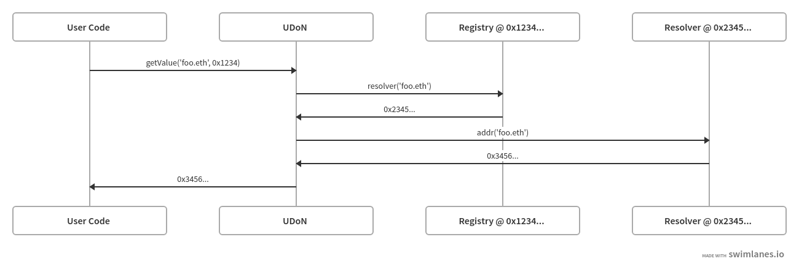

## Abstract

The objective of this EIP is to propose the **Universal Domain Namespace(UDoN)**, which aims to facilitate onchain registry entries. Each entry in this structure adopts a mapping type, allowing for interactive capabilities across multiple registries like [ENS](./eip-137.md) and [NFT accounts](./eip-6551.md).

## Motivation

The necessity for a unified method of data retrieval across various registries is apparent. A structured methodology that allows for seamless reading of data from one registry to another, effectively linking chains of information, is thus proposed. This proposal seeks to standardize an interface that not only supports interaction but also promotes integration with multi-protocol registries. With the utilization of such an interface, a single deployed contract can retrieve records from different combinations of registries, such as ENS, the registry for royalty payments of NFTs, the registry for smart contract accounts owned by NFT tokens, and other registries as defined by varying protocols.

## Specification

The key words “MUST”, “MUST NOT”, “REQUIRED”, “SHALL”, “SHALL NOT”, “SHOULD”, “SHOULD NOT”, “RECOMMENDED”, “MAY”, and “OPTIONAL” in this document are to be interpreted as described in RFC 2119.

**The Universal Domain Namespace(UDoN)** is a singular contract that enables the retrieval of data from multiple registries, each defined under different protocols within its own namespace. These registries employ distinct methods for resolving the key-value pairs.

Resolving a node in **UDoN** involves a two-step process. Firstly, the **UDoN** is invoked with the protocol specified by the caller to resolve their namespace. This call returns the corresponding registry associated with that protocol. Secondly, using the key that needs resolution, if the record exists in the returned registry, the registry itself retrieves the associated value using its own implementation. This retrieval process can involve directly returning the value or utilizing a resolver.

### Typical Flow



### Interface

A new UDoN interface is defined, consisting of the following method:

```solidity
interface IERC7336 {
  struct Result {
      address   resAddr;
      string    resText;
      bytes32   resAbi;
      bytes32   resPublickey;
  }

  /// @notice Returns the multi type data by retrieving value from different registries
  /// @param registryAddress An address of target registry
  /// @param node A key to lookup data for
  /// @return The value is retrieved from specific registry
  function getValue(address registryAddress, byte32 node) external view returns (Result res);
}
```

Smart contracts implementing the standard MUST implement all of the functions in the interface.

## Rationale

The rationale behind this EIP is to augment the efficiency and interoperability within the Ethereum ecosystem. It provides a seamless way to interact with different registries, ultimately simplifying the process of reading and retrieving data. This proposed interface will encourage the development of more efficient, interoperable and standardized solutions, leading to a more robust and integrated Ethereum ecosystem.

## Backwards Compatibility

As this EIP introduces a new feature and does not modify any existing behaviors, there are no backwards compatibility issues.

## Reference Implementation

```solidity
pragma solidity ^0.8.12;

import "./IERC7336Interface.sol";
import "./ERC165/ERC165Query.sol";

contract RegistryInterfaceId {
  bytes4 internal constant ENS_INTERFACE_ID = 0x75b24222;
  bytes4 internal constant TXT_INTERFACE_ID = 0x59d1d43c;
  bytes4 internal constant OTHER_INTERFACE_ID = 0x...; // Replace with the correct value for the other interface ID
}

contract UDoN is ERC165Query, IERC7336Interface {
    function getValue(address registryAddress, bytes32 node) external view override returns (Result memory) {
        UDoN reg = UDoN(registryAddress);
        Result memory res;

        if (doesContractImplementInterface(registryAddress, RegistryInterfaceId.ENS_INTERFACE_ID)) {
            var resolver = reg.resolver(node);
            var address = resolver.addr(node);
            res.resAddr = address;
        } else if (doesContractImplementInterface(registryAddress, RegistryInterfaceId.TXT_INTERFACE_ID)) {
            var text = reg.getText();
            res.resText = text;
        }
        
        return res;
    }
}
```

## Security Considerations

Needs discussion.

## Copyright

Copyright and related rights waived via [CC0](../LICENSE.md).
