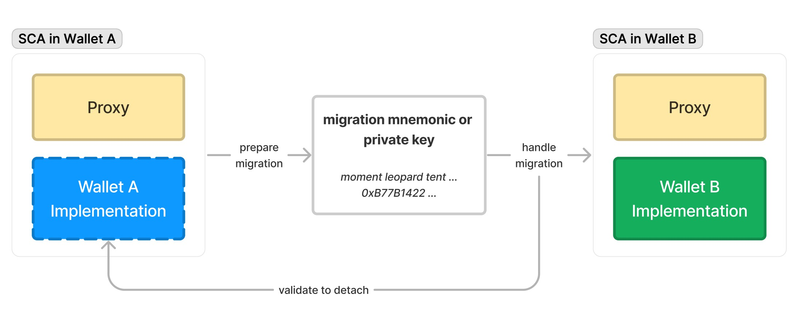

## Abstract

Portable Smart Contract Accounts (PSCA) address the lack of portability and compatibility faced by Smart Contract Accounts (SCA) across different wallet providers. Based on [ERC-1967](./eip-1967.md), the PSCA system allows users to easily migrate their SCAs between different wallets using new, randomly generated migration keys. This provides a similar experience to exporting an externally owned account (EOA) with a private key or mnemonic. The system ensures security by employing signatures and time locks, allowing users to verify and cancel migration operations during the lock period, thereby preventing potential malicious actions. PSCA offers a non-intrusive and cost-effective approach, enhancing the interoperability and composability within the Account Abstraction (AA) ecosystem.

## Motivation

With the introduction of the [ERC-4337](./eip-4337.md) standard, AA related infrastructure and SCAs have been widely adopted in the community. However, unlike EOAs, SCAs have a more diverse code space, leading to varying contract implementations across different wallet providers. Consequently, the lack of portability for SCAs has become a significant issue, making it challenging for users to migrate their accounts between different wallet providers. While some proposed a modular approach for SCA accounts, it comes with higher implementation costs and specific prerequisites for wallet implementations.

Considering that different wallet providers tend to prefer their own implementations or may expect their contract systems to be concise and robust, a modular system may not be universally applicable. The community currently lacks a more general SCA migration standard.

This proposal describes a solution working at the Proxy (ERC-1967) layer, providing a user experience similar to exporting an EOA account (using private keys or mnemonics). A universal SCA migration mechanism is shown in the following diagram:



Considering that different wallet providers may have their own implementations, this solution imposes almost no requirements on the SCA implementation, making it more universally applicable and less intrusive with lower operational costs. Unlike a modular system operating at the "implementation" layer, both approaches can complement each other to further improve the interoperability and composability of the AA ecosystem.

## Specification

The key words “MUST”, “MUST NOT”, “REQUIRED”, “SHALL”, “SHALL NOT”, “SHOULD”, “SHOULD NOT”, “RECOMMENDED”, “MAY”, and “OPTIONAL” in this document are to be interpreted as described in RFC 2119.

### Terms

- Wallet Provider: A service provider that offers wallet services. SCA implementations among wallet providers are typically different, lacking compatibility with each other.
- Random Operator: A new, randomly generated migration mnemonic or private key used for each migration. The corresponding address of its public key is the random operator's address.
    - If using a mnemonic, the derived migration private key follows the [BIP 44](https://github.com/bitcoin/bips/blob/55566a73f9ddf77b4512aca8e628650c913067bf/bip-0044.mediawiki) specification with the path **`m/44'/60'/0'/0/0'`**.

### Interfaces

A Portable Smart Contract Account **MUST** implement the **`IERC7405`** interface:

```solidity
interface IERC7405 {
    /**
     * @dev emitted when the account finishes the migration
     * @param oldImplementation old implementation address
     * @param newImplementation new implementation address
     */
    event AccountMigrated(
        address oldImplementation,
        address newImplementation
    );
    
    /**
     * @dev prepare the account for migration
     * @param randomOperator public key (in address format) of the random operator
     * @param signature signature signed by the random operator
     *
     * **MUST** check the authenticity of the account
     */
    function prepareAccountMigration(
        address randomOperator,
        bytes calldata signature
    ) external;

    /**
     * @dev cancel the account migration
     *
     * **MUST** check the authenticity of the account
     */
    function cancelAccountMigration() external;

    /**
     * @dev handle the account migration
     * @param newImplementation new implementation address
     * @param initData init data for the new implementation
     * @param signature signature signed by the random operator
     *
     * **MUST NOT** check the authenticity to make it accessible by the new implementation
     */
    function handleAccountMigration(
        address newImplementation,
        bytes calldata initData,
        bytes calldata signature
    ) external;
}
```

### Signatures

The execution of migration operations **MUST** use the migration private key to sign the `MigrationOp`.

```solidity
struct MigrationOp {
    uint256 chainID;
    bytes4 selector;
    bytes data;
}
```

When the **`selector`** corresponds to **`prepareAccountMigration(address,bytes)`** (i.e., **`0x50fe70bd`**), the **`data`** is **`abi.encode(randomOperator)`**. When the **`selector`** corresponds to **`handleAccountMigration(address,bytes,bytes)`** (i.e., **`0xae2828ba`**), the **`data`** is **`abi.encode(randomOperator, setupCalldata)`**.

The signature is created using **[ERC-191](./eip-191.md)**, signing the **`MigrateOpHash`** (calculated as **`abi.encode(chainID, selector, data)`**).

### Registry

To simplify migration credentials and enable direct addressing of the SCA account with only the migration mnemonic or private key, this proposal requires a shared registry deployed at the protocol layer.

```solidity
interface IERC7405Registry {
    struct MigrationData {
        address account;
        uint48 createTime;
        uint48 lockUntil;
    }

    /**
     * @dev check if the migration data for the random operator exists
     * @param randomOperator public key (in address format) of the random operator
     */
    function migrationDataExists(
        address randomOperator
    ) external returns (bool);

    /**
     * @dev get the migration data for the random operator
     * @param randomOperator public key (in address format) of the random operator
     */
    function getMigrationData(
        address randomOperator
    ) external returns (MigrationData memory);

    /**
     * @dev set the migration data for the random operator
     * @param randomOperator public key (in address format) of the random operator
     * @param lockUntil the timestamp until which the account is locked for migration
     *
     * **MUST** validate `migrationDataMap[randomOperator]` is empty
     */
    function setMigrationData(
        address randomOperator,
        uint48 lockUntil
    ) external;

    /**
     * @dev delete the migration data for the random operator
     * @param randomOperator public key (in address format) of the random operator
     *
     * **MUST** validate `migrationDataMap[randomOperator].account` is `msg.sender`
     */
    function deleteMigrationData(address randomOperator) external;
}
```

### Expected behavior

When performing account migration (i.e., migrating an SCA from Wallet A to Wallet B), the following steps **MUST** be followed:

1. Wallet A generates a new migration mnemonic or private key (**MUST** be new and random) and provides it to the user. The address corresponding to its public key is used as the **`randomOperator`**.
2. Wallet A signs the **`MigrateOpHash`** using the migration private key and calls the **`prepareAccountMigration`** method, which **MUST** performs the following operations:
    - Calls the internal method **`_requireAccountAuth()`** to verify the authenticity of the SCA account. For example, in ERC-4337 account implementation, it may require **`msg.sender == address(entryPoint)`**.
    - Performs signature checks to confirm the validity of the **`randomOperator`**.
    - Calls **`IERC7405Registry.migrationDataExists(randomOperator)`** to ensure that the **`randomOperator`** does not already exist.
    - Sets the SCA account's lock status to true and adds a record by calling **`IERC7405Registry.setMigrationData(randomOperator, lockUntil)`**.
    - After calling **`prepareAccountMigration`**, the account remains locked until a successful call to either **`cancelAccountMigration`** or **`handleAccountMigration`**.
3. To continue the migration, Wallet B initializes authentication data and imports the migration mnemonic or private key. Wallet B then signs the **`MigrateOpHash`** using the migration private key and calls the **`handleWalletMigration`** method, which **MUST** performs the following operations:
    - **MUST NOT** perform SCA account authentication checks to ensure public accessibility.
    - Performs signature checks to confirm the validity of the **`randomOperator`**.
    - Calls **`IERC7405Registry.getMigrationData(randomOperator)`** to retrieve **`migrationData`**, and requires **`require(migrationData.account == address(this) && block.timestamp > migrationData.lockUntil)`**.
    - Calls the internal method **`_beforeWalletMigration()`** to execute pre-migration logic from Wallet A (e.g., data cleanup).
    - Modifies the Proxy (ERC-1967) implementation to the implementation contract of Wallet B.
    - Calls **`address(this).call(initData)`** to initialize the Wallet B contract.
    - Calls **`IERC7405Registry.deleteMigrationData(randomOperator)`** to remove the record.
    - Emits the **`AccountMigrated`** event.
4. If the migration needs to be canceled, Wallet A can call the **`cancelAccountMigration`** method, which **MUST** performs the following operations:
    - Calls the internal method **`_requireAccountAuth()`** to verify the authenticity of the SCA account.
    - Sets the SCA account's lock status to false and deletes the record by calling **`IERC7405Registry.deleteMigrationData(randomOperator)`**.

### Storage Layout

To prevent conflicts in storage layout during migration across different wallet implementations, a Portable Smart Contract Account implementation contract:

- **MUST NOT** directly define state variables in the contract header.
- **MUST** encapsulate all state variables within a struct and store that struct in a specific slot. The slot index **SHOULD** be unique across different wallet implementations.

For slot index, we recommend calculating it based on the namespace and slot ID:

- The namespace **MUST** contain only [A-Za-z0-9_].
- Wallet providers' namespaces are **RECOMMENDED** to use snake_case, incorporating the wallet name and major version number, such as **`foo_wallet_v1`**.
- The slot ID for slot index **SHOULD** follow the format **`{namespace}.{customDomain}`**, for example, **`foo_wallet_v1.config`**.
- The calculation of the slot index is performed as **`bytes32(uint256(keccak256(slotID) - 1))`**.

## Rationale

The main challenge addressed by this EIP is the lack of portability in Smart Contract Accounts (SCAs). Currently, due to variations in SCA implementations across wallet providers, moving between wallets is a hassle. Proposing a modular approach, though beneficial in some respects, comes with its own costs and compatibility concerns.

The PSCA system, rooted in ERC-1967, introduces a migration mechanism reminiscent of exporting an EOA with a private key or mnemonic. This approach is chosen for its familiarity to users, ensuring a smoother user experience.

Employing random, migration-specific keys further fortifies security. By mimicking the EOA exportation process, we aim to keep the process recognizable, while addressing the unique challenges of SCA portability.

The decision to integrate with a shared registry at the protocol layer simplifies migration credentials. This system enables direct addressing of the SCA account using only the migration key, enhancing efficiency.

Storage layout considerations were paramount to avoid conflicts during migrations. Encapsulating state variables within a struct, stored in a unique slot, ensures that migrations don't lead to storage overlaps or overwrites.

## Backwards Compatibility

This proposal is backward compatible with all SCA based on ERC-1967 Proxy, including non-ERC-4337 SCAs. Furthermore, this proposal does not have specific prerequisites for SCA implementation contracts, making it broadly applicable to various SCAs.

<!--
## Reference Implementation

[WIP]
-->

## Security Considerations

- Each migration must generate a new, randomly generated migration mnemonic or private key and its corresponding random operator address to prevent replay attacks or malicious signing.
- Different wallet implementations must consider the independence of storage layout to avoid conflicts in storage after migration.
- To prevent immediate loss of access for the account owner due to malicious migration, we introduce a "time lock" to make migrations detectable and reversible. When a malicious operation attempts an immediate migration of an SCA, the account enters a lock state and waits for a lock period. During this time, users can use the original account authentication to cancel the migration and prevent asset loss. Accounts in the lock state **SHOULD NOT** allow the following operations:
    - Any form of asset transfer operations
    - Any form of external contract call operations
    - Any attempts to modify account authentication factors
    - Any operations that could potentially impact the above three
- When performing migration operations, the wallet provider **SHOULD** attempt to notify the account owner of the migration details through all available messaging channels.

## Copyright

Copyright and related rights waived via **[CC0](../LICENSE.md)**.
