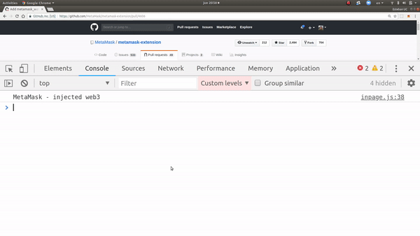
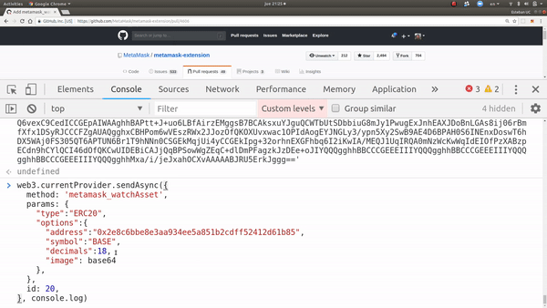

## Simple Summary
A method for allowing users to easily track new assets with a suggestion from sites they are visiting.

## Abstract
Web3 JavaScript wallet browsers may implement `wallet_watchAsset()` to allow any website to suggest a token for the user's wallet to track.

## Motivation
Today, one of the major uses of ethereum wallets is to acquire and track assets. Currently, each wallet either needs to pre-load a list of approved assets, or users need to be stepped through a tedious process of adding an asset for their given wallet.

In the first case, wallets are burdened with both the security of managing this list, as well as the bandwidth of mass polling for known assets on their wallet.

In the second case, the user experience is terrible.

By leveraging a user's existing trust with websites they are learning about assets on, we are able to decentralize the responsibility of managing a user's list of known assets.

## Specification
A new method is added to web3 browsers' ethereum providers:

```javascript

/**
* @param  {Object}  opts - The options specifying the asset `type` and `options` specific for each of asset.
* @returns  {Promise} success - Whether the user added the asset to their wallet.
*/
async  function  wallet_watchAsset (
  opts
) {
/* Implementation would go here */
}

// Sample usage:
web3.wallet.watchAsset({ type, options })
```
As there are several types of different assets, this method has to provide support for each of them in a separate way. If it doesn't, it should give a response according to that.

In the case of assets of type `ERC20`, this method works as follows.

```javascript
web3.wallet.watchAsset({
	type: 'ERC20',
	options: { address, symbol, decimals [, image] }
})
```

The `image` parameter should link to a web-standard image format (png, jpg) of a reasonable size or a `Base64` image. To establish a baseline, let's say no greater than 512x512 pixels, and no greater than 256kb. However, this can be a client-defined setting.

An example of use in the first case would be.

```javascript
web3.wallet.watchAsset({
	type: 'ERC20',
	options: {
		address,
		symbol,
		decimals,
		image: 'linktoimage.jpg'
	}
})
```
Upon calling this request, the user should be prompted with the opportunity to add this token to their wallet:



For `Base64` images, the user just have to add it as `image` parameter.

```javascript
const base64image = 'data:image/png;base64, ... '
web3.wallet.watchAsset({
	type: 'ERC20',
	options: {
		address,
		symbol,
		decimals,
		image: base64image
	}
})
```
Upon calling this request, the user should be prompted with the opportunity to add this token to their wallet:



If the user adds this token, it should appear somewhere in their wallet's UI, with its balance, etc.

As a result of the addition or not of the asset a `Promise` should be returned, indicating if the user added the asset or an error if some parameter is not valid.

In the case of an asset type that is not supported by the wallet, an error should appear indicating at least.

```
Asset of type (type) not supported
```

## Rationale
Displaying a user's assets is a basic feature that every modern dapp user expects. However, keeping this list, and polling for it from the network can be costly, especially on bandwidth constrained devices.

Most wallets today either manage their own assets list, which they store client side, or they query a centralized API for balances, which reduces decentralization, letting that API's owner easily correlate account holders with their IP addresses.

Maintaining one of these assets lists becomes a political act, and maintainers can be subject to regular harassment and pressure to list otherwise unknown assets.

Furthermore, automatically listing assets makes assets into a sort of spam mail: Users suddenly seeing new assets that they don't care about in their wallet can be used to bombard them with information that they didn't opt into.

This phenomenon is exacerbated by the trend towards airdropped tokens, which has been a cause of network congestion, because spamming people with new tokens has so far been rewarded with user attention.

While some people might suggest we begin a TCR of trusted tokens to watch, this would not solve the client-side bandwidth issues, nor the airdropped token spam issues. What we really want is a small list of tokens the user cares about.

Most of the time a user is adding a asset, they learned about it on a website. At that moment, there is a natural alignment of interests, where the website wants the user to track their asset, and the user wants to track it. This is a natural point to introduce an API to easily allow these parties to collaborate, without involving the politics of the wallet's developers.

## Implementation
One implementation in progress can be viewed [on the MetaMask GitHub repository](https://github.com/MetaMask/metamask-extension/pull/4606).

## Copyright
Copyright and related rights waived via [CC0](https://creativecommons.org/publicdomain/zero/1.0/).

