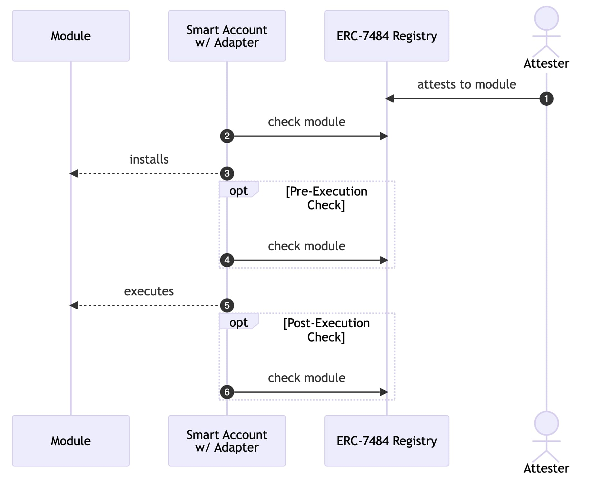

## Abstract

This proposal standardises the interface and functionality of Module Registries, allowing modular smart contract accounts to verify the security of modules using a Registry Adapter. It also provides a reference implementation of a Singleton Module Registry.

## Motivation

[ERC-4337](./eip-4337.md) standardises the execution flow of contract accounts and other efforts aim to standardise the modular implementation of these accounts, allowing any developer to build modules for these modular accounts (hereafter Smart Accounts). However, adding third-party modules into Smart Accounts unchecked opens up a wide range of attack vectors.

One solution to this security issue is to create a Module Registry that stores security attestations on Modules and allows Smart Accounts to query these attestations before using a module. This standard aims to achieve two things:

1. Standardise the interface and required functionality of Module Registries.
2. Standardise the functionality of Adapters that allow Smart Accounts to query Module Registries.

This ensures that Smart Accounts can securely query Module Registries and handle the Registry behavior correctly, irrespective of their architecture, execution flows and security assumptions. This standard also provides a reference implementation of a Singleton Module Registry that is ownerless and can be used by any Smart Account. While we see many benefits of the entire ecosystem using this single Module Registry (see `Rationale`), we acknowledge that there are tradeoffs to using a singleton and thus this standard does not require Smart Accounts to use the reference implementation. Hence, this standard ensures that Smart Accounts can query any Module Registry that implements the required interface and functionality, reducing integration overhead and ensuring interoperability for Smart Accounts.

## Specification

The key words "MUST", "MUST NOT", "REQUIRED", "SHALL", "SHALL NOT", "SHOULD", "SHOULD NOT", "RECOMMENDED", "NOT RECOMMENDED", "MAY", and "OPTIONAL" in this document are to be interpreted as described in RFC 2119 and RFC 8174.

### Definitions

- **Smart account** - An ERC-4337 compliant smart contract account that has a modular architecture.
- **Module** - Self-contained smart account functionality.
- **Attestation** - Onchain assertions made about the security of a module.
- **Attester** - The entity that makes an attestation about a module.
- **(Module) Registry** - A contract that stores an onchain list of attestations about modules.
- **Adapter** - Smart account functionality that handles the fetching and validation of attestations from the Registry.

### Required Registry functionality

There are 2 separate required Registry methods: `check` and `checkN`

- `check` is used to check the attestation on a module by a single attester.
- `checkN` is used to check the attestation on a module by multiple attesters.

The core interface for a Registry is as follows:

```solidity
interface IRegistry {
  function check(address module, address attester) public view returns (uint256);

  function checkN(address module, address[] memory attesters, uint256 threshold) external view returns (uint256[] memory);
}
```

The Registry MUST implement the following functionality:

- Verify that an attester is the creator of an attestation, for example by checking `msg.sender` or by using signatures, before storing it.
- Allow attesters to revoke attestations that they have made.
- Store either the attestation data or a reference to the attestation data.
- Implement `check` and `checkN` as specified below.

The Registry SHOULD implement the following additional functionality:

- Allow attesters to specify an expiry date for their attestations and revert during `check` or `checkN` if an attestation is expired.
- Implement a view function that allows an adapter or offchain client to read the data for a specific attestation.

#### `check`

Takes two arguments: `module` and `attester`.

- The Registry MUST revert if the `attester` has not made an attestation on the `module`.
- The Registry MUST revert if the `attester` has revoked their attestation on the `module`.

Returns a `uint256` of the timestamp at which the attestation was created.

#### `checkN`

Takes three arguments: `module`, `attesters` and `threshold`.

Note: `threshold` may be 0.

- The Registry MUST revert if the number of `attesters` that have made an attestation on the `module` is smaller than the `threshold`.
- The Registry MUST revert if any `attester` has revoked their attestation on the `module`.

Returns an array of `uint256` of the timestamps at which the attestation by each queried attester was created.

Note: The return values of `check` and `checkN` might change in the future, based on community feedback and further exploration of Registries and Adapters.

### Adapter behavior

A Smart Account MUST implement the following Adapter functionality either natively in the account or as a module. This Adapter functionality MUST ensure that:

- The Registry is queried about module `A` at least once before or during the transaction in which `A` is called for the first time.
- The Registry reverting is treated as a security risk.

Additionally, the Adapter SHOULD implement the following functionality:

- Revert the transaction flow when the Registry reverts.
- Query the Registry about module `A` on installation of `A`.
- Query the Registry about module `A` on execution of `A`.

Example: Adapter flow using `check`


## Rationale

### Attestations

Attestations are onchain assertions made about a module. These assertions could pertain to the security of a module (similar to a regular smart contract audit), whether a module adheres to a certain standard or any other kinds of statements about these modules. While some of these assertions can feasibly be verified onchain, the majority of them cannot be.

One example of this would be determining what storage slots a specific module can write to, which might be useful if a smart account uses DELEGATECALL to invoke the module. This assertion is practically infeasible to verify onchain, but can easily be verified off-chain. Thus, an attester could perform this check off-chain and publish an attestation onchain that attests to the fact that a given module can only write to its designated storage slots.

While attestations are always certain kinds of assertions made about a module, this proposal purposefully allows the attestation data to be any kind of data or pointer to data. This ensures that any kind of data can be used as an assertion, from a simple boolean flag specifying that a module is secure to a complex proof of runtime module behaviour.

### Singleton Registry

In order for attestations to be queryable onchain, they need to be stored in some sort of list in a smart contract. This proposal includes the reference implementation of an ownerless Singleton Registry that functions as the source of truth for attestations.

The reasons for proposing a Singleton Registry are the following:

**Security**: A Singleton Registry creates greater security by focusing account integrations into a single source of truth where a maximum number of security entities are attesting. This has a number of benefits: a) it increases the maximum potential quantity and type of attestations per module and b) removes the need for accounts to verify the authenticity and security of different registries, focusing trust delegation to the onchain entities making attestations. The result is that accounts are able to query multiple attesters with lower gas overhead in order to increase security guarantees and there is no additional work required by accounts to verify the security of different registries.

**Interoperability**: A Singleton Registry not only creates a greater level of “attestation liquidity”, but it also increases module liquidity and ensures a greater level of module interoperability. Developers need only deploy their module to one place to receive attestations and maximise module distribution to all integrated accounts. Attesters can also benefit from previous auditing work by chaining attestations and deriving ongoing security from these chains of dependencies. This allows for benefits such as traversing through the history of attestations or version control by the developer.

However, there are obviously tradeoffs for using a singleton. A Singleton Registry creates a single point of failure that, if exploited, could lead to serious consequences for smart accounts. The most serious attack vector of these would be the ability for an attacker to attest to a malicious module on behalf of a trusted attester. One tradeoff here is that using multiple registries, changes in security attestations (for example a vulnerability is found and an attestation is revoked) are slower to propagate across the ecosystem, giving attackers an opportunity to exploit vulnerabilities for longer or even find and exploit them after seeing an issue pointed out in a specific Registry but not in others.

Due to being a singleton, the Registry needs to be very flexible and thus likely less computationally efficient in comparison to a narrow, optimised Registry. This means that querying a Singleton Registry is likely to be more computationally (and by extension gas) intensive than querying a more narrow Registry. The tradeoff here is that a singleton makes it cheaper to query attestations from multiple parties simultaneously. So, depending on the Registry architectures, there is an amount of attestations to query (N) after which using a flexible singleton is actually computationally cheaper than querying N narrow registries. However, the reference implementation has also been designed with gas usage in mind and it is unlikely that specialised registries will be able to significantly decrease gas beyond the reference implementations benchmarks.

### Related work

The reference implementation of the Registry is heavily inspired by the Ethereum Attestation Service. The specific use-case of this proposal, however, required some custom modifications and additions to EAS, meaning that using the existing EAS contracts as the Module Registry was sub-optimal. However, it would be possible to use EAS as a Module Registry with some modifications.

## Backwards Compatibility

No backward compatibility issues found.

## Reference Implementation

### Adapter.sol

```solidity
contract Adapter {
    IRegistry registry;

    function checkModule(address module, address trustedAttester) internal {
        // Check module attestation on Registry
        registry.check(module, trustedAttester);
    }

    function checkNModule(address module, address[] memory attesters, uint256 threshold) internal {
        // Check list of module attestations on Registry
        registry.checkN(module, attesters, threshold);
    }
}
```

### Account.sol

**Note**: This is a specific example that complies to the `Specification` above, but this implementation is not binding.

```solidity
contract Account is Adapter {
    ...

    // installs a module
    function installModule(address module, address trustedAttester) public {
       checkModule(module, trustedAttester);
        ...
    }

    // executes a module
    function executeTransactionFromModule(address module, address[] memory attesters, uint256 threshold) public {
        checkNModule(module, attesters, threshold);
        ...
    }

    ...
}
```

### Registry

```solidity
contract Registry {
    ...

    function check(
        address module,
        address attester
    )
        public
        view
        returns (uint256)
    {
        AttestationRecord storage attestation = _getAttestation(module, attester);

        uint48 expirationTime = attestation.expirationTime;
        uint48 attestedAt =
            expirationTime != 0 && expirationTime < block.timestamp ? 0 : attestation.time;
        if (attestedAt == 0) revert AttestationNotFound();

        uint48 revokedAt = attestation.revocationTime;
        if (revokedAt != 0) revert RevokedAttestation(attestation.attester);

        return uint256(attestedAt);
    }

    function checkN(
        address module,
        address[] calldata attesters,
        uint256 threshold
    )
        external
        view
        returns (uint256[] memory)
    {
        uint256 attestersLength = attesters.length;
        if (attestersLength < threshold || threshold == 0) {
            threshold = attestersLength;
        }

        uint256 timeNow = block.timestamp;
        uint256[] memory attestedAtArray = new uint256[](attestersLength);

        for (uint256 i; i < attestersLength; i = uncheckedInc(i)) {
            AttestationRecord storage attestation = _getAttestation(module, attesters[i]);
            if (attestation.revocationTime != 0) {
                revert RevokedAttestation(attestation.attester);
            }

            uint48 expirationTime = attestation.expirationTime;
            if (expirationTime != 0 && expirationTime < timeNow) {
                revert AttestationNotFound();
            }

            attestedAtArray[i] = uint256(attestation.time);

            if (attestation.time == 0) continue;

            if (threshold != 0) --threshold;
        }
        if (threshold == 0) return attestedAtArray;
        revert InsufficientAttestations();
    }

    function _getAttestation(
        address module,
        address attester
    )
        internal
        view
        virtual
        returns (AttestationRecord storage)
    {
        return _moduleToAttesterToAttestations[module][attester];
    }

    ...
}
```

## Security Considerations

Needs discussion.

## Copyright

Copyright and related rights waived via [CC0](../LICENSE.md).
