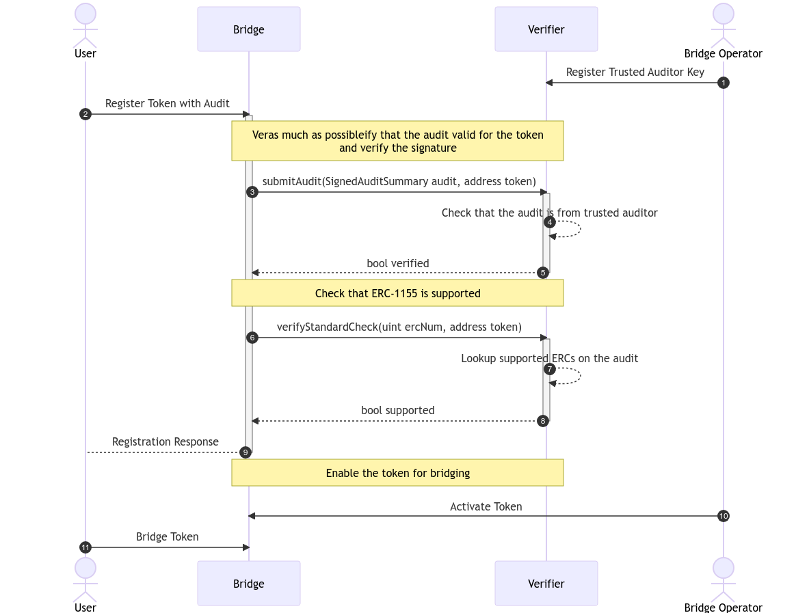

## Abstract

The proposal aims to create a standard for an onchain representation of audit reports that can be parsed by contracts to extract relevant information about the audits, such as who performed the audits and what standards have been verified.

## Motivation

Audits are an integral part of the smart contract security framework. They are commonly used to increase the security of smart contracts and ensure that they follow best practices as well as correctly implement standards such [ERC-20](./eip-20.md), [ERC-721](./eip-721.md), and similar ERCs. Many essential parts of the blockchain ecosystem are facilitated by the usage of smart contracts. Some examples of this are:

- Bridges: Most bridges consist of a bridgehead or a lockbox that secures the tokens that should be bridged. If any of these contracts are faulty it might be possible to bring the operation of the bridge to a halt or, in extreme circumstances, cause uncollateralized assets to be minted on satellite chains.
- Token Contracts: Every token in the Ethereum ecosystem is a smart contract. Apps that interact with these tokens rely on them adhering to known token standards, most commonly [ERC-20](./eip-20.md) and [ERC-721](./eip-721.md). Tokens that behave differently can cause unexpected behavior and might even lead to loss of funds.
- Smart Contract Accounts (SCAs): With [ERC-4337](./eip-4337.md) more visibility has been created for smart-contract-based accounts. They provide extreme flexibility and can cater to many different use cases whilst retaining a greater degree of control and security over each account. A concept that has been experimented with is the idea of modules that allow the extension of a smart contract account's functionality. [ERC-6900](./eip-6900.md)) is a recent standard that defines how to register and design plugins that can be registered on an account.
- Interoperability (Hooks & Callbacks): With more protocols supporting external-facing functions to interact with them and different token standards triggering callbacks on a transfer (i.e. [ERC-1155](./eip-1155.md)), it is important to make sure that these interactions are well vetted to minimize the security risks they are associated with as much as possible.

The usage and impact smart contracts will have on the day-to-day operations of decentralized applications will steadily increase. To provide tangible guarantees about security and allow better composability it is imperative that an onchain verification method exists to validate that a contract has been audited. Creating a system that can verify that an audit has been made for a specific contract will strengthen the security guarantees of the whole smart contract ecosystem.

While this information alone is no guarantee that there are no bugs or flaws in a contract, it can provide an important building block to create innovative security systems for smart contracts in an onchain way.

### Example

Imagine a hypothetical [ERC-1155](./eip-1155.md) token bridge. The goal is to create a scalable system where it is possible to easily register new tokens that can be bridged. To minimize the risk of malicious or faulty tokens being registered, audits will be used and verified onchain.



To illustrate the flow within the diagram clearly, it separates the Bridge and the Verifier roles into distinct actors. Theoretically, both can live in the same contract. 

There are four parties:

- User: The end user that wants to bridge their token
- Bridge Operator: The operator that maintains the bridge
- Bridge: The contract the user will interact with to trigger the bridge operation
- Validator: The contract that validates that a token can be bridged

As a first (1) step, the bridge operator should define the keys/accounts for the auditors from which audits are accepted for the token registration process. 

With this, the user (or token owner) can trigger the registration flow (2). There are two steps (3 and 6) that will be performed: verify that the provided audit is valid and has been signed by a trusted auditor (4), and check that the token contract implements the bridge's supported token standard ([ERC-1155](./eip-1155.md)) (7).

After the audit and token standard validations have been performed, it is still advisable to have some form of manual intervention in place by the operator to activate a token for bridging (10). <!-- This step could be omitted if there is strong trust in the auditor or if an ERC provides strong compatibility guarantees. -->

Once the token has been activated on the bridge, Users can start bridging it (11). 

## Specification

The keywords "MUST", "MUST NOT", "REQUIRED", "SHALL", "SHALL NOT", "SHOULD", "SHOULD NOT", "RECOMMENDED", "NOT RECOMMENDED", "MAY", and "OPTIONAL" in this document are to be interpreted as described in RFC 2119 and RFC 8174.

### Audit Properties

- Auditor
    - `name`: Name of the auditor (i.e. for displaying to the user)
    - `uri`: URI to retrieve more information about the auditor
    - `authors`: A list of authors that contributed to this audit. This SHOULD be the persons who audited the contracts and created the audit
- Audit
    - `auditor`: Information on the auditor
    - `auditedContract`: MUST be the `chainId` as well as `deployment` of the contract the audit is related to
    - `issuedAt`: MUST contain the information when the original audit (identified by the `auditHash`) was issued
    - `ercs`: A list of ERCs that are implemented by the target contract. The ERCs listed MUST be fully implemented. This list MAY be empty
    - `auditHash`: MUST be the hash of the original audit. This allows onchain verification of information that may belong to a specific audit
    - `auditUri`: SHOULD point to a source where the audit can be retrieved
- Contract
    - `chainId`: MUST be a `bytes32` representation of the [EIP-155](./eip-155.md) chain ID of the blockchain that the contract has been deployed in
    - `deployment`: MUST be an `address` representation of a contract's deployment address

### Auditor Verification

- Signature
    - Type
        - `SECP256K1`
            - Data is the encoded representation of `r`, `s`, and `v`
        - `BLS`
            - TBD
        - `ERC1271`
            - Data is the ABI-encoded representation of `chainId`, `address`, `blocknumber`, and the `signature bytes`
        - `SECP256R1`
            - Data is the encoded representation of `r`, `s`, and `v`
    - Data

### Data types

```solidity
struct Auditor {
    string name;
    string uri;
    string[] authors;
}

struct Contract {
    bytes32 chainId;
    address deployment;
}

struct AuditSummary {
    Auditor auditor;
    uint256 issuedAt;
    uint256[] ercs;
    Contract auditedContract;
    bytes32 auditHash;
    string auditUri;
}
```

### Signing

For signing [EIP-712](./eip-712.md) will be used. For this the main type is the `AuditSummary` and as the `EIP712Domain` the following definition applies:

```solidity
struct EIP712Domain {
    string name;
    string version;
}

EIP712Domain auditDomain = EIP712Domain("ERC-7652: Onchain Audit Representation", "1.0");
```

The generated signature can then be attached to the `AuditSummary` to generate a new `SignedAuditSummary` object:

```solidity
enum SignatureType {
    SECP256K1,
    BLS,
    ERC1271,
    SECP256R1
}

struct Signature {
    SignatureType type;
    bytes data;
}

struct SignedAuditSummary extends AuditSummary {
    uint256 signedAt;
    Signature auditorSignature;
}
```

## Rationale

The current ERC deliberately does not define the `findings` of an audit. Such a definition would require alignment on the definition of what severities are supported, what data of a finding should be stored onchain vs off-chain, and other similar finding-related attributes that are hard to strictly describe. Given the complexity of this task, we consider it to be outside the scope of this EIP. It is important to note that this ERC proposes that a signed audit summary indicates that a specific contract instance (specified by its `chainId` and `deployment`) has undergone a security audit. 

Furthermore, it indicates that this contract instance correctly implements the listed ERCs. This normally corresponds to the final audit revision for a contract which is then connected to the deployment. As specified above, this ERC MUST NOT be considered an attestation of a contract's security but rather a methodology via which data relevant to a smart contract can be extracted; evaluation of the quality, coverage, and guarantees of the data is left up to the integrators of the ERC.

### Further Considerations

- `standards` vs `ercs`
    - Limiting the scope to audits related to EVM-based smart contract accounts allows a better definition of parameters.
- `chainId` and `deployment`
    - As a contract's behavior depends on the blockchain it is deployed in, we have opted to associate a `chainId` as well as `deployment` address per contract that corresponds to an audit
- `contract` vs `contracts`
    - Many audits are related to multiple contracts that make up a protocol. To ensure simplicity in the initial version of this ERC, we chose to only reference one contract per audit summary. If multiple contracts have been audited in the same audit engagement, the same audit summary can be associated with different contract instances. An additional benefit of this is the ability to properly associate contract instances with the `ercs` they support. The main drawback of this approach is that it requires multiple signing passes by the auditors.
- Why [EIP-712](./eip-712.md)?
    - [EIP-712](./eip-712.md) was chosen as a base due to its tooling compatibility (i.e. for signing)
- How to assign a specific Signing Key to an Auditor?
    - Auditors should publicly share the public part of the signature, which can be done via their website, professional page, and any such social medium
    - As an extension to this ERC it would be possible to build a public repository, however, this falls out-of-scope of the ERC
- Polymorphic Contracts and Proxies
    - This ERC explicitly does **not** mention polymorphic contracts and proxies. These are important to be considered, however, their proper management is delegated to auditors as well as implementors of this ERC

### Future Extensions

- Potential expansion of ERC to accommodate non-EVM chains
- Better support for polymorphic/upgradeable contracts and multi-contract audits
- Management of signing keys for auditors
- Definition of findings of an audit

## Backwards Compatibility

No backward compatibility issues have been identified in relation to current ERC standards.

## Reference Implementation

TBD.

The following features will be implemented in a reference implementation:

- Script to trigger signing based on a JSON representing the audit summary
- Contract to verify signed audit summary

## Security Considerations

### Auditor Key Management

The premise of this ERC relies on proper key management by the auditors who partake in the system. If an auditor's key is compromised, they may be associated with seemingly audited or ERC-compliant contracts that ultimately could not comply with the standards. As a potential protection measure, the ERC may define an "association" of auditors (f.e. auditing companies) that would permit a secondary key to revoke existing signatures of auditors as a secondary security measure in case of an auditor's key compromise.

## Copyright

Copyright and related rights waived via [CC0](../LICENSE.md).
