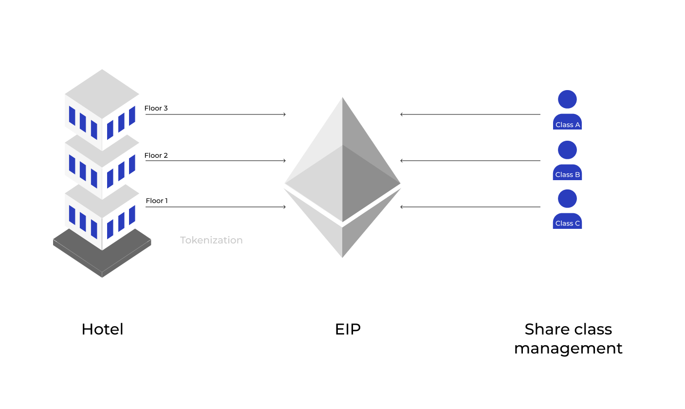

## Abstract

[ERC-7518](./eip-7518.md) is a proposed token standard that extends [ERC-1155](./eip-1155.md) and combines its functionality with other existing token standards, introducing unique features for interoperability, cross-chain operation, and token wrapping. The standard aims to provide a flexible and efficient solution for managing real-asset security tokens. At its core, [ERC-7518](./eip-7518.md) introduces the concept of partitions, where each `tokenId` represents a distinct partition. A partition can have its own set of rights and privileges, making it suitable for various use cases, including but not limited to semi-fungible asset management.

One of the significant use cases of [ERC-7518](./eip-7518.md) is semi-fungible asset management, enabling the representation of different fractional ownership units within a single token. This facilitates the fractionalization of assets, allowing investors to own smaller portions of high-value assets. However, it is essential to note that `tokenId` can represent various partitions, each serving different purposes beyond share classes.

[ERC-7518](./eip-7518.md) addresses the need for enhanced cross-chain interoperability and flexible compliance management in the rapidly evolving landscape of security tokens. By leveraging the [ERC-7518](./eip-7518.md) standard, security tokens can seamlessly interact with the [ERC-7518](./eip-7518.md) ecosystem, enabling trustless transfers and integration with decentralized finance (DeFi) platforms.

## Motivation

The [ERC-7518](./eip-7518.md) standard addresses the increasing demand for interoperability and compliance management within the security token ecosystem. Leveraging the strengths of established token standards like [ERC-3643](./eip-3643.md), and [ERC-1155](./eip-1155.md). [ERC-7518](./eip-7518.md) presents a comprehensive token framework that enables seamless interaction between security tokens and the [ERC-7518](./eip-7518.md) ecosystem. This heightened interoperability allows for trustless transfers and integration with decentralized finance (DeFi) platforms, ensuring security tokens comply effortlessly with diverse regulatory requirements across various jurisdictions.

* Cross-chain

  As the blockchain landscape evolves, cross-chain interoperability gains importance. [ERC-7518](./eip-7518.md) tackles this challenge by introducing features enabling security tokens to operate across multiple blockchain networks. This cross-chain functionality facilitates the seamless transfer and interaction of security tokens between blockchains, enhancing their versatility and accessibility in decentralized ecosystems. By transcending the limitations of a single blockchain, [ERC-7518](./eip-7518.md) opens up new possibilities for security tokens, tapping into the potential of the broader blockchain universe.
* Partition

  A unique aspect of [ERC-7518](./eip-7518.md) is its semi-fungible partition management feature. Leveraging the tokenId functionality of [ERC-1155](./eip-1155.md), [ERC-7518](./eip-7518.md) allows each tokenId to represent a unique semi-fungible partition. Token issuers can create and manage diverse partitions, each with its own set of rights and privileges. This feature benefits security tokens representing real-world assets, allowing the tokenization of complex financial instruments with multiple partitions. Enhanced partition management empowers token issuers to offer tailored investment options, catering to the unique preferences of investors in the security token ecosystem.
* Interoperability

  [ERC-7518](./eip-7518.md) introduces token wrapping functionality, enabling security tokens to be represented on other blockchain networks and integrated with DeFi platforms. This unlocks new liquidity and financial service opportunities, bridging traditional finance with decentralized finance. The integration of security tokens with DeFi platforms expands asset tokenization and financial innovation, contributing to the growth of the DeFi sector. In summary, [ERC-7518](./eip-7518.md)'s comprehensive features enhance the potential of security tokens and drive the evolution of the security token ecosystem.

## Specification

The key words “MUST”, “MUST NOT”, “REQUIRED”, “SHALL”, “SHALL NOT”, “SHOULD”, “SHOULD NOT”, “RECOMMENDED”, “MAY”, and “OPTIONAL” in this document are to be interpreted as described in RFC 2119.

### Interface for token

```solidity
pragma solidity ^0.8.0;


interface IERC7518 is IERC1155, IERC165{


event TokensLocked(address indexed account, uint indexed id, uint256 amount, uint256 releaseTime);

event TokenUnlocked(address indexed account, uint indexed id);


event TokensForceTransferred(address indexed from, address indexed to, uint indexed id, uint256 amount);

event AddressFrozen(address indexed account, bytes data);

event AddressUnfrozen(address indexed account, bytes data);

// Emitted when the transferability of tokens with a specific ID is restricted.
event TransferRestricted(uint indexed id);

// Emitted when the transferability restriction of tokens with a specific ID is removed.
event TransferRestrictionRemoved(uint indexed id);

event TokensDeposited(address indexed account, uint indexed tokenId, uint amount, bytes data);

event TokensWithdrawn(address indexed account, uint indexed tokenId, uint shares, bytes data);

/**
* @dev Retrieves the transferable balance of tokens for the specified account and ID.
* @param account The address of the account.
* @param id The token ID.
* @return The transferable balance of tokens.
*/
function transferableBalance(address account, uint id) external view returns (uint);

/**
* @dev Retrieves the locked balance of tokens for the specified account and ID.
* @param account The address of the account.
* @param id The token ID.
* @return The locked balance of tokens.
*/
function lockedBalanceOf(address account, uint256 id) external view returns (uint256);

/**
* @dev Restricts the transferability of tokens with the specified ID.
* @param id The token ID.
* @return A boolean value indicating whether the operation was successful.
*/
function restrictTransfer(uint id) external returns (bool);

/**
* @dev Removes the transferability restriction of tokens with the specified ID.
* @param id The token ID.
* @return A boolean value indicating whether the operation was successful.
*/
function removeRestriction(uint id) external returns (bool);

/**
* @notice Transfers `_value` amount of an `_id` from the `_from` address to the `_to` address specified (with safety call).
* @dev Caller must be approved to manage the tokens being transferred out of the `_from` account (see "Approval" section of the standard).

* After the above conditions are met, this function MUST check if `_to` is a smart contract (e.g. code size > 0). If so, it MUST call `onERC1155Received` on `_to` and act appropriately (see "Safe Transfer Rules" section of the standard).  
* @param _from    Source address
* @param _to      Target address
* @param _id      ID of the token type
* @param _value   Transfer amount
* @param _data    Additional data with no specified format, MUST be sent unaltered in call to `onERC1155Received` on `_to`
*/
function safeTransferFrom(address _from, address _to, uint256 _id, uint256 _value, bytes calldata _data) override external;

/**
* @dev Checks if a transfer is allowed.
* @param from The address to transfer tokens from.
* @param to The address to transfer tokens to.
* @param id The token ID.
* @param amount The amount of tokens to transfer.
* @param data Additional data related to the transfer.
* @return status A boolean value indicating whether the transfer is allowed.
*/
function canTransfer(address from, address to, uint id, uint amount, bytes calldata data) external view returns (bool status);

/**
* @dev lock token till a particular block time.
* @param account The address of the account for which tokens will be locked.
* @param id The token ID.
* @param amount The amount of tokens to be locked for the account.
* @param releaseTime The timestamp indicating when the locked tokens can be released.
* @return bool Returns true if the tokens are successfully locked, otherwise false.
*/
function lockTokens(address account, uint id, uint256 amount, uint256 releaseTime) external returns (bool);

/**
* @dev Unlocks tokens that have crossed the release time for a specific account and id.
* @param account The address of the account to unlock tokens for.
* @param id The token ID.
*/
function unlockToken(address account, uint256 id) external;

/**
* @dev Force transfer in cases like recovery of tokens.
* @param from The address to transfer tokens from.
* @param to The address to transfer tokens to.
* @param id The token ID.
* @param amount The amount of tokens to transfer.
* @param data Additional data related to the transfer.
* @return A boolean value indicating whether the operation was successful.
*/
function forceTransfer(address from, address to, uint256 id, uint256 amount, bytes memory data) external returns (bool);

/**
* @dev Freezes specified address.
* @param account The address to be frozen.
* @param data Additional data related to the freeze operation.
* @return A boolean value indicating whether the operation was successful.
*/
function freezeAddress(address account, bytes calldata data) external returns (bool);

/**
* @dev Unfreezes specified address.
* @param account The address to be unfrozen.
* @param data Additional data related to the unfreeze operation.
* @return A boolean value indicating whether the operation was successful.
*/
function unFreeze(address account, bytes memory data) external returns (bool);


/**
* @dev Sends payout to single address with corresponding amounts.
* @param to address to send the payouts to.
* @param amount amount representing the payouts to be sent.
* @return A boolean indicating whether the batch payouts were successful.
*/* 
function payout(address calldata to, uint256 calldata amount) public returns (bool);

/**
* @dev Sends batch payouts to multiple addresses with corresponding amounts.
* @param to An array of addresses to send the payouts to.
* @param amount An array of amounts representing the payouts to be sent.
* @return A boolean indicating whether the batch payouts were successful.
*/
function batchPayout(address[] calldata to, uint256[] calldata amount) public returns (bool);
```

### Methods for token

#### transferableBalance

Retrieves the transferable balance of tokens for the specified account and ID.

```js
function transferableBalance(address account,uint id) external view returns (uint)
```

* MUST calculate and return the transferable balance of tokens for the specified account and ID ie current `balanceOf(account, id) - lockedBalanceOf(account, id)`.

#### lockedBalanceOf

Retrieves the locked balance of tokens for the specified account and ID.

```js
function lockedBalanceOf(address account,uint256 id)exteranl view returns (uint256)
```

* MUST retrieve and return the locked balance of tokens for the specified `account` and `id`.

#### restrictTransfer

Restricts the transferability of tokens with the specified ID.

```js
function restrictTransfer(uint id) external returns (bool)
```

* MUST restrict the transferability of tokens with the specified `id`.

#### removeRestriction

Removes the transferability restriction of tokens with the specified ID.

```js
function removeRestriction(uint id) external returns (bool)
```

* MUST remove the transferability restriction of tokens with the specified `id`.
* MUST check if `id` is previously restricted.

#### safeTransferFrom

```js
function safeTransferFrom(address _from, address _to, uint256 _id, uint256 _value, bytes calldata _data) override external;
```

* MUST revert if `_to` is the zero address.
* MUST revert if balance of holder for token `_id` is lower than the `_value` sent.
* MUST revert on any other error.
* MUST emit the `TransferSingle` event to reflect the balance change (see "Safe Transfer Rules" section of the standard).
* MUST call `canTransfer` function to check if the transfer can proceed

#### canTransfer

Determine transferring a specified amount of a token from one address to another.

```js
function canTransfer(address from,address to,uint id,uint amount,bytes calldata data) external view returns (bool status);
```

* Accurately determine whether the transfer of tokens is allowed.
* MUST validate `to` and `from` are not frozen address.
* MUST validate `id` of the transfer should not be restricted
* MUST check if `amount` is a transferable balance.
* MAY call external contract to verify the transfer.
* SHOULD NOT modify any state or perform any side effects.

#### lockTokens

Locks a specified amount of tokens from an account for a specified duration.

```js
function lockTokens(address account,uint id,uint256 amount,uint256 releaseTime) external returns (bool);
```

* MUST enforce time-based restrictions on the transfer or use of tokens.
* MUST revert if balance of holder is less than amount.
* SHOULD use proper access control measures to ensure that only authorized entities can lock tokens.
* MUST perform input validation prevent potential vulnerabilities and unauthorized locking of tokens.
* SHOULD record release time securely and ensure that locked tokens are only released after the designated time has passed.
* SHOULD emit proper event to track and monitor locked token transactions.

#### unlockToken

Unlocks tokens that have crossed the release time for a specific account and id.

```js
function unlockToken(address account,uint256 id) external;
```

* MUST unlock the tokens for the specified `account` address and `id`.
* MUST unlock all the token which has release time > `block.time`
* SHOULD revert if no token are unlocked to save gas.

#### forceTransfer

Force transfer in cases like recovery of tokens

```js
function forceTransfer(address from,address to,uint256 id,uint256 amount,bytes memory data) external returns (bool);
```

* MUST bypasses normal transfer restrictions and authorization checks.
* MUST revert if the `from` address is not Frozen.
* MUST revert if `to` address is Frozen.
* MUST only authorized entities have the capability to call this function.
* Additional data related to the freeze operation.
* SHOULD emit proper event to track and monitor forced token transfers.

#### freeze

Freezes specified address.
The Freeze function takes in the `account address` to be frozen and additional data, and returns a `boolean` value indicating whether the operation was successful.

```js
function freezeAddress(address account,bytes data) external returns (bool);
```

* MUST prevent `account` to transfer and payout.
* SHOULD implement appropriate access control measures to ensure that only authorized addresses can be unfrozen.
* SHOULD emit proper event to track and monitor address freeze or unfreeze operations.

#### unFreeze

The Unfreeze function takes in the `account address` to be unfrozen and additional data, and returns a `boolean` value indicating whether the operation was successful.

```js
function unFreeze(address account,bytes memory data) external returns (bool);
```

* MUST consideration implications of unfreezing an address, as it grants unrestricted transfer and operation capabilities.
* MUST unfreeze the specified `account`
* SHOULD implement appropriate access control measures to ensure that only authorized addresses can be unfrozen.

#### payout

Send payouts to single address, receiver will be receiving a specific amount of tokens.

```js
function Payout(address calldata to,uint256 calldata amount) public returns (bool)
```

* MUST revert if `to` address is frozen address.
* SHOULD have sufficient balance to transfer token from issuer address.

#### batchPayout

Send payouts to multiple addresses at once, with each address receiving a specific amount of tokens. It can be used for various purposes such as distributing rewards, dividends, or interest payment.

```js
function batchPayout(address[] calldata to,uint256[] calldata amount) public returns (bool)
```

* MUST revert if `to` address is frozen address.
* SHOULD have sufficient balance to transfer token from issuer address.

### Interoperability

[ERC-7518](./eip-7518.md) facilitates interoperability with [ERC-3643](./eip-3643.md) tokens through a token wrapping method. The process involves two key components: the [ERC-3643](./eip-3643.md) token contracts representing the original and the [ERC-7518](./eip-7518.md) token contract for the wrapped version. Users seeking to wrap their tokens interact with the wrapping contract, which securely locks their original tokens and mints an equivalent amount of [ERC-7518](./eip-7518.md) tokens to their address. Conversely, unwrapping is achieved by calling the contract's withdraw function, resulting in the burning of [ERC-7518](./eip-7518.md) tokens and the release of the corresponding original tokens. Events are emitted for transparency, and robust security measures are implemented to safeguard user assets and address any potential vulnerabilities in the contract code. With this design, [ERC-7518](./eip-7518.md) ensures the seamless conversion and compatibility with [ERC-3643](./eip-3643.md) tokens, promoting greater utility and usability across the Ethereum ecosystem.

### Interface for Interoperability

```solidity
interface IERC1155Wrapper is IERC7518 {

/**
@dev Emitted when a new wrapped token address is added to the set.
@param wrappedTokenAddress The address of the wrapped token that was added.
*/
event WrappedTokenAddressSet(address wrappedTokenAddress);

/**
@dev Emitted when tokens are wrapped.
@param The ERC1155 token ID of the wrapped tokens.
@param amount The amount of tokens that were wrapped.
*/
event TokensWrapped(uint indexed id, uint256 amount);

/**
@dev Emitted when tokens are unwrapped.
@param wrappedTokenId Is the ERC1155 token ID of the wrapped tokens.
@param amount The amount of tokens that were unwrapped.
*/
event TokensUnwrapped(uint indexed wrappedTokenId, uint256 amount);

/**
* @dev Sets the wrapped token address and logic for deciding partitions.
* @param wrappedTokenAddress The address of the wrapped token contract.
* @return A boolean value indicating whether the operation was successful.
*/
function setWrappedToken(address token) external returns (bool);

/**
* @dev Wraps the specified amount of tokens by depositing the original tokens and receiving [ERC-1155](./eip-1155.md) tokens.
* @param amount The amount of tokens to wrap.
* @param data Additional data for partition.
* @return A boolean value indicating whether the operation was successful.
*/
function wrapToken(uint256 amount, bytes calldata data) external returns (bool);

/**
* @notice Wraps a specified amount of tokens from a given partition into the main balance.
* @dev This function allows users to convert tokens from a specific partition back to the main balance,making them fungible with tokens from other partitions.
* @param partitionId The unique identifier of the partition from which tokens will be wrapped.
* @param id The unique identifier of the token.
* @param amount The amount of tokens to be wrapped from the specified partition.
* @param data Additional data that may be used to handle the wrap process (optional).
* @return success A boolean indicating whether the wrapping operation was successful or not.
*/

function wrapTokenFromPartition(bytes32 partitionId, uint256 id, uint256 amount, bytes calldata data) external returns (bool);
/**
* @dev Unwraps the specified amount of wrapped tokens by depositing the [ERC-1155](./eip-1155.md) tokens and receiving the original tokens.
* @param wrappedTokenId internal [ERC-1155](./eip-1155.md) id.
* @param amount The amount of wrapped tokens to unwrap.
* @param data Additional data for partition.
* @return A boolean value indicating whether the operation was successful.
*/
function unwrapToken(uint256 wrappedTokenId, uint256 amount, bytes calldata data) external returns (bool);


function unwrapTokenForPartition(uint256 wrappedTokenId, uint256 amount, bytes calldata data) external returns (bool);
/**
* @dev Retrieves the balance of wrapped tokens for the specified account and ID.
* @param account The address of the account.
* @param id The token ID.
* @param data Additional data for partition.
* @return The balance of wrapped tokens.
*/
function wrappedBalanceOf(address account, uint256 id, bytes calldata data) external view returns (uint256);

/**
* @dev Retrieves the balance of original tokens for the specified account and ID.
* @param account The address of the account.
* @param id The token ID.
* @param data Additional data for partition.
* @return The balance of original tokens.
*/
function originalBalanceOf(address account, uint256 id, bytes calldata data) external view returns (uint256);
```

### Methods for Interoperability

#### setWrappedTokenAddress

```js
function setWrappedTokenAddress(address token) external returns (bool);
```

* `token` address could be any security token standard i.e [ERC-3643](./eip-3643.md).

#### wrapToken

```js
function wrapToken(uint256 amount, bytes calldata data) external returns (bool);
```

* MUST lock token in an on-chain vault type smart contract.
* MUST mint an equivalent amount of an [ERC-7518](./eip-7518.md) token.
* MUST verify mapping of [ERC-1155](./eip-1155.md) `id` with the corresponding [ERC-20](./eip-20.md) compatible security token.

#### wrapTokenFromPartition

```js
function wrapTokenFromPartition(bytes32 partitionId, uint256 id, uint256 amount, bytes calldata data) external returns (bool);
```

* MUST lock the token amount from source standard and mint an equivalent amount of an [ERC-7518](./eip-7518.md) token.
* SHOULD lock token in smart contract to achieve one to one mapping with the investor.
* MUST verify mapping of `id` with the corresponding partially fungible security token `partitionId`.

#### unwrapToken

```js
function unwrapToken(uint256 wrappedTokenId, uint256 amount, bytes calldata data) external returns (bool);
```

* MUST burn the [ERC-7518](./eip-7518.md) token and release the original token.
* MUST verify that the token is not subject to any [ERC-7518](./eip-7518.md) locking functionality.

### Use case diagram


Actor:

* Issuer : creates and releases tokens on a blockchain. They ensure compliance, manage token offerings, track ownership, and maintain token functionality and governance.
* Investor : individual or entity that participates in investment opportunities involving tokens on a blockchain or distributed ledger. These investors allocate capital to purchase or acquire tokens with the expectation of generating a return on their investment.
* Transfer Agent: intermediary between buyers and sellers of tokens. They help facilitate transactions by connecting investors or token holders with liquidity providers or other participants in the market and provide liquidity to the market by maintaining an inventory of tokens and offering competitive bid and ask prices.

Core Functions:

* mint: minting tokens by the issuer.
* burn: burning tokens by the issuer.
* isRestricted: condition check to determine if the token is not restricted.
* canTransfer: checking if a transfer is allowed.
* isRestricted : A condition representing the check for whether the token is not restricted.
* on-chain: performing a verification steps for token restrictions, frozen accounts, transferable balances, and token locking.
* transfer: transferring tokens by the investor.
* force transfer: forcing a transfer by the transfer agent.
* payout: performing payouts by the issuer.
* freeze account: freezing an account by the transfer agent.

### Real-World Example



* Dynamic Pricing: With [ERC-1155](./eip-1155.md) tokens representing different floors of the hotel, the token issuer can implement dynamic pricing strategies. As demand fluctuates, the prices of tokens for each floor can be adjusted accordingly. Premium amenities, floor popularity, and seasonal variations can all be factored into the pricing model. This dynamic pricing mechanism ensures that token values accurately reflect the current market conditions and the perceived value of each floor.
* Designated Payouts: Each token class (e.g., "Class A," "Class B," "Class C") can have its own designated payout structure. Token holders are entitled to receive payouts based on the revenue generated by the specific partition represented by their tokens. This means that token holders owning "Class A" tokens for Floor 1 will receive payouts corresponding to the revenue generated by Floor 1, "Class B" tokens for Floor 2 will receive payouts according to the revenue of Floor 2, and so on.
* Complex Revenue Sharing: By customizing revenue-sharing percentages for different token classes, the hotel can implement more intricate revenue-sharing models. For example, "Class A" tokens might have a higher revenue-sharing percentage due to the premium amenities and high demand on Floor 1, while "Class C" tokens for Floor 3, representing fractional ownership, might have a lower revenue-sharing percentage.
* Optimized Revenue Distribution: By strategically adjusting the payout structures for various partitions, the hotel can optimize revenue distribution among token holders. This approach ensures that investors with tokens representing more desirable floors or premium features receive a greater share of the revenue, while still providing value to holders of tokens for less popular or less lucrative partitions.
* Incentivizing Investments: Different revenue-sharing arrangements for token classes can incentivize investors to acquire tokens for specific floors. If a particular floor is expected to have higher revenue potential in the future, the corresponding tokens may attract more investments due to their attractive payout structure.
* Catering to Stakeholder Preferences: The ability to create multiple token classes, each with its own unique payout structure, allows the hotel to cater to the diverse preferences of stakeholders. Some investors might be interested in higher-risk, higher-reward investments (e.g., "Class A" tokens), while others might prefer more conservative options (e.g., "Class C" tokens).

By combining dynamic pricing, designated payouts, complex revenue sharing, optimized revenue distribution, incentivized investments, and stakeholder catering, the hotel can create a versatile and attractive investment opportunity that appeals to a broad range of investors. Moreover, the transparency and immutability of blockchain-based [ERC-1155](./eip-1155.md) tokens ensure a secure and trustless system for managing ownership, access, and revenue-sharing rights within the hotel's ecosystem.

### Transfer Flow

The transfer flow in the proposed EIP consists of two main parts off-chain and on-chain.

* Client: Represents the client or user initiating the transfer. It interacts with the backend and the [ERC-7518](./eip-7518.md) contract.
* Backend: Refers to the backend system responsible for handling requests from the client and performing off-chain verification.
* [ERC-7518](./eip-7518.md): Represents the smart contract that implements the [ERC-7518](./eip-7518.md) security standard. It receives transfer requests and interacts with the compliance contract for verification.
* Compliance: Responsible for performing verification checks. It verifies the transfer's validity based on various factors such as off-chain verification, custom rules, regulations, and signature validation.

```mermaid
 sequenceDiagram
 autonumber
 participant Client as Client
 participant Backend as Oracle
  participant CompliTo as Compliance
  participant ERC-7518 as EIP
 alt Off-chain verification

 Client->>+Backend: Post: /api/approveTransfer(from, to , id, value)

 note right of Backend: Offchain / third party kyc, regulation exemption,<br/> jurisdiction, custom rule verification,

 Backend-->>-Client: signature

 end

 Client->>ERC-7518: safeTransferFrom(from, to , id, value, signature)
 
 ERC-7518->>ERC-7518: canTransfer(from, to, id, value, signature)

 ERC-7518->>+CompliTo: verifyTransfer(from, to, id, value, signature)

 alt Off-chain

 CompliTo->>CompliTo:isSignatureValid(hash, signature)

 else without signature

 CompliTo->>CompliTo:validateOn-chainTransfer(hash, signature)

 end

 CompliTo-->>-ERC-7518: status(bool)

 ERC-7518-->>-Client: status
```

* #### Off-chain

  1. The sequence begins with the Client initiating a request to the Backend by sending a post request to the backend, upon receiving the request, the Backend performs several verification checks. These include verifying the KYC (Know Your Customer), regulation exemptions, jurisdiction requirements, and performing manual verification if necessary.
  2. Once the Backend completes the verification process, it generates a signature based on [EIP-712](./eip-712.md) method.

* #### On-chain

  1. Involves the client invoking the `safeTransferFrom` function within the [ERC-7518](./eip-7518.md) contract, supplying the necessary transfer information. Subsequently, this function triggers the `canTransfer` function, which assesses whether the transfer is permissible. The specific approach may vary, with the function either communicating with another contract or performing internal checks to make this determination.
  2. [ERC-7518](./eip-7518.md) internally call `verifyTransfer` method on the `Compliance` with or without signature. Based on the client preference the mode of verification could be off-chain(signature based) or on-chain(rule based smart contract).
  3. The [ERC-7518](./eip-7518.md) contract forwards the transfer request along with the signature to the Compliance contract for further verification. If off-chain verification is enabled, the Compliance contract validates the signature using the `isSignatureValid` function. If the signature is found to be valid, the Compliance contract sends the verification status (true) back to the [ERC-7518](./eip-7518.md) contract.
  4. If the signature is missing or invalid, the Compliance contract performs additional validation checks based on the provided hash and signature using the validateOff-chain transfer function. The details of this additional validation process are not shown in the diagram.
  5. The `Compliance` contract returns the verification status (true/false) to the [ERC-7518](./eip-7518.md) contract.
  6. Finally, the [ERC-7518](./eip-7518.md) contract relays the verification status back to the client, indicating whether the transfer is approved or rejected.

## Rationale

* Building upon Existing Token Standards:

  [ERC-7518](./eip-7518.md) extends and combines the functionalities of existing token standards like [ERC-1155](./eip-1155.md), addressing the unique requirements of security tokens, such as cross-chain interoperability, flexible compliance management, and token wrapping.
* Enhancing Interoperability and Compliance Management:

  [ERC-7518](./eip-7518.md) introduces unique features for cross-chain operations, semi-fungible share class management, and seamless interaction with the [ERC-7518](./eip-7518.md) ecosystem. It also provides a comprehensive compliance model for both on-chain and off-chain verification, ensuring adherence to various regulatory requirements and jurisdictional restrictions.

## Backwards Compatibility

1. Compatibility with  [ERC-1155](./eip-1155.md)

   [ERC-7518](./eip-7518.md) is designed to be compatible with [ERC-1155](./eip-1155.md) token standards. By leveraging the features of these widely adopted token standards, [ERC-7518](./eip-7518.md) provides a robust foundation for security token functionality.
2. Key additional features of [ERC-7518](./eip-7518.md)

In addition to the compatibility with [ERC-1155](./eip-1155.md), [ERC-7518](./eip-7518.md) introduces unique features specifically tailored for security tokens. These features include:

* Enhanced cross-chain interoperability: [ERC-7518](./eip-7518.md) enables security tokens to seamlessly interact with the [ERC-7518](./eip-7518.md) ecosystem, allowing for trustless transfers and integration with DeFi platforms across different blockchain networks.
* Semi-fungible share class management: [ERC-7518](./eip-7518.md) supports the management of semi-fungible share classes, providing flexibility in the representation of ownership and fractional shares of real-world assets.
* Token wrapping: [ERC-7518](./eip-7518.md) introduces token wrapping functionality, enabling the conversion of tokens from one standard to another, further enhancing interoperability and integration with various blockchain networks.
* Flexible compliance management: [ERC-7518](./eip-7518.md) offers a comprehensive compliance management solution, including off-chain verification, custom rules, regulations, and signature validation. This ensures that security tokens adhere to the necessary regulatory requirements while maintaining a high level of flexibility.
* Hard Asset such as Commercial Tower: [ERC-7518](./eip-7518.md) can be used to tokenize a commercial tower, allowing investors to own a fraction of the asset. Each `tokenId` can represent a unique share class, such as a percentage of the entire tower or individual floors. This enables greater liquidity and accessibility to real estate investments, as smaller investors can participate in owning a portion of a large commercial property
* Soft Asset such as Funds: [ERC-7518](./eip-7518.md) can be used to tokenize funds, especially in a Fund of Funds (FoF) business model. Each sub-fund within the FoF can be tokenized, with each `tokenId` representing a unique share class. This allows investors to directly invest in specific sectors, regions, or strategies based on their preferences. The semi-fungible share class management feature of [ERC-7518](./eip-7518.md) provides the flexibility to create and manage multiple share classes with varying rights and privileges.

By incorporating these additional features, [ERC-7518](./eip-7518.md) addresses the growing need for enhanced cross-chain interoperability and flexible compliance management in the rapidly evolving landscape of security tokens. This makes [ERC-7518](./eip-7518.md) a powerful and versatile token standard for the security token ecosystem.

## Security Considerations

1. Access Control Measures

   To ensure the security and integrity of the [ERC-7518](./eip-7518.md) token standard, it is crucial to implement proper access control measures. Access control measures should be in place to restrict unauthorized access to sensitive functions such as `lockTokens`, `forceTransfer`, `freezeAddress`, and `unFreeze`. This can be achieved by using role-based access control (RBAC) or other access control mechanisms to limit the capabilities of different entities interacting with the smart contract.
2. Input Validation

   Input validation is essential to prevent potential vulnerabilities and unauthorized actions. Functions such as `canTransfer`, `lockTokens`, and `forceTransfer` should validate input parameters to ensure they meet the required criteria. For example, checking if the `to` and `from` addresses are not frozen, ensuring the `amount` is within the transferable balance, and validating the `releaseTime` for locked tokens.
3. Secure Storage and Handling of Release Times

   When locking tokens using the `lockTokens` function, it is important to securely store and handle the release times. This can be achieved by storing the release times in a secure data structure within the smart contract and ensuring that locked tokens are only released after the designated time has passed. Proper handling of release times helps prevent unauthorized access to locked tokens and ensures the integrity of the token locking mechanism.

## Copyright

Copyright and related rights waived via [CC0](../LICENSE.md).
