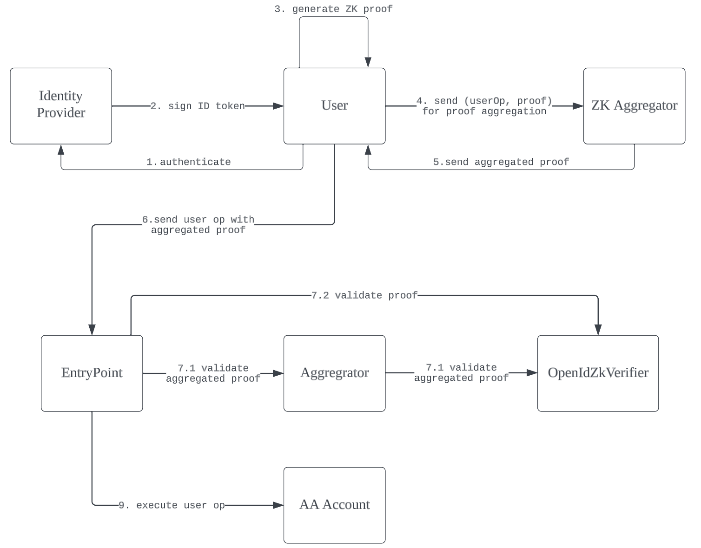

## Abstract

Account Abstraction facilitates new use cases for smart accounts, empowering users with the ability to tailor authentication and recovery mechanisms to their specific needs. To unlock the potential for more convenient verification methods such as social login, we inevitably need to connect smart accounts and OpenID Connect(OIDC), given its status as the most widely accepted authentication protocol. In this EIP, we proposed a [ERC-4337](./eip-4337.md) compatible OIDC ZK verifier. Users can link their ERC-4337 accounts with OIDC identities and authorize an OIDC verifier to validate user operations by verifying the linked OIDC identity on-chain.

## Motivation

Connecting OIDC identity and smart accounts has been a very interesting but challenging problem. Verifying an OIDC issued IdToken is simple. IdToken are usually in the form of JWT and for common JWTs, they usually consist of three parts, a header section, a claim section and a signature section. The user claimed identity shall be included in the claim section and the signature section is usually an RSA signature of a well-known public key from the issuer against the hash of the combination of the header and claim section.

The most common way of tackling the issue is by utilizing Multi-Party Computation(MPC). However, the limitation of the MPC solution is obvious. First, it relies on a third-party service to sign and aggregate the signature which introduces centralization risk such as single point of failure and vendor lock-in. Second, it leads to privacy concerns, since the separation between the users' Web2 identity to their Web3 address can not be cryptographically guaranteed.

All these problems could be solved by ZK verification. Privacy will be guaranteed as the connection between Web2 identity and the Web3 account will be hidden. The ZK proof generation process is completely decentralized since it can be done on the client side without involving any third-party service. ZK proofs aggregation has also proven to be viable and paves the way for cheaper verification cost at scale.

In this EIP, we propose a new model to apply OIDC ZK verification to ERC-4337 account validation. We also define a minimal set of functions of the verifier as well as the input of the ZK proof to unify the interface for different ZK implementations. Now one can link its ERC-4337 account with an OIDC identity and use the OpenID ZK verifier to validate user operations. Due to the high cost of ZK verification, one common use case is to use the verifier as the guardian to recover the account owner if the owner key is lost or stolen. One may set multiple OIDC identities(e.g. Google Account, Facebook Account) as guardians to minimize the centralization risk introduced by the identity provider.

## Specification

The keywords “MUST”, “MUST NOT”, “REQUIRED”, “SHALL”, “SHALL NOT”, “SHOULD”, “SHOULD NOT”, “RECOMMENDED”, “MAY”, and “OPTIONAL” in this document are to be interpreted as described in RFC 2119.

### Definitions

**Identity Provider(IDP)**: The service to authenticate users and provide signed ID token

**User**: The client to authenticate users and generate the ZK proof

**ZK Aggregrator**: The offchain service to aggregate ZK proof from multiple users

**OpenIdZkVerifier**: The on-chain contract to verify the ZK proof

The **EntryPoint**, **Aggregator** and **AA Account** are defined at ERC-4337.

### Example Flow



### Interface

```
struct OpenIdZkProofPublicInput {
    bytes32 jwtHeaderAndPayloadHash;
    bytes32 userIdHash;
    uint256 expirationTimestamp;
    bytes jwtSignature;
}

interface IOpenIdZkVerifier {
    // @notice get verification key of the open id authenticator
    function getVerificationKeyOfIdp() external view returns(bytes memory);
 
    // @notice get id hash of account
    function getIdHash(address account) external view returns(bytes32);

    // @notice the function verifies the proof and given a user op
    // @params op: the user operation defined by ERC-4337
    //         input: the zk proof input with JWT info to prove
    //         proof: the generated ZK proof for input and op
    function verify(
        UserOp memory op,
        OpenIdZkProofPublicInput input,
        bytes memory proof
    ) external;

    // @notice the function verifies the aggregated proof give a list of user ops
    // @params ops: a list of user operations defined by ERC-4337
    //         inputs: a list of zk proof input with JWT info to prove
    //         aggregatedProof: the aggregated ZK proof for inputs and ops
    function verifyAggregated(
        UserOp[] memory ops,
        OpenIdZkProofPublicInput[] memory inputs,
        bytes memory aggregatedProof
    ) external;
}
```

## Rationale

To verify identity ownership on-chain, **IOpenIdVerifier** needs at least three pieces of information:

1. the user ID to identify the user in the IDP. The **getIdHash** function returns the hash of the user id given smart account address. There may be multiple smart accounts linked to the same user ID.

2. the public key of the key pair used by identity provider to sign ID token. It is provided by the **getVerificationKeyOfIdp** function.

3. the ZK proof to verify the OIDC identity. The verification is done by the **verify** function. Besides the proof, the function takes two extra params: the user operation to execute and the public input to prove. The **verifyAggregated** is similar to the **verify** function but with a list of input and ops as parameters

The **OpenIdZkProofPublicInput** struct must contain the following fields:

| Field      | Description |
| ----------- | ----------- |
| jwtHeaderAndPayloadHash | the hash of the JWT header plus payload |
| userIdHash   | the hash of the user id, the user id should present as value of one claim |
| expirationTimestamp | the expiration time of the JWT, which could be value of "exp" claim |
| jwtSignature | the signature of the JWT |

We didn't include the verification key and the user operation hash in the struct because we assume the public key could be provided by **getVerificationKeyOfIdp** function and the user operation hash could be calculated from the raw user operation passed in.

## Security Considerations

The proof must verify the *expirationTimestamp* to prevent replay attacks. **expirationTimestamp** should be incremental and could be the **exp** field in JWT payload. The proof must verify the user operation to prevent front running attacks. The proof must verify the **userIdHash**. The verifier must verify that the sender from each user operation is linked to the user ID hash via the **getIdHash** function.

## Copyright

Copyright and related rights waived via CC0.
