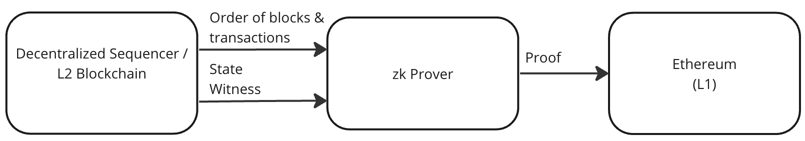

## Abstract

This EIP defines a set of EVM Profiles. Each profile describes how the Ethereum Virtual Machine (EVM) should operate when configured with the profile. The profile specifies that some EVM opcodes and precompiles should operate in the usual way, whereas other opcodes and precompiles operate differently, for example reverting. 

## Motivation

Blockchains that use deterministic finality consensus protocols can be used as decentralized sequencers in zero knowledge rollup systems, as shown in the figure below. 

The L2 blockchain acts as a decentralized sequencer, defining an ordered list of transactions, and the resulting state changes produced by executing those transactions. Finalised transactions and related state changes are consumed by zero knowledge provers. The provers generate proofs that show that executing the transactions results in the state changes. The proofs can be verified in verifier smart contracts on Ethereum.

In the system described in the previous paragraph there are three Ethereum Virtual Machines: the EVM executing in the L2 blockchain clients and the EVM processor in the zk prover, and the EVM in the L1 blockchain (Ethereum). The EVM in the L2 blockchain clients and the EVM in the zk prover must operate in precisely the same way for the proof to be able to be verified in the verifier smart contract.

Several "EVM compatible" zero knowledge proof systems are available at time of writing (October 2023). However, each prover has implemented a slightly different set of opcodes and precompiles, and has different behaviour for opcodes and precompiles that are not supported. 

The purpose of this EIP is to define a standard set of opcodes and precompiles must be supported and the behaviour for unsupported opcodes and precompiles. The goal is to allow any blockchain client configured with this profile to be connected to any prover configured with this profile to create a workable zero knowledge rollup system with a decentralised sequencer.

## Specification

The key words "MUST", "MUST NOT", "REQUIRED", "SHALL", "SHALL NOT", "SHOULD", "SHOULD NOT", "RECOMMENDED", "NOT RECOMMENDED", "MAY", and "OPTIONAL" in this document are to be interpreted as described in RFC 2119 and RFC 8174.

### Hardfork Reference Point

The baseline for the opcodes and precompiles defined in this specification is the Shanghai Hark Fork. All opcodes and precompiles not specified in the sections below MUST be fully supported.

### EVM Profile A

This profile describes a system that has minimal changes compared to Ethereum.

#### Opcodes with Changed Behaviour

##### Opcode 0x44: DIFFICULTY / PREVRANDAO

The DIFFICULTY opcode MUST return 0x00 instead of the previous RANDAO value.

#### Precompiles with Changed Behaviour

None.

### EVM Profile B

This profile describes a system that inherits the changes of EVM Profile A, plus additionally does not support some precompiles.

#### Opcodes with Changed Behaviour

##### Opcode 0x44: DIFFICULTY / PREVRANDAO

The DIFFICULTY opcode MUST return 0x00 instead of the previous RANDAO value.

##### Precompiles with Changed Behaviour

##### Address 0x02: SHA256

The SHA256 precompile MUST be treated as a revert, returning all gas to the previous context and setting the success flag to 0x00.

##### Address 0x03: RIPEMD160

the RIPEMD160 precompile must be treated as a revert, returning all gas to the previous context and setting the success flag to 0x00.

##### Address 0x05: MODEXP

The MODEXP must be treated as a revert, returning all gas to the previous context and setting the success flag to 0x00.

##### Address 0x06: ALT BN128 ADD

The ALT BN128 ADD precompile must be treated as a revert, returning all gas to the previous context and setting the success flag to 0x00.

##### Address 0x07: ALT BN128 MUL

The ALT BN128 MUL precompile must be treated as a revert, returning all gas to the previous context and setting the success flag to 0x00.

##### Address 0x08: ALT BN128 PAIRING CHECK

The ALT BN128 PAIRING CHECK precompile must be treated as a revert, returning all gas to the previous context and setting the success flag to 0x00.

##### Address 0x09: BLAKE2F

The BLAKE2F precompile must be treated as a revert, returning all gas to the previous context and setting the success flag to 0x00.

### Summary of Profiles

The tables below show a summary of opcodes and precompiles with changed behaviour.

| Opcode                         | Profile A  | Profile B |
|--------------------------------|------------|-----------|
| 0x44: DIFFICULTY / PREVRANDAO  | Returns 0  | Returns 0 |

| Precompiles                    | Profile A  | Profile B |
|--------------------------------|------------|-----------|
| 0x02: SHA256                   | No change  | Reverts   |
| 0x03: RIPEMD160                | No change  | Reverts   |
| 0x05: MODEXP                   | No change  | Reverts   |
| 0x06: ALT BN128 ADD            | No change  | Reverts   |
| 0x07: ALT BN128 MUL            | No change  | Reverts   |
| 0x08: ALT BN128 PAIRING CHECK  | No change  | Reverts   |
| 0x09: BLAKE2F                  | No change  | Reverts   |

## Rationale

TBD

## Backwards Compatibility

No backward compatibility issues found.

## Test Cases

None.

## Reference Implementation

None.

## Security Considerations

Needs discussion.

## Copyright

Copyright and related rights waived via [CC0](../LICENSE.md).
