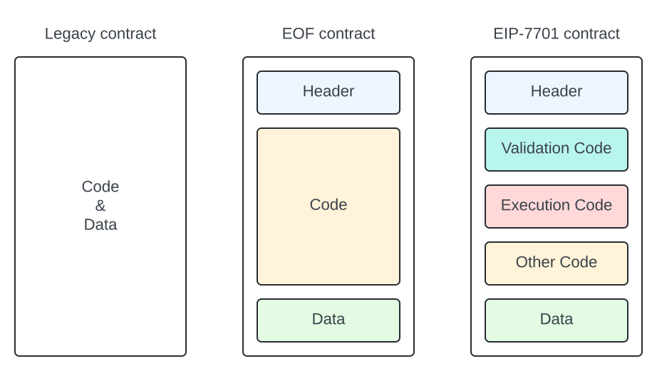
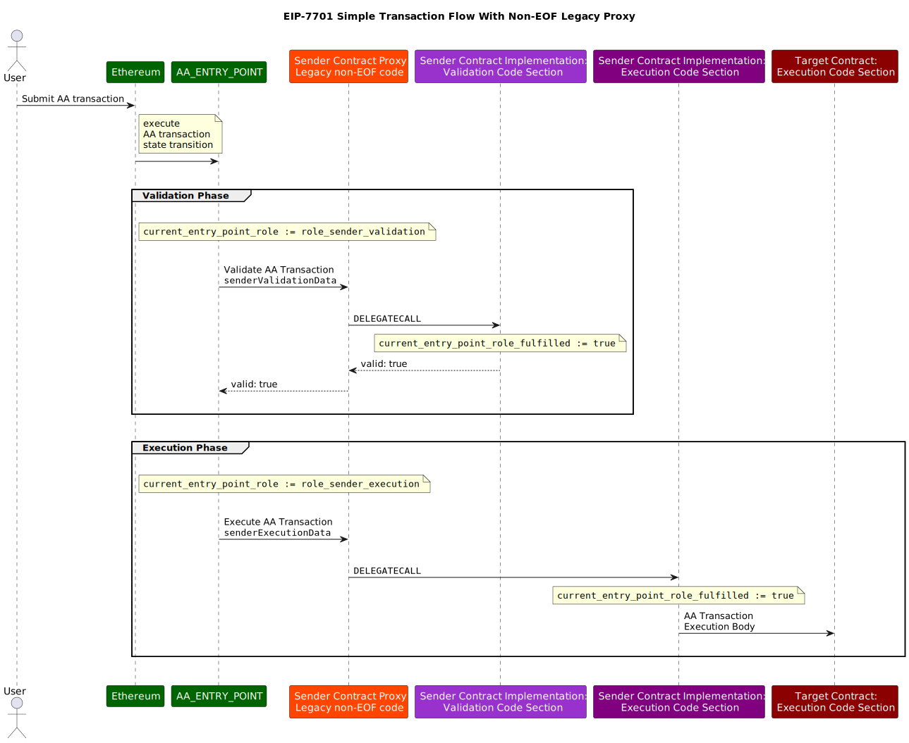

## Abstract

We propose splitting the Ethereum transaction scope into multiple steps: validations, execution, and post-operation logic. Transaction validity is determined by the result of the validation steps of a transaction.

We further separate transaction validation for the purposes of authorization and the gas fee payment, allowing one contract to pay gas for a transaction that will be executed from another contract.

## Motivation

Native Account Abstraction allows custom validation logic of a transaction and custom gas payment logic, opening new use-cases and features for wallets and dApps.


## Specification

### Constants

| Name              | Value                                      |
|-------------------|--------------------------------------------|
| AA_TX_TYPE        | TBD                                        |
| AA_ENTRY_POINT    | `address(0x7701)`                          |
| AA_BASE_GAS_COST  | 15000                                      |

### New Transaction Type

A new [EIP-2718](./eip-2718) transaction with type `AA_TX_TYPE` is introduced.
Transactions of this type are referred to as "AA transactions".

Their payload should be interpreted as:

```

AA_TX_TYPE || rlp([
  chainId,
  nonce,
  sender, senderValidationData,
  deployer, deployerData,
  paymaster, paymasterData,
  senderExecutionData,
  validAfter, validUntil,
  maxPriorityFeePerGas, maxFeePerGas,
  senderValidationGasLimit, paymasterValidationGasLimit,
  senderExecutionGasLimit, paymasterPostOpGasLimit,
  accessList,
  authorizationList
])

```

### Definitions

* **Smart Contract Account**: an Ethereum smart contract that serves as the user's account and on-chain identity.
  It is responsible for holding user's assets, verifying user requests, and executing actions on the user's behalf.
* **Sender**: the Smart Contract Account sending the current AA transaction.
* **Paymaster**: a smart contract that is requested to pay gas fees for the current AA transaction on behalf of the
  `Sender` contract.
* **Factory**: a smart contract that performs a deployment for a new `Sender` contract if necessary in the context of
  the current AA transaction.
* **Transaction Validity**:
  A property of an Ethereum transaction that describes whether this transaction can be included in a block without a
  violation of the ethereum execution and consensus rules.
  This property depends on both the inputs of the transaction and the current state of the Ethereum blockchain and can
  change over time.
* **EIP-7701 Transaction**: the entire transaction initiated by the `Sender` Smart Contract Account and represented with
  an [EIP-2718](./eip-2718) compatible Transaction Envelope object.
* **Call Frame**: The context and state for a specific function call during contract execution, including input
  parameters, local variables, and the execution environment.
* **Top-Level Call Frame**: The initial execution context of a transaction accessing the contract, the "entry point" to
  the EVM code.
* **EIP-7701 Call Frame**:
  A single atomic element of EVM code execution,
  represented by a single top-level call to a specific address with a given data.
  An EIP-7701 call frame may contain inner call frames as well, but they are not referred to as "EIP-7701 call frames".
  An EIP-7701 call frame may either succeed or revert.
* **EIP-7701 Transaction Phase**:
  A set of EIP-7701 Call Frames that form a single step in an EIP-7701 Transaction flow.
  There are two phases in an EIP-7701 Transaction: *validation* and *execution*
* **Validation phase**:
  A set of EIP-7701 Call Frames that define the current EIP-7701 Transaction's **Validity** by executing the
  **validation** EVM code.
* **Execution phase**:
  A set of EIP-7701 Call Frames that perform the actions according to the `Sender` and the `Paymaster` contracts'
  interpretation of the user input.
  These frames do not define the **Validity** of the transaction.

The base gas cost of this transaction is set to `AA_BASE_GAS_COST` instead of 21000 to reflect the lack of "intrinsic"
ECDSA signature verification.

### System-level code entry points

Modify the EOF container format, by adding the fields `kind_entry_points` and `entry_points_size` to the container header, and adding a section `entry_points_section` to the container body.

The modified EOF container:

```
container := header, body
header :=
    magic, version,
    kind_types, types_size,
    kind_entry_points, entry_points_size,
    kind_code, num_code_sections, code_size+,
    [kind_container, num_container_sections, container_size+,]
    kind_data, data_size,
    terminator
body := types_section, entry_points_section, code_section+, container_section*, data_section
types_section := (inputs, outputs, max_stack_height)+
entry_points_section := (entry_point_role, target_section_index, target_section_flags)+
```

In practice this amounts to contracts being able to differentiate their code by its purpose:



#### Container Header extension

| name              | length  | value | description                                                                                |
|-------------------|---------|-------|--------------------------------------------------------------------------------------------|
| kind_entry_points | 2 bytes | TBD   | kind marker for entry_points size section                                                  |
| entry_points_size | 2 bytes | TBD   | 16-bit unsigned big-endian integer denoting the length of the entry_points section content |

#### Container Body extension

| name                 | length   | value         | description                                                      |
|----------------------|----------|---------------|------------------------------------------------------------------|
| entry_points_section | variable | n/a           | stores entry_points section metadata                             |
| entry_point_role     | 2 bytes  | 0x0001-0x0005 | specifies the role corresponding to the EIP-7701 Call Frame      |
| target_section_index | 2 bytes  | n/a           | the index of the code section associated with the specified role |
| target_section_flags | TBD      | n/a           | placeholder for future extensibility                             |


For legacy transaction types, validation is part of the protocol, and the execution always starts at the first byte of code section 0, and `pc` is set to 0.

For `AA_TX_TYPE` transaction type, the `entry_points_section` defines alternative indexes of code sections to start the execution for EIP-7701 Call Frames.
This is reserved for execution of special roles in the `entry_point_role` range.

Note: do not confuse code EOF's execution `entry_point` with the `EntryPoint` contract defined in ERC-4337.

### Validation and PostOp code entry points

We define the following as a valid `entry_point_role` values:

```python
role_sender_execution = 0x0001
role_sender_deployment = 0x0002
role_sender_validation = 0x00003
role_paymaster_validation = 0x0004
role_paymaster_post_op = 0x0005
```

The contract that acts as a `Deployer`  in an AA transaction MUST contain the `role_sender_deployment` code section.

The contract that acts as a `Sender`  in an AA transaction MUST contain the `role_sender_validation` and `role_sender_execution` code sections.

The contract that acts as a `Paymaster`  in an AA transaction MUST contain the `role_paymaster_validation` and `role_paymaster_post_op` code sections.

Code from code sections with an assigned role can be executed during a legacy transaction execution and has no special effects.
If it is the code section `0` of a contract it can even act as an entry point during legacy transaction execution.

Only a single section per role is allowed in a contract.
This rule is validated during contract creation.

### Non-EOF Proxy Contract Support

During the execution of the `Sender`, `Paymaster` or a `Deployer` code as defined by the `AA_TX_TYPE` transaction,
the global `entry_point_role` variable is set to the corresponding role.
The `entry_point_role` remains set through an uninterrupted chain of `DELEGATECALL`/`EXTDELEGATECALL` calls.

By default, the value for `entry_point_role` is not set. Call frames initiated with any opcodes other than
`DELEGATECALL`/`EXTDELEGATECALL` run without a role.

If by the end of the execution of the `Sender`, `Paymaster` or a `Deployer` code,  `entry_point_role` is not set to the correct role, the EIP-7701 Call Frame reverts.

### Execution entry point for Sender, Paymaster and Deployer

During a regular contract code execution, its behaviour is defined as follows by EIP-3540:

```
Execution starts at the first byte of code section 0, and pc is set to 0
```

However, if a contract is referenced in an `AA_TX_TYPE` transaction as a `Sender`, `Paymaster` or a `Deployer`,
execution starts at the first byte of code section with the current `entry_point_role` variable value,
and `pc` is set to `0`.

If the specified contract does not contain such a section, or is not an EOF contract,
execution starts at code section 0, and `pc` is set to 0.

The transaction is considered invalid if it never reached a code section corresponding to the current `entry_point_role`
in any contract called through an uninterrupted chain of `DELEGATECALL`/`EXTDELEGATECALL` calls.

The transaction is considered invalid if it reached such a code section and reverted at any stage.

The `target_section_flags` parameter is added to provide signaling into the EVM so that EOF can perform some additional
validations as part of EOF code validation.
The description of specific flags and their impact on EOF validation shall be added as a separate EIP.

### New `TXPARAMLOAD`, `TXPARAMSIZE`, and `TXPARAMCOPY` opcodes

Accessing transaction details within call frames is performed using the new `TXPARAM*` opcode family.
The instructions are followed by an 8-bit immediate value, which we call `n`, and can have a value of 0 to 255.

The `TXPARAMDLOAD`, `TXPARAMSIZE`, `TXPARAMCOPY` follow the pattern of `CALLDATA*` / `RETURNDATA*` opcode
families.

1. `TXPARAMSIZE` opcode puts the byte size of the transaction parameter value defined by the input `n`.
2. `TXPARAMLOAD` opcode takes the byte offset in the specified transaction parameter from stack and puts the
   32-byte value starting from the given offset of the specified transaction parameter to stack.\
   It takes 1 stack arguments:
   * `offset`: byte offset in the transaction parameter to copy.
3. `TXPARAMCOPY` opcode copies data from the appropriate dynamically sized transaction parameter to memory.\
   It takes 3 stack arguments:
   * `destOffset`: byte offset in the memory where the result will be copied.
   * `offset`: byte offset in the transaction parameter to copy.
   * `size`: byte size to copy.

The valid values for `n` are described in the table below.
Note that some parameters are "optional" for AA transactions and these parameters have default values as stated below.

| `n`  | Return value                  | Data size | Default      |
|------|-------------------------------|-----------|--------------|
| 0x00 | current transaction type      | 32        |              |
| 0x01 | current transaction hash      | 32        |              |
| 0x02 | current role                  | 32        |              |
| 0x03 | `nonce`                       | 32        |              |
| 0x04 | `sender`                      | 32        |              |
| 0x05 | `senderValidationData`        | dynamic   |              |
| 0x06 | `deployer`                    | 0 or 32   | `address(0)` |
| 0x07 | `deployerData`                | dynamic   | empty array  |
| 0x08 | `paymaster`                   | 0 or 32   | `address(0)` |
| 0x09 | `paymasterData`               | dynamic   | empty array  |
| 0x0A | `senderExecutionData`         | dynamic   |              |
| 0x0B | `validAfter`                  | 32        | `0`          |
| 0x0C | `validUntil`                  | 32        | `2^256-1`    |
| 0x0D | `maxPriorityFeePerGas`        | 32        |              |
| 0x0E | `maxFeePerGas`                | 32        |              |
| 0x0F | `senderValidationGasLimit`    | 32        |              |
| 0x10 | `paymasterValidationGasLimit` | 32        | `0`          |
| 0x11 | `senderExecutionGasLimit`     | 32        |              |
| 0x12 | `paymasterPostOpGasLimit`     | 32        | `0`          |
| 0x13 | `accessList` hash             | 32        |              |
| 0x14 | `authorizationList` hash      | 32        |              |
| 0xA0 | `executionStatus`             | 32        |              |
| 0xA1 | `executionGasCost`            | 32        |              |

### Limitations on `TXPARAM*` opcodes

The `executionStatus` and `executionGasCost` parameters are only accessible in the `role_paymaster_post_op` section.

The rest of parameters are only accessible in the following code sections:

* `role_sender_deployment`
* `role_sender_validation`
* `role_paymaster_validation`

Accessing these values in any other code sections is considered to be an invalid opcode and reverts the execution.

### `TXPARAM*` opcodes gas prices

The new opcodes have gas prices equivalent to corresponding `CALLDATA*` opcodes:

1. `TXPARAMLOAD` - static value of `3` gas
2. `TXPARAMSIZE`- static value of `2` gas
3. `TXPARAMCOPY` - dynamic formula

    ```
    minimum_word_size = (size + 31) / 32
    static_gas = 3
    dynamic_gas = 3 * minimum_word_size + memory_expansion_cost
    ```

#### Time range validity (optional)

If the `validUntil` field is non-zero, the transaction is only valid for inclusion in a block with a timestamp at most `validUntil` value.
Similarly, the transaction is only valid for inclusion in blocks with a timestamp at most the `validAfter` value.

#### Sender Deployment (optional)

Inputs to the `deployer` contract are not defined by the protocol and are controlled by the `deployerData` parameter.

The sender deployment frame MUST result in the `sender` address becoming initialized with contract code.

This step is performed with the `role_sender_deployment` code section.

#### Sender Validation

This step is performed with the `role_sender_validation` code section.

In order for the transaction to be considered valid, the
sender validation frame MUST return without reverting.

#### Paymaster Validation (optional)

This step is performed with the `role_paymaster_validation` code section.

In order for the transaction to be considered valid, the paymaster validation frame MUST return without reverting.
If it does, the `Paymaster` contract is charged for the transaction gas costs instead of the `Sender`.

#### Sender Execution

This step is performed with the `role_sender_execution` code section.

Inputs to the `Sender` contract are not defined by the protocol and are controlled by the `senderExecutionData` parameter.

#### Paymaster post-operation frame (optional)

This step is performed with the `role_paymaster_post_op` code section.

It is intended to provide the Paymaster contract with an opportunity to finalize any calculations after the
results of the Sender Execution are known.

The `executionStatus` and `executionGasCost` values are accessible via the `TXPARAMLOAD` opcode.

The post-operation frame is considered an integral part of the transaction execution phase.
It means that if the post-operation frame reverts its execution, the Sender Execution state changes are also reverted.

### Transaction Execution Flow

All legacy transaction types only have an implicit validation phase where balance, nonce, and signature are checked,
and an implicit execution phase with a single top-level execution frame.

For all legacy transaction types, during the single top-level execution frame,
the `ORIGIN` (`0x32`, `tx.origin`) and `CALLER` (`0x33`, `msg.sender`)
are both equal to the address that is determined by the transaction's ECDSA signature (`yParity`, `r`, `s`).

When processing an EIP-7701 transaction, however, multiple execution frames will be created.
The full list of possible frames and their corresponding code sections is as follows:

1. **Validation Phase**
    * `sender` deployment frame (once per account) - `role_sender_deployment`
    * `sender` validation frame (required) - `role_sender_validation`
    * `paymaster` validation frame (optional) - `role_paymaster_validation`
2. **Execution Phase**
    * `sender` execution frame (required) - `role_sender_execution`
    * `paymaster` post-operation frame (optional) - `role_paymaster_post_op`

All execution frames in the **Validation Phase** must be completed successfully without reverting
in order for the transaction to be considered valid for a given position in a block.

In all top-level frames, the global variables have the following meaning:

| Opcode Name | Solidity Equivalent | Value                                                                                                         |
|-------------|---------------------|---------------------------------------------------------------------------------------------------------------|
| `CALLER`    | `msg.sender`        | The `AA_ENTRY_POINT` address                                                                                  |
| `ORIGIN`    | `tx.origin`         | The transaction `sender` address                                                                              |
| `CALLDATA*` | `msg.data`          | Empty for all call frames except for the sender execution frame, for which it is set to `senderExecutionData` |

### Transaction execution context

Note that some behaviours in the EVM depend on the transaction context. These behaviours include:

1. Costs of the `SSTORE (0x55)` opcode per [EIP-2200](./eip-2200)
2. Costs of accessing cold addresses and slots per [EIP-2929](./eip-2929)
3. Values available within the transient storage per [EIP-1153](./eip-1153)
4. Maximum amount of gas refund assigned after the execution per [EIP-3529](./eip-3529)

These features are not affected by the separation of the transaction into multiple frames.
Meaning, for example, that a value set with `TSTORE (0x5D)` in one frame will remain available in the next one.

### Costs of accessing cold addresses for Sender, Paymaster and Deployer

The Sender address is pre-warmed as part of the `AA_BASE_GAS_COST`.

When non-zero address, that is not equal to the Sender address, is provided for a Paymaster or a Deployer contract,
an additional EIP-2929 `COLD_ACCOUNT_READ_COST` cost of 2600 gas is charged and the address is added to `accessed_addresses`.

### Flow diagrams

#### Simple AA Transaction flow


#### Simple AA Transaction flow with legacy non-EOF proxy contracts



#### Complete AA transaction flow


### Pseudocode

#### AA transaction state transition function

```python

def state_transition_function(tx, block, state):
    max_gas = sum(tx.params[role].gaslimit for role in ROLES)
    gas_price = min(tx.maxFeePerGas, block.baseFeePerGas + tx.maxPriorityFeePerGas)
    total_max_cost = max_gas * gas_price
    if tx.paymaster is None:
        balances[tx.sender] -= total_max_cost
    else:
        balances[tx.paymaster] -= total_max_cost

    if get_code(tx.sender) is None:
        deployer_result = call_with_params(tx, role_sender_deployment)
        assert deployer_result.success

    checkpoint = state.take_snapshot()
    sender_result = call_with_params(tx, role_sender_validation)
    assert sender_result.success

    if tx.paymaster:
        paymaster_result = call_with_params(tx, role_paymaster_validation)
        assert paymaster_result.success

    call_with_params(tx, role_sender_execution)
    if tx.paymaster:
        postop_result = call_with_params(tx, role_paymaster_post_op)
        if postop_result.success is not True:
            state.revert_snapshot(checkpoint)
        balances[tx.paymaster] += gas_refund
    else:
        balances[tx.sender] += gas_refund


def call_with_params(tx, role):
    return call_section(
        AA_ENTRY_POINT, role, tx.params[role].address,
        tx.params[role].data, tx.params[role].gaslimit
    )


def call_section(from_address, target_role, target_address, call_data, gas_limit):
    section = get_code(target_address).sections[target_role]
    if section is None:
        # fall back to the main section so that we can support proxy contracts
        section = get_code(target_address).sections[0]
    result = execute_code_in_section(section, from_address, target_role, target_address, call_data, gas_limit)
    success = result.success and result.role_performed is True
    return {"success": success}


# This function is almost identical to the original EVM call frame transition function.
# In addition, it returns 'role_performed' value:
# True if the 'target_role' target EOF code section was executed for either top-level call,
# or for an inner call made with an uninterrupted 'DELEGATECALL' opcodes chain
# False otherwise
def execute_code_in_section(args):
    pass


# get the current contract code at the given address
def get_code(target_address):
    pass


# pre-charge the entire maximum gas cost of the transaction
def buy_gas(tx, block):
    max_gas = tx.senderValidationGasLimit + tx.paymasterValidationGasLimit + tx.senderExecutionGasLimit + tx.paymasterPostOpGasLimit
    gas_price = min(tx.maxFeePerGas, block.baseFeePerGas + tx.maxPriorityFeePerGas)
    total_max_cost = max_gas * gas_price
    if tx.paymaster is None:
        balances[tx.paymaster] -= total_max_cost
    else:
        balances[tx.sender] -= total_max_cost


```

#### Block transition function

```python
def block_transition_function(block):
    for index, tx in enumerate(block.txs):
        if is_type_aa(tx):
            try:
                if (tx.validUntil != 0 and tx.validUntil <= block.timestamp) or tx.validAfter >= block.timestamp:
                    raise Exception("time range violation")
                state_transition_function(tx, block)
            except Exception:
                # validation failed and this transaction could not have been included in the current block
                raise Exception("invalid AA Transaction in block")
        else:
            legacy_state_transition_function(tx)
```

## Rationale

### Introduction of the `TXPARAM*` opcode family

The validation section of a Smart Contract Account code needs to have full access to the majority of transaction
details in order to be able to make an informed decision about either accepting or rejecting the transaction.

A small subset of this data is available with the existing opcodes, like `CALLER (0x33)` or `GASPRICE  (0x3A)`.
However, creating an opcode for every transaction parameter is not feasible or desirable.

The `TXPARAM*` opcode family provides the Account Abstraction contracts with access to this data.

These values are not made accessible to the transactions' execution or to legacy transaction types.
This limitation prevents the `TXPARAM*` opcode family from becoming a new source of a globally observable state,
which could create backwards compatibility issues in the future.

### Non-EOF Proxy Contract Support

We want to support legacy proxy contracts upgrading to add EIP-7701 support.

Since legacy proxies don't have the aforementioned code validation and execution code sections, a different mechanism had to be added to enable their support.

## Backwards Compatibility

An EOF contract with `kind_entry_points` section is not valid according to EIP-3540 and cannot exist on-chain
before this proposal is implemented.

The introduction of `kind_entry_points` will break an assumption that a contract code can only have a single
execution starting point, which might confuse some developer tooling that relies on this assumption.

## Security Considerations

As the `kind_entry_points` code sections represent a generic way to authorize any action on behalf of the contract,
correct and secure implementation of this code is critical.
We expect that compilers targeting EVM will play a major role in enabling and ensuring Smart Contract Accounts' security.

For smart contract security auditors and security-oriented developer tools it is crucial to ensure that contracts not
meant to have roles in AA transactions do not have unexpected code section defined in their `entry_points_section`.
Otherwise, these contracts may present an immediate security threat.

Block explorers should tag contracts as "user accounts" or "paymasters" if they have these sections.

## Copyright

Copyright and related rights waived via [CC0](../LICENSE.md).

