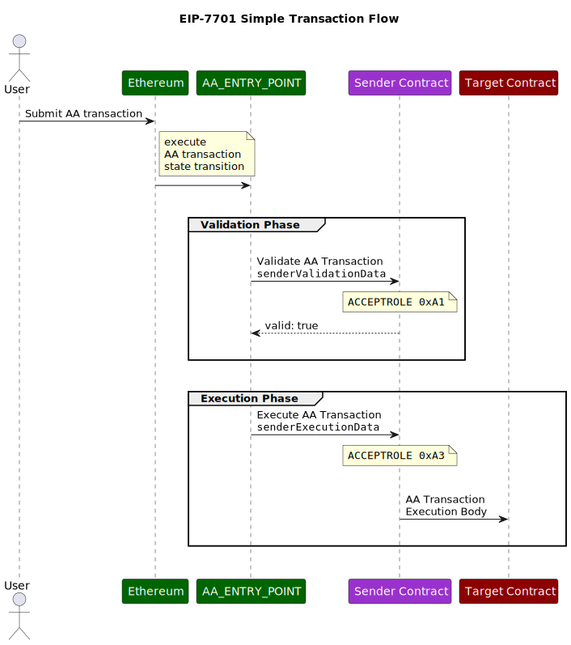

## Abstract

This proposal describes a slight variation of the Native Account Abstraction design fully described in RIP-7560.
This version's difference compared to the original proposal is in relying on features of "EVM Object Format" to
distinguish between validation and execution code sections.

## Motivation

Talking about Full Native Account Abstraction, the fundamental idea any solution has to address is a
mechanism for a Smart Contract Account to separate its validation and execution code sections.

RIP-7560 is build on the current Ethereum contract structure, and therefore has little choice but to rely
on using some higher-level abstraction.

In its current form, RIP-7560 transactions use Solidity method selectors in order to achieve this separation.

This, however, is far from ideal as this approach "leaks" the concept from a programming language widely used
in the EVM into the core design of the Ethereum protocol.

While there is no purely technical reason to disallow it and there are already instances of Solidity code
being "enshrined" in the Ethereum protocol, e.g. the validator deposit contract, such violation of abstraction levels
often lead to unnecessary technical debt and are worth avoiding if possible.

Additionally, method selectors provide very weak indication of the contract developer's decision to become a
participant in Native Account Abstraction transaction flow.
The chance of accidentally exposing a function with a colliding 4 byte
method identifier is pretty low, but a malicious developer
can easily hide such a function giving it an innocent name, making it hard to spot a Native Account Abstraction entity.

This issue to some extent is also present in [ERC-4337](./eip-4337.md).

As an alternative, Native Account Abstraction can be implemented in coordination with [EIP-3540](./eip-3540).
Relying on the concept of "code sections" introduced with EIP-3540 appears to be a superior approach.

## Specification

### Constants

| Name              | Value                                      |
|-------------------|--------------------------------------------|
| AA_TX_TYPE        | TBD                                        |
| AA_ENTRY_POINT    | `address(0x7701)`                          |
| AA_SENDER_CREATOR | `address(ffff7701)`                        |
| AA_BASE_GAS_COST  | 15000                                      |
| AA_ORIGIN         | 0x7701000000000000000000000000000000007701 |

### New Transaction Type

A new [EIP-2718](./eip-2718) transaction with type `AA_TX_TYPE` is introduced.
Transactions of this type are referred to as "AA transactions".

Their payload should be interpreted as:

```

AA_TX_TYPE || rlp([
  chainId,
  nonce, 
  sender, senderValidationData,
  deployer, deployerData,
  paymaster, paymasterData,
  senderExecutionData,
  builderFee,
  maxPriorityFeePerGas, maxFeePerGas,
  senderValidationGasLimit, paymasterValidationGasLimit,
  senderExecutionGasLimit, paymasterPostOpGasLimit,
  accessList,
  authorizationList
])

```

### Definitions

* **Smart Contract Account**: an Ethereum smart contract that serves as the user's account and on-chain identity.
  It is responsible for holding user's assets, verifying user requests, and executing actions on the user's behalf.
* **Sender**: the Smart Contract Account sending the current AA transaction.
* **Paymaster**: a smart contract that is requested to pay gas fees for the current AA transaction on behalf of the
  `Sender` contract.
* **Factory**: a smart contract that performs a deployment for a new `Sender` contract if necessary in the context of
  the current AA transaction.
* **Transaction Validity**:
  A property of an Ethereum transaction that describes whether this transaction can be included in a block without a
  violation of the ethereum execution and consensus rules.
  This property depends on both the inputs of the transaction and the current state of the Ethereum blockchain and can
  change over time.
* **EIP-7701 Transaction**: the entire transaction initiated by the `Sender` Smart Contract Account and represented with
  an [EIP-2718](./eip-2718) compatible Transaction Envelope object.
* **Call Frame**: The context and state for a specific function call during contract execution, including input
  parameters, local variables, and the execution environment.
* **Top-Level Call Frame**: The initial execution context of a transaction accessing the contract, the "entry point" to
  the EVM code.
* **EIP-7701 Call Frame**:
  A single atomic element of EVM code execution,
  represented by a single top-level call to a specific address with a given data.
  An EIP-7701 call frame may contain inner call frames as well, but they are not referred to as "EIP-7701 call frames".
  An EIP-7701 call frame may either succeed or revert.
* **EIP-7701 Transaction Phase**:
  A set of EIP-7701 Call Frames that form a single step in an EIP-7701 Transaction flow.
  There are two phases in an EIP-7701 Transaction: *validation* and *execution*
* **Validation phase**:
  A set of EIP-7701 Call Frames that define the current EIP-7701 Transaction's **Validity** by executing the *
  *validation** EVM code.
* **Execution phase**:
  A set of EIP-7701 Call Frames that perform the actions according to the `Sender` and the `Paymaster` contracts'
  interpretation of the user input.
  These frames do not define the **Validity** of the transaction.

The base gas cost of this transaction is set to `AA_BASE_GAS_COST` instead of 21000 to reflect the lack of "intrinsic"
ECDSA signature verification.

### System-level code entry points

Modify the EOF container format to consist of the following sections:

```
container := header, body
header :=
    magic, version,
    kind_types, types_size,
    kind_entry_points, entry_points_size,
    kind_code, num_code_sections, code_size+,
    [kind_container, num_container_sections, container_size+,]
    kind_data, data_size,
    terminator
body := types_section, entry_points_section, code_section+, container_section*, data_section
types_section := (inputs, outputs, max_stack_height)+
entry_points_section := (entry_point_role, target_section_index, target_section_flags)+
```

For regular calls to the contract, the execution always starts at the first byte of code section 0, and `pc` is set to

0.

Here the `entry_points_section` defines alternative indexes of code sections to start the execution for system calls.
This is reserved for execution of special roles in the `entry_point_role` range.

Note: do not confuse code execution `entry_point` with the `EntryPoint` contract defined in ERC-4337.

### Validation and PostTransaction code entry points

The contract that has a role in an Account Abstraction transaction, either as a `Sender`, a `Paymaster` or a `Deployer`,
has to contain all necessary sections marked with one of the following `entry_point_role` markers:

```python
role_none = 0x0000
role_sender_execution = 0x0001
role_sender_deployment = 0x0002
role_sender_validation = 0x00003
role_paymaster_validation = 0x0004
role_paymaster_post_tx = 0x0005
```

This section is equivalent to a code section.

Its code can be executed during a regular transaction execution and has no special effects.
If it is the first code section of a contract, it can act as an entry point during regular transaction execution.

Only a single section per role is allowed in a contract.
This rule is validated during contract creation.

### Context variable for the `entry_point_role` value

During the execution of the `Sender`, `Paymaster` or a `Deployer` code as defined by the `AA_TX_TYPE` transaction,
the global `entry_point_role` variable is set to the corresponding role.
The `entry_point_role` remains set through an uninterrupted chain of `DELEGATECALL`/`EXTDELEGATECALL` calls.

The default value for `entry_point_role` is `role_none`. Call frames initiated with any opcodes other than
`DELEGATECALL`/`EXTDELEGATECALL` run with the default role.

Frames that originate as part of the EIP-7701 transaction have their `ORIGIN` and `SENDER` opcodes
return the `AA_ORIGIN` address.

### Execution entry point for Account Abstraction transaction type participant entity (Sender, Paymaster and Deployer)

During a regular contract code execution, its behaviour is defined as follows by EIP-3540:

```
Execution starts at the first byte of code section 0, and pc is set to 0
```

However, if a contract is referenced in an `AA_TX_TYPE` transaction as a `Sender`, `Paymaster` or a `Deployer`,
execution starts at the first byte of code section with the current `entry_point_role` variable value,
and `pc` is set to `0`.

If the specified contract does not contain such a section, or is not an EOF contract,
execution starts at code section 0, and `pc` is set to 0.

The transaction is considered invalid if it never reached a code section corresponding to the current `entry_point_role`
in any contract called through an uninterrupted chain of `DELEGATECALL`/`EXTDELEGATECALL` calls.

The transaction is considered invalid if it reached such a code section and reverted at any stage.

The `target_section_flags` parameter is added to provide signaling into the EVM so that EOF can perform some additional
validations as part of EOF code validation.
The description of specific flags and their impact on EOF validation shall be added as a separate EIP.

### New opcodes: `TXPARAMDATALOAD`, `TXPARAMDATASIZE`, `TXPARAMDATACOPY` and `TXPARAM`

Accessing transaction details within call frames is performed using the new `TXPARAM*` opcode family.
The instructions are followed by an 8-bit immediate value, which we call `n`, and can have a value of 0 to 255.

The `TXPARAM` opcode pushes onto the stack the transaction parameter value defined by the input `n`.

The `TXPARAMDATALOAD`, `TXPARAMDATASIZE`, `TXPARAMDATACOPY` follow the pattern of `CALLDATA*` / `RETURNDATA*` opcode
families.

1. `TXPARAMDATASIZE` opcode puts the byte size of the specified transaction parameter.
   2.`TXPARAMDATALOAD` opcode takes the byte offset in the specified transaction parameter from stack and puts the
   32-byte value starting from the given offset of the specified transaction parameter to stack.
   3.`TXPARAMDATACOPY` opcode copies data from the appropriate dynamically sized transaction parameter to memory.
   It takes 3 stack arguments:

* `destOffset`: byte offset in the memory where the result will be copied.
* `offset`: byte offset in the transaction parameter to copy.
* `size`: byte size to copy.

The valid values for `n` are described in the table below.

| `n` | Return value                  |
|-----|-------------------------------|
| 0   | `sender`                      |
| 1   | `senderValidationData`        |
| 2   | `deployer`                    |
| 3   | `deployerData`                |
| 4   | `paymaster`                   |
| 5   | `paymasterData`               |
| 6   | `senderExecutionData`         |
| 7   | `builderFee`                  |
| 8   | `maxPriorityFeePerGas`        |
| 9   | `maxFeePerGas`                |
| 10  | `senderValidationGasLimit`    |
| 11  | `paymasterValidationGasLimit` |
| 12  | `senderExecutionGasLimit`     |
| 13  | `paymasterPostOpGasLimit`     |
| 14  | `accessList` hash             |
| 15  | `authorizationList` hash      |

[//]: # (to be continued...)

#### Sender Deployment

Inputs to the `deployer` contract are not defined by the protocol and are controlled by the `deployerData` parameter.

The sender deployment frame MUST result in the `sender` address becoming initialized with contract code.

This step is performed with the `role_sender_validation` code section.

#### Sender Validation

This step is performed with the `role_sender_deployment` code section.

In order for the transaction to be considered valid the
sender validation frame MUST return two 64-bit values:

```
abi.encode(bool success, uint64 validUntil, uint64 validAfter)
```

#### Paymaster Validation

Inputs to the `Paymaster` validation section are same as the ones in the [Sender Validation](#sender-validation) step.

This step is performed with the `role_paymaster_validation` code section.

In order for the transaction to be considered valid the
paymaster validation frame MUST return the following values:

```
abi.encode(bool success, uint64 validUntil, uint64 validAfter, bytes context)
```

#### Sender Execution

This step is performed with the `role_sender_execution` code section.

Inputs to the `Sender` contract are not defined by the protocol and are controlled by the `callData` parameter.

#### Paymaster post-transaction frame

Inputs to the `Paymaster` post-transaction are defined by the protocol as an ABI encoding of the following data:

```
abi.encode(uint256 actualGasCost, bool success, bytes context)
```

This step is performed with the `role_paymaster_post_tx` code section.

### Transaction Execution Flow

All existing transaction types only have an implicit validation phase where balance, nonce, and signature are checked,
and an implicit execution phase with a single top-level execution frame.

For all existing transaction types, during the single top-level execution frame,
the `ORIGIN` (`0x32`, `tx.origin`) and `CALLER` (`0x33`, `msg.sender`)
are both equal the address that is determined by the transaction's ECDSA signature (`yParity`, `r`, `s`).

When processing an EIP-7701 transaction, however, multiple execution frames will be created.
The full list of possible frames and their corresponding code sections is as follows:

1. **Validation Phase**
    * `sender` deployment frame (once per account) - `role_sender_deployment`
    * `sender` validation frame (required) - `role_sender_validation`
    * `paymaster` validation frame (optional) - `role_paymaster_validation`
2. Execution Phase
    * `sender` execution frame (required) - `role_sender_execution`
    * `paymaster` post-transaction frame (optional) - `role_paymaster_post_tx`

All execution frames in the **Validation Phase** must be completed successfully without reverting,
and both `sender` and `paymaster` validation frames must include a call to a corresponding `AA_ENTRY_POINT`
approval callback functions in order for the transaction to be considered valid for a given position in a block.

In all top-level frames, the global variables have the following meaning:

| Opcode Name | Solidity Equivalent | Value                                                                         |
|-------------|---------------------|-------------------------------------------------------------------------------|
| `CALLER`    | `msg.sender`        | The `AA_ENTRY_POINT` address. `AA_SENDER_CREATOR` for the "deployment frame". |
| `ORIGIN`    | `tx.origin`         | The transaction `sender` address                                              |
| `CALLDATA*` | `msg.data`          | The transaction data is set to inputs of the corresponding frame              |

### Transaction execution context

Note that some behaviours in the EVM depend on the transaction context. These behaviours are:

1. Costs of the `SSTORE (0x55)` opcode per [EIP-2200](./eip-2200)
2. Costs of accessing cold addresses and slots per [EIP-2929](./eip-2929)
3. Values available within the transient storage per [EIP-1163](./eip-1163)
4. Maximum amount of gas refund assigned after the execution per [EIP-3529](./eip-3529)

These features are not affected by the separation of the transaction into multiple frames.
Meaning, for example, that a value set with `TSTORE (0x5D)` in one frame will remain available in the next one.

### Flow diagrams

#### Simple AA Transaction flow



#### Complete AA transaction flow


### Pseudocode

#### AA transaction state transition function

```python

def state_transition_function(tx):
    buy_gas(tx)
    deployer_result = deployer_frame(tx)
    paymaster_result = paymaster_validation_frame(tx)
    sender_result = sender_validation_frame(tx)
    if (
            deployer_result.success is False or
            paymaster_result.success is False or
            sender_result.success is False
    ):
        raise Exception("validation failed")
    sender_execution_frame(tx)
    paymaster_postop_frame(tx)
    refund_gas(tx)


def deployer_frame(tx):
    if tx.deployer is None:
        return {"success": True}
    if get_code(tx.sender) is not None:
        raise Exception("sender already has code")
    result = call_section(
        AA_ENTRY_POINT, role_sender_deployment,
        # deployment gas counts towards sender's limit
        tx.deployer, tx.deployerData, tx.senderValidationGasLimit)
    if get_code(tx.sender) is None:
        raise Exception("deployer did not deploy sender code")
    return result


def paymaster_validation_frame(tx):
    if tx.paymaster is None:
        return {"success": True}
    result = call_section(
        AA_ENTRY_POINT, role_paymaster_validation,
        tx.paymaster, tx.paymasterData, tx.paymasterValidationGasLimit)
    return result


def sender_validation_frame(tx):
    result = call_section(
        AA_ENTRY_POINT, role_sender_validation,
        tx.sender, tx.senderValidationData, tx.senderValidationGasLimit)
    return result


def sender_execution_frame(tx):
    result = call_section(
        AA_ENTRY_POINT, role_sender_execution,
        tx.sender, tx.senderExecutionData, tx.senderExecutionGasLimit)
    return result


def paymaster_postop_frame(tx):
    if tx.paymaster is None:
        return {"success": True}
    result = call_section(
        AA_ENTRY_POINT, role_paymaster_post_tx,
        tx.sender, [], tx.paymasterPostOpGasLimit)
    return result


def call_section(from_address, target_role, target_address, call_data, gas_limit):
    section = get_code(target_address).sections[target_role]
    if section is None:
        # fall back to the main section so that we can support proxy contracts
        section = get_code(target_address).sections[0]
    result = execute_code_in_section(section, from_address, target_role, target_address, call_data, gas_limit)
    success = result.reverted is False and result.role_performed is True
    return {"success": success}


# This function is almost identical to the original EVM call frame transition function.
# In addition, it returns 'role_performed' value:
# True if the 'target_role' target EOF code section was executed for either top-level call,
# or for an inner call made with an uninterrupted 'DELEGATECALL' opcodes chain
# False otherwise
def execute_code_in_section(args):
    pass


# get the current contract code at the given address
def get_code(target_address):
    pass


# pre-charge the entire maximum gas cost of the transaction
def buy_gas(tx):
    pass


# refund the unused gas value of the transaction to the payer (sender or paymaster)
def refund_gas(tx):
    pass

```

#### Block transition function

```python
def block_transition_function(block):
    for index, tx in enumerate(block.txs):
        if is_type_aa(tx):
            try:
                state_transition_function(tx)
            except Exception:
                # validation failed and this transaction cannot be included in the current block
                del block.txs[index]
                continue
```

## Rationale

### ABI encoding for system frames' input and output data

Using an ABI encoding format for data provided by the protocol itself does represent an abstraction levels violation,
however it is a relatively safe one and any alternative solution would require some trade-offs.

The validation section of a Smart Contract Account code needs to have full access to the majority of transaction
details in order to be able to make an informed decision about either accepting or rejecting the transaction.

A small subset of this data is available with the existing opcodes, however creating an opcode for every transaction
parameter is not feasible.

Allowing wallets to specify their own encoding for this data is also not feasible as Smart Contract Accounts must
avoid any ambiguity about the meaning of the received data.

The main benefit of using the ABI encoding lies in its currently ubiquitous use in smart contracts.
There exist multiple high-quality production-tested libraries implementing ABI encoding and decoding in
multiple programming languages.

## Backwards Compatibility

An EOF contract with `kind_entry_points` section is not valid according to EIP-3540 and cannot exist on-chain
before this proposal is implemented.

The introduction of `kind_entry_points` will break an assumption that a contract code can only have a single
execution starting point, which might confuse some developer tooling that relies on this assumption.

## Security Considerations

A contract with a `kind_entry_points` section explicitly indicates its role as a Native Account Abstraction entity.
This is a significant improvement over ERC-4337 and RIP-7560 where entities are not explicitly marked.

As the `kind_entry_points` code sections represent a generic way to authorize any action on behalf of the contract,
correct and secure implementation of this code is critical.
We expect compilers targeting EVM will play a major role in enabling and ensuring Smart Contract Accounts' security.

## Copyright

Copyright and related rights waived via [CC0](../LICENSE.md).
