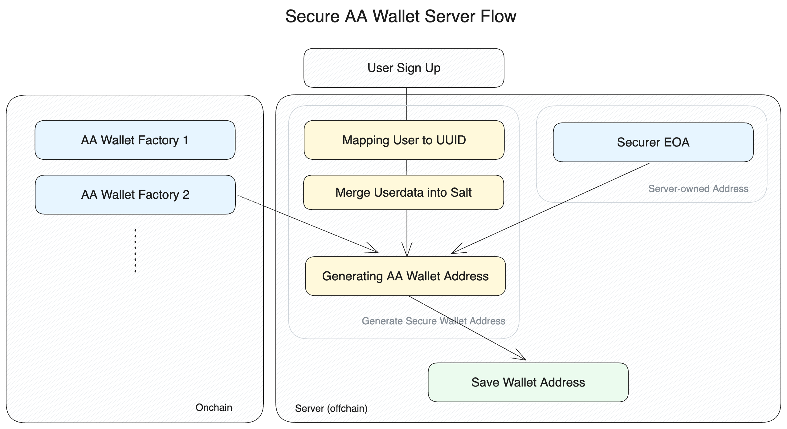

## Abstract

Propose a non-custodial interface for service providers to provide AA accounts.

## Motivation

- Problem
    - The `createAccount` function necessitates an `owner` address to establish an account, consequently preventing service providers from creating accounts on behalf of their users without knowledge of the users’ EOA addresses. To resolve this limitation, service providers employ temporary EOAs to deterministically generate an [ERC-4337](./eip-4337.md) account for their users, assigning the temporary EOA as the initial owner. This approach, however, introduces a security vulnerability, as the temporary EOAs’ private keys are managed by the service providers. Furthermore, the service providers assume responsibility for these private keys until such a time when users take the ownership.
- Solution
    - Set a separate contract as the owner when calling `createAccount`, and allow the user to claim ownership at a later date via a signature provided by the service provider.

AA implementations widely use `CREATE2` opcode when creating an AA wallet. One of the benefits of this approach is that it allows the service provider to predetermine the address of an AA wallet without actually deploying it on-chain. This means that the service provider can assign a user an AA wallet address and perform on-chain actions with value (e.g. add to airdrop address, add to whitelist, etc) based on that address, even though the user has not yet provided a Web3 authentication method (i.e. EOA).

This approach has its limitations, however. To prevent the predetermined address from being claimed by an external party, most AA wallet factory contracts include the `owner` address when calculating the predetermined address and make sure that the owner of the AA wallet becomes the given `owner` address. In order to satisfy this constraint, service providers opt to creating a new and random private key on their server and sending it later when the user requests it.

This design is flawed in multiple ways:

- Service provider becomes the custodian until the user requests their owner private key, which is heavy duty both logistically and legally.
- Sending private key/mnemonic over networks is not safe

**Our proposal:**

This EIP proposes a safer solution by proposing a new concept of a `Securer`.

When calculating the predetermined address, the service provider sets the `owner` variable of the AA wallet to the address of a new `Factory` contract so that it does not need to create a separate EOA. When deploying the AA wallet, a user will request a `Securer` signature from the service provider and send it to the new `Factory` contract, along with a new EOA address.

## Specification

The key words “MUST”, “MUST NOT”, “REQUIRED”, “SHALL”, “SHALL NOT”, “SHOULD”, “SHOULD NOT”, “RECOMMENDED”, “NOT RECOMMENDED”, “MAY”, and “OPTIONAL” in this document are to be interpreted as described in RFC 2119 and RFC 8174.

### Terms

- A **smart contract account (or SCA)** is a smart contract that can be used to send transactions and hold digital assets. It implements the `IAccount` interface from ERC-4337
- A **securer** is an EOA or SCA that secures a contract address (before it is deployed) by setting its owner to a factory contract, which contains logic that prevents it from being deployed unless you provide it with a valid signature from the securer.
- A **deterministic account** is an SCA with slight modifications: it needs to the `securer`’s signature to be deployed, and its address is calculated not only by the `salt` provided to the SCA, but also its `securer`  address.
- A **deterministic account factory** is a smart contract that can create a deterministic account.
- A **deterministic account signer** is an SCA that can act as a `securer` for a deterministic account. Compared to an EOA, it is more secure because it allows setting multiple signers (safe against losing a single EOA) with set expiration timestamps (allowing key rotation).
- A **deterministic account signer factory** is a smart contract that can create a deterministic account signer.
- A **hierarchical deterministic wallet (or HD Wallet)** is a standard for creating deterministic wallets that was first introduce in BIP-32 and is now currently widely used in the form of its particular application, BIP-44.

### Overview

A service provider handles mainly two operations: generating the deterministic account address when a user signs up and providing a valid signature when a user requests to create the deterministic account. This standard specifies how a service provider should handle these operations.

The diagram below shows the flow of the service provider when a user signs up. The service provider should first map the user to a UUID and create a `securer` EOA/SCA. Then, it should merge them with auxiliary data to create a salt and use the salt to compute the address of a deterministic account.

Once the address has been set and secured, the service provider should save it off-chain.



The diagram below depicts the next operation where the service provider should provide a valid signature to the user. Once the user provides a new EOA to be the owner of its deterministic account, the service provider should generate the calldata that must be included when creating the deterministic account. It should then provide the calldata to the user along with a valid signature from the `securer`, which the user can use to successfully create a secured deterministic account.


The `salt` data should have the following structure, inspired by the hierarchical deterministic wallet structure currently widely adopted in the ecosystem (BIP-44).

`d / purpose / deterministic_account_factory / securer_address / user_identifier / user_index`

- `d`: shorthand for “deterministic”
- `purpose`: number of the EIP that specifies the tree-level structure of the salt
- `deterministic_account_factory`: the address of the factory that is used to deploy the deterministic account
- `securer_address`: the address of the securer securing the deterministic account
- `user_identifier`: the unique identifier for the user set by the service provider
- `user_index`: the index value of the user set by the service provider

### Interfaces

Deterministic AA wallet Factory MUST implement

- `IDeterministicAccountFactory.sol` to support deterministic essential functionality.

Deterministic AA wallet Factory MAY utilize a contract securer(signer) implements IDeterministicAccountSigner interface.

- `IDeterministicAccountSigner.sol` to support multisig-like contract securer(signer) with authority expirations.

#### `IDeterministicAccountFactory.sol`

Deterministic account factory interface. Deterministic wallet factory **MUST** implement this interface to support creating secured AA wallet.

```

interface IDeterministicAccountFactory {
    /**
     * @notice Creates a new account directly. Owner secure wallet itself.
     * @param factory The factory address to use for creating the account.
     * @param salt A unique salt to ensure address determinism.
     * @param transferOwnershipCode Calldata to transfer ownership.
     * @return The address of the newly created account.
     */
    function createAccount(
        address factory,
        uint256 salt,
        bytes calldata transferOwnershipCode
    ) external payable returns (address);

    /**
     * @notice Creates a new secured account.
     * @param factory The factory address to use for creating the account.
     * @param salt A unique salt to ensure address determinism.
     * @param securedBy The address securing the account.
     * @param signature ECDSA signature by securer.
     * @param transferOwnershipCode Calldata to transfer ownership.
     * @return The address of the newly created account.
     */
    function createSecuredAccount(
        address factory,
        uint256 salt,
        address securedBy,
        bytes calldata signature,
        bytes calldata transferOwnershipCode
    ) external payable returns (address);

    /**
     * @notice Computes the deterministic address for an account given the parameters.
     * @param factory The factory address used for account creation.
     * @param securedBy The address securing the account.
     * @param salt A unique salt to ensure address determinism.
     * @return The computed deterministic address.
     */
    function getDeterministicAddress(
        address factory,
        address securedBy,
        uint256 salt
    ) external view returns (address);

    /**
     * @notice Verifies if a signature is valid for the given securer.
     * @param factory The factory address to use for creating the account.
     * @param salt A unique salt to ensure address determinism.
     * @param transferOwnershipCode Function call data to transfer ownership.
     * @param securedBy The address securing the account.
     * @param signature ECDSA signature by securer
     * @return isValid A boolean value indicating whether the signature is valid (`true`) or not (`false`).
     */
    function hasValidSignature(
        address factory,
        uint256 salt,
        bytes calldata transferOwnershipCode,
        address securedBy,
        bytes calldata signature
    ) external view returns (bool);
}
```

#### `IDeterministicAccountSigner.sol`

 Deterministic account contract signer interface. Deterministic AA wallet Factory MAY utilize a contract securer that implements the IDeterministicAccountSigner interface.

```solidity
interface IDeterministicAccountSigner {
    /**
     * @notice Initializes the contract signer with the specified initial owner. This function can only be called once.
     * @param initialOwner The address of the initial owner.
     */
    function initialize(address initialOwner) external;

    /**
     * @notice Adds a new signer with an expiration time. This function can only be called by the contract owner.
     * @param signer The address of the signer to add.
     * @param expiration The timestamp when the signer's permission will expire.
     */
    function addSigner(address signer, uint256 expiration) external;

    /**
     * @notice Removes an existing signer. This function can only be called by the contract owner.
     * @param signer The address of the signer to remove.
     */
    function removeSigner(address signer) external;

    /**
     * @notice Retrieves the list of all signers.
     * @return An array of addresses representing the signers.
     */
    function getSigners() external view returns (address[] memory);

    /**
     * @notice Retrieves the expiration time for a specific signer.
     * @param signer The address of the signer.
     * @return The timestamp when the signer's permission will expire.
     */
    function getExpiration(address signer) external view returns (uint256);

    /**
     * @notice Checks if a given address is a valid signer as of the current time.
     * @param signer The address to check.
     * @return True if the address is a valid signer, false otherwise.
     */
    function isValidSigner(address signer) external view returns (bool);

    /**
     * @notice Verifies if a given hash and signature pair is valid. It uses EIP-712 typed data signing.
     * @param hash The hash of the typed data.
     * @param signature The signature to verify.
     * @return magicValue The EIP-1271 magic value if the signature is valid, 0x0 otherwise.
     */
    function isValidSignature(bytes32 hash, bytes memory signature) external view returns (bytes4 magicValue);

    /**
     * @notice Verifies if a given message and signature pair is valid. It's an alternative function for legacy message signing.
     * @param message The message that was signed.
     * @param signature The signature to verify.
     * @return magicValue A specific legacy magic value if the signature is valid, 0x0 otherwise.
     */
    function isValidSignature(bytes memory message, bytes memory signature) external view returns (bytes4 magicValue);
}

```

#### Ownership transfer function

When computing the address of the SCA underlying the deterministic account, the `DeterministicAccountFactory` sets itself as the owner. So when the deterministic account is actually deployed, `DeterministicAccountFactory` goes through a two-step process where it first sets itself as the owner and then transfer the ownership to a new address provided by the user.

Since the two steps need to be handled atomically, `DeterministicAccountFactory` must be provided with the SCA ownership transfer function when deploying the account. Unfortunately, multiple SCA implementations employ different function names for transferring ownership, so it is necessary to add the calldata for each SCA implementation that the service provider wishes to support.

Our reference implementation includes transfer ownership calldata for Alchemy’s Light/Modular accounts and ZeroDev’s Kernel v2.4.

## Rationale

## Backwards Compatibility

No backward compatibility issues found.

- Key Management

A service provider should rotate its `securer` key regularly. Since the `securer` address must not change after it has been used to compute the address of a deterministic account, the service must not blindly discard the `securer` key after a certain time period. It should first check that there are no deterministic accounts that are secured by the `securer` key it will discard, and if there are any such accounts, the service provider should either postpone discarding it or keep a valid signature on its server for future use.

## Reference Implementation

See `https://github.com/deterministic-aa/monorepo`

## Security Considerations

Needs discussion.

## Copyright

Copyright and related rights waived via [CC0](../LICENSE.md).
