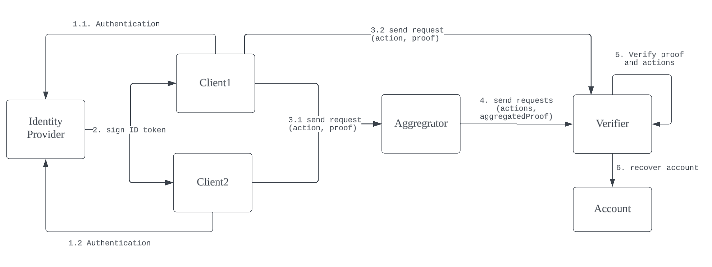

## Abstract

Account Abstraction facilitates new use cases for smart accounts, empowering users with the ability to tailor authentication and recovery mechanisms to their specific needs. To unlock the potential for more convenient verification methods such as social login, we inevitably need to connect smart accounts and OpenID Connect(OIDC), given its status as the most widely accepted authentication protocol. In this EIP, we proposed a new model to use OIDC identity as the recovery mechanism for smart accounts. Users can link their accounts with OIDC identities and authorize an OIDC verifier to mutate their account state, such as resetting operators, by performing ZK verification against the linked OIDC identity. The corresponding interfaces are also defined in the spec.

## Motivation

Connecting OIDC identity and smart accounts has been a very interesting but challenging problem. The most common ways of tackling the issue is by utilizing Multi-Party Computation(MPC). However, the limitation of the MPC solution is obvious:

1. **Centralization**: It relies on a third-party service to sign and aggregate the signature which introduces centralization risk such as single point of failure and vendor lock-in.
2. **Privacy**: the separation between the users' Web2 identity to their Web3 address cannot be cryptographically guaranteed and results in higher cost of trust between the users and the wallet service providers.

In this EIP, we propose a new model with OIDC ZK verification to address these concerns. The new model has the following characteristics:

1. **ZK Verified**. Privacy will be guaranteed through ZK verification as the connection between Web2 identity and the Web3 account will be hidden.
2. **Decentralized**. The ZK proof generation can be done on client side without involving any third-party service. The ZK-proof aggregation is also stateless, so it can be done via any gateway without introducing extra centralization dependencies.
3. **Affordable**. Daily operations could be signed and executed with the local smart account operator. The ZK verification will only be used to reset the account if the operator key is lost or stolen to ensure the whole setup is affordable. ZK proofs aggregation has also proven to be viable and paves the way for cheaper verification cost at scale.

## Specification

The keywords “MUST”, “MUST NOT”, “REQUIRED”, “SHALL”, “SHALL NOT”, “SHOULD”, “SHOULD NOT”, “RECOMMENDED”, “MAY”, and “OPTIONAL” in this document are to be interpreted as described in RFC 2119.

## Definitions

**Account**: The user's smart account contract

**Operator**: The signer to sign and exectue transactions. This can be reset by the verifier if lost or stolen.

**Identity Provider(IDP)**: The service to authenticate users and provide signed ID token

**Client**: The application to authenticate users and generate the ZK proof

**Aggregrator**: The offchain service to aggregate ZK proof from multiple users

**Verifier**: The on-chain contract to verify the ZK proof and recover account by resetting the operator

## Example Flow



## Interface

```
interface IOpenIdVerifier {
    struct Action {
        address account;
        bytes data;
    }
 
    // @notice get verification key of the open id authenticator
    function getVerificationKey() external view returns(bytes memory);
 
    // @notice get id hash of account
    function getIdHash(address account) external view returns(bytes32);

    // @notice the function verifies the proof and executes the action if it's valid
    // @params action: the action to execute
    //         proof: data to prove the account ownership
    function verifyAndCall(
        Action memory action,
        bytes memory proof
    ) external;

    // @notice the function verifies the aggregated proof and
    //         execute actions in batch if it's valid
    // @params actions: a list of actions to execute
    //         aggregatedProof: the data to prove the ownership of accounts in actions
    function verifyAndCallAggregated(
        Action[] memory actions,
        bytes memory aggregatedProof
    ) external;
}

interface IOpenIdAccount {
    /// @notice get open id verifier linked to the account
    /// @return the open id verifier
    function getOpenIdVerifier() external view returns(IOpenIdVerifier);
}

interface IRecoverableAccount is IOpenIdAccount {
    /// @notice get the operator of the account
    /// @return the address of operator
    function getOperator() external view returns(address);
 
    /// @notice set operator of the account
    /// @params the new operator to set
    function setOperator(address operator) external;
}
```

## Rationale

To verify identity ownership on-chain, **IOpenIdVerifier** needs at least three pieces of information:

1. the user ID to identify the user in the IDP. The **getIdHash** function returns the hash of the user id given the smart account. There may be multiple smart accounts linked to the same user ID.

2. the public key of the signed credential(which must contain the user ID), which is provided by the **getVerificationKey** function.

3. the ZK proof generated from the signed credentials. The verification is done by the **verifyAndCall** function and the proof is used as one of the inputs. The function also takes a second parameter, which are the actions the identity owners want to perform. The **verifyAndCallAggregated** function is similar but takes a list of actions and the aggregated proof as the input.

**IOpenIdAccount** illustrates the relationship between the verifier and account. It's separated from the **IRecoverableAccount** interface since it can be used to support arbitrary actions besides account recovery. Here we give a simple recovery account interface where the account is controlled by one operator, one may come up with another one where multiple operators are allowed.

## Security Considerations

The proof must contain a nonce to prevent replay attack. The proof must contain hash of the action or the action list to prevent front running attacks. The proof can only be used to prove the ownership of the user ID, so the verifier must verify that the accounts from actions are controlled by these user IDs via the **getIdHash** function.

## Copyright

Copyright and related rights waived via CC0.
