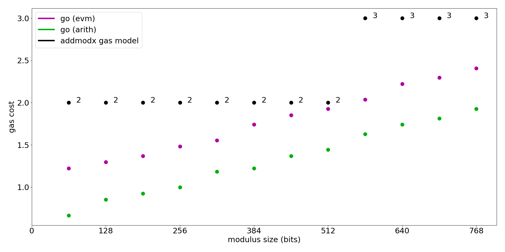
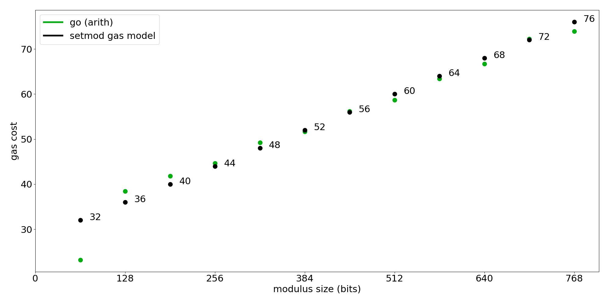

## Abstract

This EIP proposes new EVM modular arithmetic opcodes which support operations on odd moduli up to 768 bits wide.

## Motivation

Current opcodes for modular arithmetic only support values up to 256 bits wide.  In addition, they are permissive and accept any representable value for the inputs.

Many cryptographic operations are heavily-bottlenecked by modular arithmetic over prime fields.  To expand the range of primitives that can be implemented efficiently in the EVM, we propose new modular arithmetic opcodes designed for this case:

* They specify inputs/outputs as opcode immediate data containing offsets that point to values in a memory space.  This avoids stack overhead and enables expanded-width operations beyond 256 bits.
* They perform operations on values located within a call-frame-scoped memory space separate from EVM memory, and only accessible via new load/store opcodes.  This allows to internally express values in an optimized representation while keeping the details opaque to the EVM.

## Specification

### Conventions

The use of "assert" implies that if the assertion fails, the call frame will consume all gas and terminate execution in an exceptional state.

### Constants

| Name | Value | Description |
| ---- | ---- | ---- |
| `MAX_FIELD_ALLOC_MEM` | ? | The maximum size of memory in bytes allocated by field contexts for the current call frame.  TBD, see the relevant section under security considerations. |
| `MAX_BIT_WIDTH` | 768 bits | maximum modulus width that can be used |

### Overview

The execution state of an EVM call frame is modified to include a mapping of `id` (a number 0-256) to "field context".  A field context comprises a modulus and an allocated space of values to perform operations on.

An executing contract uses a new instruction `SETMODX` to set the active field context, allocating a new one in the mapping if it does not already exist for `id`.

New arithmetic opcodes perform modular addition, subtraction and multiplication with inputs/outputs from the value space of the active field context.

New load/store opcodes copy values to and from EVM memory and the value space of the active field context.

### New Opcodes

#### `SETMODX(0xc0)`

**Input**: `<top of stack> id modulus_offset modulus_size alloc_count`.

**Output**: none

#### Execution

Assert `0 <= id <= 256`.  If a field context for `id` exists in this call scope.  Set it as the active one.

Otherwise:

* Assert `modulus_size <= MAX_BIT_WIDTH // 8`.
* Assert that the byte range`[modulus_offset, modulus_offset+modulus_size]` falls within EVM memory.
* Load the byte range interpreting it as a big endian `modulus`.
* Assert `modulus` is odd.
* Assert `modulus > 1`.
* Assert that the most significant byte of the modulus is non-zero.
* Assert `0 < alloc_count <= 256`.
* Define the size in bytes of elements in the value space: `element_size = ceil(modulus_size / 8) * 8`: the size of the modulus padded to the next multiple of 64 bits.
* Charge EVM memory expansion cost to allocate `(alloc_count + 2) * element_size` bytes.
* Allocate the new field context with zeroed value space containing `alloc_count` number of values. Associate it with `id` in the mapping.
* The new field context is set as active.

#### Arithmetic Opcodes

Opcodes `ADDMODX(0xc3)`, `SUBMODX(0xc4)`, `MULMODX(0xc5)` take a 3-byte immediate interpreted as 3 values `out`, `x`, `y`.  These are indices which correspond to individual values from the space of the active field context (0 corresponds to the first value in the space, 1 to the second, etc.).

Execution asserts that an active field context is set in the current call frame, asserts that each input index is less than the size of the active field context's value space.

Then, compute the given operation with inputs from slot `x`/`y`:

* `ADDMODX`: `value_space[x] + value_space[y] % modulus`
* `SUBMODX`: `value_space[x] - value_space[y] % modulus`
* `MULMODX`: `value_space[x] * value_space[y] % modulus` 
    
Store the result in the value at index `out`.  Note: `x`, `y` and `out` are allowed to overlap.

Charge a gas cost based on `active_context.element_size/8` (the number of 64bit words needed to represent values/modulus):

```
# element_size64bit \in [1, 12]

def gas_mulmodx(element_size64bit: int) -> int:
    coef_a = 2.3
    coef_b = -2
    coef_c = 32
    return math.ceil(coef_a * element_size64bit ** 2 + \
        coef_b * element_size64bit + coef_c)  
    
def gas_addmodx(element_size64bit: int) -> int:
    coef_a = 0.1111
    coef_b = 1.111
    return math.ceil(coef_a * element_size64bit + coef_b)
    
def gas_setmod(element_size64bit: int) -> int:
    coef_a = 110
    coef_b = 730
    return math.ceil(coef_a * element_size64bit + coef_b)
```

`SUBMODX` uses the same cost model as `ADDMODX`.

#### Cost table:

| Modulus Size | MULMODX cost | ADDMODX and SUBMODX cost | SETMODX cost |
| ---- | ---- |  ---- | ---- |
|1 - 64 bits|2|2|32|
|65 - 128 bits|2|2|36|
|129 - 192 bits|2|2|40|
|193 - 256 bits|3|2|44|
|257 - 320 bits|3|2|48|
|321 - 384 bits|4|2|52|
|385 - 448 bits|5|2|56|
|449 - 512 bits|7|2|60|
|513 - 576 bits|8|3|64|
|577 - 640 bits|9|3|68|
|641 - 704 bits|11|3|72|
|705 - 768 bits|13|3|76|

--- 

### Data Transfer Opcodes

Note: serialization format for values in EVM memory: big-endian padded to `active_context.element_size` bytes.

#### `LOADX(0xc1)`

**Stack in**: `(top of stack) dest source count`

**Stack out**: none

**Description**: copies one or more values in the currently-active field context's value space into EVM memory.

##### Execution

* Assert that a field context is set as active in the current call frame.
* Assert that the range `[source, source + count]` falls within the active field context value space.
* Assert that the range `[dest, dest + count * active_context.element_size]` falls entirely within EVM memory.
* Charge `gas_mulmodx(active_context.element_size / 8) * count` and copy the values into EVM memory starting at offset `dest`.

#### `STOREX(0xc2)`

**Stack in**: `dest source count`

**Stack out**: none

**Description**: copies values from EVM memory into the currently-active field context's value space.

##### Execution

* Assert that a field context is set as active in the current call frame.
* Assert `dest + count` is less than or equal to the active context's value space size.
* Assert that `[source, source+count*active_context.element_size]` falls entirely within EVM memory.  Interpret it as `count` number of values, asserting that each is less than the modulus and storing them in the value space starting at index `dest`.

### EVM Memory Expansion Cost Modification

When expanding EVM memory, expansion cost will now consider the size of all allocated field contexts in the current call frame.

## Rationale

By restricting that a modulus must be odd, and ensuring that inputs to arithmetic operations will be reduced by the modulus, modular arithmetic operations can be optimized:

* The reduction step for modular addition/subtraction can be implemented without division using only conditional subtraction.
* Modular multiplication can be implemented using Montgomery multiplication, a family of similar algorithms which have greatly-improved performance compared to the naive method.

### EOF Dependency

EOF allows for the introduction of new opcodes that use immediates without breaking backwards compatibility.

#### Montgomery Modular Multiplication

For a value `A`, an odd modulus `M` and a value `R` (must be coprime and greater than `M`, chosen as a power of two for efficient performance), the Montgomery representation is `A * R % M`.

Define the Montgomery modular multiplication of two values `A` and `B`: `mulmont(A, B, M): A * B * R**-1 % M` where `R**-1 % M` is the modular inverse of `R` with respect to `M`.  There is various literature and algorithms for computing `mulmont` which have been published since 1985, and the operation is used ubiquitously where execution is bottlenecked by operations over prime-fields.

Note that normal modular addition and subtraction algorithms work for Montgomery form values.

##### Conversion of Canonical to Montgomery Representation

`mulmont(canon_val, R**2 % M, M) = mont_val`

##### Conversion from Montgomery to Canonical representation

`mulmont(mont_val, 1, M) = canon_val`

#### Gas Model Justification with Benchmarks

Benchmarks were performed on a Xeon CPU E5-2686 v4 (2.30GHz).  A target gas rate of 27 ns/gas was chosen by benchmarking the performance of the ecrecover precompile.

For each arithmetic operation and `value_size` combination, two benchmarks were measured:

* arithmetic-only benchmarks
* standalone EVM bytecodes which execute arithmetic opcodes in a large loop with inputs/outputs as random indices from a 256-element sized value space

In the graphs below, benchmark execution time is expressed in gas via scaling by the target gas rate.

##### `ADDMODX`/`SUBMODX`/`MULMODX`

The implementations of the arithmetic are constant time.  Modular addition/subtraction are linear with respect to modulus size.  Modular multiplication scales quadratically with modulus size.

###### `ADDMODX`



###### `SUBMODX`


###### `MULMODX`


---

##### `SETMODX`

`SETMODX` overhead is dominated by the computation of the conversion parameter used for `STOREX` (`R**2 % M`) which is assumed to be approximately `O(N)` in the bit-width of the modulus for range of bit-widths supported in this EIP.



---

### Reference Implementation

There is a work-in-progress implementation for Geth.

## Test Cases

TODO

## Security Considerations

### Memory Attacks via forcing cache-misses

An attacker could potentially grief by allocating many field contexts with large moduli and structuring accesses to values in a way that thrashes the CPU cache.

To prevent this, there should be a cap on the amount of memory that can be allocated via field contexts in a call frame.  Looking into this, creating attack benchmarks  and defining `MAX_FIELD_ALLOC_MEM` is a TODO.

## Copyright

Copyright and related rights waived via [CC0](../LICENSE.md).
