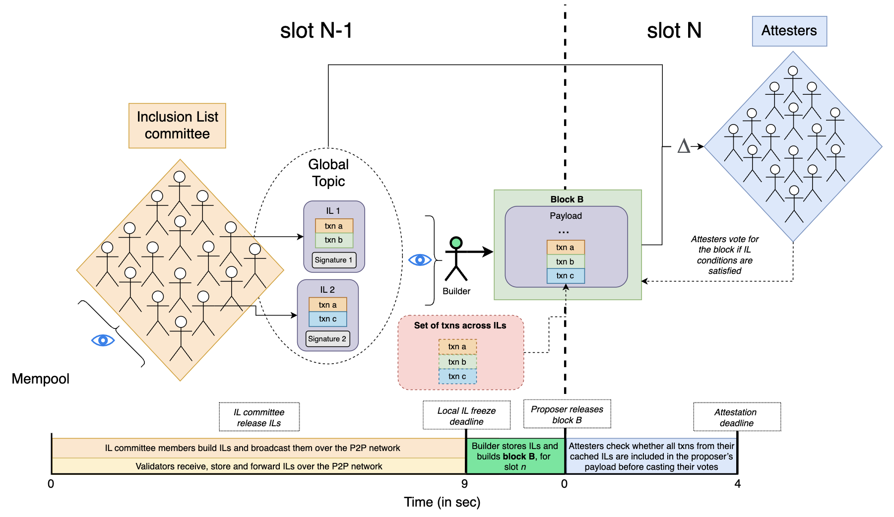

## Abstract

FOCIL implements a robust mechanism to preserve Ethereum’s censorship resistance properties by guaranteeing timely transaction inclusion.

FOCIL (**Fo**rk-**c**hoice enforced **I**nclusion **L**ists) is built in a few simple steps:

- In each slot, a set of validators is selected as inclusion list (IL) committee members. Each member builds and gossips one IL according to their subjective view of the mempool.
- The proposer and all attesters of the next slot monitor, store and forward available ILs.
- The proposer (or the builder if the block is not built locally by the proposer) includes transactions from all collected ILs in its block. The proposer then broadcasts the block including IL transactions to the rest of the network.
- Attesters only vote for the proposer's block if it includes transactions from all stored ILs.

## Motivation

In an effort to shield the Ethereum validator set from centralizing forces, the right to build blocks has been auctioned off to specialized entities known as *builders*. This has led to a few sophisticated builders dominating block production, leading to a deterioration of the network’s censorship resistance properties. To address this issue, research has focused on improving Ethereum's transaction inclusion guarantees by enabling validators to impose constraints on builders. This is achieved by force-including transactions in blocks via ILs.

### High-level Overview

FOCIL is a committee-based, fork-choice enforced inclusion list (IL) design that improves upon previous IL mechanisms and block co-creation proposals. It addresses issues related to bribing/extortion attacks, IL equivocation, account abstraction (AA), and transaction invalidation.



### Roles And Participants

This section outlines the workflow of FOCIL, detailing the roles and responsibilities of various participants: IL committee members, validators, builders, proposers and attesters.

#### IL Committee Members

- **`Slot N`, `t=0 to 8s`**:
IL committee members construct their ILs by including transactions pending in the public mempool, and broadcast them over the P2P network after processing the block for `slot N` and confirming it as the head. If no block is received by `t=7s`, they should run `get_head` and build and release their ILs based on the node’s local head.

IL committee members may follow different strategies for constructing their ILs as discussed in [IL Building](#il-building).

#### Validators

- **`Slot N`, `t=0s to 9s`**: Validators receive ILs from the P2P network and store (1) all new ILs that pass the CL P2P validation rules, and (2) any evidence of IL equivocation by committee members (i.e., if multiple ILs are received from the same committee member).

- **`Slot N`, `t=9s` to `Slot N+1`, `t=4s`**: After the view freeze deadline at `t=9s`, validators:
  1. Do not store new ILs received after the deadline.
  2. Continue forwarding ILs to peers following the CL P2P validation rules.
  3. Record any evidence of IL equivocation that occurs after the view freeze deadline.

After the attestation deadline of **`Slot N+1`, `t=4s`**, validators ignore any new ILs related to the previous slot's IL committee, and stop recording equivocation evidence for the previous slot's ILs.

#### Builder

- **`Slot N`, `t=0s to 11s`**: The builder (i.e., a proposer doing local block building or an external builder) receives ILs from the P2P network, forwarding and caching those that pass the CL P2P validation rules. Optionally, an RPC endpoint can be added to allow the builder to request missing ILs from its peers (e.g., by committee index at `t=10s`).

- **`Slot N`, `t=11s`**:
The builder freezes its view of ILs and asks the EL to update its execution payload by adding transactions from its view (the exact timings will be defined after running some tests/benchmarks).

#### Proposer

- **`Slot N+1`, `t=0s`**:
The proposer broadcasts its block with the up-to-date execution payload satisfying IL transactions over the P2P network.

#### Attesters

- **`Slot N+1`, `t=4s`**:
Attesters monitor the P2P network for the proposer’s block. Upon detecting it, they verify whether all transactions from their stored ILs are included in the proposer’s execution payload, except for ILs whose sender has equivocated. Based on their frozen view of the ILs from `t=9s` in the previous slot, attesters check if the execution payload satisfies IL conditions. This is done either by confirming that all transactions are present or by determining if any missing transactions are invalid when appended to the end of the payload. In such cases, attesters use the EL to perform nonce and balance checks to validate the missing transactions and check whether there is enough space in the block to include the transaction(s).

#### CL P2P Validation Rules

When validators receive ILs from the P2P network, they perform a series of validation checks before forwarding or caching them. These rules protect against Denial-of-Service attacks by (1) limiting ILs' byte size and (2) restricting IL proposals to a small committee of IL committee members, thereby tightly bounding bandwidth, the main resource consumed by the propagation of ILs. Consumption of other relevant resources, such as verification time, is minimal because the only nontrivial check performed on IL propagation is signature verification. At this stage, there is no EL verification of the transactions within ILs. This means that ILs are allowed to contain any transactions—valid or invalid—since validators do not perform EL-side validity checks. This design choice is intended to avoid additional computational overhead.

1. The slot of the IL matches the current or previous slot.
2. The root of the IL committee referenced in the IL matches the expected IL committee root for its slot.
3. Received two or fewer ILs from this IL committee member (see IL equivocation section below).
4. The IL is correctly signed by the validator.
5. The validator is part of the IL committee.
6. The size of a IL does not exceed the maximum size allowed (e.g., `MAX_BYTES_PER_INCLUSION_LIST = 8 KiB`).

## Specification

### Execution Layer

On the execution layer, an additional check is introduced for new payloads. After all of the transactions in the payload have been executed, we check whether any transaction from ILs, that is not already present in the payload, could be validly included (i.e. nonce and balance checks pass). If that is the case for any transaction, then an error is returned to the CL. Although the block is valid, the CL will not attest to it.

Let `B` denote the current block.
Let `S` denote the execution state following the execution of the last transaction in `B`.
Let `gas_left` be the gas remaining after execution of B.

For each transaction `T` in ILs, perform the following:

1. Check whether `T` is present in `B`. If `T` is present, then jump to the next transaction, else continue with next step.

2. Check whether `B` has enough remaining gas to execute `T`. If `T.gas` > `gas_left`, then jump to the next transaction, else continue with next step.

3. Validate `T` against `S` by checking the nonce and balance of `T.origin`.

  - If `T` is invalid, then continue to the next transaction. 
  
  - If `T` is valid, terminate process and return an `INVALID_INCLUSION_LIST` error.

#### Engine API Changes

We make the following changes to the engine API:

- Add `engine_getInclusionListV1` endpoint to retrieve an IL from the `ExecutionEngine`.
- Add `engine_updatePayloadWithInclusionListV1` endpoint to update a payload with the IL that should be used to build the block. This takes as an argument an 8-byte `payloadId` of the ongoing payload build process, along with the IL itself.
- Modify `engine_newPayload` endpoint to include a parameter for transactions in ILs determined by the IL committee member. If the IL is not satisfied an `INVALID_INCLUSION_LIST` error must be returned.

#### IL Building

The rules for building ILs are left to the discretion of implementers. For instance, they may select transactions from the public mempool in various ways such as at random, by priority fee, or based on how long they have been pending. The IL has a maximum size of `MAX_BYTES_PER_INCLUSION_LIST = 8 KiB` for all of the RLP encoded transactions.

### Consensus Layer

The full consensus changes can be found in the following GitHub repository. They are split between: 

- [Beacon Chain](https://github.com/ethereum/consensus-specs/blob/e678deb772fe83edd1ea54cb6d2c1e4b1e45cec6/specs/_features/eip7805/beacon-chain.md) changes.
- [Fork choice](https://github.com/ethereum/consensus-specs/blob/e678deb772fe83edd1ea54cb6d2c1e4b1e45cec6/specs/_features/eip7805/fork-choice.md) changes.
- [P2P](https://github.com/ethereum/consensus-specs/blob/e678deb772fe83edd1ea54cb6d2c1e4b1e45cec6/specs/_features/eip7805/p2p-interface.md) changes.
- [Honest validator guide](https://github.com/ethereum/consensus-specs/blob/e678deb772fe83edd1ea54cb6d2c1e4b1e45cec6/specs/_features/eip7805/validator.md) changes.

#### Beacon chain changes

##### Preset

| Name | Value |
| - | - |
| `DOMAIN_IL_COMMITTEE`       | `DomainType('0x0C000000')`  |
| `IL_COMMITTEE_SIZE` | `uint64(2**4)` (=16)  |
| `MAX_BYTES_PER_INCLUSION_LIST` |  `uint64(2**13)` (=8192) | 

##### New containers

```python
class InclusionList(Container):
    slot: Slot
    validator_index: ValidatorIndex
    inclusion_list_committee_root: Root
    transactions: List[Transaction, MAX_TRANSACTIONS_PER_PAYLOAD]
```

```python
class SignedInclusionList(Container):
    message: InclusionList
    signature: BLSSignature
```

#### Fork choice changes

- Store ILs observed over gossip before the view freeze deadline.
- If more than one IL is observed from the same IL committee member, mark the committee member as an equivocator and ignore any further ILs from them.
- The beacon block from the current slot is only attested to if it satisfies IL conditions, based on all stored ILs from non equivocators.
  
#### P2P changes

- A new global topic for broadcasting `SignedInclusionList` objects.
- A new RPC topic for request `SignedInclusionList` based on IL committee index.

## Rationale

### Core Properties

- Committee-based: FOCIL relies on a committee of multiple validators, rather than a single proposer, to construct and broadcast ILs. This approach significantly reduces the surface for bribery and extortion attacks and strengthens censorship resistance.
- Fork-choice enforced: FOCIL incorporates the force-inclusion mechanism into the fork-choice rule, an integral component of the consensus process, thereby preventing any actor from bypassing the system. Attesters vote only for blocks that include transactions from a set of ILs provided by the IL committee and that satisfy the IL constraints. Any block failing to meet these criteria will not be voted on by the attesters, and therefore cannot be canonical.
- Same-slot: With FOCIL running in parallel with the block building process for `slot N+1` during `slot N`, the constraints imposed on `block B` for `slot N+1` can include transactions submitted during `slot N`. This represents a strict improvement over forward IL designs like [EIP-7547](./eip-7547.md), where the forward property introduced a 1-slot delay.
- Conditional inclusion: FOCIL adopts conditional inclusion, accepting blocks that may lack some transactions from ILs if they cannot append the transactions to the end of the block or if they are full.
- Anywhere-in-block: FOCIL is unopinionated about the placement of transactions from ILs within a block. This reduces incentives for sophisticated actors to use side channels to bypass the mechanism. Combined with conditional inclusion, this flexibility makes the emergence of off-protocol markets less attractive.
- No incentive mechanism: FOCIL does not provide explicit rewards for IL committee members participating in the mechanism. We believe that the added complexity of implementing a transaction fee system for FOCIL is not justified. Instead, we rely on altruistic behavior, as FOCIL requires only a `1-out-of-N` honesty assumption from IL committee members for the mechanism to work as intended.

## Backwards Compatibility

This EIP introduces backward incompatible changes to the block validation rule set on the consensus layer and must be accompanied by a hard fork. These changes do not break anything related to current user activity and experience.

## Security Considerations

### Consensus Liveness

The builder of `slot N+1` cannot construct a canonical block without first receiving the ILs broadcast during `slot N`. This means that the builder (including cases in which the proposer locally builds its block) must be well-connected to the IL committee members to ensure timely access to these inclusion lists. Additionally, there must be sufficient time between the view freeze deadline (`t=9s` of `slot N`) and the moment the proposer must broadcast `block B` to the rest of the network. This buffer allows the builder to gather all available ILs and update the execution payload of `block B` accordingly.

### IL Equivocation

To mitigate IL equivocation, FOCIL introduces a new P2P network rule that allows forwarding up to two ILs per IL committee member. If the proposer or attesters detect two different ILs sent by the same IL committee member, they should ignore all ILs from that member. In the worst case, the bandwidth of the IL gossip subnet can at most double.

### Payload Construction

The builder, responsible for constructing the execution payload, must ensure that the IL is satisfied. A naive way to do so would be to build an initial payload in whatever way the builder desires, then execute the following algorithm:

1. Sequentially check validity of any yet-to-be-included IL tx against the post-state. If none is found, payload building is over.
2. If one is found, append it to the end of the payload and update the post-state. Go back to step 1.

The issue with this simple approach is that, given a set of `n` IL transactions, one might end up needing to do `n + (n-1) + (n-2) + ...` validity checks, so `O(n^2)`. For example, the `n`th tx might be valid while all others are not, but its execution sends balance to the sender of the `(n-1)`th tx, making it valid, and in turn, the `(n-1)`th sends balance to the sender of the `(n-2)`th tx, etc.

To efficiently ensure that all valid IL txs have been included in the payload, builders can adopt a simple strategy: prior to building the payload, they store the `nonce` and `balance` of all Externally Owned Accounts (EOAs) involved in IL transactions. As they construct the payload, builders track these EOAs, maintaining and updating each EOA's `nonce` and `balance` whenever changes occur—specifically, when the `nonce` increments (indicating that a transaction from that EOA has been executed) or when the `balance` changes without a `nonce` increment (e.g., after an Account Abstraction (AA) transaction has interacted with that EOA). 

This tracking allows builders to verify IL transaction validity in real-time, enabling them to add transactions sequentially until all remaining transactions are either invalid because the nonce or balance of the associated EOA does not change or cannot be included due to insufficient gas. This approach minimizes overhead by keeping track only of the state changes that are relevant to the validity of IL txs.

## Copyright

Copyright and related rights waived via [CC0](../LICENSE.md).
