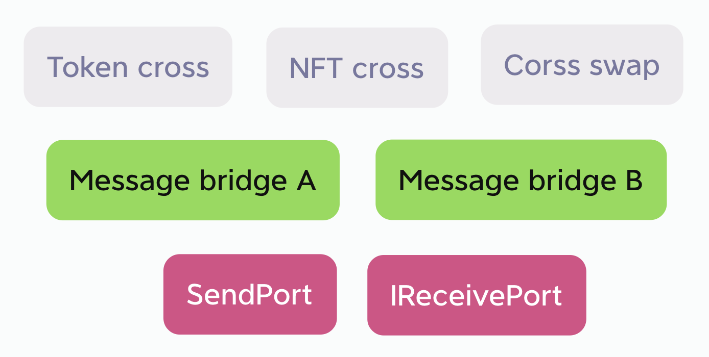
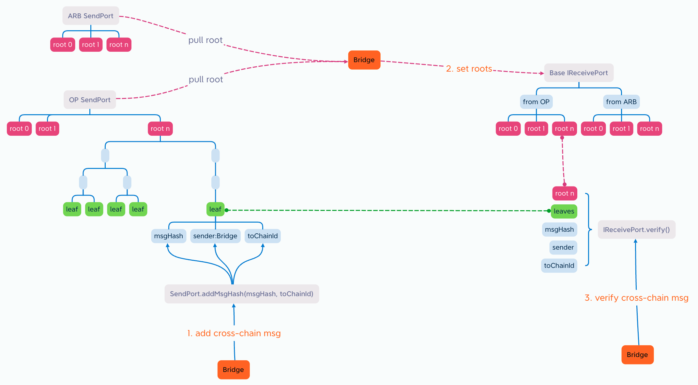
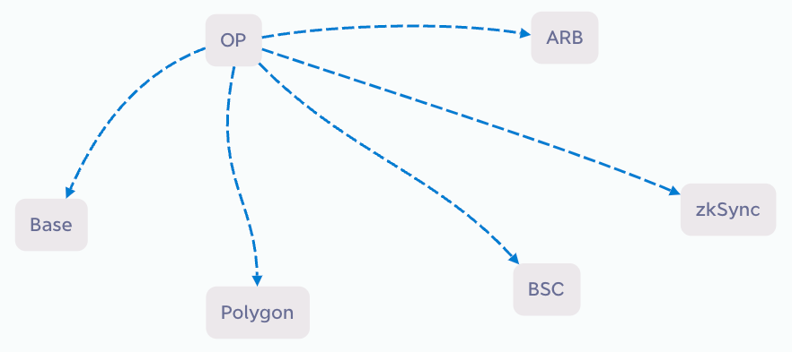
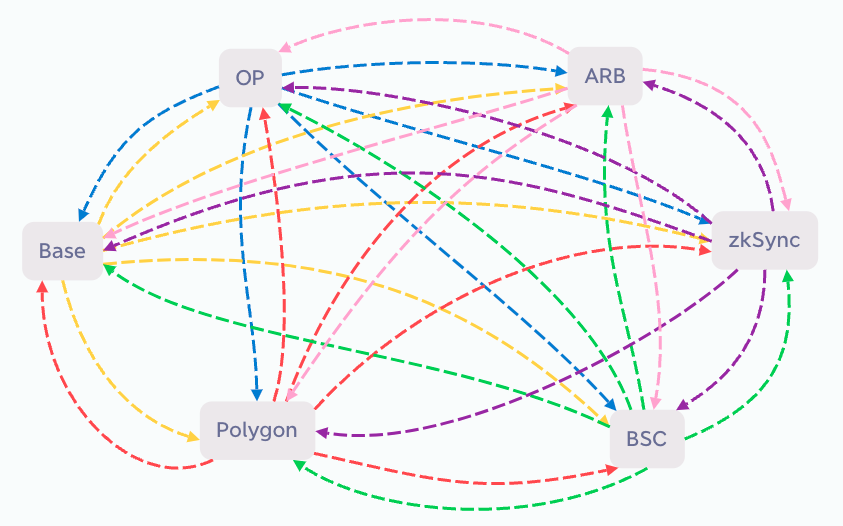

## Abstract

The objective of Public Cross Port (PCP) is to securely and efficiently connect various EVM chains, significantly reducing the number of cross-chain bridges and gas cost, and enhancing security. It aims to unite all EVM chains and establish a powerful, decentralized EVM cross-chain network. To achieve this goal, it is necessary for cross-chain bridge projects to utilize the standardized SendPort contract and IReceivePort interface. As more cross-chain bridge projects are built on PCP, the overall security increases, making the establishment of a decentralized EVM cross-chain network possible. DApps that utilize this cross-chain network will benefit from highly secure and free cross-chain services.


## Motivation

Currently, there are official cross-chain bridges between L2 and L1, but not between L2s. If there are 10 L2 chains that need to cross-chain with each other, it would require 10 x 9 = 90 cross-chain bridges. However, if a pull mechanism is used to merge messages from the other 9 chains into one transaction synchronized to its own chain, only 10 cross-chain bridges would be needed. This significantly reduces the number of cross-chain bridges required and minimizes gas cost.

This implementation, with the participation of multiple cross-chain bridge projects, would greatly enhance security. There is currently a considerable amount of redundant construction of cross-chain bridges, which does not contribute to improved security. By using a standardized SendPort contract, if the same cross-chain message is being transported by multiple redundant bridges, the validation on the target chain's IReceivePort should yield the same result. This result, confirmed by multiple cross-chain bridge projects, provides much higher security than relying on a single confirmation. The purpose of this EIP is to encourage more cross-chain bridge projects to participate, transforming redundant construction into enhanced security.

To attract cross-chain bridge projects to participate, aside from reducing the number of bridges and gas cost, the use of the Hash MerkleTree data structure in the SendPort ensures that adding cross-chain messages does not increase the overhead of the bridges. Only a small-sized root is required for the transportation of cross-chain bridges, further saving gas.


### Use case

This EIP divides the cross-chain ecosystem into 3 layers and defines the SendPort contract and IReceivePort interface at the foundational layer. The implementation of the other layers is left to ecosystem project participants.



Under this EIP, an official SendPort contract is deployed on each chain as a unique entity. It is responsible for collecting cross-chain messages on that chain and packing them. SendPort operates as a public, permissionless, administrator-free, and automatic system. Cross-chain bridge operators retrieve cross-chain messages from the SendPort and transport it to the target chain to complete the cross-chain messaging process.

On top of cross-chain messaging, various types of cross-chain applications can be developed, such as Token cross-chain, NFT cross-chain, and Cross-chain swap.

Cross-chain messaging bridges can be combined with Token cross-chain functionality, as shown in the code example at Reference Implementation. Alternatively, they can be separated. Taking the example of an NFT cross-chain application, it can reuse the messaging bridge of Tokens, and even leverage multiple messaging bridges. Reusing multiple bridges for message verification can significantly enhance security without incurring additional costs for cross-chain and verification services.


## Specification

The key words "MUST", "MUST NOT", "REQUIRED", "SHALL", "SHALL NOT", "SHOULD", "SHOULD NOT", "RECOMMENDED", "NOT RECOMMENDED", "MAY", and "OPTIONAL" in this document are to be interpreted as described in RFC 2119 and RFC 8174.

### `ISendPort` Interface and `SendPort` Implementation

```solidity
pragma solidity ^0.8.0;

interface ISendPort {
    event MsgHashAdded(uint indexed packageIndex, address sender, bytes32 msgHash, uint toChainId, bytes32 leaf);

    event Packed(uint indexed packageIndex, uint indexed packTime, bytes32 root);

    struct Package {
        uint packageIndex;
        bytes32 root;
        bytes32[] leaves;
        uint createTime;
        uint packTime;
    }

    function addMsgHash(bytes32 msgHash, uint toChainId) external;

    function pack() external;

    function getPackage(uint packageIndex) external view returns (Package memory);

    function getPendingPackage() external view returns (Package memory);
}
```

Let:
- `Package`: Collects cross-chain messages within a certain period and packs them into a single package.
  - `packageIndex`: The index of the package, starting from 0.
  - `root`: The root generated by the MerkleTree from the `leaves`, representing the packed package.
  - `leaves`: Each leaf represents a cross-chain message, and it is a hash calculated from `msgHash`, `sender`, and `toChainId`.
    - `msgHash`: The hash of the message, passed in from an external contract.
    - `sender`: The address of the external contract, no need to pass it in explicitly.
    - `toChainId`: The chain ID of the target chain, passed in from an external contract.
  - `createTime`: The timestamp when the package started collecting messages. It is also the timestamp when the previous package was packed.
  - `packTime`: The timestamp when the package was packed. After packing, no more leaves can be added.
- `addMsgHash()`: The external contract sends the hash of cross-chain messages to the SendPort.
- `pack()`: Manually triggers the packing process. Typically, it is automatically triggered when the last submitter submits his message. If waiting for the last submitter takes too long, the packing process can be manually triggered.
- `getPackage()`: Retrieves each package in the SendPort, including both packed and pending packages.
- `getPendingPackage()`: Retrieves the pending package in the SendPort.

```solidity
pragma solidity ^0.8.0;

import "./ISendPort.sol";

contract SendPort is ISendPort {
    uint public constant PACK_INTERVAL = 6000;
    uint public constant MAX_PACKAGE_MESSAGES = 100;

    uint public pendingIndex = 0;

    mapping(uint => Package) public packages;

    constructor() {
        packages[0] = Package(0, bytes32(0), new bytes32[](0), block.timestamp, 0);
    }

    function addMsgHash(bytes32 msgHash, uint toChainId) public {
        bytes32 leaf = keccak256(
            abi.encodePacked(msgHash, msg.sender, toChainId)
        );
        Package storage pendingPackage = packages[pendingIndex];
        pendingPackage.leaves.push(leaf);

        emit MsgHashAdded(pendingPackage.packageIndex, msg.sender, msgHash, toChainId, leaf);

        if (pendingPackage.leaves.length >= MAX_PACKAGE_MESSAGES) {
            console.log("MAX_PACKAGE_MESSAGES", pendingPackage.leaves.length);
            _pack();
            return;
        }

        // console.log("block.timestamp", block.timestamp);
        if (pendingPackage.createTime + PACK_INTERVAL <= block.timestamp) {
            console.log("PACK_INTERVAL", pendingPackage.createTime, block.timestamp);
            _pack();
        }
    }

    function pack() public {
        require(packages[pendingIndex].createTime + PACK_INTERVAL <= block.timestamp, "SendPort::pack: pack interval too short");

       _pack();
    }

    function getPackage(uint packageIndex) public view returns (Package memory) {
        return packages[packageIndex];
    }

    function getPendingPackage() public view returns (Package memory) {
        return packages[pendingIndex];
    }

    function _pack() internal {
        Package storage pendingPackage = packages[pendingIndex];
        bytes32[] memory _leaves = pendingPackage.leaves;
        while (_leaves.length > 1) {
            _leaves = _computeLeaves(_leaves);
        }
        pendingPackage.root = _leaves[0];
        pendingPackage.packTime = block.timestamp;

        emit Packed(pendingPackage.packageIndex, pendingPackage.packTime, pendingPackage.root);

        pendingIndex = pendingPackage.packageIndex + 1;
        packages[pendingIndex] = Package(pendingIndex, bytes32(0), new bytes32[](0), pendingPackage.packTime, 0);
    }

    function _computeLeaves(bytes32[] memory _leaves) pure internal returns (bytes32[] memory _nextLeaves) {
        if (_leaves.length % 2 == 0) {
            _nextLeaves = new bytes32[](_leaves.length / 2);
            bytes32 computedHash;
            for (uint i = 0; i + 1 < _leaves.length; i += 2) {
                computedHash = _hashPair(_leaves[i], _leaves[i + 1]);
                _nextLeaves[i / 2] = computedHash;
            }

        } else {
            bytes32 lastLeaf = _leaves[_leaves.length - 1];
            _nextLeaves = new bytes32[]((_leaves.length / 2 + 1));
            bytes32 computedHash;
            for (uint i = 0; i + 1 < _leaves.length; i += 2) {
                computedHash = _hashPair(_leaves[i], _leaves[i + 1]);
                _nextLeaves[i / 2] = computedHash;
            }
            _nextLeaves[_nextLeaves.length - 1] = lastLeaf;
        }
    }

    function _hashPair(bytes32 a, bytes32 b) private pure returns (bytes32) {
        return a < b ? _efficientHash(a, b) : _efficientHash(b, a);
    }

    function _efficientHash(bytes32 a, bytes32 b) private pure returns (bytes32 value) {
        /// @solidity memory-safe-assembly
        assembly {
            mstore(0x00, a)
            mstore(0x20, b)
            value := keccak256(0x00, 0x40)
        }
    }
}
```

External featrues:

- `PACK_INTERVAL`: The minimum time interval between two consecutive packing operations. If this interval is exceeded, a new packing operation can be initiated.
- `MAX_PACKAGE_MESSAGES`: Once `MAX_PACKAGE_MESSAGES` messages are collected, a packing operation is triggered immediately. This takes precedence over the `PACK_INTERVAL` setting.

### `IReceivePort` Interface

```solidity
pragma solidity ^0.8.0;

interface IReceivePort {
    event PackageReceived(uint indexed fromChainId, uint indexed packageIndex, bytes32 root);

    struct Package {
        uint fromChainId;
        uint packageIndex;
        bytes32 root;
    }

    function receivePackages(Package[] calldata packages) external;

    function getRoot(uint fromChainId, uint packageIndex) external view returns (bytes32);

    function verify(
        uint fromChainId,
        uint packageIndex,
        bytes32[] memory proof,
        bytes32 msgHash,
        address sender
    ) external view returns (bool);
}
```

Let:
- `Package`: Collects cross-chain messages within a certain period and bundles them into a single package.
  - `fromChainId`: The chain from which the package originates.
  - `packageIndex`: The index of the package, starting from 0.
  - `root`: The root generated by the MerkleTree from the `leaves`, representing the packed package.
- `receivePackages()`: Receive multiple roots from different source chains's SendPort.
- `getRoot()`: Retrieves a specific root from a particular chain.
- `verify()`: Verifies if the message on the source chain was sent by the sender.


## Rationale

The essence of cross-chain is to inform the target chain about events happening on the source chain. This process can be divided into 3 steps. The following diagram illustrates the overall principle:



### 1.Add cross-chain message

The SendPort contract is unique on each chain and is responsible for collecting events (i.e., cross-chain messages) that occur on that chain and packing them into a MerkleTree. For example, let's consider a scenario where a Bridge contract receives a user's USDT deposit. It can send the hash of this event and the ID of the target chain to the SendPort contract. SendPort adds this information, along with the hash of the sender's address (i.e., the Bridge contract's address), as a leaf in an array. After collecting a certain number of leaves for a period of time (e.g., 1 minute), SendPort automatically packs them into a MerkleTree and begins the next collection phase. SendPort's role is solely focused on event collection and packing. It operates autonomously without the need for management.

The `SendPort.addMsgHash()` function can be called by different cross-chain bridge projects or any other contract. The function does not require permission, which means that there is a possibility of incorrect or fraudulent messages being sent. To prevent fraud, SendPort includes the sender's address in the packing process. This indicates that the `sender` intends to send the information `msgHash` to the `toChainId` chain. When this information is decoded on the target chain, it can help prevent fraudulent activities.

### 2.Pull roots & Set roots

Upon the completion of packing a new MerkleTree, the package carrier (usually the cross-chain bridge project) pulls the root from multiple chains and stores it in the IReceivePort contract of each chain. It is important to note that the traditional approach involves using a push method, as depicted in the following diagram:



If there are 6 chains, each chain needs to push to the other 5 chains, resulting in the requirement of 30 cross-chain bridges, as shown in the diagram below:



When N chains require cross-chain communication with each other, the number of cross-chain bridges needed is calculated as: num = N * (N - 1).

Using the pull approach allows the batch of cross-chain messages from 5 chains into 1 transaction, significantly reducing the number of required cross-chain bridges, as illustrated in the following diagram:


If each chain pulls messages from the other 5 chains onto its own chain, only 6 cross-chain bridges are necessary. For N chains requiring cross-chain communication, the number of cross-chain bridges needed is: num = N.

Thus, the pull approach can greatly reduce the number of cross-chain bridges.

The MerkleTree data structure efficiently compresses the size of cross-chain messages. Regardless of the number of cross-chain messages, they can be compressed into a single root, represented as a byte32 value. The package carrier only needs to transport the root, resulting in low gas cost.

A root contains messages from one source chain to multiple target chains. For the package carrier, the root may not contain relevant messages or may not include messages intended for a specific target chain. Therefore, the package carrier has the discretion to decide whether or not to transport the root to a particular target chain, based on its relevance.

Hence, the IReceivePort contract is not unique and is implemented by the package carrier based on the IReceivePort interface. With multiple package carriers, there will be multiple IReceivePort contracts.

### 3.Verify cross-chain message

The IReceivePort contract stores the roots of each chain, allowing it to verify the authenticity of messages when provided with the complete message. It is important to note that the root itself cannot be used to decipher the message; it can only be used to validate its authenticity. The complete message can be retrieved from the SendPort contract of the source chain.

Since the roots originate from the same SendPort, the roots in different IReceivePort contracts **SHOULD** be identical. In other words, if a message is authentic, it **SHOULD** be able to be verified as authentic across different IReceivePort contracts. This significantly enhances security. It is similar to the principle of multi-signature, where if the majority of IReceivePort contracts verify a message as authentic, it is likely to be true. Conversely, any IReceivePort contracts that verify the message as false may indicate a potential hacker attack or a failure in the corresponding cross-chain bridge. This decentralized participation model ensures that the security of the system is not compromised by single points of failure. It transforms redundant construction into an improvement in security.


## Backwards Compatibility

This EIP does not change the consensus layer, so there are no backwards compatibility issues for Ethereum as a whole. 


## Reference Implementation

Below is an example contract for a cross-chain bridge:

ReceivePort.sol (for example)
```solidity
pragma solidity ^0.8.0;

import "@openzeppelin/contracts/access/Ownable.sol";
import "./IReceivePort.sol";

abstract contract ReceivePort is IReceivePort, Ownable {

    //fromChainId => packageIndex => root
    mapping(uint => mapping(uint => bytes32)) public roots;

    constructor() {}

    function receivePackages(Package[] calldata packages) public onlyOwner {
        for (uint i = 0; i < packages.length; i++) {
            Package calldata p = packages[i];
            require(roots[p.fromChainId][p.packageIndex] == bytes32(0), "ReceivePort::receivePackages: package already exist");
            roots[p.fromChainId][p.packageIndex] = p.root;

            emit PackageReceived(p.fromChainId, p.packageIndex, p.root);
        }
    }

    function getRoot(uint fromChainId, uint packageIndex) public view returns (bytes32) {
        return roots[fromChainId][packageIndex];
    }

    function verify(
        uint fromChainId,
        uint packageIndex,
        bytes32[] memory proof,
        bytes32 msgHash,
        address sender
    ) public view returns (bool) {
        bytes32 leaf = keccak256(
            abi.encodePacked(msgHash, sender, block.chainid)
        );
        return _processProof(proof, leaf) == roots[fromChainId][packageIndex];
    }

    function _processProof(bytes32[] memory proof, bytes32 leaf) internal pure returns (bytes32) {
        bytes32 computedHash = leaf;
        for (uint256 i = 0; i < proof.length; i++) {
            computedHash = _hashPair(computedHash, proof[i]);
        }
        return computedHash;
    }

    function _hashPair(bytes32 a, bytes32 b) private pure returns (bytes32) {
        return a < b ? _efficientHash(a, b) : _efficientHash(b, a);
    }

    function _efficientHash(bytes32 a, bytes32 b) private pure returns (bytes32 value) {
        /// @solidity memory-safe-assembly
        assembly {
            mstore(0x00, a)
            mstore(0x20, b)
            value := keccak256(0x00, 0x40)
        }
    }
}
```

BridgeExample.sol (for example)
```solidity
pragma solidity ^0.8.0;

import "@openzeppelin/contracts/token/ERC20/IERC20.sol";
import "@openzeppelin/contracts/token/ERC20/utils/SafeERC20.sol";
import "./ISendPort.sol";
import "./ReceivePort.sol";

contract BridgeExample is ReceivePort {
    using SafeERC20 for IERC20;

    ISendPort public sendPort;

    mapping(bytes32 => bool) public usedMsgHashes;

    mapping(uint => address) public trustBridges;

    mapping(address => address) public crossPairs;

    constructor(address sendPortAddr) {
        sendPort = ISendPort(sendPortAddr);
    }

    function setTrustBridge(uint chainId, address bridge) public onlyOwner {
        trustBridges[chainId] = bridge;
    }

    function setCrossPair(address fromTokenAddr, address toTokenAddr) public onlyOwner {
        crossPairs[fromTokenAddr] = toTokenAddr;
    }

    function getLeaves(uint packageIndex, uint start, uint num) view public returns(bytes32[] memory) {
        ISendPort.Package memory p = sendPort.getPackage(packageIndex);
        bytes32[] memory result = new bytes32[](num);
        for (uint i = 0; i < p.leaves.length && i < num; i++) {
            result[i] = p.leaves[i + start];
        }
        return result;
    }

    function transferTo(
        uint toChainId,
        address fromTokenAddr,
        uint amount,
        address receiver
    ) public {
        bytes32 msgHash = keccak256(
            abi.encodePacked(toChainId, fromTokenAddr, amount, receiver)
        );
        sendPort.addMsgHash(msgHash, toChainId);

        IERC20(fromTokenAddr).safeTransferFrom(msg.sender, address(this), amount);
    }

    function transferFrom(
        uint fromChainId,
        uint packageIndex,
        bytes32[] memory proof,
        address fromTokenAddr,
        uint amount,
        address receiver
    ) public {
        bytes32 msgHash = keccak256(
            abi.encodePacked(block.chainid, fromTokenAddr, amount, receiver)
        );

        require(!usedMsgHashes[msgHash], "transferFrom: Used msgHash");

        require(
            verify(
                fromChainId,
                packageIndex,
                proof,
                msgHash,
                trustBridges[fromChainId]
            ),
            "transferFrom: verify failed"
        );

        usedMsgHashes[msgHash] = true;

        address toTokenAddr = crossPairs[fromTokenAddr];
        require(toTokenAddr != address(0), "transferFrom: fromTokenAddr is not crossPair");
        IERC20(toTokenAddr).safeTransfer(receiver, amount);
    }
}
```


## Security Considerations

Regarding competition and double spending among cross-chain bridges:

The SendPort is responsible for one task: packing the messages to be cross-chain transferred. The transmission and verification of messages are implemented independently by each cross-chain bridge project. The objective is to ensure that the cross-chain messages obtained by different cross-chain bridges on the source chain are consistent. Therefore, there is no need for competition among cross-chain bridges for the right to transport or validate roots. Each bridge operates independently. If a cross-chain bridge has bugs in its implementation, it poses a risk to itself but does not affect other cross-chain bridges.

**RECOMMENDED**:
1. `IReceivePort.receivePackages()` **SHOULD NOT** be called by everyone.
2. When performing verification, store the verified `msgHash` to avoid double spending during subsequent verifications.
3. **SHOULD NOT** trust all senders in the MerkleTree.

Regarding the forgery of cross-chain messages:

Since the SendPort is a public contract without usage restrictions, anyone can send arbitrary cross-chain messages to it. The SendPort includes the `msg.sender` in the packing process. If a hacker attempts to forge a cross-chain message, the hacker's address will be included in the packing along with the forged message. During verification, the hacker's address can be identified. This is why it is recommended to not trust all senders in the MerkleTree.

Regarding the sequnce of messages:

While the SendPort sorts received cross-chain messages by time, there is no guarantee of sequnce during verification. For example, if a user performs a cross-chain transfer of 10 ETH and then 20 USDT, on the target chain, he may withdraw the 20 USDT first and then the 10 ETH, or vice versa. The specific sequnce depends on the implementation of the IReceivePort.

Regarding data integrity:

The SendPort retains all roots and continuous index numbers without deletion or modification. The IReceivePort contracts of each cross-chain bridge **SHOULD** also follow this approach.


## Copyright

Copyright and related rights waived via [CC0](../LICENSE.md).