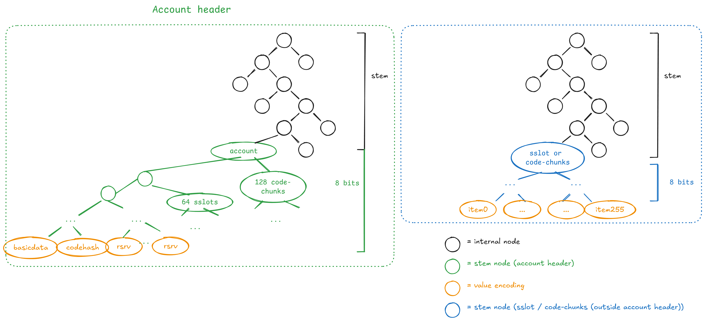
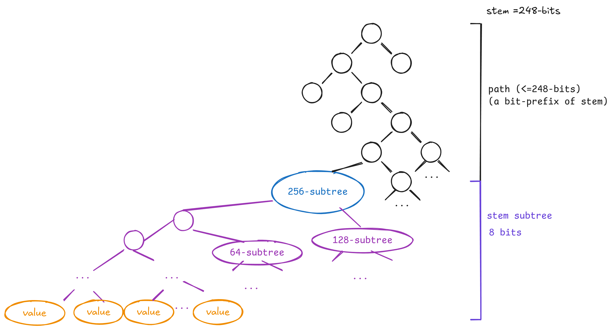

## Abstract

Introduce a new binary state tree, intended to replace the hexary patricia trees. Account and storage tries are merged into a single tree with 32-byte keys, which also contains contracts code. Account data is broken into independent leaves which  are grouped by 256 in order to provide some locality.

Note: The hash function used in the current draft is not final. The current implementation uses BLAKE3 to reduce friction for EL clients experimenting with this EIP, but the final decision remains TBD. Other potential candidates include Keccak and Poseidon2. 

For Poseidon2, there's an ongoing Ethereum Foundation cryptography initiative assessing its security properties. If Poseidon2 is selected, additional specifications will be needed for field selection (BN254 scalar field, 31-bit field elements, etc.) and encoding 32-byte values into field elements.

The hash function can be switched with minimal impact on implementations as this EIP progresses toward acceptance. **Do not** assume BLAKE3 is a final decision.

## Motivation

Ethereum's long-term goal is to allow blocks to be proved with validity proof so that chain verification is as simple and fast as possible. One of the most challenging parts of achieving that goal is proving the state of the tree, which is required for EVM execution.

The current Merkle-Patricia Trie (MPT) design isn't friendly to validity proofs for many reasons, such as using RLP for node encoding, Keccak as a hashing function, being a "tree of trees", and not including accounts code as part of the state.

Apart from requiring a state tree design that is friendly for block validity proofs, it's also important to have fast and small regular Merkle proofs when the amount of state to prove is small. This is useful not only for the application layer but also for supporting future protocol needs in a stateless world (e.g: inclusion lists).

Regarding these regular Merkle proofs in an MPT, since it's a hexary tree, their size is quite big on average and in worst-case scenarios. Given a 2^32 size tree, the expected size for proving a single branch is `15 * 32 * log_16(2^32) = 3840`. From a worst-case block perspective, if 30M gas is used to access only a single byte of different account codes since this code isn't chunkified, we'd need `30M/2400*(5*480+24k)=330MB`.

A binary tree has a good balance between out-of-circuit and in-circuit proving. Since the tree arity is two, this reduces the size of regular Merkle proofs (i.e., `# siblings * log_arity(N)` for arity 2 is better than for arity 16). Moreover, we propose switching from Keccak to a more proving-friendly hash function, which would be more amenable to modern proving systems.

## Specification

The keywords "MUST", "MUST NOT", "REQUIRED", "SHALL", "SHALL NOT", "SHOULD", "SHOULD NOT", "RECOMMENDED", "NOT RECOMMENDED", "MAY", and "OPTIONAL" in this document are to be interpreted as described in RFC 2119 and RFC 8174.

### Notable changes from the hexary structure

- The account and storage tries are merged into a single trie.
- RLP is no longer used.
- The account's code is chunked and included in the tree.
- Account data (e.g., balance, nonce, first storage slots, first code-chunks) is co-located in the tree to reduce branch openings.

### Tree structure

The proposed Binary Tree stores key-value entries where both the key and value are 32 bytes. The first 31-bytes of the key define the entry stem, and the last byte is the subindex in that stem. If two keys have the same stem, they live in the same "big branch" — this co-locates groups of 256 keys (i.e: keys with the same first 31-bytes).


(More details about the purple/orange part in the "Tree embedding" section)

We can distinguish four node types:

- `InternalNode` has a `left_hash` and `right_hash` field (black).
- `StemNode` has fields `stem`, `left_hash` and `right_hash` (blue).
- `LeafNode` has a field `value` which is a 32-byte blob or `empty`. (orange).
- `EmptyNode` represents an empty node/sub-tree.

The path to a `StemNode` is defined by the key's first 248-bits (31-bytes) from MSB to LSB. From this node, a subtree of 256 values exists indexed by the key's last byte (8 bits). A newly created `StemNode` subtree (i.e: 256 values) has all leaves with `value: empty`.

The path length isn't 248-bits, but contains the minimal amount of `InternalNodes` required if other stems exist with the same prefix. As in, when walking the 248-bit path inserting a new `StemNode`, you can end on a `EmptyNode` or `StemNode`. In the former, you replace it with the new `StemNode`. In the latter, you create as many `InternalNodes` as common bits both stems have as prefixes. Another way to look at this is that there aren't _extension nodes_ in paths, but we use the minimal amount of `InternalNodes` to place `StemNode`s with common prefixes.

Below is an implementation that describes the tree structure:

```python
class StemNode:
    def __init__(self, stem: bytes):
        assert len(stem) == 31, "stem must be 31 bytes"
        self.stem = stem
        self.values: list[Optional[bytes]] = [None] * 256

    def set_value(self, index: int, value: bytes):
        self.values[index] = value

class InternalNode:
    def __init__(self):
        self.left = None
        self.right = None

class BinaryTree:
    def __init__(self):
        self.root = None

    def insert(self, key: bytes, value: bytes):
        assert len(key) == 32, "key must be 32 bytes"
        assert len(value) == 32, "value must be 32 bytes"
        stem = key[:31]
        subindex = key[31]

        if self.root is None:
            self.root = StemNode(stem)
            self.root.set_value(subindex, value)
            return

        self.root = self._insert(self.root, stem, subindex, value, 0)

    def _insert(self, node, stem, subindex, value, depth):
        assert depth < 248, "depth must be less than 248"

        if node is None:
            node = StemNode(stem)
            node.set_value(subindex, value)
            return node

        stem_bits = self._bytes_to_bits(stem)
        if isinstance(node, StemNode):
            # If the stem already exists, update the value.
            if node.stem == stem:
                node.set_value(subindex, value)
                return node
            existing_stem_bits = self._bytes_to_bits(node.stem)
            return self._split_leaf(
                node, stem_bits, existing_stem_bits, subindex, value, depth
            )

        # We're in an internal node, go left or right based on the bit.
        bit = stem_bits[depth]
        if bit == 0:
            node.left = self._insert(node.left, stem, subindex, value, depth + 1)
        else:
            node.right = self._insert(node.right, stem, subindex, value, depth + 1)
        return node

    def _split_leaf(self, leaf, stem_bits, existing_stem_bits, subindex, value, depth):
        # If the stem bits are the same up to this depth, we need to create another
        # internal node and recurse.
        if stem_bits[depth] == existing_stem_bits[depth]:
            new_internal = InternalNode()
            bit = stem_bits[depth]
            if bit == 0:
                new_internal.left = self._split_leaf(
                    leaf, stem_bits, existing_stem_bits, subindex, value, depth + 1
                )
            else:
                new_internal.right = self._split_leaf(
                    leaf, stem_bits, existing_stem_bits, subindex, value, depth + 1
                )
            return new_internal
        else:
            new_internal = InternalNode()
            bit = stem_bits[depth]
            stem = self._bits_to_bytes(stem_bits)
            if bit == 0:
                new_internal.left = StemNode(stem)
                new_internal.left.set_value(subindex, value)
                new_internal.right = leaf
            else:
                new_internal.right = StemNode(stem)
                new_internal.right.set_value(subindex, value)
                new_internal.left = leaf
            return new_internal
```

### Node merkelization

Define `hash(value)` as:

- `hash([0x00] * 64) = [0x00] * 32`
- `hash(value) = H(value)`, where H is the selected cryptographic hash function.

The `value` parameter lengths can only be 32 and 64.

Merkelize each node type as follows:

- `internal_node_hash = hash(left_hash || right_hash)`
- `stem_node_hash = hash(stem || 0x00 || hash(left_hash || right_hash))`
- `leaf_node_hash = hash(value)`
- `empty_node_hash = [0x00] * 32`

Below is an implementation of these rules using BLAKE3 as a reference implementation:

```python
def _hash(self, data):
    if data in (None, b"\x00" * 64):
        return b"\x00" * 32

    assert len(data) == 64 or len(data) == 32, "data must be 32 or 64 bytes"
    return blake3(data).digest()  # This will be replaced with the final hash function

def merkelize(self):
    def _merkelize(node):
        if node is None:
            return b"\x00" * 32
        if isinstance(node, InternalNode):
            left_hash = _merkelize(node.left)
            right_hash = _merkelize(node.right)
            return self._hash(left_hash + right_hash)

        level = [self._hash(x) for x in node.values]
        while len(level) > 1:
            new_level = []
            for i in range(0, len(level), 2):
                new_level.append(self._hash(level[i] + level[i + 1]))
            level = new_level

        return self._hash(node.stem + b"\0" + level[0])

    return _merkelize(self.root)
```

### Tree embedding

Instead of a two-layer structure like the MPT, we will embed all information into a unique `key: value` space in the proposed single tree. This section specifies which tree keys store the state's information (account header data, code, storage). The data is colocated in such way that data that is usually accessed together lives in the same `StemNode` which reduces branch openings.

The following is a big picture of what we'll continue to describe in the rest of this section:



The account stem (green `account` node) contains accounts basic data, first 64-storage slots, and first 128-code chunks. This co-location of data allows having data in a single stem branch that is usually accessed together. The rest of storage slots and code-chunks are spread into groups of 256 values in the rest of the tree -- this is also done for convenience since slots/code-chunks that are close together will share the same stem branch.

| Parameter             | Value   |
| --------------------- | ------- |
| BASIC_DATA_LEAF_KEY   | 0       |
| CODE_HASH_LEAF_KEY    | 1       |
| HEADER_STORAGE_OFFSET | 64      |
| CODE_OFFSET           | 128     |
| STEM_SUBTREE_WIDTH    | 256     |
| MAIN_STORAGE_OFFSET   | 256**31 |

_It's a required invariant that `STEM_SUBTREE_WIDTH > CODE_OFFSET > HEADER_STORAGE_OFFSET` and that `HEADER_STORAGE_OFFSET` is greater than the leaf keys. Additionally, `MAIN_STORAGE_OFFSET` MUST be a power of `STEM_SUBTREE_WIDTH`._

Note that addresses are always passed around as an `Address32`. To convert existing addresses to `Address32`, prepend with 12 zero bytes:

```python
def old_style_address_to_address32(address: Address) -> Address32:
    return b'\\x00' * 12 + address
```

### Header values

These are the positions in the tree at which header fields of an account are stored.

```python
def tree_hash(inp: bytes) -> bytes32:
    return bytes32(blake3.blake3(inp).digest())

def get_tree_key(address: Address32, tree_index: int, sub_index: int):
    # Assumes STEM_SUBTREE_WIDTH = 256
    return tree_hash(address + tree_index.to_bytes(32, "little"))[:31] + bytes(
        [sub_index]
    )

def get_tree_key_for_basic_data(address: Address32):
    return get_tree_key(address, 0, BASIC_DATA_LEAF_KEY)

def get_tree_key_for_code_hash(address: Address32):
    return get_tree_key(address, 0, CODE_HASH_LEAF_KEY)
```

An account's `version`, `balance`, `nonce`, and `code_size` fields are packed with big-endian encoding in the value found at `BASIC_DATA_LEAF_KEY`:

| Name        | Offset | Size |
| ----------- | ------ | ---- |
| `version`   | 0      | 1    |
| `code_size` | 5      | 3    |
| `nonce`     | 8      | 8    |
| `balance`   | 16     | 16   |

Bytes `1..4` are reserved for future use.

The current layout and encoding allow for an extension of `code_size` to 4 bytes without changing the account version. The goal of packing these fields together in a basic-data leaf is to reduce gas costs, since we only need one branch opening compared with the usual 3 or 4 if the fields aren't packed. This also simplifies witness generation.

When any account header field is set, the `version` field is also set to zero. The `codehash` and `code_size` fields are set upon contract or EOA creation.

### Code

```python
def get_tree_key_for_code_chunk(address: Address32, chunk_id: int):
    return get_tree_key(
        address,
        (CODE_OFFSET + chunk_id) // STEM_SUBTREE_WIDTH,
        (CODE_OFFSET + chunk_id)  % STEM_SUBTREE_WIDTH
    )
```

Chunk `i` stores a 32 byte value, where bytes 1…31 are bytes `i*31...(i+1)*31 - 1` of the code (i.e. the i'th 31-byte slice of it), and byte 0 is the number of leading bytes that are part of PUSHDATA (e.g. if part of the code is `...PUSH4 99 98 | 97 96 PUSH1 128 MSTORE...` where `|` is the position where a new chunk begins, then the encoding of the latter chunk would begin `2 97 96 PUSH1 128 MSTORE` to reflect that the first 2 bytes are PUSHDATA).

For precision, here is an implementation of code chunkification:

```python
PUSH_OFFSET = 95
PUSH1 = PUSH_OFFSET + 1
PUSH32 = PUSH_OFFSET + 32

def chunkify_code(code: bytes) -> Sequence[bytes32]:
    # Pad to multiple of 31 bytes
    if len(code) % 31 != 0:
        code += b'\\x00' * (31 - (len(code) % 31))
    # Figure out how much pushdata there is after including each byte
    bytes_to_exec_data = [0] * (len(code) + 32)
    pos = 0
    while pos < len(code):
        if PUSH1 <= code[pos] <= PUSH32:
            pushdata_bytes = code[pos] - PUSH_OFFSET
        else:
            pushdata_bytes = 0
        pos += 1
        for x in range(pushdata_bytes):
            bytes_to_exec_data[pos + x] = pushdata_bytes - x
        pos += pushdata_bytes
    # Output chunks
    return [
        bytes([min(bytes_to_exec_data[pos], 31)]) + code[pos: pos+31]
        for pos in range(0, len(code), 31)
    ]

```

### Storage

```python
def get_tree_key_for_storage_slot(address: Address32, storage_key: int):
    if storage_key < (CODE_OFFSET - HEADER_STORAGE_OFFSET):
        pos = HEADER_STORAGE_OFFSET + storage_key
    else:
        pos = MAIN_STORAGE_OFFSET + storage_key
    return get_tree_key(
        address,
        pos // STEM_SUBTREE_WIDTH,
        pos % STEM_SUBTREE_WIDTH
    )
```

Note that storage slots within the same range of size `STEM_SUBTREE_WIDTH` (i.e. a range with the form `x*STEM_SUBTREE_WIDTH ... (x+1)*STEM_SUBTREE_WIDTH-1)` are all, except for the `HEADER_STORAGE_OFFSET` special case, part of a single stem.

### Fork

Described in [EIP-7612](./eip-7612.md).

### Access events

Described in [EIP-4762](./eip-4762.md).

## Rationale

This EIP defines a new Binary Tree that starts empty. Only new state changes are stored in the tree. The MPT continues to exist but is frozen. This sets the stage for a future hard fork that migrates the MPT data to this Binary Tree ([EIP-7748](./eip-7748.md)).

### Single tree design

The proposal uses a single-layer tree structure with 32-byte keys and values for several reasons:

- **Simplicity**: working with the abstraction of a key/value store makes it easier to write code dealing with the tree (e.g. database reading/writing, caching, syncing, proof creation, and verification) and upgrade it to other trees in the future. Additionally, witness gas rules can become simpler and clearer.
- **Uniformity**: the state is uniformly spread throughout the tree; even if a single contract has millions of storage slots, the contract's storage slots are not concentrated in one place. This is useful for state-syncing algorithms. Additionally, it helps reduce the effectiveness of unbalanced tree-filling attacks.
- **Extensibility**: account headers and code being in the same structure as storage makes it easier to extend both features and even add new structures if desired.

### SNARK friendliness and Post-Quantum security

The proposed design should consider the usual complexity, performance, and efficiency for out-of-circuit implementations (i.e. EL clients) and in-circuit ones for generating proofs in ZK circuits.

The tree design structure tries to be simple, by not having complex branching rules. For example, in contrast with the MPT, we avoid extension nodes injected in the middle of branches. Also, RLP encoding was removed since it adds unnecessary complexity. Although complexity can be managed more easily in out-of-circuit implementations, it's valuable to help circuit implementations be as simple as possible to avoid proving overhead.

The most important factor in the design is the cryptographic hash function used for merkleization. This hash function should have efficient implementations both out and in circuits. The hash function selection remains TBD, with several candidates under consideration:

1. **BLAKE3**:
   - Good out-of-circuit performance (i.e., for raw EL client execution)
   - Reasonable in-circuit performance for proving
   - Well-established security properties
   - Currently used in the reference implementation to facilitate experimentation

2. **Keccak**:
   - Already used in Ethereum, reducing implementation complexity
   - Well-studied security properties
   - Less efficient for circuit proving than alternatives

3. **Poseidon2**:
   - Excellent in-circuit performance for ZK proofs
   - Potentially better proving throughput
   - Security analysis still ongoing through EF cryptography initiative
   - Would require additional specification for field selection and encoding

The final hash function selection will balance these considerations, with particular attention to security, proving efficiency, and implementation complexity.

Due to recent progress in the quantum computing field, expert estimations consider that they can become real in the 2030s. NIST suggests stopping the use of ECC by 2030 too. Other alternatives, such as Verkle Trees, introduce a new cryptography stack to the protocol, which relies on elliptic curves that aren't post-quantum secure. This makes the current tree proposal attractive since it only depends on hash functions, which are still safe in this new paradigm.

Moreover, there has been impressive progress in proving systems, which indicates that we could be close to achieving the required performance for creating pre-state & post-state proofs fast enough. This last point is crucial since the main advantage of Verkle Trees was having proofs that are small and fast to generate.

Finally, the current state tree proposal will probably be the final state tree used in the protocol, compared with Verkle Trees, which would eventually need to be replaced by a post-quantum secure alternative.

### Arity-2

Binary tries have been chosen primarily because they reduce the witness size. In general, in an `N`-element tree with each element having `k` children, the average size of a branch is roughly `32 * (k-1) * log(N) / log(k)` plus a few percent for overhead. 32 is the length of a hash; the `k-1` refers to the fact that a Merkle proof needs to provide all `k-1` sister nodes at each level, and `log(N) / log(k)` is an approximation of the number of levels in the tree (e.g. a tree where each node has 5 children, with 625 nodes total, would have depth 4, as `625 = 5**4` and so `log(625) / log(5) = 4`).

For any `N`, the expression is minimized at `k = 2`. Here's a table of branch lengths for different `k` values assuming `N = 2**24`:

| `k` (children per node) | Branch length (chunks) | Branch length (bytes) |
| ----------------------- | ---------------------- | --------------------- |
| 2                       | 1 * 24 = 24            | 768                   |
| 4                       | 3 * 12 = 36            | 1152                  |
| 8                       | 7 * 8 = 56             | 1792                  |
| 16                      | 15 * 6 = 90            | 2880                  |

Actual branch lengths might be slightly larger than this due to uneven distribution, but the pattern of `k=2` remains by far the best.

### Tree depth

The tree design attempts to be as simple as possible considering both out-of-circuit and circuit implementations, while satisfying our throughput constraints on proving hashes.

The proposed design avoids a full 248-bit depth as it would happen in a Sparse Merkle Tree (SMT). This approach helps reduce the hashing load in proving systems, which is currently a throughput bottleneck on commodity hardware. The choice of hash function will impact this consideration - arithmetic-friendly hash functions like Poseidon2 would have different performance characteristics than cryptographic hash functions like BLAKE3 or Keccak. There are some optimization techniques that could be applied, but they add complexity to the specification.

Moreover, we could push this further trying to introduce extension nodes in the middle of paths as done in a MPT, but this also adds complexity that might not be worth it considering the tree should be quite balanced.

### State-expiry

State-expiry strategies such as [EIP-7736](./eip-7736.md) could still be applied, requiring a change in the design. One potential solution is adding a field to the `StemNode` with `epoch` as described in the mentioned EIP. Another alternative is to use 247-bits for the stem, and have two subtrees `StemValuesNode`, which would correspond to the current 256-values, and `StemMetaNode` which is also a 256-subtree that can be used to store arbitrary stem metadata.

## Backwards Compatibility

The main breaking changes are:

- (1) Gas costs for code chunk access can have an impact on applications' economic viability
- (2) Tree structure change makes in-EVM proofs of historical state no longer work

(1) can be mitigated by increasing the gas limit while implementing this EIP, allowing the same economic viability for applications.

<!-- TODO:

## Test Cases

- Add comprehensive test vectors for tree operations
- Finalize hash function selection and provide test vectors for the selected function
- Add test cases for edge cases in tree operations

-->

<!-- TODO: Remove external link

## Reference Implementation

Python reference implementation (`github.com/jsign/binary-tree-spec`).

-->

## Security Considerations

Needs discussion. <!-- TODO -->

## Copyright

Copyright and related rights waived via [CC0](../LICENSE.md).
