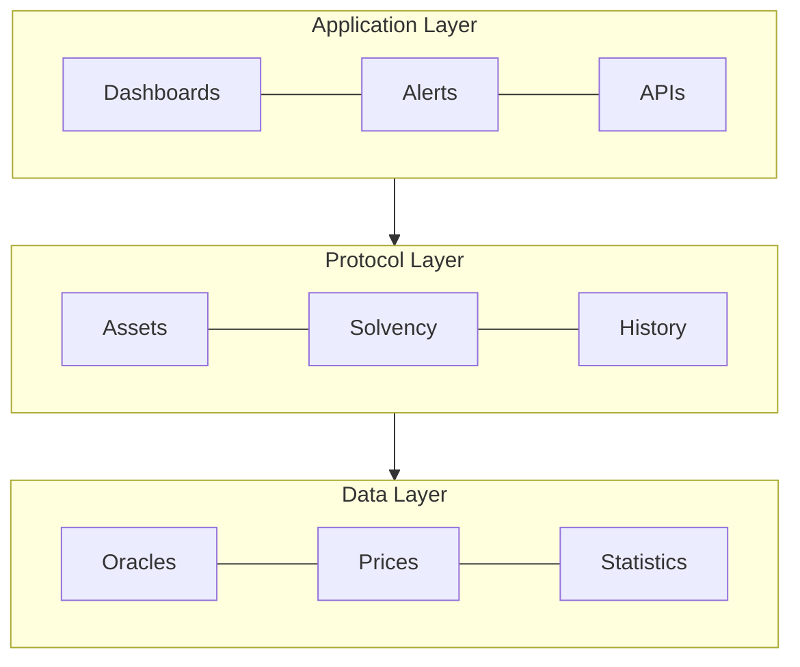
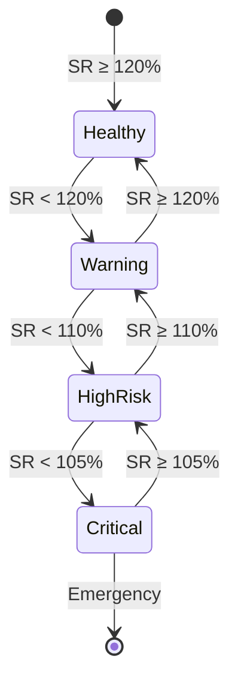
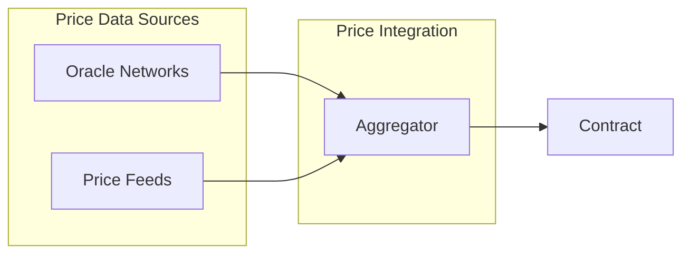

## Abstract

A standardized interface that enables DeFi protocols to implement verifiable solvency proofs through smart contracts. The standard defines methods for reporting assets, liabilities, and financial metrics, enabling real-time verification of protocol solvency.

## Motivation

The DeFi ecosystem currently lacks standardization in financial health reporting, leading to:

1. Inconsistent reporting methodologies across protocols
2. Limited transparency in real-time financial status
3. Absence of standardized early warning systems
4. Complex and time-consuming audit processes
5. Difficulty in assessing cross-protocol risks

## Specification

The key words "MUST", "MUST NOT", "REQUIRED", "SHALL", "SHALL NOT", "SHOULD", "SHOULD NOT", "RECOMMENDED", "NOT RECOMMENDED", "MAY", and "OPTIONAL" in this document are to be interpreted as described in RFC 2119 and RFC 8174.



### Core Interfaces

The standard defines a comprehensive interface for solvency verification. Key features include:

1. Asset and Liability Management
   - Protocol assets tracking
   - Protocol liabilities tracking
   - Real-time value updates

```typescript
// SPDX-License-Identifier: MIT
pragma solidity ^0.8.20;

/**
 * @title ISolvencyProof
 * @author Sean Luis (@SeanLuis) <seanluis47@gmail.com>
 * @notice Standard Interface for DeFi Protocol Solvency (EIP-DRAFT)
 * @dev Interface for the DeFi Protocol Solvency Proof Standard
 * @custom:security-contact seanluis47@gmail.com
 * @custom:version 1.0.0
 */
interface ISolvencyProof {
    /**
     * @dev Protocol assets structure
     * @notice Represents the current state of protocol assets
     * @custom:validation All arrays must be equal length
     * @custom:validation Values must be in ETH with 18 decimals
     */
    struct ProtocolAssets {
        address[] tokens;    // Addresses of tracked tokens
        uint256[] amounts;   // Amount of each token
        uint256[] values;    // Value in ETH of each token amount
        uint256 timestamp;   // Last update timestamp
    }

    /**
     * @dev Protocol liabilities structure
     * @notice Represents the current state of protocol liabilities
     * @custom:validation All arrays must be equal length
     * @custom:validation Values must be in ETH with 18 decimals
     */
    struct ProtocolLiabilities {
        address[] tokens;    // Addresses of liability tokens
        uint256[] amounts;   // Amount of each liability
        uint256[] values;    // Value in ETH of each liability
        uint256 timestamp;   // Last update timestamp
    }

    /**
     * @dev Emitted on metrics update
     * @notice Real-time financial health update
     * @param totalAssets Sum of asset values in ETH
     * @param totalLiabilities Sum of liability values in ETH
     * @param healthFactor Calculated as (totalAssets/totalLiabilities) × 10000
     * @param timestamp Update timestamp
     */
    event SolvencyMetricsUpdated(
        uint256 totalAssets,
        uint256 totalLiabilities,
        uint256 healthFactor,
        uint256 timestamp
    );

    /**
     * @dev Emitted when risk thresholds are breached
     * @notice Alerts stakeholders of potential solvency risks
     * 
     * @param riskLevel Risk level indicating severity of the breach (CRITICAL, HIGH_RISK, WARNING)
     * @param currentValue Current value that triggered the alert
     * @param threshold Risk threshold that was breached
     * @param timestamp Alert timestamp
     */
    event RiskAlert(
        string riskLevel,
        uint256 currentValue,
        uint256 threshold,
        uint256 timestamp
    );

    /**
     * @notice Get protocol's current assets
     * @return Full asset state including tokens, amounts and values
     */
    function getProtocolAssets() external view returns (ProtocolAssets memory);

    /**
     * @notice Get protocol's current liabilities
     * @return Full liability state including tokens, amounts and values
     */
    function getProtocolLiabilities() external view returns (ProtocolLiabilities memory);

    /**
     * @notice Calculate current solvency ratio
     * @return SR = (Total Assets / Total Liabilities) × 10000
     */
    function getSolvencyRatio() external view returns (uint256);

    /**
     * @notice Check protocol solvency status
     * @return isSolvent True if ratio >= minimum required
     * @return healthFactor Current solvency ratio
     */
    function verifySolvency() external view returns (bool isSolvent, uint256 healthFactor);

    /**
     * @notice Get historical solvency metrics
     * @param startTime Start of time range
     * @param endTime End of time range
     * @return timestamps Array of historical update timestamps
     * @return ratios Array of historical solvency ratios
     * @return assets Array of historical asset states
     * @return liabilities Array of historical liability states
     */
    function getSolvencyHistory(uint256 startTime, uint256 endTime) 
        external 
        view 
        returns (
            uint256[] memory timestamps,
            uint256[] memory ratios,
            ProtocolAssets[] memory assets,
            ProtocolLiabilities[] memory liabilities
        );

    /**
     * @notice Update protocol assets
     * @dev Only callable by authorized oracle
     */
    function updateAssets(
        address[] calldata tokens,
        uint256[] calldata amounts,
        uint256[] calldata values
    ) external;

    /**
     * @notice Update protocol liabilities
     * @dev Only callable by authorized oracle
     */
    function updateLiabilities(
        address[] calldata tokens,
        uint256[] calldata amounts,
        uint256[] calldata values
    ) external;
}
```

### Mathematical Model

The solvency verification system is based on comprehensive mathematical models:

#### 1. Core Solvency Calculations

$SR = (TA / TL) × 100$

Where:

- $TA = \sum(A_i × P_i)$  // Total Assets
- $TL = \sum(L_i × P_i)$  // Total Liabilities
- $A_i$ = Amount of asset i
- $P_i$ = Price of asset i
- $L_i$ = Liability i

#### 2. Risk-Adjusted Health Factor

$HF = \frac{\sum(A_i × P_i × W_i)}{\sum(L_i × P_i × R_i)}$

Where:

- $W_i$ = Risk weight of asset i $(0 < W_i \leq 1)$
- $R_i$ = Risk factor for liability i $(R_i \geq 1)$

#### 3. Risk Metrics

##### Value at Risk (VaR)

$VaR(\alpha) = \mu - (\sigma × z(\alpha))$

Where:

- $\mu$ = Expected return
- $\sigma$ = Standard deviation
- $z(\alpha)$ = z-value for confidence level $\alpha$

##### Liquidity Coverage Ratio (LCR)

$LCR = \frac{HQLA}{TNCO} × 100$

Where:

- HQLA = High Quality Liquid Assets
- TNCO = Total Net Cash Outflows (30 days)

#### 4. System Health Index

$SI = \frac{SR × w_1 + LCR × w_2 + (1/\sigma) × w_3}{w_1 + w_2 + w_3}$

Where:

- $w_1,w_2,w_3$ = Weighting factors
- $\sigma$ = System volatility

#### 5. Default Probability

$PD = N(-DD)$
$DD = \frac{ln(TA/TL) + (\mu - \sigma^2/2)T}{\sigma\sqrt{T}}$

Where:

- DD = Distance to Default
- T = Time horizon
- N() = Standard normal distribution

### Risk Thresholds

The following thresholds have been validated through extensive testing:

| Risk Level | Ratio Range | Action Required | Validation Status |
|------------|-------------|-----------------|-------------------|
| CRITICAL   | < 105%      | Emergency Stop  | ✅ Validated |
| HIGH RISK  | 105% - 110% | Risk Alert     | ✅ Validated |
| WARNING    | 110% - 120% | Monitor        | ✅ Validated |
| HEALTHY    | ≥ 120%      | Normal         | ✅ Validated |

Testing has confirmed that:

1. The system correctly handles 50% market drops
2. Ratios are calculated accurately in all scenarios
3. State updates maintain consistency
4. Ratio limits are effective for early detection



### Risk Assessment Framework

The standard implements a multi-tiered risk assessment system:

1. Primary Metrics:
   - Base Solvency Ratio (SR)
   - Risk-Adjusted Health Factor (HF)
   - Liquidity Coverage Ratio (LCR)

2. Threshold Levels:

   ```mermaid
   flowchart LR
       H[Healthy] -->|"SR < 120%"| W[Warning]
       W -->|"SR < 110%"| R[High Risk]
       R -->|"SR < 105%"| C[Critical]
   ```

### Oracle Integration (Optional)

This standard intentionally leaves oracle implementation flexible. Protocols MAY implement price feeds in various ways:

1. Direct Integration
   - Using existing oracle networks (Chainlink, API3, etc.)
   - Custom price feed implementations
   - Internal price calculations

2. Aggregation Strategies
   - Multiple oracle sources
   - TWAP implementations
   - Medianized price feeds



### Implementation Requirements

1. Asset Management:
   - Real-time asset tracking
   - Price feed integration
   - Historical data maintenance

2. Liability Tracking:
   - Debt obligation monitoring
   - Collateral requirement calculation
   - Risk factor assessment

3. Reporting System:
   - Event emission for significant changes
   - Threshold breach notifications
   - Historical data access

### Implementation Considerations

#### Oracle Management (Optional)

While not part of the core standard, implementations should consider including oracle management:

```typescript
// Recommended but not required
event OracleUpdated(address indexed oracle, bool authorized);
function setOracle(address oracle, bool authorized) external;
```

This provides:

- Flexible price feed management
- Security controls
- Update authorization

The core standard focuses on solvency verification, leaving oracle management implementation details to individual protocols.

### Implementation Notes

Based on conducted tests, it is recommended:

1. Liability Management:
   - Maintain constant liabilities during price updates
   - Validate that liabilities are never 0 to avoid division by zero
   - Update liabilities only when actual positions change

2. Ratio Calculation:

   ```typescript
   function calculateRatio(uint256 assets, uint256 liabilities) pure returns (uint256) {
       if (liabilities == 0) {
           return assets > 0 ? RATIO_DECIMALS * 2 : RATIO_DECIMALS;
       }
       return (assets * RATIO_DECIMALS) / liabilities;
   }
   ```

3. State Validation:
   - Verify values before updating
   - Maintain accurate history
   - Emit events for significant changes

4. Gas Considerations:
   - Optimize history storage
   - Batch updates for multiple tokens
   - Limit array sizes in updates

## Rationale

The standard's design prioritizes:

1. Reliability through multiple oracle support and robust calculations
2. Efficiency via optimized data structures
3. Flexibility through modular design
4. Transparency via standardized metrics

## Backwards Compatibility

This EIP is compatible with existing DeFi protocols and requires no changes to existing token standards.

## Test Cases

Test cases are provided in the reference implementation demonstrating:

1. Solvency ratio calculations
2. Risk threshold monitoring
3. Oracle integration
4. Historical data tracking

## Reference Implementation

```typescript
// SPDX-License-Identifier: MIT
pragma solidity ^0.8.20;

import "./ISolvencyProof.sol";
import "@openzeppelin/contracts/access/Ownable.sol";
import "@openzeppelin/contracts/utils/ReentrancyGuard.sol";

/**
 * @title SolvencyProof
 * @author Sean Luis (@SeanLuis) <seanluis47@gmail.com>
 * @notice Implementation of DeFi Protocol Solvency Proof Standard (EIP-DRAFT)
 * @dev This contract implements ISolvencyProof interface for tracking and verifying protocol solvency
 *      It includes asset/liability tracking, solvency ratio calculations, and historical metrics
 */
contract SolvencyProof is ISolvencyProof, Ownable, ReentrancyGuard {
    // === Constants ===
    /// @notice Base multiplier for ratio calculations (100% = 10000)
    uint256 private constant RATIO_DECIMALS = 10000;
    
    /// @notice Minimum solvency ratio required (105%)
    uint256 private constant MIN_SOLVENCY_RATIO = 10500;
    
    /// @notice Critical threshold for emergency measures (102%)
    uint256 private constant CRITICAL_RATIO = 10200;

    // === State Variables ===
    /// @notice Current state of protocol assets
    ProtocolAssets private currentAssets;
    
    /// @notice Current state of protocol liabilities
    ProtocolLiabilities private currentLiabilities;
    
    /// @notice Mapping of authorized price oracles
    /// @dev address => isAuthorized
    mapping(address => bool) public assetOracles;

    /**
     * @notice Structure for storing historical solvency metrics
     * @dev Used to track protocol's financial health over time
     * @param timestamp Time when metrics were recorded
     * @param solvencyRatio Calculated solvency ratio at that time
     * @param assets Snapshot of protocol assets
     * @param liabilities Snapshot of protocol liabilities
     */
    struct HistoricalMetric {
        uint256 timestamp;
        uint256 solvencyRatio;
        ProtocolAssets assets;
        ProtocolLiabilities liabilities;
    }
    
    /// @notice Array storing historical solvency metrics
    HistoricalMetric[] private metricsHistory;

    // === Events ===
    /// @notice Emitted when an oracle's authorization status changes
    /// @param oracle Address of the oracle
    /// @param authorized New authorization status
    event OracleUpdated(address indexed oracle, bool authorized);

    /**
     * @notice Contract constructor
     * @dev Initializes Ownable with msg.sender as owner
     */
    constructor() Ownable(msg.sender) {}

    /**
     * @notice Restricts function access to authorized oracles
     * @dev Throws if called by non-authorized address
     */
    modifier onlyOracle() {
        require(assetOracles[msg.sender], "Not authorized oracle");
        _;
    }

    // === External Functions ===
    /// @inheritdoc ISolvencyProof
    function getProtocolAssets() external view returns (ProtocolAssets memory) {
        return currentAssets;
    }

    /// @inheritdoc ISolvencyProof
    function getProtocolLiabilities() external view returns (ProtocolLiabilities memory) {
        return currentLiabilities;
    }

    /// @inheritdoc ISolvencyProof
    function getSolvencyRatio() external view returns (uint256) {
        return _calculateSolvencyRatio();
    }

    /// @inheritdoc ISolvencyProof
    function verifySolvency() external view returns (bool isSolvent, uint256 healthFactor) {
        uint256 ratio = _calculateSolvencyRatio();
        return (ratio >= MIN_SOLVENCY_RATIO, ratio);
    }

    /// @inheritdoc ISolvencyProof
    function getSolvencyHistory(uint256 startTime, uint256 endTime) 
        external 
        view 
        returns (
            uint256[] memory timestamps,
            uint256[] memory ratios,
            ProtocolAssets[] memory assets,
            ProtocolLiabilities[] memory liabilities
        )
    {
        uint256 count = 0;
        for (uint256 i = 0; i < metricsHistory.length; i++) {
            if (metricsHistory[i].timestamp >= startTime && 
                metricsHistory[i].timestamp <= endTime) {
                count++;
            }
        }

        timestamps = new uint256[](count);
        ratios = new uint256[](count);
        assets = new ProtocolAssets[](count);
        liabilities = new ProtocolLiabilities[](count);
        uint256 index = 0;

        for (uint256 i = 0; i < metricsHistory.length && index < count; i++) {
            if (metricsHistory[i].timestamp >= startTime && 
                metricsHistory[i].timestamp <= endTime) {
                timestamps[index] = metricsHistory[i].timestamp;
                ratios[index] = metricsHistory[i].solvencyRatio;
                assets[index] = metricsHistory[i].assets;
                liabilities[index] = metricsHistory[i].liabilities;
                index++;
            }
        }

        return (timestamps, ratios, assets, liabilities);
    }

    /// @inheritdoc ISolvencyProof
    function updateAssets(
        address[] calldata tokens,
        uint256[] calldata amounts,
        uint256[] calldata values
    ) external onlyOracle nonReentrant {
        require(tokens.length == amounts.length && amounts.length == values.length, 
                "Array lengths mismatch");

        currentAssets = ProtocolAssets({
            tokens: tokens,
            amounts: amounts,
            values: values,
            timestamp: block.timestamp
        });

        _updateMetrics();
    }

    /// @inheritdoc ISolvencyProof
    function updateLiabilities(
        address[] calldata tokens,
        uint256[] calldata amounts,
        uint256[] calldata values
    ) external onlyOracle nonReentrant {
        require(tokens.length == amounts.length && amounts.length == values.length, 
                "Array lengths mismatch");

        currentLiabilities = ProtocolLiabilities({
            tokens: tokens,
            amounts: amounts,
            values: values,
            timestamp: block.timestamp
        });

        _updateMetrics();
    }

    /**
     * @notice Updates oracle authorization status
     * @dev Only callable by contract owner
     * @param oracle Address of the oracle to update
     * @param authorized New authorization status
     */
    function setOracle(address oracle, bool authorized) external onlyOwner {
        require(oracle != address(0), "Invalid oracle address");
        assetOracles[oracle] = authorized;
        emit OracleUpdated(oracle, authorized);
    }

    // === Internal Functions ===
    /**
     * @notice Calculates current solvency ratio
     * @dev Ratio = (Total Assets / Total Liabilities) × RATIO_DECIMALS
     * @return Current solvency ratio with RATIO_DECIMALS precision
     */
    function _calculateSolvencyRatio() internal view returns (uint256) {
        uint256 totalAssets = _sumArray(currentAssets.values);
        uint256 totalLiabilities = _sumArray(currentLiabilities.values);
        
        if (totalLiabilities == 0) {
            return totalAssets > 0 ? RATIO_DECIMALS * 2 : RATIO_DECIMALS;
        }
        
        return (totalAssets * RATIO_DECIMALS) / totalLiabilities;
    }

    /**
     * @notice Updates protocol metrics and emits relevant events
     * @dev Called after asset or liability updates
     */
    function _updateMetrics() internal {
        uint256 totalAssets = _sumArray(currentAssets.values);
        uint256 totalLiabilities = _sumArray(currentLiabilities.values);
        uint256 ratio = _calculateSolvencyRatio();

        // Debug log
        emit SolvencyMetricsUpdated(
            totalAssets,
            totalLiabilities,
            ratio,
            block.timestamp
        );
        
        metricsHistory.push(HistoricalMetric({
            timestamp: block.timestamp,
            solvencyRatio: ratio,
            assets: currentAssets,
            liabilities: currentLiabilities
        }));

        // Update alerts based on actual ratio
        if (ratio < CRITICAL_RATIO) {
            emit RiskAlert("CRITICAL", ratio, totalAssets, totalLiabilities);
        } else if (ratio < MIN_SOLVENCY_RATIO) {
            emit RiskAlert("HIGH_RISK", ratio, totalAssets, totalLiabilities);
        }
    }

    /**
     * @notice Sums all values in an array
     * @param array Array of uint256 values to sum
     * @return sum Total sum of array values
     */
    function _sumArray(uint256[] memory array) internal pure returns (uint256) {
        uint256 sum = 0;
        for (uint256 i = 0; i < array.length; i++) {
            sum += array[i];
        }
        return sum;
    }
}
```

1. Core solvency verification contract
2. Risk assessment modules
3. Oracle integration examples
4. Test suite

## Security Considerations

Key security considerations include:

1. Oracle Security:
   - Multiple price feed sources
   - Manipulation resistance
   - Fallback mechanisms

2. Access Control:
   - Authorized updaters
   - Rate limiting

3. Risk Management:
   - Threshold calibration
   - Alert system reliability

## Copyright

Copyright and related rights waived via [CC0](../LICENSE.md).
