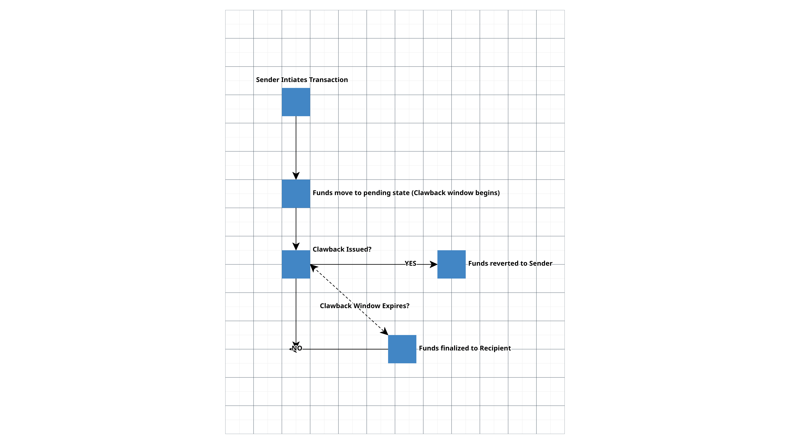

## Abstract

This EIP introduces a transaction clawback mechanism for externally owned accounts (EOAs), allowing senders to reclaim funds within a specified delay period before final settlement. This enhances security against unauthorized transfers while preserving Ethereum’s principles of immutability and finality.

## Motivation

EOAs lack built-in security to recover funds lost due to errors or hacks. This has led to:

- Irrevocable loss of funds from phishing attacks.

- No recourse for accidental transfers.

- Reliance on centralized arbitration (e.g., support requests to exchanges).

A clawback mechanism provides an opt-in, decentralized safety layer.

### Use Cases & Real-World Applications

### **Example 1: Recovering a Mistaken Transfer**

Alice accidentally sends 5 ETH to the wrong address. She had enabled a 30-minute clawback window. Within that period, Alice issues a clawback transaction, recovering her funds before final settlement.

### **Example 2: Preventing Theft from a Compromised Wallet**

Bob’s private key gets leaked, and a hacker initiates a large withdrawal from his wallet. Since Bob enabled a 1-hour clawback period, he quickly uses a separate recovery address (`clawbackAuth`) to reclaim the stolen funds before they are finalized.

### **Example 3: Preventing Large-Scale Exchange Hacks (Bybit Case Study)**

In February 2024, cryptocurrency exchange Bybit suffered a 401000 ETH hack, one of the largest crypto thefts in history. The hackers exploited security vulnerabilities and transferred Ethereum (ETH) from Bybit’s cold storage to an unidentified address, draining the exchange’s funds.

### **How Could Clawback Transactions Have Prevented This?**

If Bybit had implemented clawback-enabled transactions, the stolen ETH would have been temporarily locked in a clawback window before final settlement. This could have allowed Bybit to:

1. **Detect the Unauthorized Withdrawal:**

    - Bybit's security team could have identified the suspicious transactions during the clawback window.

2. **Execute a Clawback Before Final Settlement:**
    
    - The company could have issued a clawback transaction, reversing the fraudulent transfers before the funds were fully moved into the hacker’s control.

3. **Prevent Large-Scale Damage & Market Impact:**
    
    - Instead of instantly losing 401000 ETH hack, Bybit could have secured its assets and avoided Ethereum’s 4% price drop, which was partially triggered by the hack.

## Specification

This EIP introduces a new transaction type (0x05) enabling a clawback period before final settlement. A clawback transaction reaches final settlement once the clawback period expires without a reclaim request. If no clawback is executed within the clawback period, the transaction reaches final settlement and is treated like a standard Ethereum transaction — fully irreversible and valid in consensus.

### **Definitions**

- **Clawback Transaction:** A transaction with a delay period before finalization.

- **Clawback Window:** The period during which the sender can reclaim funds.

- **Recovery Address:** An optional address that can execute clawbacks on behalf of the sender.

### **Transaction Format**

| **Field**                 | **Type**                                         | **Description**                                    |
|---------------------------|-------------------------------------------------|----------------------------------------------------|
| `chainId`                | `uint256`                                       | Ethereum chain ID                                 |
| `nonce`                  | `uint64`                                        | Unique transaction nonce                         |
| `maxFeePerGas`           | `uint256`                                       | EIP-1559 gas fee                                 |
| `maxPriorityFeePerGas`   | `uint256`                                       | Priority gas fee                                 |
| `gasLimit`               | `uint64`                                        | Gas limit for execution                         |
| `recipient`              | `address`                                       | Target recipient address                        |
| `value`                  | `uint256`                                       | Amount of ETH to transfer                       |
| `clawbackPeriod`         | `uint64`                                        | Delay (in blocks) before final settlement       |
| `clawbackAuth`           | `address`                                       | Authorized recovery address (optional)          |
| `data`                   | `bytes`                                         | Additional transaction data                     |
| `accessList`             | `List[Tuple[address, List[uint256]]]`           | Storage optimization access list                |
| `yParity, r, s`          | `uint256`                                       | ECDSA signature fields                          |


### Clawback Execution Rules

1. **Transaction Initialization:** Funds enter a pending state upon execution.

2. **Clawback Window:** The sender has `clawbackPeriod` blocks to issue a clawback request.

3. **Final Settlement:** If no clawback is executed, funds become irreversible.

4. **Optional Recovery Address:** A designated address (`clawbackAuth`) can execute clawbacks.

## Rationale

- **Immutability is Preserved:** Transactions settle permanently after the clawback period expires.

- **Security is Enhanced:** Unauthorized transactions can be rescinded before finalization, reducing hack-related losses.

- **No Central Authority Needed:** Clawbacks are executed by the sender or an authorized wallet, ensuring decentralization.

- **Backward Compatibility:** The new transaction type `0x05` does not interfere with existing transactions.

### Dependency Justification & EVM Integration

### **Why Require EIP-2718?**

EIP-2718 introduces typed transactions, allowing Ethereum to support multiple transaction types without breaking consensus. This proposal introduces a new transaction type (`0x05`) for clawbacks, making it compatible with existing Ethereum clients while ensuring smooth integration with other EIP-2718-based transactions.

### **Why Consider EIP-2930?**

This EIP does not require Access Lists (EIP-2930), but Ethereum clients may optionally support access lists** for gas optimizations. If a clawback transaction interacts with storage-heavy contracts, an access list could reduce `SLOAD` and `SSTORE` costs, making execution more efficient. However, for simple EOA-to-EOA clawback transactions, access lists provide little benefit.

### **Transaction Type (0x05) Justification**

### **Why is This a New Transaction Type (0x05)?**

The introduction of a new transaction type (`0x05`) is necessary to ensure compatibility with Ethereum's existing transaction framework, enable delayed finalization, and provide a modular approach to clawbacks. Existing transaction types, including EIP-1559 (`0x02`) and EIP-2930 (`0x01`), do not support delayed execution, making them incompatible with the clawback mechanism.

### **Why Not Extend EIP-1559 (`0x02`)?**

- **EIP-1559 is designed for immediate execution** – Transactions settle in the same block they are included in.

- **A clawback-enabled transaction requires a delay period** before finalization, which contradicts EIP-1559’s design.

- **Gas fee handling differs** – Clawback transactions introduce conditional execution, where gas refunds may be necessary if a transaction is clawed back before final settlement.

A new transaction type (`0x05`) ensures that existing EIP-1559 transactions remain unchanged while allowing clawback transactions to have custom execution rules.

### **Why Not Use Access List Transactions (EIP-2930, `0x01`)?**

- **EIP-2930 focuses solely on reducing gas costs** by specifying storage slots upfront.

- **It does not introduce new transaction execution rules** – Clawbacks require delayed settlement, which is not part of EIP-2930’s purpose.

- **Mixing storage optimization with clawback execution would add complexity**, increasing implementation difficulty.

Access lists are useful for gas optimizations, but they are not required for clawbacks. A new transaction type ensures that clawback transactions are clearly defined.

### **Why Not Implement This as a Smart Contract Instead?**


- EOAs (Externally Owned Accounts) cannot use smart contract-based clawbacks by default since they lack code execution capabilities

- Gas overhead is higher – A smart contract clawback would require:

    1. A transaction to send funds to a smart contract.
    
    2. A second transaction to finalize or claw back the funds.

- Protocol-level enforcement is stronger – A dedicated transaction type ensures that clawbacks are handled at the EVM level.

A native transaction type is more gas-efficient, works with EOAs, and enforces clawbacks at the protocol level.

### What About EIP-7377 (Migration Transactions) and ERC-4337 (Account Abstraction)?

EIP-7377 proposes a one-time transaction type (0x04) that allows EOAs to be converted into smart contracts.
ERC-4337 enables smart contract wallets with added programmability, allowing EOAs to function like contracts with modular security features.
While these proposals increase security and flexibility, they still require:

- A migration step (EIP-7377), adding friction to adoption.

- Infrastructure upgrades (ERC-4337) that are not yet native to the Ethereum protocol and require bundlers, paymasters, and relayers.

### Hybrid Approach: Combining CeFi & DeFi Security

The ByBit hack in February 2024, which exploited a cold-to-warm wallet transfer via a masked address on a multi-sig, demonstrates why DeFi and CeFi must align on a shared security standard.
*This could have been prevented with OpenZeppelin Defender, pause functions, alerting mechanisms, and manual checks as the transfer occurred.*

This highlights the need for a hybrid security approach where:

- Smart contract wallets (ERC-4337 & EIP-7377) bring additional security, but require adoption.

- An in-protocol clawback (Type 0x05) provides a safety net for EOAs that are not using smart contract wallets.

- Institutions and high-net-worth individuals should be able to secure wallets without requiring full contract migration.

### Why a Native Clawback Transaction (0x05) is the Superior Solution

- Immediate security without requiring migration → No need for EOAs to transition into smart contract wallets.

- Works with existing Ethereum infrastructure → No reliance on bundlers or additional gas-sponsoring mechanisms (as with ERC-4337).

- Efficient gas usage → Unlike smart contract-based clawbacks, which require multiple transactions.

- Standardized, in-protocol security → Can be universally adopted without fragmentation between different wallet types.

Thus, while ERC-4337 and EIP-7377 introduce powerful security features, a native clawback transaction (0x05) is a necessary security upgrade for EOAs, ensuring fund recovery without forcing wallet migration.

## **Backwards Compatibility**

- No impact on existing Ethereum transactions.

- EOAs & smart contracts remain unaffected.

- New transaction type (`0x05`) ensures seamless integration with existing Ethereum clients.

- This proposal introduces a new transaction type (`0x05`) and does not modify existing transaction types (`0x00`, `0x01`, `0x02`). However, wallet providers (MetaMask, Ledger, Trezor) and Ethereum nodes will need to implement support for clawback transactions. Existing smart contracts and EOAs remain unaffected.

## Test Cases

To ensure the correctness, security, and gas efficiency of clawback-enabled transactions (`0x05`), the following test cases must be covered:

| **Category**        | **Test Case**                                           | **Expected Outcome**                                      |
|---------------------|---------------------------------------------------------|-----------------------------------------------------------|
| **Basic Clawback Functionality** | Initiate a clawback transaction                        | Transaction enters the pending state.                     |
|                     | Execute a clawback within the valid window          | Funds return to the sender.                               |
|                     | Finalize transaction after clawback period expires  | Funds become irreversible and settle with the recipient.  |
| **Failure Cases** | Clawback attempt after expiration window            | Reverts with `"Clawback period expired"`.               |
|                     | Unauthorized address attempts clawback              | Reverts with `"Not sender or authorized recovery address"`. |
|                     | Clawback execution when no clawback transaction exists | Reverts with `"Invalid transaction"`.                  |
| **Recovery Address Functionality** | Authorized recovery address executes clawback        | Recovery address (`clawbackAuth`) successfully claims funds. |
|                     | Unauthorized address attempts clawback              | Transaction is rejected.                               |
| **Gas Refund Handling** | Gas refund when clawback is executed before settlement | Sender gets a partial gas refund (per EIP-3529).       |
|                     | No refund if clawback period expires                | Full gas cost applies if no clawback is issued.       |
| **Security Considerations** | Recipient contract cannot intercept clawback funds    | Ensure clawback funds remain locked until settlement.  |
|                     | Replay protection                                   | Transactions cannot be replayed across chains or forks. |
|                     | Prevent gas griefing attacks                        | Excessive gas usage does not disrupt clawback execution. |

## Reference Implementation

This Solidity contract serves as a proof-of-concept for how clawback transactions could work before protocol-level adoption. If this EIP is accepted, clawback transactions (0x05) will be enforced at the consensus layer, meaning Ethereum clients (Geth, Nethermind, Besu, Erigon) will natively handle clawbacks without requiring smart contracts. This contract is included for testing and demonstration purposes only.

This implementation allows EOAs to initiate transactions with a clawback period, during which they (or an authorized recovery address) can reclaim the funds before final settlement.

````

// SPDX-License-Identifier: MIT
pragma solidity ^0.8.25;

import "@openzeppelin/contracts/security/ReentrancyGuard.sol";

contract ClawbackTransactions is ReentrancyGuard {
    struct Clawback {
        address sender;
        address recipient;
        uint256 amount;
        uint256 expiryBlock;
        bool executed;
    }

    mapping(bytes32 => Clawback) public clawbacks;

    event ClawbackInitiated(
        bytes32 indexed txHash,
        address indexed sender,
        address indexed recipient,
        uint256 amount,
        uint256 expiryBlock
    );

    event ClawbackExecuted(bytes32 indexed txHash, address indexed sender);
    event ClawbackFinalized(bytes32 indexed txHash, address indexed recipient);

    /// @notice Initiates a transaction with a clawback window
    /// @param recipient The intended recipient
    /// @param clawbackPeriod The number of blocks before the transaction is final
    function initiateClawbackTransaction(address recipient, uint256 clawbackPeriod)
        external
        payable
        nonReentrant
    {
        require(msg.value > 0, "Must send ETH");
        require(clawbackPeriod > 0 && clawbackPeriod <= 256, "Clawback period out of range");

        bytes32 txHash = keccak256(
            abi.encodePacked(msg.sender, recipient, msg.value, block.number)
        );
        require(clawbacks[txHash].amount == 0, "Transaction already exists");

        clawbacks[txHash] = Clawback({
            sender: msg.sender,
            recipient: recipient,
            amount: msg.value,
            expiryBlock: block.number + clawbackPeriod,
            executed: false
        });

        emit ClawbackInitiated(txHash, msg.sender, recipient, msg.value, block.number + clawbackPeriod);
    }

    /// @notice Allows the sender to reclaim funds before the expiry block
    function executeClawback(bytes32 txHash) external nonReentrant {
        Clawback storage cb = clawbacks[txHash];
        require(cb.amount > 0, "Invalid transaction");
        require(msg.sender == cb.sender, "Not sender");
        require(block.number <= cb.expiryBlock, "Clawback period expired");
        require(!cb.executed, "Already executed");

        cb.executed = true;
        payable(cb.sender).transfer(cb.amount);

        emit ClawbackExecuted(txHash, cb.sender);

        // Optimize storage: Delete entry after execution
        delete clawbacks[txHash];
    }

    /// @notice Finalizes transaction after clawback period expires
    function finalizeTransaction(bytes32 txHash) external nonReentrant {
        Clawback storage cb = clawbacks[txHash];
        require(cb.amount > 0, "Invalid transaction");
        require(block.number > cb.expiryBlock, "Clawback period not over");
        require(!cb.executed, "Already clawed back");

        cb.executed = true;
        payable(cb.recipient).transfer(cb.amount);

        emit ClawbackFinalized(txHash, cb.recipient);

        // Optimize storage: Delete entry after finalization
        delete clawbacks[txHash];
    }

    /// @notice Prevents self-destructs on recipient contracts
    function checkRecipient(address recipient) internal view {
        uint256 size;
        assembly {
            size := extcodesize(recipient)
        }
        require(size == 0, "Recipient cannot be contract");
    }

    /// @notice Allows querying clawback status
    function getClawbackStatus(bytes32 txHash) external view returns (bool isPending, uint256 expiryBlock, bool executed) {
        Clawback memory cb = clawbacks[txHash];
        return (block.number <= cb.expiryBlock, cb.expiryBlock, cb.executed);
    }

    receive() external payable { }
}

````

### **2. Solidity Implementation Validation**

1. **Ensure Transactions Are Held Temporarily**

    - Funds must be moved to an intermediate contract instead of the recipient immediately.
    
    - Clawbacks should only be executed within the `clawbackPeriod` and must fully revert the original transaction if called.

2. **Gas Costs & Refunds**

    - The contract should refund excess gas to prevent overcharging for failed clawback attempts.
    
    - Gas estimation should consider worst-case execution for clawback-enabled transactions.

## **Security Considerations**

The proposed clawback mechanism introduces security, execution, and gas efficiency considerations that must be addressed to ensure safety, consistency, and resistance to abuse.

### **A. Risks & Mitigation Strategies**

- **Blind Signing Risks:** Wallets must warn users when signing clawback-enabled transactions to prevent unintentional approval.

- **Recovery Address Compromise:** If `clawbackAuth` is compromised, an attacker could maliciously reclaim transactions. Users should rotate recovery addresses periodically.

- **Potential Abuse (Griefing Attacks):**
    
    - Attackers could repeatedly send and reclaim funds, causing transaction spam and disrupting services.
    
    - **Mitigation:** Limit clawback windows (e.g., max 1 hour) to prevent excessive delays.

### **2. Execution Safety & Opcode Restrictions**

### **A. Preventing Double-Spending & Reentrancy**

- **Restricted Execution During Clawback Period:**

    - Calls (`CALL`, `STATICCALL`, `DELEGATECALL`, `CALLCODE`) must not execute funds in clawback status to prevent double-spending.
    
    - **Reentrancy risks**: Malicious contracts could attempt to withdraw funds before a clawback is executed.
        
        - **Mitigation:** Use checks-effects-interactions pattern to prevent reentrancy.
    
    - **Frontrunning prevention**: Attackers may frontrun clawback requests by manipulating recipient balances.
        
        - **Mitigation:** Fixed gas costs for clawback execution to reduce miner-exploitable MEV.

### **B. Storage & State Readability**

- The EVM should expose a clawback status flag (`isPendingClawback(txHash)`) to indicate whether a transaction is finalized or pending.

- Smart contracts must query clawback state before executing fund transfers to avoid interacting with pending transactions.

- **Gas Implications:**
    
    - Clawbacks require additional `SSTORE` operations, which increase gas costs.
    
    - Gas griefing risks in that attackers could send large transactions, wait for gas fees to drop, and reclaim funds later.

### **C. Opcode Restrictions**

Since clawbacks introduce delayed execution, interactions with certain opcodes may need to be restricted to prevent inconsistencies:

- **Restricted:**
    
    - `SELFDESTRUCT`: Prevents premature contract deletion to bypass clawback mechanisms.
    
    - `BLOCKHASH`: Clawback transactions must not rely on historical block hashes.
    
    - `TIMESTAMP`: Prevents manipulation of clawback windows based on external time-based triggers.

- **Conditional:**
    
    - **`CALL`, `STATICCALL`, `DELEGATECALL`, `CALLCODE`**: Calls must not allow spending clawback-pending funds.
    
    - **`REVERT` & `INVALID`**: Transactions in clawback status should allow reversibility to prevent state inconsistencies.
    
    - **`SSTORE` & `SLOAD`**: Ensure efficient storage reads/writes for tracking clawback transactions.
    
    - **`BALANCE`**: Must differentiate between settled vs. clawback-pending funds.

### **D. Gas Usage & Execution Flow**

- **Potential Griefing Vectors:**
    
    - Attackers could send high gas limit transactions, enter a clawback state, and later revert.
    
    - **Mitigation:** Restrict gas-heavy opcodes (`EXP`, `CREATE`, `SELFDESTRUCT`).

- **Gas Refund Considerations:**
    
    - Should gas be refunded if a clawback is executed?
    
    - A possible use case is if funds are clawed back early, Ethereum’s gas refund mechanisms (`SSTORE` refund) could partially reimburse fees.

### **E. Potential Workarounds**

- **Use a Proxy Mechanism**: Transactions could be wrapped in an intermediary contract that holds funds until the clawback window expires.

- **Introduce a Precompile**: A dedicated EVM precompile could manage clawback execution efficiently at the protocol level.

### **Gas Refunds: Address Explicitly**

Since clawbacks introduce conditional execution, gas refund handling needs to be explicitly defined. Ethereum already has gas refund mechanisms (EIP-3529), and clawback transactions could benefit from refunds if executed early.

### **Gas Refund Policy**

| **Scenario**                                      | **Should Gas Be Refunded?** | **Reason**                                               |
|--------------------------------------------------|----------------------------|----------------------------------------------------------|
| Transaction finalized (no clawback)              | No refund                  | The full gas cost was used for execution.               |
| Clawback executed before the settlement window expires | Partial refund            | The transaction did not complete fully, so some gas can be refunded. |
| Attempted clawback after the window expired      | No refund                  | The transaction is already settled, and no gas should be refunded. |


If a clawback is executed before final settlement, a portion of the gas fees will be eligible for partial gas refunds to the sender in accordance with EIP-3529’s gas refund mechanism. This reduces unnecessary transaction costs and ensures fair gas usage for clawback-enabled transactions

### Diagram

Below is a high-level flow of how clawback transactions work:



### Where Can Clawbacks Be Used?

Clawback transactions (0x05) introduce delayed finalization at the protocol level, ensuring senders (or authorized recovery addresses) can reclaim funds within a predefined clawback window. While EOAs will no longer require smart contracts for clawbacks if this EIP is adopted, various use cases still exist for dApps, wallets, and protocols to leverage clawback transactions.

1. Wallet Integration & User Experience

    - Wallet providers (e.g., MetaMask, Ledger, Trezor) can integrate clawback-enabled transactions by offering users the ability to:

    - Enable a clawback window when sending funds.
    
    - Configure a recovery address (clawbackAuth).
    
    - Reclaim funds within the clawback period using a built-in “Reclaim” button.

 User Benefit: Enhanced security against phishing, mistaken transfers, and compromised accounts.

2. DeFi Protocols & Smart Contracts

    While EOAs no longer require a contract-based clawback solution, DeFi protocols can still integrate clawback-aware mechanisms.
    For example:

    - Lending & Borrowing Platforms: Before executing a loan, protocols can check -if the borrower's funds are in a pending clawback state (preventing fraudulent transactions).

    - Decentralized Exchanges (DEXs): Liquidity pools can be protected by ensuring traders cannot provide funds still in the clawback window, avoiding potential exploits.

Smart Contract Interaction Example:

````

function checkClawbackStatus(bytes32 txHash) external view returns (bool) {
    return isPendingClawback(txHash); // Query protocol-level clawback state
}

````

Protocol Benefit: Security enhancements against flash loan exploits, fraud, and unstable liquidity.

3. Centralized Exchanges (CEXs)

    Exchanges like Binance, Coinbase, and Kraken could require clawback expiration before crediting deposits, mitigating fraud and unauthorized transfers.
    For example:

    - Delayed Deposit Finalization: Exchanges could wait until a clawback expires before crediting balances.
    
    - Enhanced Withdrawal Protection: If an account is compromised, clawbacks allow exchanges to reverse unauthorized withdrawals before funds are lost.

CEX Benefit: Reduced fraud risk and improved user protection.

4. DAO & Governance Mechanisms
    
    DAOs often deal with treasury allocations, grant funding, and multi-signature transactions.
    Potential uses:

    - DAO Grant Distributions: If a grantee violates terms, a DAO can claw back funds before settlement.
    
    - Multisig Governance: Clawbacks add an extra security layer to high-value DAO transactions.

 DAO Benefit: Increased treasury security and accountability for fund distributions.

5. Layer 2 (L2) Solutions & Cross-Chain Bridges

    Clawback transactions can be extended beyond Ethereum L1 to:

    - Layer 2 Rollups (Optimism, Arbitrum) → Prevent premature withdrawals.
    
    - Cross-Chain Bridges (Axelar, Wormhole) → Add security for bridging transactions.

L2 & Cross-Chain Benefit: Stronger fund protection in bridging & rollup withdrawals.

### **Conclusion**

This EIP introduces clawback transactions (0x05), a novel transaction type that enables delayed finalization and fund recovery at the protocol level. By allowing senders or authorized recovery addresses to reclaim funds within a predefined clawback window, this proposal enhances security, user protection, and financial resilience across Ethereum.

**Key Benefits:**

- **Increased Security** – Reduces fund loss due to phishing, theft, and user error.

- **Protocol-Level Enforcement** – Eliminates reliance on smart contracts for EOAs.

- **Broad Adoption Potential** – Supports wallets, DeFi protocols, CEXs, DAOs, L2s, and more.

- **Backward Compatible** – Introduces a new transaction type without modifying EIP-1559 or breaking existing transactions.

We encourage **Ethereum developers, researchers, and community members** to review this proposal and provide feedback.  

With further refinement and community input, clawback transactions could become a vital security layer in Ethereum’s transaction framework.

## Copyright

Copyright and related rights waived via [CC0](../LICENSE.md).
