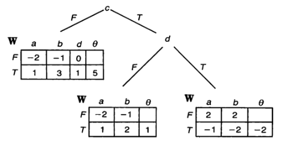
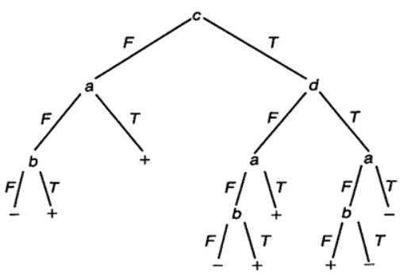
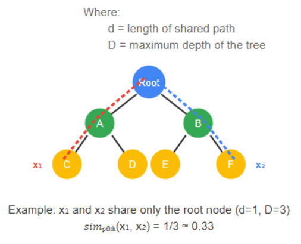
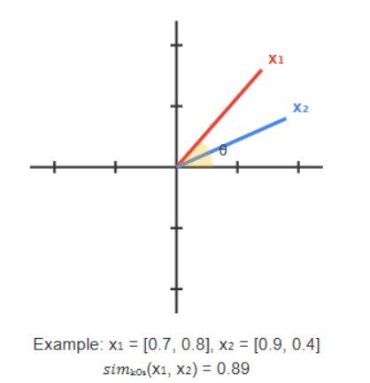
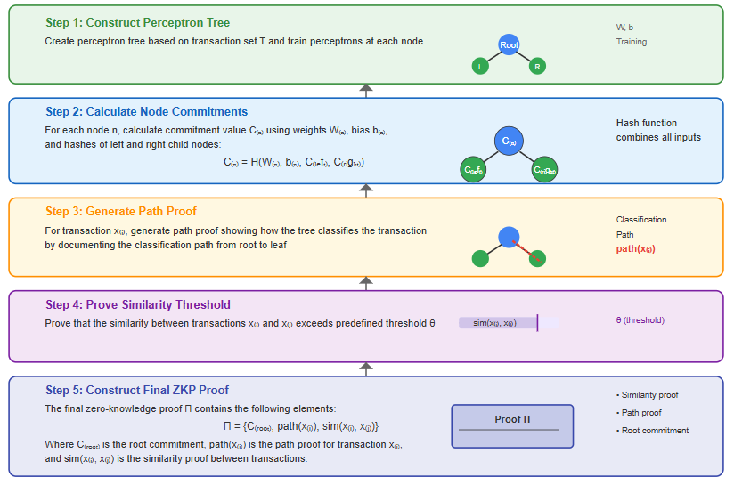

## Abstract

This project proposes a method to enhance scalability and privacy protection in the Ethereum network using a Perceptron Tree-based Zero-Knowledge Proof (ZKP) model. The Perceptron Tree, a hybrid model combining the strengths of decision trees and perceptron neural networks, provides a compressed representation for transaction relationships, facilitating efficient verification. It addresses specific drawbacks of existing zk-SNARK and zk-STARK methods, consolidating multiple transactions into a single proof to reduce gas fees and decrease on-chain verification load.

## Motivation

The significant increase in blockchain transactions has resulted in scalability limitations and privacy issues. Existing ZKP methods effectively validate individual transactions but fall short in analyzing inter-transaction relationships while maintaining privacy.

ZK-Rollups bundle multiple transactions off-chain into a single proof submitted to the Ethereum mainnet, improving throughput and reducing costs. However, current batching approaches verify transactions individually without leveraging inter-transaction patterns or relationships.

Existing privacy solutions generate separate ZK proofs for each transaction, limiting ZKP's full potential. The proposed Perceptron Tree model overcomes these limitations by measuring the similarity among multiple transactions and compressing them into a unified proof, thus broadening ZKP applications.

## Specification

### 1. Tree Construction

The system inputs a transaction dataset T = {x₁, x₂, ..., xₙ} to construct a recursive tree.

- Each node classifies transaction data using a perceptron with a linear function:

  ```
  f(x) = step(Wₐ·a + Wᵦ·b + θ)
  ```
  
  where the step function is defined as:

  ```
  step(z) = {
      1, if z ≥ 0
      0, if z < 0
  }
  ```

  

- Tree construction recursively partitions nodes based on conditions like homogeneity (isPure) or maximum depth (maxDepth).

  

### 2. Relationship Similarity Calculation

#### Path Similarity

Measures similarity by the ratio of shared paths between two transactions within the tree:

```
sim_path(xᵢ, xⱼ) = d/D
```

Where:

- d = length of shared path
- D = maximum depth of the tree



Example: If transactions x₁ and x₂ share only the root node (d=1) in a tree of depth 3, their similarity would be 1/3 ≈ 0.33.

#### Vector Space Similarity

Uses cosine similarity calculated from the feature vectors of each transaction:

```
sim_cos(xᵢ, xⱼ) = (xᵢ·xⱼ)/(‖xᵢ‖‖xⱼ‖)
```



Example: For vectors x₁ = [0.7, 0.8] and x₂ = [0.9, 0.4], the similarity is 0.91.

### 3. ZKP Proof Generation

The process follows five key steps:


1) **Construct Perceptron Tree**: Build a tree based on transaction set T and train perceptrons at each node.

2) **Calculate Node Commitments**: Compute a commitment value Cₙ for each node n using weights Wₙ, bias bₙ, and hashes of left/right child nodes:
   
   ```
   Cₙ = H(Wₙ, bₙ, Cₗₑₜₜ, Cᵣᵢₑₕₜ)
   ```

3) **Generate Path Proof**: For a specific transaction xᵢ, demonstrate the classification path within the tree.

4) **Prove Similarity Threshold**: Prove that the similarity between two transactions xᵢ and xⱼ exceeds a predefined threshold θ.

5) **Construct Final ZKP Proof**: The final Zero-Knowledge Proof Π includes:

   ```
   Π = {Cᵣₒₒₜ, path(xᵢ), sim(xᵢ, xⱼ)}
   ```
   
   Where Cᵣₒₒₜ is the root commitment, path(xᵢ) is the path proof of xᵢ, and sim(xᵢ, xⱼ) is the similarity proof between transactions.



### 4. On-chain Verification

Smart contracts verify the submitted proof (Π) by checking:

- The Cᵣₒₒₜ commitment matches the pre-registered tree root hash

- The transaction xᵢ is correctly classified along the provided path(xᵢ)

- The similarity between two transactions meets the predefined threshold θ

## Rationale

The Perceptron Tree-based ZKP model extends the capabilities of existing zero-knowledge proof techniques by incorporating transaction relationships into the proof structure. Traditional zk-SNARK and zk-STARK methods validate individual transactions but do not leverage inter-transaction similarity, which can lead to inefficiencies.

By structuring transactions using a Perceptron Tree, this model enables compression of multiple transactions into a single proof,
reducing gas fees and improving on-chain verification efficiency. The use of a perceptron-based decision structure
ensures adaptability to various transaction patterns, making it a scalable solution for Ethereum.

This proposal operates at the smart contract level, requiring no modifications to the existing Ethereum protocol or consensus algorithm.
It can be implemented alongside existing transaction verification methods, allowing optional adoption without network upgrades.

## Security Considerations

- **Privacy Protection**: Verifies transaction validity without revealing specific transaction details.

- **Tamper Resistance**: Uses commitment values based on tree structures and weights to detect data tampering.

- **Replay Attack Prevention**: Includes unique transaction IDs in proofs to avoid replay attacks.

- **Lightweight Verification**: Ensures efficient, simple proof verification operations within smart contracts, minimizing gas fees.

## Copyright

Copyright and related rights waived via [CC0](../LICENSE.md).
