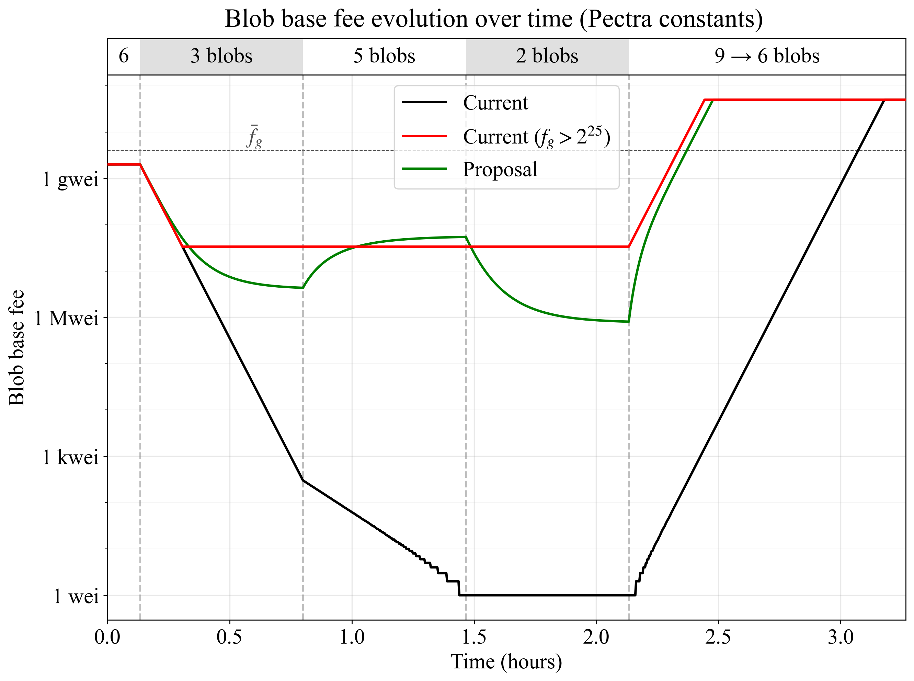

## Abstract

Reworks the excess blob gas update in `calc_excess_blob_gas()` so that the blob base fee rises relatively more during high gas usage than it falls during low usage whenever the current fee is below the long-run average. This establishes a smoothly adapting, neutral lower bound for the base fee. The exponential moving average (EMA) is computed in the linear domain and stored as a header variable.

## Motivation

Demand for blobspace is fee-inelastic, leading to a blob base fee that may fluctuate excessively with minor shifts in aggregate demand. The lower end of the fee range of 1 wei is under current circumstances economically inconsequential, but can be reached after a period of blocks consuming fewer blobs than the target. During increases in demand, the existing fee mechanism requires sustained periods of near-full blocks to re-establish equilibrium. This exacerbates spikiness in resource consumption, which can hamper efficient scaling of throughput. Furthermore, users may intermittently need to compete in a first-price auction for inclusion, degrading UX. The appropriate fee range will inadvertently vary going forward due to changes in the ETH token price and circulating supply, as well as the protocol's ability to scale throughput. To remain neutral and future-proof, the operational range should be established relative to the long-run average fee, smoothly affecting the equilibrium quantity of blobs consumed. Thus, this EIP introduces a new fee update mechanism that accounts for the long-run average fee when responding to shifts in demand. This allows the protocol to quickly converge to desirable equilibria while also remaining neutral and future-proof.



**Figure 1.** Response to various blob quantities for the proposed fee mechanism (green), the current mechanism (black), and the threshold mechanism of [EIP-7762](./eip-7762.md) (red). The proposed mechanism smoothly converges to appropriate equilibria when demand shifts, establishing the fee relative to the long-run average base fee $\bar{f}_g$ (at 4 gwei in this example). The fee adapts faster when converging toward $\bar{f}_g$ from below than when diverging from it.

## Specification

### Parameters

| Constant | Value | Short description |
| - | - | - |
| `EMA_DECAY` | `2**18` | Reciprocal of the EMA decay rate (per slot) |
| `MEAN_REVERSION_DEADBAND` | `64` | Fee ratio at which mean reversion effect accelerates |
| `MEAN_REVERSION_FULLBAND` | `10**6` | Fee ratio at which mean reversion effect stops increasing |

### Functions

The function `calc_excess_blob_gas()` from [EIP-4844](./eip-4844.md) is updated. A mean reversion weight `w` is computed based on the ratio between the long-run base fee and the current base fee. The weight influences the excess gas update by smoothly increasing the gas used and decreasing the gas target as the current base fee falls below the long-run base fee (see Figure 2 below). The variable `Up` upsamples `w` to retain precision. Note that the function applies `integer_squareroot()`, which must be implemented at the execution layer; it is currently implemented at the consensus layer. Thresholding at `MEAN_REVERSION_FULLBAND` and strategic deployment of `Up` allows the mechanism to rely on the `uint64` type internally.

```python
def calc_excess_blob_gas(parent: Header) -> int:
    if parent.excess_blob_gas + parent.blob_gas_used < TARGET_BLOB_GAS_PER_BLOCK:
        return 0

    # Compute upsampled mean reversion weight w based on the EMA fee ratio
    Up = 2**16
    if get_base_fee_per_blob_gas(parent) > parent.base_fee_per_blob_gas_ema:
        w = Up
    else:
        if parent.base_fee_per_blob_gas_ema // get_base_fee_per_blob_gas(parent) > MEAN_REVERSION_FULLBAND:
            ratio = Up * MEAN_REVERSION_FULLBAND
        else:
            ratio = Up * parent.base_fee_per_blob_gas_ema // get_base_fee_per_blob_gas(parent)
        w = (ratio + Up * MEAN_REVERSION_DEADBAND) // (MEAN_REVERSION_DEADBAND + 1)
        for _ in range(3):
            w = integer_squareroot(w * Up)
    
    # Return excess blob gas based on adjusted gas usage and target under mean reversion
    return parent.excess_blob_gas + parent.blob_gas_used * w // Up - TARGET_BLOB_GAS_PER_BLOCK * Up // w
```

The exponential moving average (EMA) of the base fee is updated based on the previous block's `base_fee_per_blob_gas` and `base_fee_per_blob_gas_ema` in a new function:

```python
def calc_base_fee_per_blob_gas_ema(parent: Header) -> int:
    return parent.base_fee_per_blob_gas_ema +
        get_base_fee_per_blob_gas(parent) // EMA_DECAY -
        parent.base_fee_per_blob_gas_ema // EMA_DECAY
```

### Header extension

The current header encoding is extended with the `uint` field `base_fee_per_blob_gas_ema`. For the first post-fork block, `parent.base_fee_per_blob_gas_ema` is evaluated as `4*10**9` (4 gwei).

### Execution layer validation

The block validity conditions on the execution layer are extended to assert that `base_fee_per_blob_gas_ema` was correctly updated:

```python
    ...
    # Check that the base fee per blob gas EMA was updated correctly
    assert block.header.base_fee_per_blob_gas_ema == calc_base_fee_per_blob_gas_ema(block.parent.header)
```

## Rationale

### Supply and demand

Since the introduction of blobs, the reservation fee of the marginal consumer of blobs has periodically been very low. Whenever demand picks up, a sustained succession of near-full blocks is required to restore equilibrium, with the mechanism intermittently resorting to a first-price auction, considered a worse UX by blob consumers. The resulting spikiness in resource consumption is suboptimal for scaling blobspace. At a fundamental level, the issue is that Ethereum faces a fee-inelastic demand curve while operating a perfectly inelastic supply curve—with supply fixed at `TARGET_BLOB_GAS_PER_BLOCK`. When an equilibrium forms between fee-inelastic supply and demand curves, even a small shift in aggregate demand can lead to huge shifts in the equilibrium fee. This proposal smoothly increases the elasticity of the supply curve as it diverges from the long-run average, restricting the equilibrium fee from forming much below the average. Combined with the faster fee adjustments in the direction of the average, a desirable equilibrium can then quickly be established during temporary shifts in demand. 

Supply and demand are not fixed, and the appropriate equilibrium will inadvertently shift in the future due to changes in the ETH token price and circulating supply, as well as the protocol's ability to scale throughput. To remain neutral and future-proof, the pricing mechanism should therefore operate on a relative basis, ideally then anchored to the computed long-run average.

When demand fails to meet supply, a producer can reduce the unit price or decrease the quantity supplied to re-establish equilibrium. If it sells unique goods but seeks to avoid inefficiencies from either idle capacity or excessive resource use, it can gradually reduce both, smoothly moving along its expansion path to attain the optimal equilibrium under the given demand curve. Ethereum can respond to *temporary downturns* in demand by gradually reducing both price *and* equilibrium throughput, smoothly reducing the number of consumed blobs at which the price remains fixed. This is achieved by adjusting the fee update to smoothly become less responsive to low gas usage, implicitly controlling output. Ethereum cannot respond to *sustained downturns* in demand by reducing throughput, because such a downturn could imply that circumstances have changed, and that the price is now *too high* (assuming the protocol remains neutral). To be clear, Ethereum reduces throughput already today during downturns in demand by thresholding at 1 wei. Any fixed threshold that prevents the price from falling further once reached reduces throughput by not allowing blocks with below-threshold gas usage to influence the future fee. However, an instant shift from a fixed response schedule to complete unresponsiveness under a below-target demand presumably does not reflect the protocol's blobspace production expansion path (see also Figure 1).

### Proposed base fee update schedule

The update schedule adheres to the following design principles:

* Remain neutral and future-proof concerning changes in supply and demand.
* Rely on the normal fee update schedule when the base fee is above or just slightly below the long-run average.
* Smoothly adjust the fee update to become less responsive to low gas usage and more responsive to high gas usage as the ratio $\bar{f}_g/f_g$ grows.
* When the price is relatively low ($f_g<\bar{f}_g$), raise the fee quickly during a rise in demand and reduce it slowly during a fall in demand. In other words, add a mean reversion effect (this is closely related to the previous point).
* The fee update must vary smoothly with blob quantity at all applicable $\bar{f}_g/f_g$ ratios so that users or validators will not strategically include specific quantities of blobs in each block.
* Avoid extreme responses even if the ratio $\bar{f}_g/f_g$ diverges substantially.

A mean reversion weight is first computed

$$
w = \sqrt[8]{\frac{\bar{f}_g/f_g + D}{D+1}},
$$

where $D$ is the constant `MEAN_REVERSION_DEADBAND`, set to 64. The eighth root can be computed by applying the existing (at the consensus layer) function `integer_squareroot()` three times. The update to the excess gas field $e_g$ for slot $n$ is then changed from 

$$
e_{g(n)} = e_{g(n-1)} + c_g - t_g
$$
 
to 

$$
e_{g(n)} = e_{g(n-1)} + c_gw - t_g/w.
$$

Figure 2 illustrates the resulting fee update schedule when applying the blob targets from Pectra. The further the fee falls below the average, the fewer blobs must be consumed for the fee to remain fixed. This eventually leads to equilibrium being established, even under low demand. The transition is gradual, allowing for a smooth response to shifts in demand. Note that the vertical blob spacing is kept smooth at all ratios, discouraging users or validators to strategically adapt intra-block consumption of blobs.


**Figure 2.** Proposed blob fee update schedule across the $f_g/\bar{f}_g$ ratio under Pectra blob constants. When the ratio is around or above 1, the baseline fee update schedule is applied. When the fee falls below the average, fewer blobs must be consumed for the fee to remain fixed.

The fee schedule is computed across the range `MEAN_REVERSION_FULLBAND = 10**6`. Thus, if the ratio in Figure 2 falls below $10^{-6}$, the schedule at $10^{-6}$ applies. This approach protects against exploding fee schedules, allows the fee to gradually fall further if no blobs at all are consumed, and protects against overflow due to high ratios (thus allowing for the smaller `uint64` in the `calc_excess_blob_gas()` function). Optionally, the operational region can also be bounded by adding a constant $c$ (set in the region of 1-2 blobs worth of gas) to the fee update schedule:

$$
e_{g(n)} = e_{g(n-1)} + c_gw - t_g/w + c(w-1).
$$

The mechanism only applies mean reversion when $f_g < \bar{f}_ g.$ While there can be benefits from mean reversion in both directions, the case when $f_g<\bar{f}_ g$ is far more important to address. Furthermore, the update schedule from [EIP-7691](./eip-7691.md), applied when $f_g \geq \bar{f}_g$, already decreases more with 0 blobs than it increases with the maximum.

A symmetrical update schedule at ratios around 1 was initially considered since the target from Pectra is not centered at `MAX_BLOB_GAS_PER_BLOCK/2`. However, a well-formed symmetrical fee update schedule will likely not achieve a `TARGET_BLOB_GAS_PER_BLOCK` throughput, even though it responds to a target gas consumption by keeping the fee fixed. The reason is that the fee update for blocks $x$ blobs above the target and $x$ blobs below the target will not be reciprocal. Equilibrium would therefore settle at slightly lower throughput than `TARGET_BLOB_GAS_PER_BLOCK`, at a slightly higher price than when relying on the assymetrical update schedule with an identical target. The proposed fee update schedule instead intermediately transitions to a symmetrical schedule as the fee ratio falls (see Figure 2).

### Computing the long-run average base fee

An average of the base fee $\bar{f}_g$ is maintained in the header variable `base_fee_per_blob_gas_ema`, computed as an exponential moving average. Each slot, $\bar{f}_g$ is updated by taking

$$
\bar{f}_ {g(n)} = \bar{f}_ {g(n-1)} + \frac{f_{g(n-1)} - \bar{f}_{g(n-1)}}{m},
$$

where $m$ is a constant `EMA_DECAY=2**18`. This setting gives a half-life of around one month. If the `EMA_DECAY` is set slightly higher, the mechanism is guaranteed to influence blob pricing over the next few years. For example, initializing $\bar{f}_ g=4\times10^9$ (as proposed) and setting a half-life of four months (`EMA_DECAY=2**20`) ensures that $\bar{f}_ g>5\times10^8$ one year after activation. If the proposed mechanism is included in a hard fork that also boosts throughput, this could be seen as a bonus, given the smooth floor operating a few orders of magnitude below $\bar{f}_ g$.

Figure 3 shows how $\bar{f}_{g}$ would have evolved between November 2024 and March 2025, using $4\times10^9$ as a starting value. Note that the EMA fee could be allowed to fall below `EMA_DECAY` by subtracting at least 1 in each update step (this is however not part of the functionality in the specification). 

The EMA is computed in the linear domain to preserve additivity and maintain interpretability. Averaging in the log-domain across excess gas (akin to a geometric mean in the linear domain) would give undue influence to fine-grained fluctuations at lower fees. This would make changes at lower gas thresholds very influential, creating feedback loops that are hard to explain and reason about; especially since the threshold at 1 wei always will be fixed and gradually could come into play over the long run due to shifts in supply or demand. However, note that while it is strictly preferred to compute the EMA in the linear domain, it would be possible to convert back to the log-domain to store and apply an excess blob gas EMA. This option is described in the next subsection.


**Figure 3.** Exponential moving average with the proposed settings applied to a few months of historical blob base fee data.

### Alternative approach

One alternative way to structure the adaptive mean reversion was referenced in the previous subsection and will be described here. It differs in that that the protocol would rely on and store a log-domain representation of `base_fee_per_blob_gas_ema`: `excess_blob_gas_ema`. The EMA computation would still be performed in the linear domain, but `get_base_fee_per_blob_gas()` and its inverse—relying on a new `fake_log()` function—would be applied during computations to first go to the linear domain and then return to the log-domain

$$
\bar{e}_ {g(n)} = \log\Biggl[\exp\bigl(\bar{e}_ {g(n-1)}\bigr) + \frac{\exp\bigl(e_ {g(n-1)}\bigr) - \exp\bigl(\bar{e}_ {g(n-1)}\bigr)}{m}\Biggr].
$$

The weight calculation in `calc_excess_blob_gas()` could then be performed in the log-domain, in principle:

$$
w = \frac{\bar{e}_g-e_g + D}{D+1},
$$

but where, e.g., $D$ would be adjusted according to relevant excess gas scaling for the applicable hard fork. The fee update schedule would become very similar with both approaches, and the choice thus mostly comes down to architectural preferences.

## Security Considerations

The blob base fee doubles during full blocks if the current fee is several orders of magnitude below the average. As a result, a single-block delay in inclusion results in users paying twice as much, potentially influencing inclusion and fee-market strategies. However, practical implications should be limited, given that this aggressive fee schedule only operates at fees well below the average.

## Copyright

Copyright and related rights waived via [CC0](../LICENSE.md).

