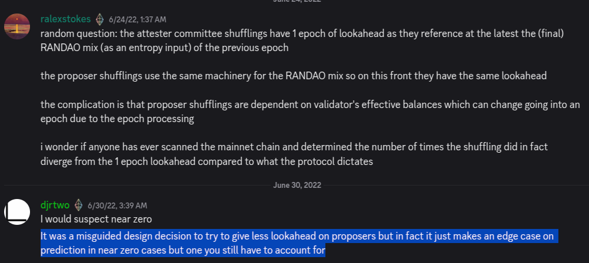

## Abstract

At the start of each epoch, pre-calculate and store in the `beacon_state` a deterministic `proposer_lookahead` for the next `MIN_SEED_LOOKAHEAD + 1` epochs.

## Motivation

Unlike RANDAO seeds, which have a deterministic lookahead of at least `MIN_SEED_LOOKAHEAD == 1` epochs, the beacon proposer schedule of epoch `N + 1` is not fully predictable from the beacon state during epoch `N`. The reason is that, under certain edge cases, the effective balances (EBs) of active validators—themselves used as input for proposer election in epoch `N + 1`—can change within epoch `N`.

Based preconfirmation protocols rely on a deterministic proposer schedule for smooth operations. Since the beacon genesis, slashings and penalties that accumulate to at least 1 ETH can change EBs of active validators and lead to an unpredictable proposer schedule despite the RANDAO seed being known ahead of time. The increase of MaxEB with [EIP-7251](./eip-7251) increases effective balance unpredictability because rewards that accumulate to at least 1 ETH, validator consolidations, and deposits can grow EBs of active validators beyond 32 ETH.

Besides fixing next-epoch proposer schedule non-determinism, this EIP makes it possible for the proposer schedule of the next epoch to be accessible to the application layer via the beacon root and a simple Merkle proof. This highly simplifies the implementation of on-chain components for based preconfirmation protocols.

Introducing a fully deterministic lookahead fixes a long-standing beacon chain design oversight, as highlighted by Danny Ryan's comment below:



With this change, it will no longer be possible for validators to grind effective balances to manipulate the proposer schedule of the next epoch, and the analysis of effective balance grinding will collapse from what is currently a subtle analysis of EB edge cases to a trivial security analysis. Finally, the proposer lookahead gives CL clients ahead-of-time visibility over the next proposer which may simplify implementations.

## Specification

The `BeaconState` container is extended with a `proposer_lookahead` field, which is a vector of validator indices covering the full visible lookahead period, starting from the beginning of the current epoch to the next `MIN_SEED_LOOKAHEAD` epochs.

```python
class BeaconState:
    ...
    proposer_lookahead: Vector[ValidatorIndex, (MIN_SEED_LOOKAHEAD + 1) * SLOTS_PER_EPOCH]
```

For example, `proposer_lookahead[0]` is the validator index for the first proposer in the current epoch, `proposer_lookahead[SLOTS_PER_EPOCH + 4]` is the validator index for the fifth proposer in the next epoch, and so forth.

The function `get_beacon_proposer_index` is modified to use the pre-calculated `proposer_lookahead` instead of calculating proposer indices on-demand.

```python
def get_beacon_proposer_index(state: BeaconState) -> ValidatorIndex:
    """
    Return the beacon proposer index at the current slot.
    """
    return state.proposer_lookahead[state.slot % SLOTS_PER_EPOCH]
```

At the epoch boundary, the `proposer_lookahead` is updated by shifting out the current epoch’s lookahead and appending the new one.

```python
def process_epoch(state: BeaconState) -> None:
    ...
    process_proposer_lookahead(state)

def process_proposer_lookahead(state: BeaconState) -> None:
    last_epoch_start = len(state.proposer_lookahead) - SLOTS_PER_EPOCH
    # Shift out proposers in the first epoch
    state.proposer_lookahead[:last_epoch_start] = state.proposer_lookahead[SLOTS_PER_EPOCH:]
    # Fill in the last epoch with new proposer indices
    last_epoch_proposers = compute_proposer_indices(state, Epoch(get_current_epoch(state) + MIN_SEED_LOOKAHEAD))
    state.proposer_lookahead[last_epoch_start:] = last_epoch_proposers
```

Furthermore, the first block after the fork will calculate all lookaheads for epochs up to `MIN_SEED_LOOKAHEAD` ahead and fill the `proposer_lookahead` field in the beacon state.

See the [updated beacon chain specs](https://github.com/ethereum/consensus-specs/blob/6a1d923730c0b368b5192e64f643f22c21451058/specs/fulu/beacon-chain.md) in consensus-specs for more details.

## Rationale

### Considered Alternatives

An alternative approach would be to cache the effective balances at the start of epoch `N` so it can be used to calculate the proposer lookahead at the start of epoch `N+MIN_SEED_LOOKAHEAD`. However, this approach would require additional footprint in the beacon state, and would not be able to provide the proposer lookahead to the EVM via the beacon root.

### Single Secret Leader Election Compatibility

In the future, we may introduce a Single Secret Leader Election (SSLE) mechanism in which only the selected validator knows their role until they propose a block. However, current SSLE designs still rely on a lookahead, albeit an encrypted one. In such designs, we could reuse the `proposer_lookahead` field by changing its type to something like `List[EncryptedValidatorIndex]`. And if a construction were to remove lookahead entirely, we could simply set `proposer_lookahead` to an empty list, meaning this wouldn’t be a blocker.

That said, any such changes would introduce additional complexity around preconfirmation protocols, but that complexity arises regardless of this EIP. Furthermore, APS (Attester Proposer Separation) envisions more sophisticated (i.e., more DDoS‑resistant) execution proposers, reducing the need for SSLE.

### Added Computation at the Epoch Boundary

Before this EIP, consensus clients only needed to compute the current proposer’s index at each slot. With the changes introduced by this EIP, they must calculate the entire epoch’s proposer schedule at the start of each epoch. However, computing the proposer index is light, involving sampling validators until we reach a validator with sufficient effective balance to be selected as a proposer. Still, testing is needed to confirm that these additional calculations do not create performance bottlenecks in practice.

## Backwards Compatibility

No backward compatibility issues found.

## Test Cases

See [the spec tests](https://github.com/ethereum/consensus-specs/tree/6a1d923730c0b368b5192e64f643f22c21451058/tests/core/pyspec/eth2spec/test/fulu) in consensus-specs.

## Security Considerations

### Malicious Lookahead Alteration

A critical consideration for any proposer election mechanism is preventing validators from manipulating lookahead to gain an unfair advantage. This proposal does not increase the chances of such attacks, as we do not alter the “RANDAO delay” used in the lookahead—the lookahead of epoch `N` is still determined by the RANDAO of epoch `N - MIN_SEED_LOOKAHEAD - 1` (which becomes available at the start of epoch `N - MIN_SEED_LOOKAHEAD`). The only difference is that it changes the “effective balances delay”: rather than using the effective balances (EB) at the start of epoch `N`, it now uses the EB at the start of epoch `N - MIN_SEED_LOOKAHEAD`.

Furthermore, by aligning the RANDAO and effective balances in this way, the proposal removes any chance of validators adjusting their EB after seeing the RANDAO outcome, which is an attack vector to consider. No such attack has been found so far, but this change removes the possibility, hence simplifying the security analysis.

## Copyright

Copyright and related rights waived via [CC0](../LICENSE.md).
