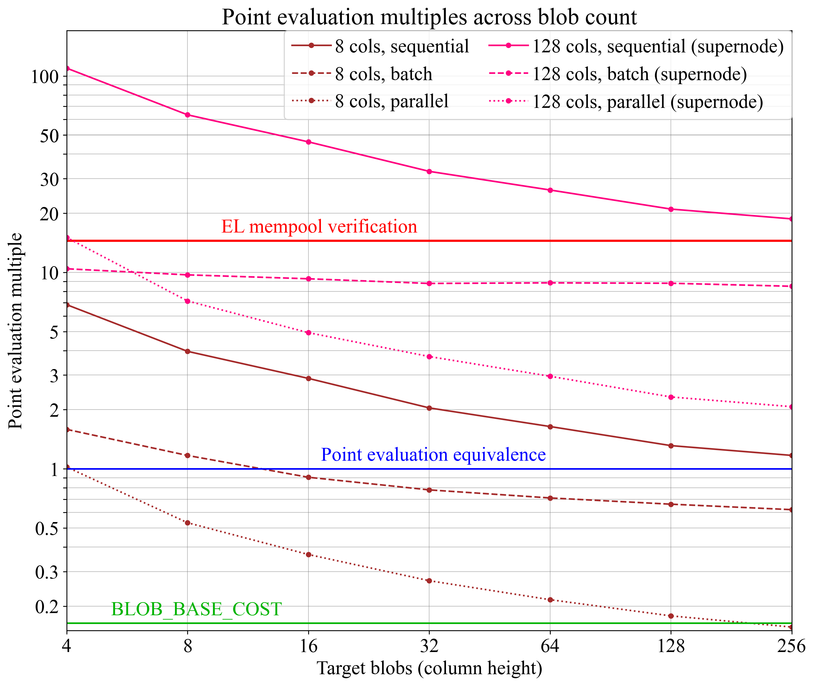

## Abstract

This EIP imposes that the price of the targeted number blobs `TARGET_BLOB_GAS_PER_BLOCK * base_fee_per_blob_gas` stays above the price of a simple blob-carrying transaction `TX_BASE_COST * base_fee_per_gas`. This ensures that the blob fee auction can function properly, because the equilibrium always forms relative to the fee that carries the price signal. The proposed `if` statement to check fee parity in `calc_excess_blob_gas()` represents a neutral, simple, and future-proof resolution to current blob fee auction idiosyncrasies.

## Motivation

Ethereum deploys a dynamic pricing auction to set the blob base fee, lowering the fee if less gas is consumed than `TARGET_BLOB_GAS_PER_BLOCK` and raising the fee if more gas is consumed. Such an auction can function well when the blob base fee represents the price signal, allowing the mechanism to control the real price facing the consumer. However, when the cost of execution gas in the blob-carrying transaction dominates, the price signal is lost. The blob base fee no longer represents the actual cost facing the consumer, and the protocol cannot adjust the blob base fee to regulate the equilibrium quantity of blobs consumed. Under these circumstances, the current mechanism will continue lowering the blob base fee until it eventually settles at 1 wei. Whenever demand picks up, a sustained succession of near-full blocks is required to restore equilibrium, with the mechanism intermittently resorting to a first-price auction, considered a worse UX by blob consumers. The resulting spikiness in resource consumption is suboptimal for scaling blobspace. 

Figure 1 shows how execution costs make the demand curve inelastic, such that a small shift in demand or execution base fee (arrows) can lead to dramatical shifts in the equilibrium blob base fee. To alleviate this, the proposal imposes that the equilibrium (squares) must form under at least fee parity between blob data costs and execution costs, somewhere along the edge of the upper-left quadrant, bounded by the supply curve (blue) and the fee parity line (dashed). This ensures that an equilibrium always forms relative to the fee that carries the price signal, thus alleviating spikiness while remaining neutral and future-proof. To achieve this, a simple `if` statement is added to the excess gas update function.


**Figure 1.** The demand for blobspace under different execution base fees (black to red lines). When execution cost dominates, the demand curve becomes inelastic and parallel to the supply curve, leading the equilibrium fee to change dramatically even with small shifts in the demand curve (arrows). The proposal imposes that the equilibrium (square) forms on the edges of the upper-left quadrant, at the intersection between supply and demand or fee parity and demand.

## Specification

The function `calc_excess_blob_gas()` from [EIP-4844](./eip-4844.md) is changed to not subtract `TARGET_BLOB_GAS_PER_BLOCK` when updating the `excess_blob_gas`, if the price of `TARGET_BLOB_GAS_PER_BLOCK` is below the price of `TX_BASE_COST`.

```python
def calc_excess_blob_gas(parent: Header) -> int:
    if parent.excess_blob_gas + parent.blob_gas_used < TARGET_BLOB_GAS_PER_BLOCK:
        return 0

    if TX_BASE_COST * parent.base_fee_per_gas > TARGET_BLOB_GAS_PER_BLOCK * get_base_fee_per_blob_gas(parent):
        return parent.excess_blob_gas + parent.blob_gas_used
    else:
        return parent.excess_blob_gas + parent.blob_gas_used - TARGET_BLOB_GAS_PER_BLOCK
```

## Rationale

### Fee-inelasticity

This proposal alleviates idiosyncrasies in the blob base fee auction. At a fundamental level, the issue is that the demand curve becomes fee-inelastic as the cost of blob data falls relative to the cost of the blob-carrying transaction. When the execution cost dominates, it does not matter to the blob consumer how the blob fee evolves—it is ultimately the execution cost that contributes to equilibrium formation. Given that the protocol stipulates a perfectly inelastic supply curve (vertical blue line in Figure 1), the blob base fee will simply fall to the boundary of 1 wei whenever the execution cost is too high for an equilibrium to form at `TARGET_BLOB_GAS_PER_BLOCK`. Thus, in the regime where execution fees dominate, the demand curve is *blob fee-inelastic*, and whenever the blob fees dominate, the demand curve is *execution fee-inelastic*. By ensuring that an equilibrium always forms relative to the fee that carries the price signal, spikiness in fee and resource consumption is alleviated. When the price signal comes from the execution fee, the equilibrium forms at the fee parity line in Figure 1, and when the price signal comes from the blob fee, the equilibrium forms at the supply curve.

The demand curve could potentially be somewhat inelastic even under zero execution costs. This would however just be another reason to move forward with this proposal. Regardless of the exact shape of the demand curve—which of course will remain unknown and can vary going forward—the proposal is based on something tangible and measurable. The execution cost *must* contribute to inelasticity, and this inelasticity *can* be modeled. This makes it a justified neutral bound on the blob base fee.

### Designing for the future

Figure 2 once again shows the permitted (green) and restricted (red) regions also captured in Figure 1, but this time with execution base fee on the x-axis. Various settings for fee parity are indicated by black lines. When fee parity is imposed based on a transaction carrying many blobs (e.g., 48), its total cost will be relatively higher, and the blob base fee will as a result be operational at a relatively lower level. Such a shift is inherent by design and as intended. If blob consumers include many more blobs in their blob-carrying transactions, the execution gas may no longer carry the price signal at the same blob base fee, and the blob base fee should be able to settle relatively lower. This is also why fixed thresholds not relating to blob quantity or the execution fee may not be sustainable. In a scenario where Ethereum provides many orders of magnitude more blobs, the equilibrium blob base fee should ideally have a relatively lower floor. To understand why potential future blob scaling is important to account for when designing the mechanism, consider how the price of storing a fixed amount of data has fallen over the last 80 years.

However, as Ethereum scales, the number of blobs submitted in the average blob-carrying transaction, as a proportion of the `BLOBS_PER_BLOCK_TARGET`, will fall. Similarly, the number of blocks where `BLOBS_PER_BLOCK_TARGET` is submitted in a single blob-carrying transaction will also fall. The mechanism can be designed to account for this. A natural idea is to impose fee parity between execution costs and the square root of the target number of blobs. If the target is 49 blobs per block, then fee parity is set to the cost of 7 blobs, etc. This means that the `if` statement would be altered by replacing `TARGET_BLOB_GAS_PER_BLOCK` with `integer_squareroot(BLOBS_PER_BLOCK_TARGET * GAS_PER_BLOB**2)`. Note that if blob-carrying transactions become restricted from including `BLOBS_PER_BLOCK_TARGET`, this should be accounted for.



**Figure 2.** Proposed restriction imposed on the blob base fee to ensure desirable equilibrium formation. When the blob fee is the primary price signal (green area), equilibrium can form just as today. When the execution fee is the primary price signal (red area), the demand curve becomes too inelastic, and the blob base fee is imposed to rise to the green area. Black lines indicate fee parity between blob data cost and execution costs.

### Delayed response during a quick rise in execution fees

When the `if` statement concludes that Ethereum operates in the execution-fee-led pricing regime, the blob base fee rises in accordance with `blob_gas_used`, without subtracting `TARGET_BLOB_GAS_PER_BLOCK`. This is an intuitive way to return to the blob-fee-led pricing regime. If the execution base fee rises quickly, there may however be a few blocks before the blob base fee catches up (during which `TARGET_BLOB_GAS_PER_BLOCK` will never be subtracted and the blob fee moves in the direction of the arrows in Figure 2). This is arguably not an issue, and the smooth response in the blob base fee under these circumstances may even be seen as a benefit.

### Alternative specifications

The specification outlines the simplest way to achieve the desired goals and is therefore preferred. Here, two alternative variants are outlined. In the first, the fee-parity comparison is instead made on the current block's base fees, as derived from the parent block. The computation for the execution base fee is omitted and the variable instead provided as input. This would also require a change to the block validity `assert` statement (omitted here).

```python
def calc_excess_blob_gas(parent: Header, updated_base_fee_per_gas: (int)) -> int:
    if parent.excess_blob_gas + parent.blob_gas_used < TARGET_BLOB_GAS_PER_BLOCK:
        return 0
    
    # Compute the updated excess_blob_gas and the fee from the parent block as normal
    ret = parent.excess_blob_gas + parent.blob_gas_used - TARGET_BLOB_GAS_PER_BLOCK 
    blob_base_fee_per_gas = fake_exponential(MIN_BASE_FEE_PER_BLOB_GAS, ret, BLOB_BASE_FEE_UPDATE_FRACTION)

    # If the updated execution fee is higher, do not subtract TARGET_BLOB_GAS_PER_BLOCK
    if TX_BASE_COST * updated_base_fee_per_gas > blob_base_fee_per_gas:
        return parent.excess_blob_gas + parent.blob_gas_used
    else:
        return ret
```

Finally, the last function can be altered to strictly keep the blob base fee above fee parity. This would require the implementation of a `fake_log()`that inverts the  `fake_exponential()`.

```python
def calc_excess_blob_gas(parent: Header, updated_base_fee_per_gas: (int)) -> int:
    ...
    # If the updated execution fee is higher, return the associated excess_blob_gas
    if TX_BASE_COST * updated_base_fee_per_gas > blob_base_fee_per_gas:
        return fake_log(MIN_BASE_FEE_PER_BLOB_GAS, TX_BASE_COST * current_base_fee_per_gas, BLOB_BASE_FEE_UPDATE_FRACTION)
    else:
        return ret
```

Neither of these two alternatives would likely have a material impact on equilibrium formation.

## Security Considerations

The blob base fee will settle at a level where posting the target number of blobs costs at least as much as its blob-carrying transaction. To the best of the author's knowledge, there are no security risks associated with this.

## Copyright

Copyright and related rights waived via [CC0](../LICENSE.md).
