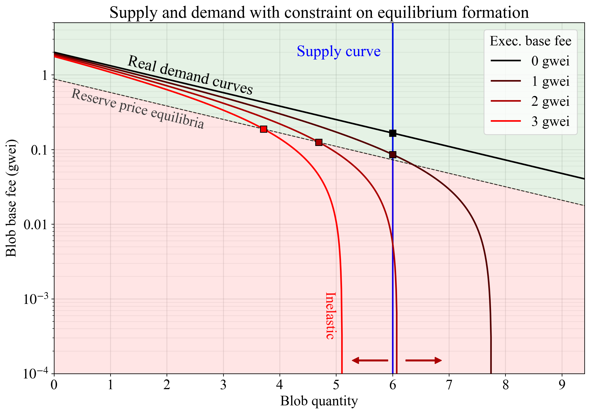
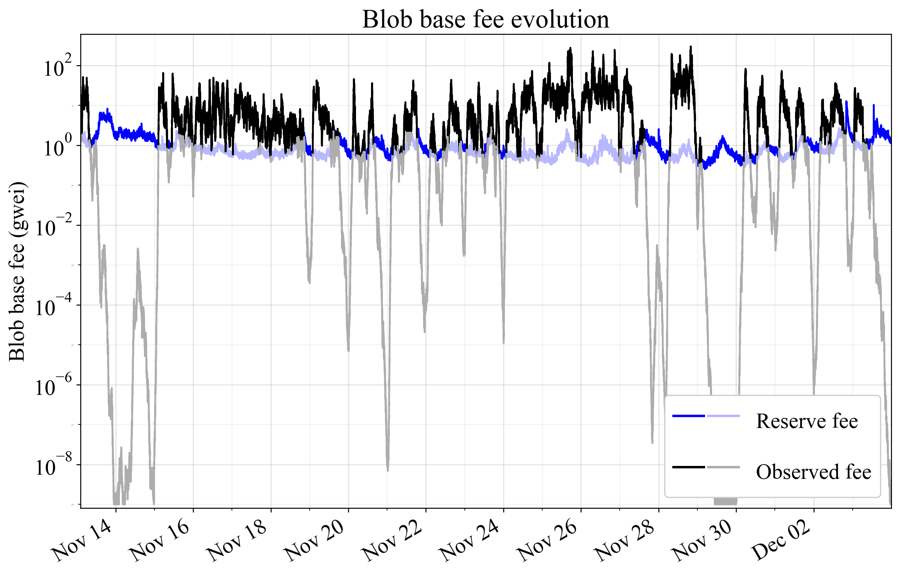

## Abstract

This EIP assigns a reserve price `BLOB_BASE_COST * base_fee_per_gas` to blobs by introducing an `if`-clause in `calc_excess_blob_gas()`. Specifically, when the reserve price is higher than `GAS_PER_BLOB * base_fee_per_blob_gas`, the function will not subtract `target_blob_gas` from `excess_blob_gas`, causing `excess_blob_gas` to increase according to `blob_gas_used`, while keeping the per-block maximum increase unchanged. The proposal ensures that the blob fee market can function properly and that blob consumers pay at least a relevant fraction of the market rate for the compute they request from nodes.

## Motivation

Ethereum uses a dynamic pricing auction to set the blob base fee, lowering the fee if less gas is consumed than `target_blob_gas = GAS_PER_BLOB * blobSchedule.target` and raising the fee if more gas is consumed. Such an auction can function well when the blob base fee represents the price signal, allowing the mechanism to control the real price for blob consumers. However, when execution costs dominate, the price signal is lost. The blob base fee then no longer represents a significant component of the total cost facing the consumer, and the protocol can no longer rely on the blob base fee to control the equilibrium quantity of blobs consumed. 

The current mechanism can therefore end up repeatedly lowering the blob base fee until it eventually settles at 1 wei. A change in the blob base fee of 10% may under such circumstances shift the total cost of utilizing blobspace by just 0.0000001%. Whenever demand picks up, over an hour of near-full blocks is required to restore a market-clearing equilibrium fee, with the mechanism intermittently resorting to a first-price auction, considered a worse UX by blob consumers. The resulting spikiness in resource consumption is suboptimal for scaling blobspace. To alleviate this, the proposal imposes a reserve price that reflects execution costs, through a simple `if`-clause in `calc_excess_blob_gas()`.

The reserve price also fulfills a second function. Nodes must cryptographically verify KZG `proofs` to ensure that associated `commitments` correspond to provided blobs. This process is computationally expensive. It seems desirable to ensure that blob consumers pay at least some fraction of the market rate for the compute they impose on nodes. In this context, the execution base fee reflects how in-demand nodes' compute services are at the time that blob consumers request them. 

By applying the reserve price to the blob base fee, the proposal jointly ensures that:

1. The blob base fee update mechanism can function properly, by establishing a reserve price which is significant relative to L1 execution costs of blob consumers. 
2. Blob consumers pay at least a relevant fraction of the market rate for the compute they request from nodes, with any additional fees for data determined independently in the blob fee market.

## Specification

### Parameters

| Constant | Value 
| - | - |
| `BLOB_BASE_COST` | `2**13` |

### Functions

An `if`-clause is added to `calc_excess_blob_gas()` from [EIP-4844](./eip-4844.md). The function no longer subtracts `target_blob_gas` when updating `excess_blob_gas` if the price of a `blob` is below the price of `BLOB_BASE_COST` execution gas. The `blobSchedule` for referencing target and max blobs was introduced in [EIP-7840](./eip-7840.md). The current block's `blobSchedule` is used during processing. Thus, in the first block after a fork—when calculating `base_fee_per_blob_gas` via `get_base_fee_per_blob_gas(parent)`—`fake_exponential()` must use the *new* `blobSchedule.baseFeeUpdateFraction`. Likewise, the *new* `blobSchedule.max` and `blobSchedule.target` must be used in `calc_excess_blob_gas()`.

```python
def calc_excess_blob_gas(parent: Header) -> int:
    target_blob_gas = GAS_PER_BLOB * blobSchedule.target
    if parent.excess_blob_gas + parent.blob_gas_used < target_blob_gas:
        return 0

    if BLOB_BASE_COST * parent.base_fee_per_gas > GAS_PER_BLOB * get_base_fee_per_blob_gas(parent):
        return parent.excess_blob_gas + parent.blob_gas_used * (blobSchedule.max - blobSchedule.target) // blobSchedule.max
    else:
        return parent.excess_blob_gas + parent.blob_gas_used - target_blob_gas
```

## Rationale

### Fee-inelasticity and reserve price

This proposal alleviates idiosyncrasies in the blob base fee auction. When a rollup's costs are dominated by execution costs for the blob-carrying transactions, ZK proof verification, or priority fees, the protocol can no longer rely on the blob base fee to control the equilibrium quantity of blobs consumed. The fee update mechanism is unaware of the full price of the goods that it regulates the price for and therefore fails to converge on equilibrium in a timely manner. 

We can express a simple real demand function for blobspace as

$Q(b + c).$

It maps the quantity of blobs demanded $Q$ to the blob base fee $b$ and the user's execution costs, expressed "per blob gas", $c$:

```python
c = execution_cost * base_fee_per_gas / GAS_PER_BLOB
```

According to the *law of demand*, the lower the price $b+c$, the higher the demand. From the perspective of the blob base fee update mechanism, $c$ is fixed. If $c>0$, the demand curve will therefore have an "inelasticity horizon", beyond which further reductions in $b$ no longer increase $Q$:

$\lim_{b \to 0} Q(b + c) = Q(c).$

In essence, the demand curve becomes a vertical line, where changes to the blob base fee $b$ no longer affect demand. Figure 1 illustrates this, with real demand curves (black to red) computed under four different execution base fees when purchasing two blobs. The hypothetical organic demand is illustrated in black. Any demand curve where execution costs are positive ($c>0$) eventually becomes vertical as the blob base fee falls. The protocol also uses a long-run perfectly inelastic supply curve (vertical blue line). Therefore, relatively small shifts in organic demand or the execution base fee (arrows) can lead to dramatic shifts in the equilibrium blob base fee. Importantly, the blob base fee will simply fall to the boundary of 1 wei whenever the execution cost is too high for consumers to achieve equilibrium formation at `target_blob_gas`.



**Figure 1.** Hypothetical real demand for blobspace under different execution base fees (black to red lines). When execution cost dominates, the real demand curve becomes inelastic and parallel to the supply curve, leading the equilibrium fee to change dramatically even with small shifts in the demand curve (arrows). The proposal imposes that the equilibrium (square) forms on the edges of the upper-left quadrant, at the intersection between the target supply curve and demand or along the dashed line representing possible reserve price equilibria accounting for execution costs.

To improve the fee update mechanism, a reserve price is specified below which $b$ cannot be reduced. Specifically, we define a constant `BLOB_BASE_COST` and in `calc_excess_blob_gas` do not subtract `target_blob_gas` if: 

```python
BLOB_BASE_COST * base_fee_per_gas > GAS_PER_BLOB * base_fee_per_blob_gas
```

This means that the reserve blob base fee becomes `BLOB_BASE_COST * base_fee_per_gas / GAS_PER_BLOB` and that the ratio between the reserve price for the blob base fee and the execution base fee is fixed to: `BLOB_BASE_COST / GAS_PER_BLOB`. This ratio is `1/16` with the proposed constant. 

The blob fee's share of the total price will with the reserve price always be at least `BLOB_BASE_COST / (BLOB_BASE_COST + execution_cost)`. This is why the equilibrium under the reserve price (dashed line in Figure 1) is situated a constant fraction below the black organic demand curve formed under a zero execution base fee. The equilibrium (squares) must then form somewhere along the edge of the upper-left quadrant, bounded by the blue supply curve and the dashed curve representing possible reserve price equilibria under real demand.

The demand curve could potentially be somewhat inelastic even under zero execution costs. This would however just be another reason to move forward with this proposal. Regardless of the exact shape of the demand curve—which of course will remain unknown and can vary going forward—the proposal is based on something tangible affecting blob consumers. This makes it a justified neutral bound on the blob base fee.

### Blob KZG proof verification cost

EIP-4844 introduced the first phase of Ethereum's data availability sampling (DAS) roadmap. Validators on the consensus layer (CL) verify that the KZG `commitments` in the payload correspond to the provided `blobs` by cryptographically verifying the accompanying KZG `proofs`. Execution layer (EL) nodes must also validate the `tx_payload_body` and verify the wrapped data (blobs, commitments, and proofs) for every blob entering a node's tx pool. The computational requirements for verifying a KZG proof for an entire blob are slightly higher than those for verifying a KZG proof for a single point on that blob; the latter is the specific operation covered by the `POINT_EVALUATION_PRECOMPILE_GAS` (50000) charged to smart contracts.

[EIP-7594](./eip-7594.md) introduces PeerDAS. It changes the compute requirements due to the reliance on blob cells and their individual proofs. The exact specification is not yet fully settled, but this is a rough guideline:

* EL nodes batch-verify `CELLS_PER_EXT_BLOB` (128) cell proofs for each blob before including a tx carrying that blob in their tx pool. This verification (e.g., using `verify_cell_kzg_proof_batch`) is roughly 15 times more expensive than the compute associated with a single `POINT_EVALUATION_PRECOMPILE_GAS`.
* Full nodes verify 4 custodied columns, each column containing one cell from all blobs referenced in the payload. Each column's cell proofs can be batch-verified (also applicable below).
* Supernodes verify 128 custodied columns, each column containing one cell from all blobs referenced in the payload.
* Validators between full nodes and supernodes will custody between 4-128 columns.
* Nodes peer-sample `SAMPLES_PER_SLOT` (8) columns each slot (in addition to custodied columns).

The ability on the CL to jointly process cell proofs of a column (from all blobs) through batching reduces the compute time spent per blob as the number of blobs increases. It is further possible to batch all columns jointly or to parallelize the processing across columns. When accounting for the prospect of parallelization for the CL, it is however worth remembering that the point evaluation proof verification performed by rollups using the precompile also lends itself to parallelization. This means that a comparison between the point evaluation and the sequential processing of blobs (batched per column) is still relevant (because *both* could be parallelized). 

Figure 2 shows verification time per blob divided by the measured execution time of a single point evaluation operation (performed by the `VerifyKZGProof` precompile) for various configurations. The figure indicates that blobs under the current Fusaka PeerDAS specification will subject nodes to rather heavy compute requirements—when compared to the single point evaluation proof verification that a smart contract is charged `POINT_EVALUATION_PRECOMPILE_GAS` for. A full node would for example do the EL mempool verification for all blobs propagated p2p (15x), sample 8 columns (2x at 32 blobs when batching columns sequentially), and custody 4 designated columns (1x). How to price the KZG proof verification is however a complex question given the varying contexts in which it is performed. The proposed constant `BLOB_BASE_COST` is indicated by a green line in Figure 2. It is relatively moderate in comparison with the compute costs imposed on nodes. 


**Figure 2.** Verification time per blob relative to one point evaluation on an Apple M2 Max with 12 cores. The EL mempool verification (red) takes 15 times longer in the worst case, regardless of the blob target. The per-blob verification time of columns depends on the number of custodied/sampled columns and falls with an increase in the blob target due to speed-ups from processing all cells of a column jointly. The constant `BLOB_BASE_COST` is relatively moderate in comparison with the compute costs that blobs impose on nodes.

### Designing for the future

The price of storing a fixed amount of data has fallen over the last 80 years. Technological progress generally brings down the unit cost of data services, following Nielsen’s law and Moore’s law. The ETH-denominated price per blob should likewise fall as Ethereum increases blob throughput. This effect is reinforced because a higher aggregate ETH-denominated blob revenue (which is distributed to ETH token holders via the burn) increases the fiat-denominated value of the ETH token, ceteris paribus. There is thus an upper bound on the blob base fee—a bound that falls as Ethereum scales. The same reflexivity applies to the execution base fee.

In this light, the proposal can be understood as a design for the future. Fixed thresholds not relating to blob quantity or the execution fee may not be sustainable. In a scenario where Ethereum sells more blobs per block, the equilibrium blob base fee should ideally have a relatively lower floor. Any fixed threshold (not relating to the execution base fee or blob quantity) would need to be gradually readjusted to retain the same relative impact.

If Ethereum increases blob throughput by several orders of magnitude but does *not* scale blockspace, such that the execution base fee remains high, the reserve price of `BLOB_BASE_COST` execution gas would however still become too high. At 1000 blobs and 30M execution gas per block, Ethereum would derive just over 1/5th (21.5%) of its income from blob gas even when blobs are strictly sold at the reserve price. This implies a too high `BLOB_BASE_COST`, but 1000 blobs and 30M execution gas is not the trajectory that Ethereum currently is on. If Ethereum scales blockspace and blobspace roughly in synchrony, it is reasonable to expect that the reserve price remains at the desired level.

### Delayed response during a quick rise in execution fees

When the `if` statement concludes that Ethereum operates in the execution-fee-led pricing regime, the blob base fee rises in accordance with `blob_gas_used * (max - target) // max`, without subtracting `target_blob_gas`. This is an intuitive way to return to the blob-fee-led pricing regime, retaining the same maximum fee increase while not allowing for a decrease. If the execution base fee rises quickly, there may be a few blocks before the blob base fee catches up (during which `target_blob_gas` will never be subtracted). This is arguably not an issue, and the smooth response in the blob base fee under these circumstances may even be seen as a benefit.

### Empirical analysis

Figures 3-4 show price evolution over three weeks in November 2024, when the average execution base fee was around 16 gwei, as well as in March 2025, when the average was around 1.3 gwei. The proposed reserve fee is applied directly to the original data, without accounting for its potential effect on the equilibrium fee. The equilibrium blob base fee would in reality rise from the threshold level once demand at this fee is above target supply. EIP-7918 imposes the maximum of the two curves, indicated in darker colors. 



**Figure 3.** Blob base fee evolution with the current fee market (black) and the proposed reserve fee (blue), during three weeks of November 2024 when the average execution base fee was around 16 gwei. EIP-7918 imposes the maximum of the two curves, as indicated in darker colors. Thresholding is applied directly to the original data, without accounting for its effect on the equilibrium fee.


**Figure 4.** Blob base fee evolution with the current fee market (black) and the proposed reserve fee (blue), during three weeks of March 2025 when the average execution base fee was around 1.3 gwei. EIP-7918 imposes the maximum of the two curves, as indicated in darker colors. Thresholding is applied directly to the original data, without accounting for its effect on the equilibrium fee.

Figure 5 shows histograms for observed fees and the maximum of the two curves for the four-month period from November 2024 (start of Figure 3's data period) through March 2025 (end of Figure 4's data period), corresponding to approximately 900k blocks beginning at block number 22075724. The histograms employ 100 log-spaced bins per decade (factor-of-ten increase), which are smoothed using a Hanning window of width 21 with mirror-reflected edges.


**Figure 5.** Histogram of the blob base fee when there is no threshold or when applying EIP-7918 (dashed combination of the darker black and blue curves from previous figures), with light smoothing applied. A four-month period from November 2024 through March 2025 was analyzed. Thresholding is applied directly to the original data, without accounting for its effect on the equilibrium fee.

## Security Considerations

The blob base fee will settle at a level where a blob costs at least `BLOB_BASE_COST` execution gas. To the best of the authors' knowledge, there are no security risks associated with this.

## Copyright

Copyright and related rights waived via [CC0](../LICENSE.md).
