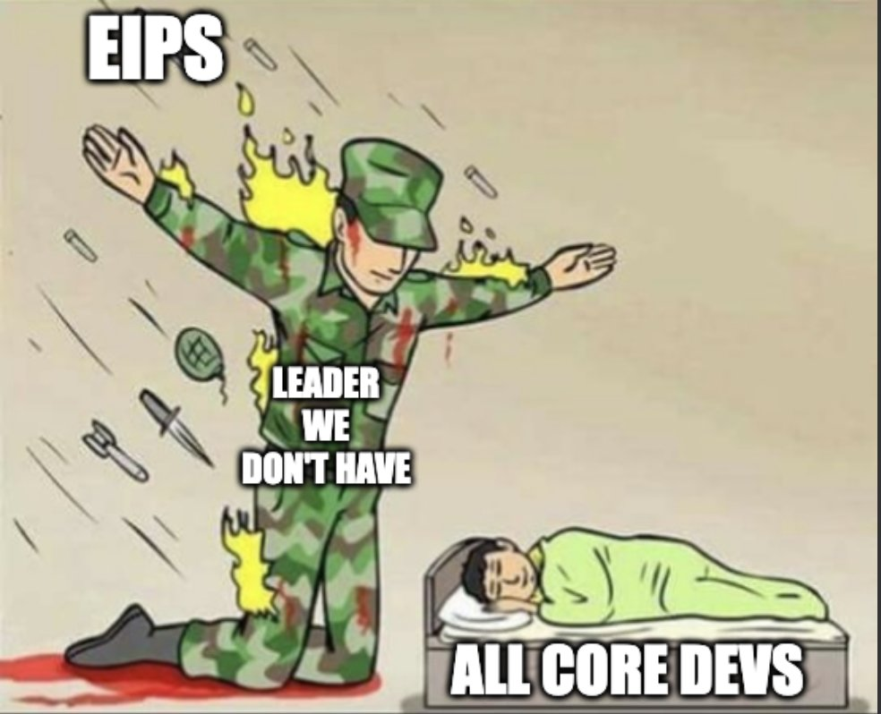

## Abstract

Ethereum needs a Shah. The role of the Shah is to be the "protector". A Shah, empowered by the community and with a mandate to represent their interests, could solve the communication gaps between the Ethereum community and core devs, represent the interests of the Ethereum community (holders, stakers, app devs & businesses especially) to the core devs with a tighter feedback loop, and eventually dissolve their position when the imminent danger of Ethereum coordination failure is meaningfully addressed.

## Motivation

It is clear from recent events that Ethereum is suffering from a coordination breakdown between the user ecosystem and the core devs. A case in point is the EOF debacle, with years wasted in EOF development that ~~seems ultimately likely to be~~ was just rejected as a result of 1) fragmented communication between researchers/core devs and the greater Ethereum ecosystem, to the extent that even tentative supporters of EOF weren't aware of the toolchain update requirements on the rest of the ecosystem as well as 2) a lack of rigorous compatibility testing such that EOF exposes protocol level risks. 

A Shah is of course centralized, but we've seen the decentralized alternative: First a tacit acceptance of a seemingly unnecessary EIP involving years of labor, approved by committee, and ultimately rejected by the Ethereum community. The costs on our collective time are large, not to mention the opportunity cost. 

Ethereum could spare itself these innefficiencies by electing a Shah to manage the core dev roadmap and EIPs.

## Specification

The Shah SHOULD be elected by the Ethereum community, using a combination of ETH voting, social signalling, and core dev ratification.

The Shah SHOULD be singularly responsible for deciding on the EIP inclusion roadmap, as well as having veto power over which EIPs to include.

The Shah SHOULD maintain communication channels with the Ethereum community (holders, stakers, app devs & businesses) to understand their needs & request feedback on EIPs.

The Shah SHOULD play a coordinator role in the All Core Devs (ACD) calls, and submit a quarterly progress update to Ethereum stakeholders.

The Shah SHOULD NOT have any special privileges, for example: to relieve developers of duty at organizations not under the Shah's control.

The Shah SHOULD explicitely call out blockers, communications breakdowns, and when deserving, the core devs that get in the way of addressing them.

The Shah SHOULD NOT report to the Ethereum Foundation. The Shah's position would be paid directly from the most credibly "Ethereum" source of funding, which has received its budget from a diverse set of Ethereum community members: The Protocol Guild. 

The Shah SHOULD have an expiration date for their role set at the time of election, that does exceed 2 years.

The Shah SHOULD be able to step down willingly before the end of their 2 year term. 

***

The key words "MUST", "MUST NOT", "REQUIRED", "SHALL", "SHALL NOT", "SHOULD", "SHOULD NOT", "RECOMMENDED", "NOT RECOMMENDED", "MAY", and "OPTIONAL" in this document are to be interpreted as described in RFC 2119 and RFC 8174.

## Rationale

During times of war, the Roman Senate would elect an "Imperator" that would be responsible for dealing with an imminent threat, and once the threat was dealt with, would abdicate their power. The Shah is a similar concept, but rooted in the culture of the Persian Empire, which pioneered a "pluralistic" multi-national empire that respected cultural and religious diversity of its member nations—as aligned with Ethereum's culture of plurlism today.

This EIP is largely inspired by Greg the Greek's post (below) about the EF core devs lacking strong leadership who can take responsibility for saying "NO" to EIPs that they expect will ultimately be defeated by community consensus, and thus saving everyone their time, effort, and mental health. The Greeks pioneered democracy—if the will of the people is to elect (even for a limited time) a strong leader, would it not be undemocratic to deny it?

Link: x (dot) com/gregthegreek/status/1914811701901623746

> All Core Devs need to centralize.
> They need a leader who will say, NO.
> They need to be told what not to do.
> They need someone to shield them.
>
> 
> 
> Story Time
> 
> I vividly remember hearing about EOF 4-5 years ago
> 
> I asked a simple question:
> Q: How does this benefit users interacting with the chain?
> A: It allows future implementations of the EVM to add those things!
> 
> 👎
> 
> Cold, hard truth. Engineers are trying to solve a problem because it's fun, not because it's needed. It has some long-tail benefits, but not enough to justify the pain that it will cause.
> 
> This is a full-blown toolchain update (almost). We need to prioritize things that provide incremental wins. If the team behind EOF had spent more time improving the EVM in incremental steps (ditching EOF altogether), they could have shipped so much more, which could have, in aggregate, contributed to a 10x improvement.
> 
> Instead, they continue to fight for a proposal that was shot down ~3 times?
> 
> What has EOF done?
> 
> - Distracted ACD for the 4th time
> - Delaying roadmap by jamming a MASSIVE change into core code
> - Distract @ethPandaOps who will inevitably be responsible for creating an ungodly testing framework for this change
> - Caused ProgPow level wars because they can't take "no" for an answer
> 
> ONE YEAR AGO in Brussels, I asked Marius "How's work?" and he responded:
> > The EOF folks are back, the proposal is bigger than before.
> 
> ONE YEAR AGO - does no one see the problem here?
> 
> @tkstanczak @hwwonx This is the hardest role to hire for, but it needs to be done. That or one of you will need to step up and actually own this. It's clear @VitalikButerin, and we shouldn't force him to, he's better on the research side. Someone needs to run DAY-To-DAY ops/product on ACD.
> 
> It's exhausting. 
> Let the devs ship.
> Stop the politics.
> Turn the ship around.
> 
> Please 💕

The role of the Shah would be primarily social, and they would not have any *formal* power. Their power solely comes from the belief that the community has in their power. In the context of steering the ACD calls & EIP inclusion roadmap, this is actually enough. In my personal experience helping kill ProgPow, the core devs were not convinced that I adequately represented enough of the Ethereum community (despite my position as the Summoner of MolochDAO) and it took Martin Koeppelman & several others to step forward to socially signal against ProgPow and ultimately join the ACD meeting to advocate against it in order to finally convince the core devs that ProgPow was against the interest of the greater Ethereum community. The role of the Shah can help short-circuit this suspicion from the core devs by having the default understanding be that the Shah does in fact represent the will of the greater Ethereum community.

In his post a few weeks ago, Tim Beiko (the current Ethereum Hard Fork Coordinator) also suggested that the ACD was missing the roadmapping role this EIP proposes to be coordinated by the Shah.

> **Roadmap Setting**
The most important missing piece in the current AllCoreDevs process is a focus on the high level roadmap (“why we do things”), rather than individual proposals (“what we do”). This is true both for when planning the next fork(s), but also when thinking about Ethereum’s longer-term direction.

Link: ethereum-magicians (dot) org/t/reconfiguring-allcoredevs/23370

## Security Considerations

The obvious risk of having a Shah is that they could veto EIPs that *are* actually aligned with the Ethereum community stakeholders or prioritize EIPs that are not. In this case, it is the role of the community to publicly dissent from the Shah and ultimately remove them from office. I would expect that long before the Shah was officially deposed, the all core devs would start ignoring the Shah's input anyway, as the position does not hold any formal power. I think a fair mimimum term would be 6 months (for there to be two quarterly reports at least) and with at least the same degree of community consensus around deposing the Shah as there was to enshrine them in the first place.

## Copyright

Copyright and related rights waived via [CC0](../LICENSE.md).
