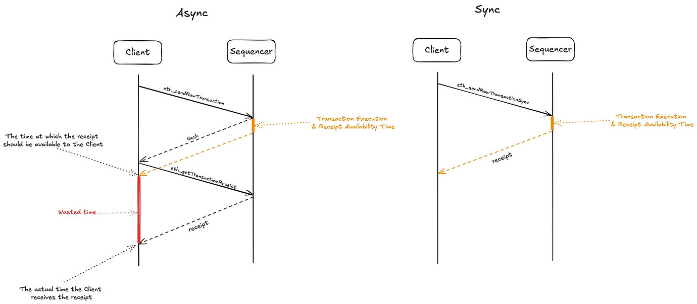

## Abstract

This EIP proposes a new JSON-RPC method, `eth_sendRawTransactionSync`, which submits a signed raw transaction and waits synchronously for the transaction receipt or a configurable timeout before returning. This method addresses the user experience gap in high-frequency applications by offering stronger delivery guarantees than `eth_sendRawTransaction`.

## Motivation

Currently, Ethereum clients submit signed transactions asynchronously using `eth_sendRawTransaction`. Clients receive a transaction hash immediately but must poll repeatedly for the transaction receipt, which increases latency and complicates client-side logic.

This asynchronous approach is not efficient for high-frequency blockchains or Layer 2 solutions with fast block times and low latency, where rapid transaction throughput and quick confirmation feedback are critical. The need to separately poll for receipts results in increased network overhead, slower overall transaction confirmation feedback, and more complex client implementations.


_In a low-latency blockchain, transaction receipts are often available right after the transactions land in the block producer’s mempool. Requiring an additional RPC call introduces unnecessary latency._

`eth_sendRawTransactionSync` addresses these issues by combining transaction submission and receipt retrieval into a single RPC call. This helps:

- reduce total transaction submission and confirmation latency by approximately 50%;
- simplify client implementations by eliminating the need for separate polling loops;
- improve user experience by enabling more responsive dApps and wallets;
- align blockchain interactions closer to traditional Web2 request-response patterns;
- maintain backward compatibility and optionality, preserving existing RPC methods and semantics.

## Specification

### Method Name

`eth_sendRawTransactionSync`

### Parameters

| Position | Type   | Description                       | Required |
|----------|--------|-----------------------------------|----------|
| 1        | `DATA` | The signed transaction data       | Yes      |
| 2        | `INT`  | Maximum wait time in milliseconds | No       |

#### Parameter Validation Rules

- **Transaction Data**. MUST be a valid hex-encoded, RLP-encoded signed transaction (same as in `eth_sendRawTransaction`).
- **Timeout**. MUST be a positive integer not greater than the node-configured maximum timeout.

### Returns

- **On success**. Node implementations MUST return the transaction receipt object as defined by the `eth_getTransactionReceipt` method.
- **On timeout error**. Node implementations MUST return an error code `4` with a timeout message.
- **On unreadiness error**. Node implementations SHOULD return an error code `5` with an error message.
  - This happens when the processing node is not ready to accept a new transaction or the transaction is erroneous (DX improvement).
- **On standard error**. Node implementations MUST return a JSON-RPC error object consistent with existing RPC error formats.

### Node-Configured Timeouts

- The handler function of this RPC SHOULD incorporate a configurable timeout when waiting for receipts (RECOMMENDED: 2 seconds).
- Node implementations SHOULD provide a way to configure the timeout duration.
- Node operators MAY implement dynamic timeout adjustment based on real-time network conditions.

### Behavior

Upon receiving an `eth_sendRawTransactionSync` request, the handler function performs the following tasks.

- If timeout parameter is provided, the handler function MUST validate its validity.
    - If the timeout is invalid, the handler function MUST use the default node-configure timeout.
- The handler function MUST submit the signed transaction to the network as per the existing `eth_sendRawTransaction` semantics.
- The handler function MUST wait for the transaction receipt until the timeout elapses.
- If the transaction is not ready to be processed, the handler function SHOULD return an error code `5` with an error message.
- If the receipt is found within the specified timeout, the handler function MUST return it immediately.
- If the timeout expires without obtaining a receipt, the handler function MUST return an error code `4` with a timeout message.
- If the transaction submission fails (e.g., due to invalid transaction data), the handler function MUST return an error (following the `eth_sendRawTransaction` definition) immediately.

### Example Request (No Timeout)

```json
{
  "jsonrpc": "2.0",
  "method": "eth_sendRawTransactionSync",
  "params": [
    "0xf86c808504a817c80082520894ab... (signed tx hex)"
  ],
  "id": 1
}
```

### Example Request (With Timeout)

```json
{
  "jsonrpc": "2.0",
  "method": "eth_sendRawTransactionSync",
  "params": [
    "0xf86c808504a817c80082520894ab... (signed tx hex)",
    5000
  ],
  "id": 1
}
```

### Example Response (Success)

```json
{
  "jsonrpc": "2.0",
  "id": 1,
  "result": {
    "transactionHash": "0x1234abcd...",
    "blockHash": "0xabcd1234...",
    "blockNumber": "0x10d4f",
    "cumulativeGasUsed": "0x5208",
    "gasUsed": "0x5208",
    "contractAddress": null,
    "logs": [],
    "status": "0x1"
  }
}
```

### Example Response (Timeout)

```json
{
  "jsonrpc": "2.0",
  "id": 1,
  "error": {
    "code": 4,
    "message": "The transaction was added to the mempool but wasn't processed in 2s.",
    "data": "0x1234abcd..."
  }
}
```

### Example Response (Unreadiness Error)

```json
{
  "jsonrpc": "2.0",
  "id": 1,
  "error": {
    "code": 5,
    "message": "The transaction was added to the mempool but wasn't processed due to a missing nonce or insufficient funds. Please double-check your account and try again.",
    "data": "0x1234abcd..."
  }
}
```

### Example Response (Error)

```json
{
  "jsonrpc": "2.0",
  "id": 1,
  "error": {
    "code": -32000,
    "message": "Invalid transaction"
  }
}
```

## Rationale

### Why Not Extend Existing RPC?

Modifying `eth_sendRawTransaction` to support this behavior would risk compatibility issues and ambiguity. A separate method makes the semantics explicit and opt-in.

### Node-Configured Timeouts

Node implementations SHOULD allow configuration of the timeout period, defaulting to 2 seconds (depending on the implementation). This balances responsiveness and propagation guarantees without creating excessive overhead in node clients.

### User-Configured Timeouts

The optional timeout parameter allows clients to specify their preferred maximum wait time for transaction processing.

- Applications can adjust timeouts based on their specific latency requirements.
- The optional timeout prevents the RPC call from blocking indefinitely.

### Optionality

This method is optional and does not replace or change existing asynchronous transaction submission methods. Nodes that do not implement this method will continue to operate normally using the standard asynchronous RPC methods.

This RPC method is particularly suitable for EVM-compatible blockchains or L2 solutions with fast block times and low network latency, where synchronous receipt retrieval can significantly improve responsiveness. On high-latency or slower blockchains (e.g., Ethereum mainnet pre-sharding), the synchronous wait may cause longer RPC call durations or timeouts, making the method less practical.

### Improved UX

The synchronous receipt retrieval reduces the complexity of client applications by eliminating the need for separate polling logic.

## Backwards Compatibility

This EIP introduces a new RPC method and does not modify or deprecate any existing methods. Nodes that do not implement this method will continue operating normally. Existing applications using `eth_sendRawTransaction` are unaffected. Node implementations that do not support the method will simply return `method not found`.

## Reference Implementation

A minimal reference implementation can be realized by wrapping existing `eth_sendRawTransaction` submission with logic that waits for the corresponding transaction receipt until a timeout elapses. Implementations MAY either rely on event-driven receipt-availability notifications or poll `eth_getTransactionReceipt` at short intervals until a receipt is found or a timeout occurs. Polling intervals or notification strategies and timeout values can be tuned by node implementations to optimize performance.

For example, in `reth`, we can implement the handler for `eth_sendRawTransactionSync` as follows.

```rust
async fn send_raw_transaction_sync(&self, tx: Bytes, timeout_duration: Option<Duration>) -> RpcResult<OpTransactionReceipt> {
    const DEFAULT_TIMEOUT: Duration = Duration::from_secs(2);
    
    // Validate the timeout parameter
    let timeout_duration = match timeout_duration {
        Some(t) if t <= DEFAULT_TIMEOUT => t,
        _ => DEFAULT_TIMEOUT,
    };
    
    // is_ready indicates if the processing node is ready to process the transaction (likely in L2 sequencers).
    let (hash, is_ready) = self.forward_raw_transaction_to_sequencer(tx).await?;

    if !is_ready {
        return Err(ErrorObject::owned(
            5,
            "The transaction was added to the mempool but wasn't processed due to a missing nonce or insufficient funds. Please double-check your account and try again",
            Some(hash),
        ));
    }

    match self.pending_state.get_receipt(hash, timeout_duration).await {
        Some(receipt) => Ok(receipt),
        None => Err(ErrorObject::owned(
            4,
            format!(
                "The transaction was added to the mempool but wasn't processed in {timeout_duration:?}."
            ),
            Some(hash),
        )),
    }
}
```

Other implementations such as `go-ethereum` can utilize a channel to signify receipt availability instead of polling.

## Security Considerations

- This method does not introduce new security risks beyond those inherent in transaction submission.
- The node-configured timeout prevents indefinite blocking of RPC calls, protecting nodes from hanging requests.
- Node implementations should handle timeout responses gracefully and continue monitoring transaction status as needed.
- Nodes must ensure that the implementation does not degrade performance or cause denial-of-service.

## Copyright

Copyright and related rights waived via [CC0](../LICENSE.md).
