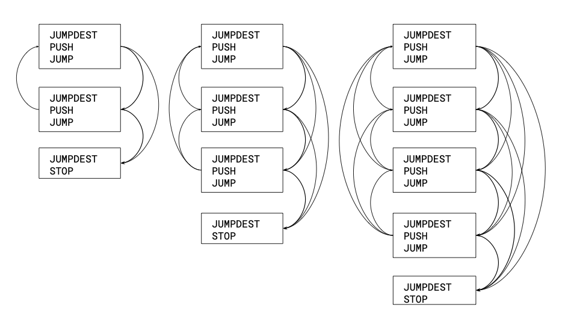

## Abstract

This is the smallest possible change to the EVM to support calls and returns.

This proposal introduces three new control-flow instructions to the EVM:

* `CALLSUB` transfers control to the `destination` on the `stack`.
* `ENTERSUB` marks a `CALLSUB` destination.
* `RETURNSUB` returns to the `PC` after the most recent `CALLSUB`.

Code can also be prefixed with `MAGIC` bytes.  The complete control flow of `MAGIC` code can be traversed in time and space linear in the size of the code, enabling tools for validation, static analysis, and AOT and JIT compilers.  On-chain, `MAGIC` code is validated at `CREATE` time to ensure that it cannot execute invalid instructions, jump to invalid locations, underflow stack, or, in the absence of recursion, overflow stack.

These changes are backwards-compatible: all instructions behave as specified whether or not they appear in `MAGIC` code.

## Motivation

In 2016 the lead author set out to write a compiler from EVM code to register code for a better VM or to machine code.  The design was simple -- traverse the EVM stack code in one pass, emitting register code for the target machine.  I was immediately stymied by the presence of dynamic jumps. _Dynamic jumps must die._

How to kill them?  First, some history.

### Babbage, 1833: Jumps and conditional jumps

In 1833 Charles Babbage began the design of a steam-powered, mechanical, Turing-complete computer.  Programs were to be encoded on punched cards which controlled a system of rods, gears and other machinery to implement storage, arithmetic, jumps, and conditional jumps.  Jumps were supported by a mechanism for shuffling forwards or backwards through the cards.  Its first published description was by L. F. Menabre, 1842[^1].  The translator, Ada Augusta, Countess of Lovelace, made extensive notes.  The notes include her famous program for recursively computing Bernoulli numbers — arguably the world's first complete computer program — which used conditional jumps to implement the required nested loops.

### Turing, 1945: Calls and returns

In 1945 Turing proposed his Automatic Computing Engine[^3], where he introduced the concept of calls and returns:  _"To start on a subsidiary operation we need only make a note of where we left off the major operation and then apply the first instruction of the subsidiary. When the subsidiary is over we look up the note and continue with the major operation."_

The ACE supported calls directly with a stack of mercury-filled memory crystals holding return addresses.  Turing's design was for a 32-bit RISC machine with integer hardware and floating point microcode, 32 registers, a 1024-entry return stack, and 32K of RAM on a 1 MHz bus.  The smaller Pilot ACE was for a while the world's fastest computer.

#### Lovelace & Turing: An aside on machine intelligence

In Lady Lovelace's notes we find her prescient recognition of the Analytic Engine's power:  _"In enabling mechanism to combine together general symbols in successions of unlimited variety and extent, a uniting link is established between the operations of matter and the abstract mental processes of the most abstract branch of mathematical science."_[^1]

Here also we find her recognition of its limits:  _"It can do whatever we know how to order it to perform. It can follow analysis; but it has no power of anticipating any analytical relations or truths. Its province is to assist us in making available what we are already acquainted with."_

In 1950 Alan Turing answered "Lady Lovelace's Objection" with a question of his own:  _"The majority of minds seem to be 'subcritical' ... an idea presented to such a mind will on average give rise to less than one idea in reply. A smallish proportion are supercritical. An idea presented to such a mind that may give rise to a whole 'theory' consisting of secondary, tertiary and more remote ideas... we ask, 'Can a machine be made to be supercritical?'"_[^2]  This question led to his famous Turing Test.  In 2025 we are wondering whether LLMs have passed it.

### Industry practice: 1945 - 2025

Call and return facilities of various levels of complexity — from Burroughs' baroque ALGOL support to RISC-V's subtly dynamic `JAL` and  `JALR` — have proven their worth across a long line of important machines over the last 80 years.  This includes most all of the machines we have programmed or implemented: physical machines including the Burroughs 5000, CDC 7600, IBM 360, PDP-11, VAX, Motorola 68000, Sun SPARC, Intel x86s, and others, as well as virtual machines for Scheme, Forth, Pascal, Java, Wasm, .NET and others.

Especially relevant to the EVM's design are the Jave, Wasm, and .NET VMs.  They share some important features:  their programs are all represented with a portable bytecode, the bytecode can be directly interpreted, and the bytecode can also be translated to machine code with a one-pass JIT.

### The EVM control-flow facility

Unlike these machines, the Ethereum Virtual Machine _does not_ provide facilities for calls and returns. Instead, they must be synthesized using the dynamic `JUMP` instruction, which takes its argument on the stack. Further, the EVM provides _only_ this jump.  The EVM's dynamic jump causes problems. First, the need to synthesize static jumps and calls with dynamic jumps wastes some space and gas.  The much bigger problem is this: jumps that can dynamically branch to any destination in the program can cause quadratic "path explosions" when traversing the program's flow of control.  We will give more detailed explanations in the Rationale.

Dynamic jumps are common enough in physical machines, whose instruction sets are of course optimized for physical performance, but less so in virtual machines, whose code is often the source for JIT compilers and other downstream tools — a JIT compiler that can take quadratic time is less than useful.  For this reason the Java, Wasm, and .NET VMs do not support dynamic jumps.

### Why dynamic jumps must die

For Ethereum, quadratic traversal times are a denial-of-service vulnerability for any online static analysis, including validating EVM bytecode and translating its virtual stack code to other representations such as virtual register code and machine code -- whether AOT at initialization time, or JIT at runtime.

Even offline, dynamic jumps (and the lack of calls and returns) can cause static analyses of many contracts to become impractical, intractable or even impossible.  The following are quotes from the abstracts for just a few recent papers on the problem:

> "Ethereum smart contracts are distributed programs running on top of the Ethereum blockchain. Since program flaws can cause significant monetary losses and can hardly be fixed due to the immutable nature of the blockchain, there is a strong need of automated analysis tools which provide formal security guarantees. Designing such analyzers, however, proved to be challenging and error-prone."[^4]
>
>  "The EVM language is a simple stack-based language ... with one significant difference between the EVM and other virtual machine languages (like Java Bytecode or CLI for .Net programs): the use of the stack for saving the jump addresses instead of having it explicit in the code of the jumping instructions. Static analyzers need the complete control-flow graph (CFG) of the EVM program in order to be able to represent all its execution paths."[^5]
>
>  "Static analysis approaches mostly face the challenge of analyzing compiled Ethereum bytecode... However, due to the intrinsic complexity of Ethereum bytecode (especially in jump resolution), static analysis encounters significant obstacles."[^6]
>
> "Analyzing contract binaries is vital ... involving identification comprising function entry identification and detecting its boundaries... Unfortunately, it is challenging to identify functions ... due to the lack of internal function call statements."[^7]

There is an entire academic literature of complex, incomplete solutions to problems that this proposal, others before it, and the design of other VMs render trivial.

With so much at stake on the blockchain -- currently over $300,000,000,000 -- deploying correct contracts is imperative — there is no reason for the EVM to make that job any more difficult than necessary.

### Taming the EVM

To prevent control-flow traversal from "going quadratic" we must prevent the dynamic use of jumps.  On-chain, most uses of `JUMP` and `JUMPI` are preceded by a `PUSH` — that is, they are effectively static.  This proposal ensures that in `valid` code `JUMP` and `JUMPI` are always used statically.  Currently, the only places that jumps _have to be_ used dynamically are to support calls and returns.  For that purpose we propose `CALLSUB` and `RETURNSUB` opcodes as replacements.

## Specification

> _The key words MUST and MUST NOT in this Specification are to be interpreted as described in RFC 2119 and RFC 8174._

### `CALLSUB (0x..)`

Transfers control to a subsidiary operation.

1. Pop the `destination` on top on the `stack`.
2. Push the current `PC + 1` to the `return stack`.
3. Set `PC` to `destination`.

The gas cost is _mid_ (`8`).

### `ENTERSUB (0x..)`

The `destination` of every `CALLSUB` MUST be an `ENTERSUB`.

### `RETURNSUB (0x..)`

Returns control to the caller of a subsidiary operation.

1. Pop the `return stack` to `PC`.

The gas cost is _low_ (`5`).

### `MAGIC (0xEF....)`

After this EIP has been activated code beginning with the `MAGIC` bytes MUST be a `valid` program.  Execution begins immediately after the `MAGIC` bytes.

_Notes:_

* _Values popped off the `return stack` do not need to be validated, since they are alterable only by `CALLSUB` and `RETURNSUB`._
* _The description above lays out the semantics of these instructions in terms of a `return stack`.  But the actual state of the `return stack` is not observable by EVM code or consensus-critical to the protocol.  (For example, a node implementer may code `CALLSUB` to unobservably push `PC` on the `return stack` rather than `PC + 1`, which is allowed so long as `RETURNSUB` observably returns control to the `PC + 1` location.)_
* _Opcode and `MAGIC` values are still to be determined._

### Costs

A _mid_ cost for `CALLSUB` is justified by it taking very little more work than the _mid_ cost of `JUMP` — just pushing an integer to the `return stack`

A _jumpdest_ cost for `ENTERSUB` is justified by it being, like `JUMPDEST`, a mere label.

A _low_ cost for `RETURNSUB` is justified by needing only to pop the `return stack` into the `PC` — less work than a jump.

Benchmarking will be needed to tell if the costs are well-balanced.

### Validity

Execution is defined in the Yellow Paper as a sequence of changes to the EVM state. The conditions on `valid` code are preserved by state changes. At runtime, if execution of an instruction would violate a condition the execution is in an exceptional halting state and cannot continue. The Yellow Paper defines six such states.

* State modification during a static call
* Insufficient gas
* More than 1024 stack items
* Insufficient stack items
* Invalid jump destination
* Invalid instruction

We would like to consider EVM code `valid` iff no execution of the program can lead to an exceptional halting state. In practice, we must test at runtime for the first three conditions.  We don't know whether we will be called statically.  We don't know how much gas there will be, and we don't know how deep a recursion may go.  (However, we can validate that non-recursive programs do not overflow stack.)  All of the remaining conditions MUST be validated statically.  To allow for efficient algorithms our validation does not consider the codes data and computations, only its control flow and stack use. This means we will reject programs with invalid code paths, even if those paths are not reachable.

#### Constraints on `valid` code

Code beginning with `MAGIC` MUST be `valid`.  Constraints on `valid` code MUST be validated at `CREATE` time, in time and space linear in the size of the code.  The constraints on `valid` code are as follows.

* All executable opcodes must be `valid`:
  * They MUST have been defined in the Yellow Paper or a deployed EIP and
  * MUST NOT have been deprecated in a subsequent deployed EIP.
  * The `INVALID` opcode is `valid`.
* The `JUMP` and `JUMPI` instructions MUST be preceded by a `PUSH` instruction.
* The `JUMP` and `JUMPI` instructions MUST NOT address immediate data, and MUST address a `JUMPDEST`.
* The `CALLSUB` instruction MUST NOT address immediate data, and MUST address an `ENTERSUB`.
* The number of items on the `data stack` MUST always be positive and less than or equal to 1024.
* The number of items on the `return stack` MUST always be positive and less than or equal to 1024.
* The `stack height` is the absolute difference between the current `stack pointer` and the `stack pointer` at the most recent `ENTERSUB`:
  * The `stack height` MUST be _the same_ for every `PC`.

The guarantee of constant stack height prevents stack underflow, breaks cycles in the control flow, ensures finite stack use for non-recursive programs, and allows virtual stack code to be directly serialized into virtual register code for faster interpretation and compilation to machine code.

_Note: The JVM, Wasm and .NET VMs enforce similar constraints for similar reasons._

#### Validation

The above is a purely semantic specification, placing no constraints on the syntax of bytecode beyond being an array of opcodes and immediate data.  "Subsidiary operations" here are not contiguous sequences of bytecode: they are subgraphs of the bytecode's full control-flow graph.  The EVM is a simple state machine, and the control-flow graph for a program represents every possible change of state.  Each instruction simply advances the machine one more step — state has no syntactic structure.  We only promise that `valid` code will not, as it were, jam up the gears of the machine.

Rather than enforce semantic constraints via syntax — as is done by higher-level languages — this proposal enforces them via validation: `MAGIC` code is proven `valid` at `CREATE` time.  We provide an algorithm below for validating code in time and space linear in the size of the code.  An equivalent predicate MUST be proven true by `CREATE` time.

With no syntactic constraints and minimal semantic constraints we maximize opportunities for optimizations, include tail call elimination, multiple-entry calls, arranging variables for efficient register allocation, and inter-procedural optimizations.  Since we want to support online compilation of EVM code to native code it is crucial that the EVM code be as well optimized as possible by our HLL compilers — upfront and offline.

## Rationale

### How can dynamic jumps cause quadratic control flow?

Static analysis amounts to most anything you can do with a program without actually running it.  And traversing the flow of control — in a way that follows every possible path only once — is a fundamental first step for many static analyses, especially for recovering control-flow graphs.  When all jumps are static the number of steps is linear in the number of instructions: a fixed number of paths must be explored for each jump.  But with dynamic jumps every possible destination must be explored at every jump: at worst, the number of steps can be quadratic in the number of instructions.

Consider these three programs.  They make for nice exploits -- is impossible to know where the jumps go.

```

   jumpdest           jumpdest          jumpdest
   prevrandao         prevrandao        prevrandao
   jump               jump              jump
   jumpdest           jumpdest          jumpdest
   sload              sload             sload
   jump               jump              jump
   jumpdest           jumpdest          jumpdest
   stop               sload             sload
                      jump              jump
                      jumpdest          jumpdest
                      stop              sload
                                        jump
                                        jumpdest
                                        stop

```

And consider the control-flow graphs for these programs.  Each block of instructions in a graph is a sequence from the above programs with one entry (a `JUMPDEST`) and one exit (a `JUMP`), and each arc is a transfer of control.  Arcs on the left are backwards branches, arcs on the right are forwards branches.


_Graph is outdated_

Note that the number of arcs in a graph is equal to the number of blocks minus one, squared.  That is, the number of possible paths of control flow, and thus the time needed to traverse them all, is quadratic in the size of the program.

### Do we save on code size and gas?

The difference these instructions make can be seen in this very simple code for calling a routine that squares a number.  The distinct opcodes make it easier for both people and tools to understand the code, and there are modest savings in code size and gas costs as well.

```

SQUARE:                           |       SQUARE:
    jumpdest       ; 1 gas        |           entersub       ; 1 gas
    dup            ; 3 gas        |           dup            : 5 gas
    mul            ; 5 gas        |           mul            ; 5 gas
    swap1          ; 3 gas        |           returnsub      ; 5 gas
    jump           ; 8 gas        |
                                  |
CALL_SQUARE:                      |       CALL_SQUARE:
    jumpdest       ; 1 gas        |           entersub       ; 1 gas
    push RTN_CALL  ; 3 gas        |           push 2         ; 3 gas
    push 2         ; 3 gas        |           push SQUARE    ; 3 gas
    push SQUARE    ; 3 gas        |           callsub        ; 8 gas
    jump           ; 8 gas        |           returnsub      ; 5 gas
RTN_CALL:                         |
    swap1          ; 3 gas        |
    jump           ; 8 gas        |
                                  |
Size in bytes; 18                 |      Size in bytes: 13
Consumed gas;  49                 |      Consumed gas:  38

```

That's 32% fewer bytes and 30% less gas using `CALLSUB` versus using `JUMP`.  So we can see that these instructions provide a simpler, more efficient mechanism. As code becomes larger and better optimized the gains become smaller, but code using `CALLSUB` always takes less space and gas than equivalent code without it.

### Do we improve real-time performance?

Some real-time performance gains will be had, as reflected in the gas.  But large real-time gains will come from AOT and JIT compilers.  Crucially, the constraint that stack depths be constant means that in `MAGIC` code a very fast streaming JIT can traverse the control flow of the EVM code in one pass -- as it is executed -- generating machine code as it goes. _(Note again: the Wasm, JVM and .NET VMs share that property.)_  The EVM is a stack machine, but real machines are register machines.  So generating virtual register code for a faster interpreter is a win, (I have seen 4X speedups on JVM code) and generating good machine code gives orders of magnitude gains. But for most transactions storage dominates execution time, and gas counting and other overhead always take their toll.  So these gains would be most visible in contexts where this overhead is absent, such as for L1 precompiles, on some L2s, and on some EVM-compatible chains.  Code can also be compiled to a better instruction set for on-chain ZK work, such as RISC-V.

### Why no immediate arguments?

This would of course break the promise of "the smallest possible change."  [EIP-8013: Static relative jumps and calls for the EVM](./eip-8013) is available if we want its size and performance advantages. It proposes five new EVM jump instructions (RJUMP, RJUMPI, RJUMPV, RJUMPSUB, and RJUMPSUBV) which encode destinations as signed immediate values. These can be useful for almost all JUMP and JUMPI use cases and offer improvements in cost, performance, and static analysis..

### Why no code sections?

Again, this would break the promise of "the smallest possible change," and [EIP-3540: EOF - EVM Object Format](./eip-3540) remains available. In the presence of EOF code sections `CALLSUB` could be restricted to section boundaries.  But note that this restriction impedes important optimizations, which EOF supported by adding special opcodes.  So if we want restricted code sections it becomes a much bigger change, and we should consider [EOF - Functions](./eip-4750) and related EIPs separately.

### Why the return-stack mechanism?

In our experience most stack machines have separate stacks for data and for returns from calls, whereas most register machines have one stack for both data and return addresses, registers for computation, and instructions to support returns from calls in coordination with registers and the stack.  The EVM is of course a stack machine, not a register machine.  As an industry and a team we have substantial experience with the return-stack mechanism proposed here.  It has been effectively used in many machines over the last eight decades since Turing invented it, and has been implemented, tested, and even ready to ship in many of our clients over the last nine years.

## Backwards Compatibility

These changes are backwards compatible.

* There are _no changes_ to the semantics of existing EVM code.
   * With the caveat that code with unspecified behavior might behave in different, unspecified ways.  Such code was always broken.
* Opcode semantics _are not_ affected by whether the code begins with `MAGIC`.
  * What is affected is the _validity_ of code.  `valid` code MUST execute identically in any contracts, but in `MAGIC` contracts the code MUST be `valid`.
* This proposal _does not_ require maintaining two interpreters.

These changes do not foreclose EOF, RISC-V, or other changes; new `MAGIC` numbers would mark future EVMs.  Neither do these changes preclude running the EVM in zero knowledge; they would more likely help.

## Test Cases

_(Note: these tests are known to be outdated and incorrect.)_

### Simple routine

This should jump into a subroutine, back out and stop.

Bytecode: `0x60045e005c5d` (`PUSH1 0x04, CALLSUB, STOP, BEGINSUB, RETURNSUB`)

|  Pc   |      Op     | Cost |   Stack   |   RStack  |
|-------|-------------|------|-----------|-----------|
|    0  |      PUSH1  |    3 |        [] |        [] |
|    2  |    CALLSUB  |   10 |       [4] |        [] |
|    5  |  RETURNSUB  |    5 |        [] |      [ 2] |
|    3  |       STOP  |    0 |        [] |        [] |

Output: 0x
Consumed gas: `18`

### Two levels of subroutines

This should execute fine, going into one two depths of subroutines

Bytecode: `0x6800000000000000000c5e005c60115e5d5c5d` (`PUSH9 0x00000000000000000c, CALLSUB, STOP, BEGINSUB, PUSH1 0x11, CALLSUB, RETURNSUB, BEGINSUB, RETURNSUB`)

|  Pc   |      Op     | Cost |   Stack   |   RStack  |
|-------|-------------|------|-----------|-----------|
|    0  |      PUSH9  |    3 |        [] |        [] |
|   10  |    CALLSUB  |   10 |      [12] |        [] |
|   13  |      PUSH1  |    3 |        [] |      [10] |
|   15  |    CALLSUB  |   10 |      [17] |      [10] |
|   18  |  RETURNSUB  |    5 |        [] |   [10,15] |
|   16  |  RETURNSUB  |    5 |        [] |      [10] |
|   11  |       STOP  |    0 |        [] |        [] |

Consumed gas: `36`

### Failure 1: invalid jump

This should fail, since the given location is outside of the code-range. The code is the same as previous example,
except that the pushed location is `0x01000000000000000c` instead of `0x0c`.

Bytecode: `0x6801000000000000000c5e005c60115e5d5c5d` (`PUSH9 0x01000000000000000c, CALLSUB, STOP, BEGINSUB, PUSH1 0x11, CALLSUB, RETURNSUB, BEGINSUB, RETURNSUB`)

|  Pc   |      Op     | Cost |   Stack   |   RStack  |
|-------|-------------|------|-----------|-----------|
|    0  |      PUSH9  |    3 |        [] |        [] |
|   10  |    CALLSUB  |   10 |[18446744073709551628] |        [] |

```
Error: at pc=10, op=CALLSUB: invalid jump destination
```

### Failure 2: shallow `return stack`

This should fail at first opcode, due to shallow `return_stack`

Bytecode: `0x5d5858` (`RETURNSUB, PC, PC`)

|  Pc   |      Op     | Cost |   Stack   |   RStack  |
|-------|-------------|------|-----------|-----------|
|    0  |  RETURNSUB  |    5 |        [] |        [] |

```
Error: at pc=0, op=RETURNSUB: invalid retsub
```

### Subroutine at end of code

In this example. the CALLSUB is on the last byte of code. When the subroutine returns, it should hit the 'virtual stop' _after_ the bytecode, and not exit with error

Bytecode: `0x6005565c5d5b60035e` (`PUSH1 0x05, JUMP, BEGINSUB, RETURNSUB, JUMPDEST, PUSH1 0x03, CALLSUB`)

|  Pc   |      Op     | Cost |   Stack   |   RStack  |
|-------|-------------|------|-----------|-----------|
|    0  |      PUSH1  |    3 |        [] |        [] |
|    2  |       JUMP  |    8 |       [5] |        [] |
|    5  |   JUMPDEST  |    1 |        [] |        [] |
|    6  |      PUSH1  |    3 |        [] |        [] |
|    8  |    CALLSUB  |   10 |       [3] |        [] |
|    4  |  RETURNSUB  |    5 |        [] |      [ 8] |
|    9  |       STOP  |    0 |        [] |        [] |

Consumed gas: `30`

## Reference Implementation

_(Note: this implementation is known to be incomplete and incorrect.)_

The following is a pseudo-Python implementation of an algorithm for predicating code validity.  An equivalent algorithm MUST be run at `CREATE` time in space and time linear in the size of the code.  The following algorithm recursively traces the _code_, emulating its control flow and stack use and checking for violations of the rules above.  It runs in time proportional to the size of the code, and the possible depth of recursion is proportional to the size of the code.

### Validation Function

We assume that instruction validation and destination analysis has been done, and that we have some constant-time helper functions:

* `is_terminator(opcode)  returns true iff opcode is a terminator.`
* `previous_data(pc)      returns the immediate data for the instruction before pc (usually a PUSH.)`
* `immediate_size(opcode) returns the size of the immediate data for an opcode.`
* `removed_items(opcode)  returns the number of items removed from the data_stack by the opcode.`
* `added_items(opcode)    returns the number of items added to the data_stack by the opcode.`

```
    # returns true iff code is valid
    int []stack_depths
    int []max_depths
    def validate_code(code: bytes, pc: int, sp: int, bp: int, max: int) -> int, boolean:
        while pc < len(code):

            # check stack height and return if we have been here before
            stack_depth = sp - bp
            max_depth = max + stack_depth
            if max_depth > 1024
                return max_depth, false
            if stack_depths[pc] {
                if stack_depth != stack_depths[pc]:
                    return 0, false
                if opcode == ENTERSUB:
                    return max_depths[pc], true
                else
                    return max_depth, true
                else:
                    stack_depths[pc] = stack_depth

            if is_terminator(opcode):
                return max_depth, true

            elif opcode == CALLSUB:

                # push return address and set pc to destination
                jumpdest = previous_data(pc)
                push(return_stack, pc)

                # validate and track maximum height
                max_depth, valid = validate_code(jumpdest, 0, sp - bp, max)
                if !valid:
                   return max_depth, false
                max_depths[jumpdest] = max_depth;

            elif opcode == RETURNSUB:

                # pop return address and check for preceding call
                pc = pop(return_stack)
                max_depth = max + stack_depth
                return max_depth, true

            if opcode == JUMP:

                # set pc to destination of jump
                pc = previous_data(pc)

            elif opcode == JUMPI:

                jumpdest = previous_data(pc)

                # recurse to validate true side of conditional
                max_depth, valid = validate_code(jumpdest, sp, bp)
                if !valid:
                    return max_depth, false

            # apply instructions to stack
            sp -= removed_items(opcode)
            if sp < 0
                return so, false
            sp += added_items(opcode)

            # Skip opcode and any immediate data
            pc += 1 + immediate_size(opcode)

        max_depth = max + stack_depth
        if (max_depth > 1024)
            return max_depth, false
        return max_depth, true
```

## Security Considerations

These changes introduce new flow control instructions.  They do not introduce any new security considerations. This EIP is intended to improve security by validating a higher level of safety for EVM code deployed on the blockchain.  The validation algorithm must use time and space linear in the size of the code so as not be a denial of service vulnerability.  The algorithm here makes one linear-time, recursive pass of the bytecode, whose depth cannot exceed the number of `CALLSUB` and `JUMPI` instructions in the code.

## Copyright

[^1]: Menabre, L.F. Sketch of The Analytical Engine Invented by Charles Babbage. Bibliothque Universelle de Genve, No. 82, October 1842
[^2]: Turing, A.M. Computing Machinery and Intelligence. Mind, Volume LIX, Issue 236, October 1950
[^3]: Carpenter, B.E. et al. The other Turing machine. The Computer Journal, Volume 20, Issue 3, January 1977
[^4]: Schneidewind, Clara et al. The Good, the Bad and the Ugly: Pitfalls and Best Practices in Automated Sound Static Analysis of Ethereum Smart Contracts. DOI: 10.48550/arXiv.2101.05735
[^5]: Albert, Elvira et al. Analyzing Smart Contracts: From EVM to a sound Control-Flow Graph. DOI: 10.48550/arXiv.2004.14437
[^6]: Contro, Fillipo et al. EtherSolve: Computing an Accurate Control-Flow Graph from Ethereum Bytecode. DOI: 10.48550/arXiv.2103.09113
[^7]: He, Jiahao et al. Neural-FEBI: Accurate Function Identification in Ethereum Virtual Machine Bytecode. DOI: 10.48550/arxiv.2301.12695"

<!--

``` csl-json
   {
     "type": "article",
     "id": 4,
     "author": [
       {
         "family": "Schneidewind",
         "given": "Clara"
       }
     ],
     "DOI": "arXiv:2101.05735",
     "title": "The Good, the Bad and the Ugly: Pitfalls and Best Practices in Automated Sound Static Analysis of Ethereum Smart Contracts.,
     "original-date": {
       "date-parts": [
         [2021, 1, 14]
       ]
     },
     "URL": "https://arxiv.org/abs/2101.05735"
   }
   ```

   ``` csl-json
   {
     "type": "article",
     "id": 5,
     "author": [
       {
         "family": "Albert",
         "given": "Elvira"
       }
     ],
     "DOI": "arXiv:2004.14437",
     "title": "Analyzing Smart Contracts: From EVM to a sound Control-Flow Graph.,
     "original-date": {
       "date-parts": [
         [2020, 4, 29]
       ]
     },
     "URL": "https://arxiv.org/abs/2004.14437"
   }
   ```
   ``` csl-json
   {
     "type": "article",
     "id": 6,
     "author": [
       {
         "family": "Contro",
         "given": "Filippo"
       }
     ],
     "DOI": "arXiv:2103.09113",
     "title": "EtherSolve: Computing an Accurate Control-Flow Graph from Ethereum Bytecode.",
     "original-date": {
       "date-parts": [
         [2021, 3, 16]
       ]
     },
     "URL": "https://arxiv.org/abs/2103.09113"
   }
   ```

   ``` csl-json
   {
     "type": "article",
     "id": 7,
     "author": [
       {
         "family": "He",
         "given": "Jiahao"
       }
     ],
     "DOI": "arXiv:2301.12695",
     "title": "Neural-FEBI: Accurate Function Identification in Ethereum Virtual Machine Bytecode.",
     "original-date": {
       "date-parts": [
         [2023, 1, 30]
       ]
     },
     "URL": "https://arxiv.org/abs/2301.12695"
   }
   ```
-->
Copyright and related rights waived via [CC0](../LICENSE.md).
