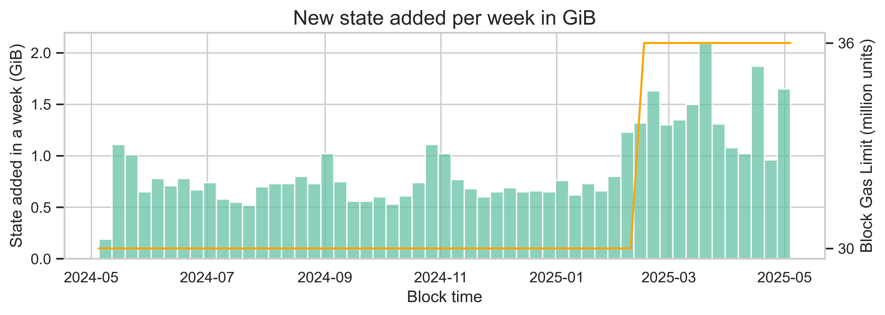

## Abstract

This proposal increases the cost of state creation operations, thus avoiding excessive state growth under increased block gas limits. It dynamically sets the unit cost per new state byte at a given block gas limit, by targeting an average state growth of 100 GiB per year based on current network usage. It also introduces an independent metering for state creation costs, thus allowing for increased throughput and for larger contract deployments without being limited by the single transaction gas limit.

## Motivation

State creation does not have a harmonized cost, with different methods incurring varied costs for creating the same size of new state. For instance, while contract deployment only costs 202 gas units per new byte created, new storage slots cost 625 gas units per new byte created. Also, deploying duplicated bytecode costs the same as deploying new bytecode, even though clients don't store duplicated code in the database. This proposal establishes a standard to harmonize all state creation operations.

Additionally, state growth will become a bottleneck for scaling under higher block limits. As of May 2025, the current database size in a Geth node dedicated to state is ~340 GiB. After the increase in gas limit from 30M to 36M gas units, the median size of new state created each day doubled, from ~102 MiB to ~205 MiB. This results in an annual growth of ~73 GiB per year.



The relationship we are seeing in this example is not linear as expected. This is likely due to other factors impacting user behavior. However, all else being equal, we expect a proportional increase in the number of new states created as gas limits increase. At a 60M gas limit (and a proportional increase in new state per day of 1.7x), we would see a daily state growth of ~349 MiB and a yearly state growth of ~124 GiB. Similarly, at a 100M gas limit, the state would grow at a rate of ~553 MiB per day and 197 GiB per year. This level of state growth would give us less than 2.5 years until the size of the state database exceeds the threshold of 650 GiB, at which point nodes will begin experiencing a degradation in performance.

## Specification

### New parameters

| **Parameter** | **Value** |
|:---:|:---:|
| `TARGET_STATE_GROWTH_PER_YEAR` | 100 x 1024^3 bytes |

Besides these fixed parameters, this EIP introduces a dynamic variable that controls the cost per byte of state created for a given block gas limit. The variable is `cost_per_state_byte` and is calculated as follows:

```python
cost_per_state_byte = np.ceil(((gas_limit/2) * 7200 * 365) / TARGET_STATE_GROWTH_PER_YEAR)
```

### Parameter changes

Upon activation of this EIP, the following parameters of the gas model are updated. The "New State Gas" column shows the state gas cost (charged to the `state_gas` dimension), while the "New Regular Gas" column shows additional regular gas costs that accompany the state gas charge.

| **Parameter** | **Current** | **New State Gas** | **New Regular Gas** | **Operations affected** |
|---|---|---|---|---|
| `GAS_CREATE` | 32,000 | 112 × `cpsb` | tbd | `CREATE`, `CREATE2`, contract creation txs |
| `GAS_CODE_DEPOSIT` | 200/byte | `cpsb` per byte | `6 × ceil(len/32)` (hash cost) | `CREATE`, `CREATE2`, contract creation txs |
| `GAS_NEW_ACCOUNT` | 25,000 | 112 × `cpsb` | — (already has `GAS_CALL_VALUE` 9,000) | `CALL*` |
| `GAS_STORAGE_SET` | 20,000 | 32 × `cpsb` | 2,900 (`GAS_STORAGE_UPDATE - GAS_COLD_SLOAD`) | `SSTORE` |
| `PER_EMPTY_ACCOUNT_COST` | 25,000 | 112 × `cpsb` | — (included in `PER_AUTH_BASE_COST`) | EOA delegation |
| `PER_AUTH_BASE_COST` | 12,500 | 23 × `cpsb` | 7,500 | EOA delegation |

Where `cpsb` = `cost_per_state_byte`.

The `PER_AUTH_BASE_COST` regular gas of 7,500 is derived from [EIP-7702](./eip-7702.md)'s cost analysis, excluding the code deployment cost (now charged as state gas):

- Calldata cost: ~1,616 (101 bytes × 16)
- Recovering authority address (ecrecover): 3,000
- Reading nonce and code of authority (cold access): 2,600
- Storing values in already warm account: 200
- ~~Code deployment cost: 4,600 (200 × 23)~~ → now in state gas

Total regular gas: 1,616 + 3,000 + 2,600 + 200 ≈ 7,500

In addition, `GAS_SELF_DESTRUCT_NEW_ACCOUNT` is removed and replaced by `GAS_NEW_ACCOUNT`.

### Multidimensional metering for state creation costs

Besides the parameter changes, this proposal introduces an independent metering for state creation costs. The specification is derived from [EIP-8011](./eip-8011.md). However, it only requires two dimensions, namely, `regular_gas` and `state_gas`. The gas costs of the parameters updated above are charged to `state_gas` instead of `regular_gas`, while all the other gas costs are charged to `regular_gas`.

At transaction level, the user pays for both `regular_gas` and `state_gas`. The total gas cost of a transaction is the sum of both dimensions. The transaction gas limit set in [EIP-7825](./eip-7825.md) only applies to the `gas` dimension, while `state_gas` is uncapped at transaction level.

At block level, we compute the new field `block.gas_metered` as:

```python
def compute_block_gas_metered(block: Block) -> int:
    transactions = self.transactions(block)
    block_gas_used_vector = array(0, 0)
    for transaction in transactions:
        gas_used, gas_used_vector = self.execute_transaction(transaction, effective_gas_price)
        block_gas_used_vector += gas_used_vector
    block_regular_gas_used = block_gas_used_vector[0]
    block_state_gas_used = block_gas_used_vector[1]
    gas_metered = max(block_regular_gas_used,  block_state_gas_used)
    return gas_metered
```

The block validity condition is modified to replace `block.gas_used` with `block.gas_metered`:

```python
assert block.gas_metered <= block.gas_limit, 'invalid block: too much gas used'
```

and the base fee update rule is modified to use `block.gas_metered` instead of `block.gas_used`:

```python
gas_used_delta = parent.gas_metered - parent.gas_target
```

### Contract deployment cost calculation

This proposal clarifies how gas is charged during contract deployment, ensuring that post-execution costs (account creation, hashing, code deposit) are only charged when the deployment succeeds.

#### Success vs Failure Gas Accounting

When a contract creation transaction or opcode (`CREATE`/`CREATE2`) is executed, gas is charged differently based on whether the deployment succeeds or fails. Given bytecode `B` (length `L`) returned by initcode and `H = keccak256(B)`:

1. **When opcode execution starts:** Always charge `GAS_CREATE`
2. **During initcode execution:** Charge the actual gas consumed by the initcode execution
3. **Success path** (no error, not reverted, and `L ≤ MAX_CODE_SIZE`):
   - Charge `GAS_CODE_DEPOSIT * L` and persist `B` under `H`, then link `codeHash` to `H`
   - Charge `HASH_COST(L)` where `HASH_COST(L) = 6 × ceil(L / 32)` to compute `H`
4. **Failure paths** (REVERT, OOG/invalid during initcode, OOG during code deposit, or `L > MAX_CODE_SIZE`):
   - Do NOT charge `GAS_CODE_DEPOSIT * L` or `HASH_COST(L)`
   - No code is stored; no `codeHash` is linked to the account
   - The account remains unchanged or non-existent

**Important:** The gas for code deposit (`GAS_CODE_DEPOSIT * L`) is checked before hash computation. This means that if a deployment runs out of gas, it will fail during the deposit gas check before the hash is computed. This maintains consistency with post-Homestead behavior where any deployment failure (including OOG) reverts all state changes - no account is created, and no gas is charged beyond `GAS_CREATE` and the actual initcode execution cost consumed.

**Total gas formulas:**

```
SUCCESS_PATH_TOTAL_GAS =
    GAS_CREATE
  + initcode_execution_cost
  + (GAS_NEW_ACCOUNT if account is new else 0)
  + GAS_CODE_DEPOSIT * L
  + HASH_COST(L)

FAILURE_PATH_TOTAL_GAS =
    GAS_CREATE
  + initcode_execution_cost
```

#### `CREATE` vs `CREATE2`

`CREATE2` already charges for hashing the init code when deriving the address. That cost remains unchanged. The bytecode hash (`keccak256(B)`) must be computed on success to store the code, incurring `HASH_COST(L)` as specified above.

## Rationale

### Deriving the cost per byte

The variable `cost_per_state_byte` is a dynamic parameter that depends on the block gas limit. The idea is to have a cost that scales as the block gas limit increases, thus avoiding excessive state growth. To compute this variable, we target a specific state growth per year, which we set to 75 GiB. Then, we assume this growth rate is achieved at an average gas utilization.

With multidimensional metering, blocks can be filled up to 50% of the target for both regular gas and state gas. Thus, we consider that on average, blocks can use half of the entire available gas in the block for state creation. This leads to a total of `(gas_limit/2) * 7200 * 365` gas units used for state creation in a year. Dividing this by the target state growth per year gives us the cost per byte of state created.

### Harmonization across state creation

With the current pricing, the gas cost of creating 1 byte of state varies depending on the method used. The following table shows the various methods and their gas cost per byte. The calculation ignores the transaction intrinsic cost (21k gas units) and the costs of additional opcodes and scaffolding needed to execute such a transaction.

| Method                                                      | What is written                                | Intrinsic gas                                                                                 | Bytes → state | Gas / byte |
| ----------------------------------------------------------- | ---------------------------------------------- | --------------------------------------------------------------------------------------------- | ------------- | ---------- |
| Deploy 24kB contract ([EIP-170](./eip-170.md) limit)        | Runtime code + account trie node               | 32,000 CREATE + 200 × 24,576 code deposit = 4,947,200 gas                | 24,688 B      | ~200 gas   |
| Fund fresh EOA with 1 wei                                   | Updated account leaf                           | 25,000 new account                                                                            | ~112 B        | ~223 gas   |
| Add delegate flag to funded EOA ([EIP-7702](./eip-7702.md)) | 23 B (0xef0100‖address) + updated account leaf | 25,000 PER_EMPTY_ACCOUNT + 12,500 PER_AUTH_BASE + 1,616 calldata - 7,823 refund = ~31,300 gas | ~135 B        | ~232 gas   |
| [EIP-7702](./eip-7702.md) authorization to empty address    | 23 B (0xef0100‖address) + updated account leaf | 25,000 PER_EMPTY_ACCOUNT + 12,500 PER_AUTH_BASE + 1,616 calldata = 39,116 gas                 | ~135 B        | ~289 gas   |
| Fill new storage slots (SSTORE 0→x)                         | Slot in storage trie                           | 20,000 gas/slot                                                                               | 32 B          | 625 gas    |

To harmonize costs, we first set the gas cost of a single state byte, `cost_per_state_byte`, as explained above. This is a dynamic parameter that depends on the block gas limit. Now that we have a standardized cost per byte, we can derive the various costs parameters by multiplying the unit cost by the increase in bytes any given operation creates in the database (i.e., 32 bytes per slot, 112 bytes per account and 23 bytes per authorization).

Note that the fixed cost `GAS_CREATE` for contract deployments assumes the same cost as a new account creation.

### Multidimensional metering

This proposal is consistent with [EIP-8011](./eip-8011.md). However, it only requires two dimensions, namely, `regular_gas` and `state_gas`. If [EIP-8011](./eip-8011.md) is not implemented, a two-dimensional version of [EIP-8011](./eip-8011.md) is still required.

#### EIP-7825 limit on contract size

[EIP-7825](./eip-7825.md) introduces `TX_MAX_GAS_LIMIT` (16.7M) as the maximum gas for a single transaction, in particular stipulating `tx.gas < TX_MAX_GAS_LIMIT`as a validity condition. Were we to continue enforcing this validity condition, with a block limit of 60M gas units, this proposal would limit the maximum contract size that can be deployed to roughly 12kb ($\frac{16,777,216 - 21,000 - 5,000,000 - 112*980}{980} = 11,884$). This maximum size would only decrease as we increase the gas limit and the `cost_per_state_byte`.

To solve this issue, we only apply this gas limit to regular gas, not state gas. Doing so does not weaken the intended scaling effect of [EIP-7825](./eip-7825.md), because regular gas meters all resources that benefit from parallelization. In particular, state growth does not: growing the state always require writing to disk, a parallelizable operation, but crucially this part of the cost of a state growth operation has to be metered in regular gas, not state gas. In other words, any operation that grows the state should consume both regular gas and state gas, and the regular gas should fully account for all costs other than the long term effect of growing the state.

However, we cannot statically enforce a regular gas consumption of `TX_MAX_GAS_LIMIT`, while still allowing a higher state gas consumption, because transactions only have a single gas limit parameter, `tx.gas`. Therefore, we also move the enforcement of this limit to transaction execution, and from a validity condition to a revert condition. Exactly like running out of gas, a transaction reverts as soon as its regular gas consumption exceeds `TX_MAX_GAS_LIMIT`. This is not applied to system transactions.

#### Higher throughput

Another advantage of metering contract creation separately is that increasing the cost of state creation operation in line with the block limit will not affect the available gas for other operations. This allows for higher throughput, as explained in the original multidimensional gas metering introduced in [EIP-8011](./eip-8011.md).

## Backwards Compatibility

This is a backwards-incompatible gas repricing that requires a scheduled network upgrade.

Wallet developers and node operators MUST update gas estimation handling to accommodate the new calldata cost rules. Specifically:

- Wallets: Wallets using `eth_estimateGas` MUST be updated to ensure that they correctly account for the updated gas parameters. Failure to do so could result in underestimating gas, leading to failed transactions.
- Node Software: RPC methods such as `eth_estimateGas` MUST incorporate the updated formula for gas calculation with the new floor cost values.

Users can maintain their usual workflows without modification, as wallet and RPC updates will handle these changes.

### Estimated price impacts at various block gas limits

Users and dApp developers will experience an increase in transaction costs associated with creating a new state. The next table summarizes the state creation costs for common operations at different block gas limits.

| Case | cost_per_state_byte | Cost of a new account | Cost increase | Cost of a new slot | Cost increase | 24kB contract deployment | Cost increase |
|:---:|:---:|---|---|---|---|---|---|
| Current cost | NA | 25,000 | NA | 20,000 | NA | 4,947,200 | NA |
| Proposed cost at 60M block limit | 734 | 82,237 | 3 | 23,496 | 1 | 18,127,280 | 4 |
| Proposed cost at 100M block limit | 1,224 | 137,061 | 5 | 39,160 | 2 | 30,212,134 | 6 |
| Proposed cost at 300M block limit | 3,671 | 411,183 | 16 | 117,481 | 6 | 90,636,402 | 18 |

We should note that as the block limit increases, the base fee is expected to reduce due to the higher capacity of the network. This reduction in base fee will offset, in part, the costs from state creation operations. Some analysis is needed to quantify this effect.

## Security Considerations

Increasing the cost of state creation operations could impact the usability of certain applications. More analysis is needed to understand the potential effects on various dApps and user behaviors.

### Mispricing with respect to ETH transfers

One potential concern is the cost of creating a new account (212,800 gas units), compared to transferring ETH to a fresh account (21,000 gas units). With this mismatch, users wishing to create new account are incentivized to first send a normal transaction (costing 21k) to this account to create it, thus avoiding the `PER_EMPTY_ACCOUNT_COST` of 212,800 gas units.

[EIP-2780](./eip-2780.md) solves this mispricing by adding a new component to the intrinsic gas cost of transactions. For transactions the sending ETH that send ETH to a fresh account. If a non-create transaction has value > 0 and targets a non-existent account, the `GAS_NEW_ACCOUNT` is added to intrinsic cost.

### Added complexity in block building

Optimal block construction becomes more complex, since builders must now balance resource usage across multiple dimensions rather than a single gas metric. Sophisticated builders may gain an advantage by applying advanced optimization techniques, raising concerns about further builder centralization. However, practical heuristics (e.g., greedily filling blocks until one resource dimension saturates) remain effective for most use cases. These heuristics limit centralization pressure by keeping block construction feasible for local and less sophisticated builders.

### Testing requirements for increasing block limits

With a dynamic cost per byte, every time the block gas limit is increased, clients and testing frameworks need to test for backward compatibility issues. This changes the testing framework for increasing the block limit. A way to mitigate this is to introduce a max cost per byte and do the analysis once on the impact of this max cost.

## Copyright

Copyright and related rights waived via [CC0](../LICENSE.md).
