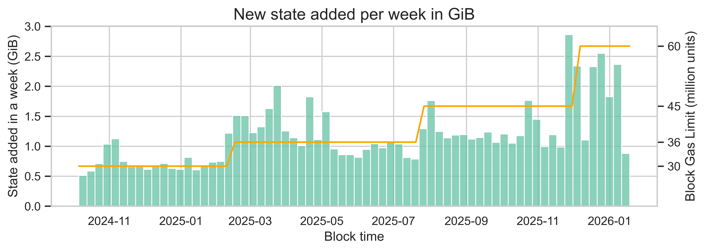

## Abstract

This proposal increases the cost of state creation operations, thus avoiding excessive state growth under increased block gas limits. It introduces a new variable, `CPSB` (cost per state byte), and sets this unit of gas costs per new state byte by targeting an average state growth of 120 GiB per year at a reference block gas limit of 150M gas units. It also introduces an independent metering for state creation costs, thus allowing for increased throughput and for larger contract deployments without being limited by the single transaction gas limit.

## Motivation

State creation does not have a harmonized cost, with different methods incurring varied costs for creating the same size of new state. For instance, while contract deployment only costs ~200 gas units per new byte created, new storage slots cost ~313 gas units per new byte created. Also, deploying duplicated bytecode costs the same as deploying new bytecode, even though clients don't store duplicated code in the database. This proposal establishes a standard to harmonize all state creation operations.

Additionally, state growth will become a bottleneck for scaling under higher block limits. As of January 2026, the current database size in a Geth node dedicated to state is ~390 GiB. After the increase in gas limit from 30M to 60M gas units, the average size of new state created each day more than tripled, from ~105 MiB to ~326 MiB. This results in an annual growth of ~116 GiB.



The state-growth response we observe is not linear in the gas limit increase: a 2x bump (30M → 60M) produced a roughly 3x jump in daily new state, suggesting a one-off shift in user behavior rather than a steady-state ratio. Treating the post-bump rate as the new baseline and extrapolating proportionally to the new gas limit, at a 200M gas limit, the state would grow at a rate of ~387 GiB per year. Starting from 390 GiB, this rate would breach the 650 GiB threshold (at which point nodes begin experiencing performance degradation) in less than a year.

## Specification

### New parameters

| **Parameter** | **Value** |
|:---:|:---:|
| `CPSB` | 1530 |
| `STATE_BYTES_PER_STORAGE_SET` | 64 |
| `STATE_BYTES_PER_NEW_ACCOUNT` | 120 |
| `STATE_BYTES_PER_AUTH_BASE` | 23 |
| `SYSTEM_MAX_SSTORES_PER_CALL` | 16 |

### Parameter changes

Upon activation of this EIP, the following parameters of the gas model are updated. The "New State Gas" column shows the state gas cost (charged to the state-gas dimension), while the "New Execution Gas" column shows additional execution gas costs that accompany the state gas charge.

| **Parameter** | **Current** | **New State Gas** | **New Execution Gas** | **Operations affected** |
|---|---|---|---|---|
| `GAS_CREATE` | 32,000 | `STATE_BYTES_PER_NEW_ACCOUNT x CPSB` | `CREATE_ACCESS` | `CREATE`, `CREATE2` |
| `GAS_CODE_DEPOSIT` | 200/byte | `CPSB` per byte | `6 × ceil(len/32)` (hash cost) | `CREATE`, `CREATE2` |
| `GAS_NEW_ACCOUNT` | 25,000 | `STATE_BYTES_PER_NEW_ACCOUNT x CPSB` | 0 | `CALL`, `SELFDESTRUCT` |
| `GAS_STORAGE_SET` | 20,000 | `STATE_BYTES_PER_STORAGE_SET x CPSB` | 0 | `SSTORE` |
| `PER_EMPTY_ACCOUNT_COST` | 25,000 | `STATE_BYTES_PER_NEW_ACCOUNT x CPSB` | `ACCOUNT_WRITE` | EOA delegation |
| `PER_AUTH_BASE_COST` | 12,500 | `STATE_BYTES_PER_AUTH_BASE x CPSB` | `REGULAR_PER_AUTH_BASE_COST` | EOA delegation |

The `REGULAR_PER_AUTH_BASE_COST` is defined as the sum of:

- Calldata cost: 1,616 (101 bytes × 16), where 101 is the byte size of an [EIP-7702](./eip-7702.md) authorization tuple (`chain_id` 8 + `address` 20 + `nonce` 8 + `y_parity` 1 + `r` 32 + `s` 32). This is a representative size, not a worst case, since `chain_id` is a `uint256` and may exceed 8 bytes.
- Recovering authority address (ecRecover): `PRECOMPILE_ECRECOVER`
- Reading nonce and code of authority (cold access): `COLD_ACCOUNT_ACCESS` (is updated by [EIP-8038](./eip-8038.md))
- Storing values in an already warm account: 2 x `WARM_ACCESS`

`COLD_ACCOUNT_ACCESS`, `ACCOUNT_WRITE` and `CREATE_ACCESS` are defined and updated in [EIP-8038](./eip-8038.md). The values are not yet final.

### Multidimensional metering for state creation costs

Besides the parameter changes, this proposal introduces an independent metering for state creation costs. Two gas dimensions are introduced, execution-gas and state-gas. For state creation operations, the "new state costs" are charged to state-gas, while the "new execution costs" are charged to execution-gas. The costs of all other operations are charged to execution-gas.

At transaction level, the user pays for both execution-gas and state-gas. The total gas cost of a transaction is the sum of both dimensions. In addition, the transaction gas limit set in [EIP-7825](./eip-7825.md) only applies to execution-gas, while state-gas is only capped by `tx.gas`.

At the block level, only the gas used in the bottleneck resource is considered when checking if the block is full and when updating the base fee for the next block. This gives a new meaning to the block's gas limit and the block's gas target: each now bounds the bottleneck resource (the dimension with the highest cumulative gas used) rather than a single combined gas counter.

#### Transaction validation

Before transaction execution, inclusion of a transaction in a block requires that:

1. The transaction's **intrinsic gas is not higher than [EIP-7825](./eip-7825.md)'s transaction cap**. Concretely, `max(intrinsic_gas, calldata_floor_gas_cost) <= TX_MAX_GAS_LIMIT`. Under [EIP-2780](./eip-2780.md), `intrinsic_gas` is state-independent and charged entirely in execution-gas; there is no intrinsic state-gas component.
2. For each gas dimension, the **cumulative gas used of all previous transactions added to the transaction's contribution does not exceed the block gas limit**. Concretely, `min(TX_MAX_GAS_LIMIT, tx.gas) <= execution_gas_available` and `tx.gas <= state_gas_available`, where `execution_gas_available = block_env.block_gas_limit - block_output.block_execution_gas_used` and `state_gas_available = block_env.block_gas_limit - block_output.block_state_gas_used`.

This check is performed before transaction inclusion in a block.

`intrinsic_gas` is the state-independent intrinsic cost defined by [EIP-2780](./eip-2780.md), charged entirely in execution-gas (base transaction cost, calldata, access lists, the recipient touch, value costs, and per-authorization base costs). It is the sole input to the transaction-validity check.

All state-dependent charges — new account creation and [EIP-7702](./eip-7702.md) delegation costs — are no longer part of intrinsic gas. Per [EIP-2780](./eip-2780.md), they are **runtime charges** applied in the pre-execution phase, after the transaction is deemed valid but before the first EVM frame is entered.

#### Transaction-level gas accounting (reservoir model)

Since transactions have a single gas limit parameter (`tx.gas`), gas accounting is enforced through a **reservoir model**. The gas is split into `gas_left` and `state_gas_reservoir`, and all gas counters are initialized, during the pre-execution phase defined by [EIP-2780](./eip-2780.md). This phase occurs after the transaction has passed the intrinsic gas check but before the first EVM frame is entered.

This EIP defines how the split and the counters are computed. The remaining accounting rules of the pre-execution phase (authorization processing, recipient warming, and the runtime account-creation and access charges) is specified in [EIP-2780](./eip-2780.md).

`gas_left` and `state_gas_reservoir` are initialized as follows:

```python
evm_gas = tx.gas - intrinsic_gas
execution_gas_budget = TX_MAX_GAS_LIMIT - intrinsic_gas
gas_left = min(execution_gas_budget, evm_gas)
state_gas_reservoir = evm_gas - gas_left
```

Because [EIP-2780](./eip-2780.md) makes intrinsic gas state-independent, no state-gas component is subtracted from `tx.gas` here and none is seeded into the reservoir. The state-dependent costs are applied as runtime charges — later in the pre-execution phase and during execution — drawing from `state_gas_reservoir` first and from `gas_left` once the reservoir is exhausted.

This means that the `state_gas_reservoir` holds gas that exceeds [EIP-7825](./eip-7825.md)'s budget. Additionally, three new counters are introduced:

- `evm_execution_gas_used` encodes the total execution-gas used by the transaction, and it is initialized as `evm_execution_gas_used = 0`.
- `evm_state_gas_used` encodes the total state-gas used by the transaction, and it is initialized as `evm_state_gas_used = 0`.
- `state_gas_from_gas_left` encodes how much of the current frame's `gas_left` has been spent on state-gas charges (i.e., the state-gas not covered by the reservoir). Like `gas_left`, it is frame-local: it is initialized to `0` at the start of each call frame and is used to refill state-gas in last-in, first-out (LIFO) order.

The gas counters operate as follows:

- Execution-gas charges deduct from `gas_left` only and increment `evm_execution_gas_used`.
- State-gas charges deduct from `state_gas_reservoir` first. When the reservoir is exhausted, the remainder deducts from `gas_left` and increments `state_gas_from_gas_left` by that remainder. State-gas charges increment `evm_state_gas_used`.
- If a state creation is undone during execution, the corresponding amount of state-gas is **refilled in last-in, first-out (LIFO) order**: because charges deduct from `state_gas_reservoir` first and from `gas_left` last, refills credit the pool charged last (`gas_left`) first. It is credited to `gas_left` first (decrementing `state_gas_from_gas_left` by the same amount) up to the current value of `state_gas_from_gas_left`, and any remainder is credited to `state_gas_reservoir`. State-gas refills decrement `evm_state_gas_used`. Throughout this specification, "refilling state-gas" refers to this LIFO operation.
- The `GAS` opcode returns `gas_left` only (excluding the reservoir).
- State-gas is metered at the end of all state-mutating opcodes, call-frame boundaries (in case of exceptional halts and reverts) and at the end of the transaction.

##### Gas accounting for SSTORE (opcode-level)

| Original value | Current value | New value | Description | State-gas charges/refills |
|---|---|---|---|---|
| 0 | x | 0 | Cleared slot, zero at transaction start | `STATE_BYTES_PER_STORAGE_SET × CPSB` refilled |
| 0 | 0 | x | New slot | `STATE_BYTES_PER_STORAGE_SET × CPSB` charged |
| x | x | 0 | Cleared slot, non-zero at transaction start | no state-gas adjustments |
| x | 0 | x | Cleared slot restored to its original non-zero value | no state-gas adjustments |
| x or 0 | y | z | All other writes to an existing slot | no state-gas adjustments |

State-gas accounting for `SSTORE` is performed at the end of the opcode execution.

##### Gas accounting for new accounts

| Operation | State-gas charges/refills |
|---|---|
| `CALL*` with value to non-existent account | `STATE_BYTES_PER_NEW_ACCOUNT × CPSB` charged |
| `CREATE`/`CREATE2` with bytecode size of `L` to existent account | `L × CPSB` charged |
| `CREATE`/`CREATE2` with bytecode size of `L` to non-existent account | `(STATE_BYTES_PER_NEW_ACCOUNT + L) × CPSB` charged |
| `SELFDESTRUCT` where balance transfer creates a new account | `STATE_BYTES_PER_NEW_ACCOUNT × CPSB` charged |

Here, an account is *existent* if it already has a leaf in the state trie, i.e., it has a nonzero balance, a nonzero nonce, or non-empty code (per [EIP-161](./eip-161.md)).

In particular, an address that holds a balance but has no code and a zero nonce is existent and is a valid `CREATE`/`CREATE2` target under [EIP-684](./eip-684.md). Creating a contract at such an address updates the existing leaf rather than adding a new one, so only the code-deposit cost (`L × CPSB`) applies and the `STATE_BYTES_PER_NEW_ACCOUNT × CPSB` account-creation charge does not.

State-gas accounting for `CALL*` and `CREATE`/`CREATE2` operations is performed right before the respective call frame. In both families the `STATE_BYTES_PER_NEW_ACCOUNT × CPSB` account-creation charge is applied *conditionally*: only when the operation is about to create a new account. The families differ only in *when* the destination account may be read, which [EIP-7928](./eip-7928.md) constrains (see [Account-creation charging and EIP-7928](#account-creation-charging-and-eip-7928)).

**`CALL*` family (conditional charge).** The `STATE_BYTES_PER_NEW_ACCOUNT × CPSB` account-creation charge is applied *conditionally* right before entering the child frame: only when the target account does not exist and a positive value is transferred. If the operation is unsuccessful before entering the call frame (e.g., due to insufficient balance or due to the stack depth), or if the child frame reverts or halts exceptionally, the charged state-gas is refilled in LIFO order and `evm_state_gas_used` decreases by the same amount.

**`CREATE`/`CREATE2` family (conditional charge).** [EIP-7928](./eip-7928.md) defers reading the computed destination address until creation has passed the checks that precede any state access: sender balance for the endowment, nonce overflow, and the call-stack depth limit. A creation failing those checks never reads the destination, and no account-creation state-gas is charged. Once the checks pass, the destination is accessed — a single read that also performs the [EIP-7610](./eip-7610.md) collision check:

- If the destination is non-existent (per the existence rule above), `STATE_BYTES_PER_NEW_ACCOUNT × CPSB` is charged in the creating frame, before 63/64ths of the remaining gas is forwarded: a portion drawn from `gas_left` reduces the gas forwarded to the create frame, and a failed charge exceptionally halts the creating frame — exactly as for `CALL*`. If the destination pre-exists (e.g., it holds a balance), nothing is charged. The charge is decided by existence alone, independently of the collision outcome below.
- On an address collision ([EIP-7610](./eip-7610.md)) the creation fails as an exceptional halt of the create frame, consuming the forwarded gas. A colliding destination is usually existent (non-zero nonce or non-empty code) and therefore was not charged; the one exception is a destination that collides on storage alone while having zero nonce, zero balance, and empty code — it is non-existent, so it was charged, and the charge is refilled by the failure rule below.
- If the create frame reverts or halts exceptionally (including an address collision and a failed code deposit), the account creation is rolled back and any charged account-creation state-gas is refilled in LIFO order, decreasing `evm_state_gas_used` by the same amount — exactly as for `CALL*`.

The code-deposit portion (`L × CPSB`) is unaffected by this rule and is charged at code-deposit time as usual.

The same conditional rule applies to top-level contract-creation transactions. Under [EIP-2780](./eip-2780.md) the `STATE_BYTES_PER_NEW_ACCOUNT × CPSB` account-creation charge is not part of intrinsic gas and is not reserved up front; it is applied as a runtime charge in the pre-execution phase, when transaction setup accesses the deployment address (an access [EIP-7928](./eip-7928.md) always records), only if the destination does not already exist. Like any other state charge, it draws from `state_gas_reservoir` first and from `gas_left` once the reservoir is exhausted. If the transaction reverts or halts (including an address collision), any charged portion is refilled by the rules below, and the unspent reservoir is returned to the sender by the normal end-of-transaction settlement.

Charges for account creation with `SELFDESTRUCT` are charged at the point where it executes.

##### Gas refills for `SELFDESTRUCT`

`SELFDESTRUCT` for accounts created in the same transaction does not produce increases in state size as the account, its data and its storage is not included in the state trie. However, this operation does not produce any state-gas refills and there are no changes to `evm_state_gas_used`.

For an account that existed before the transaction, `SELFDESTRUCT` only transfers its balance and the account is not removed. Thus, no state-gas refill applies and no changes to `evm_state_gas_used`. This is consistent with the behavior of [EIP-6780](./eip-6780.md).

##### Gas accounting for halts and reverts

A call frame's state changes are rolled back on both reverts and exceptional halts, so in both cases the state-gas charged within the frame is refilled in LIFO order (see the reservoir model above). The two cases differ only in how the frame's `gas_left` is treated, exactly as in existing EVM semantics.

When a child frame **succeeds**, its remaining `gas_left` is returned to the parent and its `state_gas_from_gas_left` is added to the parent's `state_gas_from_gas_left` (the state-gas it funded from `gas_left` persists and is now backed by the merged `gas_left`).

When a child frame **reverts**, all of its state changes are rolled back and the state-gas charged within the frame is refilled: credited to the child's `gas_left` up to `state_gas_from_gas_left`, with any remainder credited to `state_gas_reservoir`. The child's resulting `gas_left` (including the refilled portion) is then returned to the parent. `evm_state_gas_used` is decreased by the refilled amount, while `evm_execution_gas_used` is updated according to the execution gas consumed by the child frame before the revert.

When a child frame **halts exceptionally**, the same refill is applied, but the child's `gas_left` is consumed (set to zero) rather than returned. Because the portion refilled to `gas_left` is part of the consumed `gas_left`, only the portion refilled to `state_gas_reservoir` survives — which is exactly the reservoir's value at the start of the child frame. No separate reservoir-reset rule is therefore required: refilling in LIFO order makes the reservoir whole automatically, while the regular `gas_left` the parent forwarded to the child is consumed in full as usual.

The same rules apply when the top-level call frame reverts or halts, treating the frame as a child of the transaction boundary. In particular, for address collisions in contract-creation transactions, `gas_left` is consumed in full and `evm_execution_gas_used` is incremented by the initial `gas_left`; any account-creation state-gas charged for the destination (possible only for a storage-only collision, since a destination with nonce, code, or balance is existent) is refilled by the rules above, and the `state_gas_reservoir` is returned to the sender by the normal end-of-transaction settlement.

##### Gas accounting for [EIP-7702](./eip-7702.md) authorizations

Gas charges for [EIP-7702](./eip-7702.md) authorizations follow the specification in [EIP-2780](./eip-2780.md).

#### Pre-state and post-state gas validation

[EIP-7928](./eip-7928.md) defines two-phase gas validation for state-accessing opcodes: pre-state costs (determinable without state access) and post-state costs (requiring state access). Under this EIP, the execution-gas portion of these opcodes follows the [EIP-7928](./eip-7928.md) rules unchanged and is charged at opcode time against `gas_left`. The state-gas portion is also charged at the opcode level; it is computed and deducted at the end of the opcode execution, drawing first from `state_gas_reservoir` and then from `gas_left`.

For `SSTORE`, the `GAS_CALL_STIPEND` pre-state check ([EIP-7928](./eip-7928.md)) applies to `gas_left` only, excluding the `state_gas_reservoir`.

#### Transaction gas used

At the end of transaction execution, the gas used before and after refunds is defined as:

```python
tx_gas_used_before_refund = tx.gas - tx_output.gas_left - tx_output.state_gas_reservoir
tx_gas_refund = min(tx_gas_used_before_refund // 5, tx_output.refund_counter)
tx_gas_used_after_refund = tx_gas_used_before_refund - tx_gas_refund
tx_gas_used = max(tx_gas_used_after_refund, calldata_floor_gas_cost) 
```

The refund cap remains at 20% of gas used. `tx_gas_used` applies the [EIP-7623](./eip-7623.md) calldata floor after refunds, so the floor can effectively negate part of a refund when `calldata_floor_gas_cost > tx_gas_used_after_refund`. The receipt `cumulative_gas_used` uses this post-floor value.

#### Block-level gas accounting

At block level, instead of tracking a single `gas_used` counter, we keep track of two counters, one for `state-gas` and one for `execution-gas`:

```python
tx_state_gas = tx_output.evm_state_gas_used
tx_execution_gas = max(tx_gas_used_after_refund - tx_state_gas, calldata_floor_gas_cost)

block_output.block_execution_gas_used += tx_execution_gas
block_output.block_state_gas_used += tx_state_gas
```

Since all state-gas charges are now applied as runtime or execution-time charges (per [EIP-2780](./eip-2780.md)), the transaction's total state-gas is fully captured by `evm_state_gas_used`; there is no separate intrinsic state-gas term to add.

The [EIP-7623](./eip-7623.md) calldata floor participates in block accounting through the `max` term, applied to the execution-gas dimension: calldata is an execution-gas resource, and the floor's bound on worst-case block size holds only if a data-heavy transaction contributes at least the floor to the block's gas accounting. The floor is compared against the transaction's execution-gas portion alone — not the transaction total — so execution gas may absorb the floor exactly as under [EIP-7623](./eip-7623.md), while state-gas spending cannot (see [Calldata floor in block accounting](#calldata-floor-in-block-accounting)).

Note: `tx_gas_used` applies the [EIP-7623](./eip-7623.md) calldata floor after refunds, so the floor can effectively negate part of a refund when `calldata_floor_gas_cost > tx_gas_used_after_refund`. The receipt `cumulative_gas_used` uses this post-floor value.

The block header `gas_used` field is set to:

```python
gas_used = max(block_output.block_execution_gas_used, block_output.block_state_gas_used)
```

The block validity condition uses this value:

```python
assert gas_used <= block.gas_limit, 'invalid block: too much gas used'
```

The base fee update rule is also modified accordingly:

```python
gas_used_delta = parent.gas_used - parent.gas_target
```

##### Integration with [EIP-7778](./eip-7778.md)

[EIP-7778](./eip-7778.md) excludes transaction refunds from block gas accounting. The refunds in question are those of the transaction refund counter — a execution-gas quantity. State-gas refills are not refunds in this sense: a refill reverses a charge for state that was never durably created (a reverted or exceptionally halted frame, a failed `CALL*`/`CREATE`, or a slot set and reset within the same transaction), so the resource metered by the state-gas dimension was never consumed. Refills therefore remain netted into `evm_state_gas_used` regardless of [EIP-7778](./eip-7778.md), and only the execution-gas dimension changes (see [State-gas refills under EIP-7778](#state-gas-refills-under-eip-7778)). If implemented together with [EIP-7778](./eip-7778.md), the block level would be updated to:

```python
tx_state_gas = tx_output.evm_state_gas_used
tx_execution_gas = max(tx_gas_used_before_refund - tx_state_gas, calldata_floor_gas_cost)

block_output.block_execution_gas_used += tx_execution_gas
block_output.block_state_gas_used += tx_state_gas
```

The `max` term preserves [EIP-7778](./eip-7778.md)'s block accounting rule `block.gas_used += max(tx_gas_used, calldata_floor_gas_cost)`, applied here to the execution-gas dimension.

#### Receipt semantics

Receipt `cumulative_gas_used` tracks the cumulative sum of `tx_gas_used` (post-refund, post-floor) across transactions, instead of the block's `gas_used`. This means `receipt[i].cumulative_gas_used - receipt[i-1].cumulative_gas_used` equals the gas paid by transaction `i`.

### System contracts and system transactions

The gas limit of system contracts (e.g., [EIP-2935](./eip-2935.md), [EIP-4788](./eip-4788.md), [EIP-7002](./eip-7002.md), [EIP-7251](./eip-7251.md)) that are invoked at the start of every block via a system call is updated from 30M to:

```python
SYSTEM_CALL_GAS_LIMIT = 30_000_000 + STATE_BYTES_PER_STORAGE_SET × CPSB × SYSTEM_MAX_SSTORES_PER_CALL
```

This ensures preservation of the existing execution margin for system contracts under higher state creation costs.

Here, `SYSTEM_MAX_SSTORES_PER_CALL = 16` is the upper bound on the number of new storage slots a single system call is expected to write. This value matches `MAX_WITHDRAWAL_REQUESTS_PER_BLOCK` ([EIP-7002](./eip-7002.md)), the largest per-block bound across the existing system contracts.

The additional `STATE_BYTES_PER_STORAGE_SET × CPSB × SYSTEM_MAX_SSTORES_PER_CALL` is placed in `state_gas_reservoir` while the rest of the system call's gas is placed in `gas_left`. System calls remain not subject to the [EIP-7825](./eip-7825.md) `TX_MAX_GAS_LIMIT` cap, do not count against the block gas limit, and do not contribute to either `block_execution_gas_used` or `block_state_gas_used`.

## Rationale

### Deriving the cost per state byte (CPSB)

`CPSB` is a fixed parameter derived from a reference block gas limit. The derivation pins the cost so that, at the reference block gas limit and under expected average utilization, total state growth stays at the target rate. If a future block gas limit increase materially changes the expected state growth rate, `CPSB` can be re-derived in a subsequent EIP.

#### Inputs

- **Target state growth**: 120 GiB per year, i.e., `120 × 2^30 = 128,849,018,880` bytes.
- **Reference block gas limit**: 150M gas units.
- **Slot time**: 12 seconds, giving `86400 / 12 = 7,200` blocks per day and `7,200 × 365 = 2,628,000` blocks per year.
- **Average state-gas utilization**: 50% of the block gas limit. Under multidimensional metering, the base fee equilibrates around the target, which is half of the gas limit. On average, half of each block's gas budget can therefore be consumed by state-gas charges before the base fee starts pushing back.

#### Derivation

The total state gas available for state creation in a year is:

```text
total_state_gas_per_year = (gas_limit / 2) × blocks_per_year
                         = (150,000,000 / 2) × 2,628,000
                         = 75,000,000 × 2,628,000
                         = 1.971 × 10^14 gas
```

Dividing by the target byte count gives the cost per state byte:

```text
CPSB = total_state_gas_per_year / target_state_growth
     = 1.971 × 10^14 / 128,849,018,880
     ≈ 1530 gas/byte
```

#### Why target 150M block limit?

The reference block gas limit of 150M is chosen as a middle ground between the current 60M and the expected future 300M. This allows us to set a `CPSB` that is not too high (which would cause a large immediate increase in state creation costs) nor too low (which would require a more aggressive increase in a future EIP when the block limit increases further).

With this target, we expect state growth will slow down significantly compared to the current trajectory and then increase again as we slowly increase the block gas limit.

#### Why target 120 GiB per year?

By targeting a state growth of 120 GiB per year with a 150M block limit, we achieve the following worst-case growth rate at different block limits:

| Block limit | Worst-case growth rate |
| --- | --- |
| 100M | 80 GiB/year |
| 150M | 120 GiB/year |
| 200M | 160 GiB/year |
| 250M | 200 GiB/year |
| 300M | 240 GiB/year |

These rates are computed assuming blocks are fully utilized with state creation operations, which is a worst-case scenario. Assuming a smooth increase in block limit from 100M to 300M over the next year, we would expect a worst-case average growth rate of around 160 GiB per year, which is a significant improvement over the current trajectory.

### Harmonization across state creation

With the current pricing, the gas cost of creating 1 byte of state varies depending on the method used. The following table shows the various methods and their gas cost per byte. The calculation ignores the transaction intrinsic cost (21k gas units) and the costs of additional opcodes and scaffolding needed to execute such a transaction.

| Method                                                      | What is written                                | Intrinsic gas                                                                                 | Bytes → state | Gas / byte |
| ----------------------------------------------------------- | ---------------------------------------------- | --------------------------------------------------------------------------------------------- | ------------- | ---------- |
| Deploy 24kB contract ([EIP-170](./eip-170.md) limit)        | Runtime code + account trie node               | 32,000 CREATE + 200 × 24,576 code deposit = 4,947,200 gas                | 24,696 B      | ~200 gas   |
| Fund fresh EOA with 1 wei                                   | Updated account leaf                           | 25,000 new account                                                                            | ~120 B        | ~208 gas   |
| Add delegate flag to funded EOA ([EIP-7702](./eip-7702.md)) | 23 B (0xef0100‖address) + updated account leaf | 25,000 PER_EMPTY_ACCOUNT + 12,500 PER_AUTH_BASE + 1,616 calldata - 7,823 refund = ~31,300 gas | ~143 B        | ~219 gas   |
| [EIP-7702](./eip-7702.md) authorization to empty address    | 23 B (0xef0100‖address) + updated account leaf | 25,000 PER_EMPTY_ACCOUNT + 12,500 PER_AUTH_BASE + 1,616 calldata = 39,116 gas                 | ~143 B        | ~274 gas   |
| Fill new storage slots (SSTORE 0→x)                         | Slot in storage trie                           | 20,000 gas/slot                                                                               | 64 B          | ~313 gas   |

To harmonize costs, we first set the gas cost of a single state byte, `CPSB`, as explained above. Now that we have a standardized cost per byte, we can derive the various costs parameters by multiplying the unit cost by the increase in bytes any given operation creates in the database (i.e., 64 bytes per slot, 120 bytes per account and 23 bytes per authorization).

Note that the fixed cost `GAS_CREATE` for contract deployments assumes the same cost as a new account creation.

#### Deriving byte size for new slots and accounts

The byte sizes used in this proposal correspond to the on-disk footprint of a new account or storage slot, taking into account both the leaf data and the key under which it is stored.

A new account adds 120 bytes:

| Field | Size |
| --- | --- |
| Account hash (key) | 32 bytes |
| Nonce | 8 bytes |
| Balance | 16 bytes |
| Code hash | 32 bytes |
| Storage root | 32 bytes |
| **Total** | **120 bytes** |

A new storage slot adds 64 bytes:

| Field | Size |
| --- | --- |
| Slot hash (key) | 32 bytes |
| Value | 32 bytes |
| **Total** | **64 bytes** |

For [EIP-7702](./eip-7702.md) authorizations on an already-existing account, no new account leaf is created. The only new state written is the delegation indicator stored in the authority's `code` field. As specified in [EIP-7702](./eip-7702.md), this indicator is the 3-byte magic prefix `0xef0100` concatenated with the 20-byte delegate address, for a total of 23 bytes:

| Field | Size |
| --- | --- |
| Delegation magic (`0xef0100`) | 3 bytes |
| Delegate address | 20 bytes |
| **Total** | **23 bytes** |

When the authorization targets a non-existent account, the full `STATE_BYTES_PER_NEW_ACCOUNT` is charged in addition to `STATE_BYTES_PER_AUTH_BASE`, since both a new account leaf and the delegation indicator are written.

These figures account only for the leaf payload and its keccak256 key. They do not include the additional trie overhead (intermediate nodes, encoding, etc.) incurred when the new entry is inserted. The values are therefore a lower bound on the actual state growth per operation.

### Multidimensional metering

#### EIP-7825 limit on contract size

[EIP-7825](./eip-7825.md) introduces `TX_MAX_GAS_LIMIT` (16.7M) as the maximum gas for a single transaction, in particular stipulating `tx.gas < TX_MAX_GAS_LIMIT`as a validity condition. Were we to continue enforcing this validity condition, with `CPSB = 1530`, this proposal would limit the maximum contract size that can be deployed to roughly 7.5kB. Assuming a representative constructor execution budget of 5M execution gas on top of the 21,000 base transaction cost and the `STATE_BYTES_PER_NEW_ACCOUNT × CPSB` account-creation cost, the remaining budget for code-deposit state gas yields $\frac{16,777,216 - 21,000 - 5,000,000 - 120 \times 1530}{1530} \approx 7{,}564$ bytes. This maximum size would only decrease if `CPSB` is re-derived upward in a future EIP.

To solve this issue, we only apply this gas limit to execution gas, not state gas. Doing so does not weaken the intended scaling effect of [EIP-7825](./eip-7825.md), because execution gas meters all resources that benefit from parallelization. In particular, state growth does not: growing the state always requires writing to disk, a parallelizable operation, but crucially this part of the cost of a state growth operation has to be metered in execution gas, not state gas. In other words, any operation that grows the state should consume both execution gas and state gas, and the execution gas should fully account for all costs other than the long term effect of growing the state.

However, we cannot statically enforce an execution gas consumption of `TX_MAX_GAS_LIMIT`, while still allowing a higher state gas consumption, because transactions only have a single gas limit parameter, `tx.gas`. This is solved through a **reservoir model**: at transaction start, `evm_gas` is split into `gas_left` (capped at `TX_MAX_GAS_LIMIT - intrinsic_gas`) and a `state_gas_reservoir` (the overflow). State gas charges draw from the reservoir first, then from `gas_left` when the reservoir is empty. Execution gas charges draw from `gas_left` only. Exceeding the execution gas budget behaves identically to running out of gas — no special error is needed.

State-gas refills are applied in last-in, first-out (LIFO) order: because charges draw from the reservoir first and from `gas_left` last, refills credit `gas_left` first (up to the gas it borrowed, tracked by the frame-local `state_gas_from_gas_left` counter), then the reservoir. Undoing a state creation therefore restores the exact pools the charge drew from, so the two pools never drift into one another — `gas_left` is never inflated beyond `TX_MAX_GAS_LIMIT - intrinsic_gas`, and execution gas is never permanently stranded in the state-only reservoir. This LIFO refill also subsumes the exceptional-halt case: refilling into a child's `gas_left` and then consuming that `gas_left` leaves the reservoir at exactly its start-of-frame value, so no dedicated reservoir-reset rule is needed (see [Gas accounting for halts and reverts](#gas-accounting-for-halts-and-reverts)).

#### Higher throughput

Another advantage of metering contract creation separately is that increasing the cost of state creation operation in line with the block limit will not affect the available gas for other operations. This allows for higher throughput, as explained in the original multidimensional gas metering introduced in [EIP-8011](./eip-8011.md).

#### Calldata floor in block accounting

The [EIP-7623](./eip-7623.md) calldata floor (raised further by [EIP-7976](./eip-7976.md)) bounds worst-case block size only because it participates in block gas accounting: a data-heavy transaction must occupy at least the floor's worth of the block gas limit, which is also what [EIP-7778](./eip-7778.md) preserves with `max(tx_gas_used, calldata_floor_gas_cost)`. Omitting the floor from the two-dimensional accounting would let such a transaction pay the floor while contributing only its pre-floor gas to `block_execution_gas_used`, re-expanding the maximum bytes per block by the ratio of floor to standard calldata pricing and hiding the difference from the base-fee update. The transaction-validity check `max(intrinsic_gas, calldata_floor_gas_cost) <= TX_MAX_GAS_LIMIT` does not provide this bound: it caps a single transaction's calldata against the [EIP-7825](./eip-7825.md) transaction limit but contributes nothing to the block's cumulative counters, so a block could otherwise be filled with individually valid transactions whose floors were paid but never counted.

The floor is compared against the transaction's execution-gas portion (`tx_gas_used_after_refund - tx_state_gas`, or the before-refund equivalent under [EIP-7778](./eip-7778.md)) rather than the transaction total. This is the per-dimension restatement of [EIP-7623](./eip-7623.md)'s existing rule, not a new restriction. Under single-dimensional accounting, gas spent on execution may absorb the floor, and this is sound because the absorbing gas occupies the very block budget the floor protects: with or without the floor binding, a transaction carrying `B` calldata bytes occupies at least the floor's worth of block gas, which is the invariant that bounds bytes per block. Execution gas retains exactly this absorbing role here.

What the per-dimension comparison rules out is absorption *across* dimensions. State-gas occupies the state dimension's separate budget, so under a transaction-total comparison (`max(tx_gas_used_after_refund, calldata_floor_gas_cost) - tx_state_gas`) a transaction padded with state creation would enter its calldata into the execution dimension below the floor rate. The bytes-per-block bound would then no longer be a property of the execution dimension: it would hold only to the extent that the padding fills the state dimension, making the effective calldata bound a function of the state-gas schedule (`CPSB` and the per-item byte sizes) and silently weakening it whenever that schedule is re-derived. The per-dimension comparison keeps the bound unconditional and independent of state-gas pricing.

A consequence of the per-dimension comparison is that the sum of a transaction's block-accounted gas across dimensions can exceed the gas its sender pays; this is intentional — block accounting bounds resource consumption per dimension, while the payment rule remains the transaction-level floor of [EIP-7623](./eip-7623.md).

#### State-gas refills under [EIP-7778](./eip-7778.md)

[EIP-7778](./eip-7778.md) counts refunds toward block gas because a refund rebates work that was actually performed: a refunded `SSTORE` executed and its computational cost was real, so the rebate is an incentive, not evidence of less work. A state-gas refill is the opposite case. State-gas meters durable state growth, and a refill fires only when that growth is undone — the resource the dimension meters was never consumed. Counting gross (pre-refill) state-gas would make `block_state_gas_used` overstate actual state growth and invalidate the `CPSB` derivation, which assumes the block's state-gas approximates bytes written to state. There is no smuggling vector in excluding refills: the transient computation of rolled-back operations remains fully counted, since their execution-gas charges stay consumed and, under [EIP-7778](./eip-7778.md), are counted before refunds.

### Account-creation charging and [EIP-7928](./eip-7928.md)

[EIP-7928](./eip-7928.md) (Block-Level Access Lists) constrains *when* the target address of `CREATE`/`CREATE2` may be accessed: only once the EVM reaches the computed address (on post-access out-of-gas, on creation collision, or when creation setup increments the new account's nonce), and not on address computation alone, nor when creation fails before access (e.g., insufficient sender balance for the endowment, nonce overflow, or the call-stack depth limit).

The conditional account-creation charge is compatible with this by construction. The existence read that decides the charge is the *same single access* that performs the [EIP-7610](./eip-7610.md) collision check, and it happens after the pre-access failure checks — exactly the access [EIP-7928](./eip-7928.md) already sanctions and records. Creations that fail before access charge nothing and appear nowhere in the block access list; creations that reach the access point are recorded and pay exactly for the state they are about to create. The recorded access set is identical to that of an unconditional-charge design: the charge decision introduces no additional read.

An earlier revision of this EIP instead charged the account-creation portion unconditionally before the create frame (before the balance, nonce, and depth checks) and refilled it on frame exit when the destination pre-existed or creation failed. The conditional model was adopted because it removes the pre-existing-destination refill and the pre-access-failure refills (nothing was charged), aligns `CREATE`/`CREATE2` with the `CALL*` family (state-dependent charges are applied when the state is read, conditionally on what is actually created), and avoids temporarily under-budgeting the create frame of a deployment onto a pre-existing account (e.g., a pre-funded deterministic-deployment address). The remaining refill — on failure of the create frame — is shared with `CALL*`. At the transaction level the account-creation charge is not part of intrinsic gas at all: per [EIP-2780](./eip-2780.md) it is a runtime charge, so transaction validity remains decidable without any state access while the charge is metered only when the state is actually accessed.

Placement of the charge among the remaining alternatives:

- **Why not charge after the create frame exits?** Up to 63/64 of the parent's execution gas is forwarded to the child, and deployment code may legitimately consume nearly all of it. Deferring the charge until the frame returns could make an otherwise-successful deployment fail with out-of-gas at frame exit, introducing semantic uncertainty.
- **Why not charge inside the create frame?** That would silently move the out-of-gas condition from the parent frame (the pre-existing behavior for account-creation charges) to the child frame. Charging in the creating frame, right after the destination access and before the 63/64ths split, keeps the out-of-gas locus and the forwarded-gas computation identical to the `CALL*` family.

For the `CALL*` family the charge remains conditional and is unchanged: the callee is already resolved (including [EIP-7702](./eip-7702.md) delegation resolution) before the child frame, so there is no deferred-access conflict, and unconditionally pre-charging every call would create significant compatibility concerns (e.g., Solidity's `address.transfer()` forwards no gas to the child frame).

A remaining gap is value-bearing *normal transactions* to an empty account, which trigger account creation but are not currently charged for it. This is addressed by [EIP-2780](./eip-2780.md), which adds the account-creation cost to the intrinsic gas of such transactions (see [Mispricing with respect to ETH transfers](#mispricing-with-respect-to-eth-transfers)).

## Backwards Compatibility

This is a backwards-incompatible gas repricing that requires a scheduled network upgrade.

Wallet developers and node operators MUST update gas estimation handling to accommodate the new state creation costs and the two-dimensional metering model. Specifically:

- Wallets: Wallets using `eth_estimateGas` MUST be updated to ensure they correctly account for the updated state creation costs and report `tx.gas` covering both the execution-gas and state-gas dimensions. Failure to do so could result in underestimating gas, leading to failed transactions.
- Node Software: RPC methods such as `eth_estimateGas` MUST incorporate the new state-gas charges, the reservoir-model accounting, and the two-dimensional block accounting when computing gas estimates.

Users can maintain their usual workflows without modification, as wallet and RPC updates will handle these changes.

### Deterministic deployment factories

Some well-known deterministic deployment factories are deployed via presigned transactions with a hardcoded gas limit. The classic Nick's method factory, for instance, uses a presigned transaction with a 100k gas limit. Under this EIP, the state creation cost of deploying these factories increases beyond their hardcoded gas limit, so the original presigned deployment transactions will no longer execute successfully. The same applies to other deterministic deployers such as ERC-2470, Create2Deployer, ImmutableCreate2Factory, and CreateX.

This does not affect existing networks where these factories are already deployed, including mainnet and L2s (which maintain their own gas schedules). The impact is limited to new networks (e.g., devnets and testnets) that activate this EIP from genesis and have not yet deployed these factories. On such networks, the presigned deployment transactions must be regenerated with an updated gas limit, or the factories must be pre-deployed at genesis. Tooling that relies on these factories being available at their canonical addresses SHOULD ensure they are deployed before use.

### Estimated price impacts

Users and dApp developers will experience an increase in transaction costs associated with creating a new state. The next table summarizes the state-gas portion of state creation costs for common operations under the proposed `CPSB` of 1,530. Additional execution-gas charges (e.g., `ACCOUNT_WRITE`, `STORAGE_WRITE`, hash cost) defined in [EIP-8038](./eip-8038.md) apply on top.

| Case | Current gas cost | Proposed gas cost | Gas cost increase | Proposed cost (ETH) |
|:---:|---|---|---|---|
| New account | 25,000 | 183,600 | ~7x | 0.0000147 |
| New slot | 20,000 | 97,920 | ~5x | 0.00000783 |
| 24kB contract deployment | 4,947,200 | 37,784,880 | ~8x | 0.00302 |

The "Proposed cost (ETH)" column assumes a base fee of 0.08 Gwei, which corresponds to the average base fee observed after the 60M gas increase in December 2025 and January 2026.

## Security Considerations

Increasing the cost of state creation operations could impact the usability of certain applications. More analysis is needed to understand the potential effects on various dApps and user behaviors.

### Mispricing with respect to ETH transfers

One potential concern is the cost of creating a new account (`STATE_BYTES_PER_NEW_ACCOUNT × CPSB` gas units, e.g., 183,600 at the proposed `CPSB`), compared to transferring ETH to a fresh account (21,000 gas units). With this mismatch, users wishing to create a new account are incentivized to first send a normal transaction (costing 21k) to this account to create it, thus avoiding the `GAS_NEW_ACCOUNT` charge.

[EIP-2780](./eip-2780.md) solves this mispricing by adding a new component to the intrinsic gas cost of transactions. If a non-create transaction has value > 0 and targets a non-existent account, the `GAS_NEW_ACCOUNT` is added to intrinsic cost.

### Added complexity in block building

Optimal block construction becomes more complex, since builders must now balance resource usage across multiple dimensions rather than a single gas metric. Sophisticated builders may gain an advantage by applying advanced optimization techniques, raising concerns about further builder centralization. However, practical heuristics (e.g., greedily filling blocks until one resource dimension saturates) remain effective for most use cases. These heuristics limit centralization pressure by keeping block construction feasible for local and less sophisticated builders.

### Interaction with [ERC-4337](./eip-4337.md) bundles

The `GAS` opcode returns `gas_left` only and cannot observe `state_gas_reservoir`. Bundling protocols that meter sub-call consumption via `gasleft()` deltas (e.g., the [ERC-4337](./eip-4337.md) `EntryPoint`) therefore cannot accurately attribute state-gas usage when it is funded by the reservoir. Because all user operations in a bundle share the transaction's reservoir, one user operation's state-gas refunds can subsidize another's state-gas charges without appearing in either's `gasleft()` delta. Bundlers and `EntryPoint` implementations MUST account for state-gas charges and refunds explicitly rather than relying on `gasleft()` differences alone.

## Copyright

Copyright and related rights waived via [CC0](../LICENSE.md).
