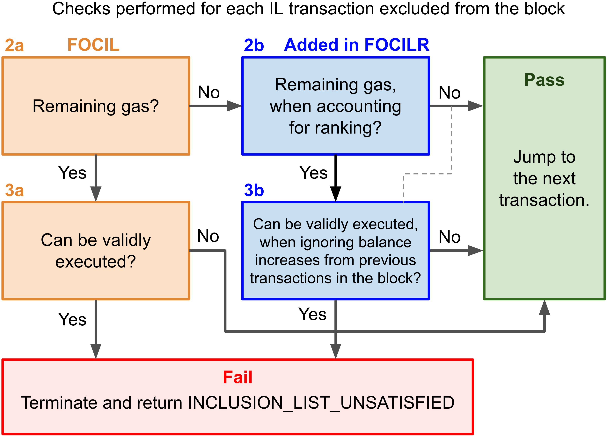

## Abstract

This EIP proposes a uniform price auction over inclusion lists (UPIL), which ranks transactions by their offered ranking fee per gas. When the block is full, no transaction is allowed to displace an inclusion-list (IL) transaction that passes regular inclusion criteria and offers a higher ranking fee per gas. All included transactions pay a uniform inclusion price, equal to the highest ranking fee offered by any valid IL transaction excluded from the block, and this fee is burned. UPIL achieves strong censorship resistance by not allowing builders to circumvent propagated ILs when the block is full. This is particularly valuable for time-sensitive transactions and promotes fairness while preventing cheap block-stuffing under a multidimensional fee market. UPIL is specified to run on top of FOCIL ([EIP-7805](./eip-7805.md)), but can be deployed on top of any IL mechanism.

## Motivation

Censorship resistance (CR) is a key property of decentralized blockchains. To ensure that transactions cannot be censored by the entity building the block (denoted "builder" in this EIP, which may sometimes be the proposer), a mechanism called fork-choice enforced inclusion lists (FOCIL) has been proposed in [EIP-7805](./eip-7805.md). A set of includers propagate inclusion lists (ILs), and the attesters uphold that the transactions in the ILs are included in the block via the fork-choice. There is no mechanism for ranking transactions in the ILs, and therefore not viable to uphold CR when the block is full. If IL transactions must be prioritized under full blocks, the builder could simply integrate with includers to propagate ILs containing the transactions it wishes to include in the block.

To uphold CR also under full blocks, it is necessary to have a framework for which transactions to include and exclude. This EIP specifies a uniform price auction over inclusion lists (UPIL), which ranks transactions by their offered `ranking_fee_per_gas`, derived from their specified `max_ranking_fee_per_gas`. If a block is full, no transaction is allowed to displace an IL transaction with a higher `ranking_fee_per_gas`, as long as the displaced IL transaction passes regular inclusion criteria. All included transactions pay the "marginal" ranking fee, corresponding to the highest ranking fee offered by a valid IL transaction excluded from the block, and this fee is burned. If no IL transaction was excluded, the marginal ranking fee is `0`. In essence, the existing base fee prices inter-block contention, while UPIL is an auction mechanism that relies on ILs to impose a secondary base fee that prices intra-block contention.

Ethereum is currently pursuing scaling by tracking gas consumption across separate resources, allowing each resource to be consumed at its maximum capacity. With a multidimensional approach, it can become cheaper to "stuff the block" such that it is full in any dimension by creating "dummy transactions" that only consume one specific resource. This degrades the CR of FOCIL, since builders can ignore ILs in full blocks. In the multidimensional [EIP-7706](./eip-7706.md) and [EIP-7999](./eip-7999.md), the degradation of CR can become rather pronounced. Base fees are set individually per resource and may become very low, depending on whether reserve prices in the style of [EIP-7918](./eip-7918.md) are adopted or not. Furthermore, if the builder varies which resource that is full across blocks, there is no longer an exponentially increasing cost to keep a transaction censored block after block.

The strong CR of UPIL is particularly suitable under a multidimensional fee market, but can be beneficial under any fee market. Some transactions are time-sensitive: what matters is inclusion within a set time frame. Sometimes, that time frame consists of just a few or a single block. UPIL guarantees inclusion in the next block for a transaction offering a sufficient ranking fee, assuming includers and attesters do their duties. This puts includers and the builder on a more equal footing. Furthermore, the lack of ranking in FOCIL gives builders an incentive to amass private transactions to facilitate low-cost temporary censorship, which could negatively affect the public mempool. However, both FOCIL and UPIL also have properties that strengthen the public mempool.

## Specification

### New transaction format and ranking fee

A new field `max_ranking_fee_per_gas` is added to a new [EIP-2718](./eip-2718.md) transaction with `TransactionType` = `RANK_TX_TYPE`. The `TransactionPayload` for this transaction is:

<-- TODO -->

```Python
# TODO: To be defined after scheduling this EIP relative to EIP-7999 and EIP-8011, etc.
```

The ranking is performed on the `ranking_fee_per_gas`, corresponding to the maximum ranking fee that the transactor was willing to pay under the current base fee. Older transaction formats use their entire headroom for their offered ranking fee, whereas the new format can cap the ranking fee using the `max_ranking_fee_per_gas` field. 

```Python
def get_max_fee(tx: Transaction) -> int:
    if is_legacy(tx.type):
        return tx.gas_price
    else:
        return tx.max_fee_per_gas

def get_ranking_fee(tx: Transaction, block: Block) -> int:
    ranking_fee_per_gas = get_max_fee(tx) - block.base_fee_per_gas
    
    # The new RANK_TX_TYPE can set a cap to the offered ranking fee
    if tx.type == RANK_TX_TYPE:
        return min(tx.max_ranking_fee_per_gas, ranking_fee_per_gas)
    else:
        return ranking_fee_per_gas
```

The ranking fee does not impose ordering constraints within the block, and only governs inclusion. The alternative specifications section discusses the options that exist for computing the `ranking_fee_per_gas` in various transaction formats, including the option to not implement a new transaction format at all.

### Transaction processing

The builder specifies in the block body the `marginal_ranking_fee_per_gas` that all transactions must pay. The full `inclusion_fee_per_gas` corresponding to `base_fee_per_gas + marginal_ranking_fee_per_gas` is covered before the priority fee. A valid transaction must have `max_fee_per_gas >= inclusion_fee_per_gas` and `RANK_TX_TYPE` transactions must also have `max_ranking_fee_per_gas >= marginal_ranking_fee_per_gas`. Thus, under [EIP-1559](./eip-1559.md), transaction processing is changed as follows:

```Python
for unnormalized_transaction in transactions:
    ...
    # After this existing check...
    assert transaction.max_fee_per_gas >= transaction.max_priority_fee_per_gas
    
    # ..check that the transactor is willing to pay the marginal ranking fee
    if transaction.type == RANK_TX_TYPE:
        assert block.marginal_ranking_fee_per_gas <= transaction.max_ranking_fee_per_gas

    # ..derive the inclusion fee per gas and perform checks
    inclusion_fee_per_gas = block.base_fee_per_gas + block.marginal_ranking_fee_per_gas
    assert transaction.max_fee_per_gas >= inclusion_fee_per_gas
    
    # ..cap the priority fee by the inclusion fee instead of the base fee
    priority_fee_per_gas = min(transaction.max_priority_fee_per_gas, transaction.max_fee_per_gas - inclusion_fee_per_gas)

    # ..and adjust the line calculating the effective gas price
    effective_gas_price = priority_fee_per_gas + inclusion_fee_per_gas
    ...
```

The inclusion fee is never distributed and thus burned. Note that legacy transactions are assigned `max_fee_per_gas = gas_price` and `max_priority_fee_per_gas = gas_price` as part of a prior normalization step. The existing assert statement

```Python
assert transaction.max_fee_per_gas >= block.base_fee_per_gas
```

is redundant and is removed.

### Altered FOCIL post-execution inclusion check

The post-execution inclusion check of [EIP-7805](./eip-7805.md) is altered as outlined in the figure. Orange squares represent the original FOCIL checks, where "No" always leads to jumping to the next transaction. Blue squares are the checks added in UPIL that account for ranking. The first black square of step (1) contains only peripheral modifications that do not alter the intended outcome of the inclusion check.



The `ranking_fee_per_gas` is first computed for each transaction `X` in the block via `get_ranking_fee(X, B)`. Then, for each transaction `T` in ILs, the check performs three steps. 

-----

The original step (1)

> (1) Check whether `T` is present in `B`. If `T` is present, then jump to the next transaction, else continue with next step.

is replaced with the following:

(1) If `T` is present in `B`, or `get_max_fee(T) < block.base_fee_per_gas`, or `T` fails static validity, then skip `T` and jump to the next IL transaction, else continue to the next step.

-----

The original step (2):

> (2) Check whether `B` has enough remaining gas to execute `T`. If `T.gas` > `gas_left`, then jump to the next transaction, else continue with next step.

is replaced with the following:

(2a) Check whether `B` has enough remaining gas to execute `T`: `gas_left >= T.gas_limit`. If so, continue to (3a); otherwise, continue to (2b) potentially followed by (3b).

(2b) Check whether `B` would have had enough remaining gas to execute `T`, if `T` was included together with only higher-ranked transactions in `B`. First compute `T.ranking_fee_per_gas = get_ranking_fee(T, B)` and then compute `gas_ranked_left(T)` as the remaining gas after subtracting the `gas_used` of all transactions of the block with a higher `ranking_fee_per_gas` than `T` from `B.gas_limit`. For transactions with the same `ranking_fee_per_gas`, included transactions in `B` are considered higher-ranked than not-included IL transactions. If `gas_ranked_left(T) >= T.gas_limit`, continue to (3b); otherwise jump to the next IL transaction.

-----

The original step (3): 

> (3) Validate `T` against `S` by checking the nonce and balance of `T.origin`.

is replaced with the following:

(3a) Validate `T` against `S` by checking the nonce and balance of `T.origin`.

(3b) Validate `T` against `S` by checking the nonce of `T.origin`. Further validate `T` against the balance of the origin account by applying the standard pre-execution fundability check to a conservative balance that ignores all increases and counts all decreases to `T.origin` at the completion of each executed transaction of the block. Intermediate increases or decreases during the execution of a transaction are not tracked in isolation.

Step (3a) and (3b) conclude as previously:

> If `T` is invalid, then continue to the next transaction. 
>
> If `T` is valid, terminate process and return an `INCLUSION_LIST_UNSATISFIED` error.

### Check on the marginal ranking fee

Attesters review excluded IL transactions to confirm that the `marginal_ranking_fee_per_gas` was set correctly by the builder. If step (2b) indicates that the transaction was outranked, then, before continuing with the next transaction, the transaction is also checked against step (3b), as indicated by a dashed line in the figure. The highest `ranking_fee_per_gas` among outranked IL transactions from (2b) that pass the valid inclusion check of (3b) must equal `marginal_ranking_fee_per_gas`. If no outranked IL transaction passes (3b), the `marginal_ranking_fee_per_gas` must be `0`.

## Rationale

### Updated inclusion check

#### Conservative balance 

The reason for using a conservative balance in (3b) when validating `T` is to avoid the circular dependencies that can emerge when a transaction is made executable by a lower-ranked transaction. Consider three transactions `A`, `B`, and `C` ranked as `A>B>C`. Without a conservative balance, `A` might be funded only if `B` is included in the block. For example, transaction `B` might fund `A`, so without `B`, `A` cannot be included, and without `A`, `B` cannot be included due to having a lower ranking. There is not enough gas to include both `A` and `B`. Including neither and instead including `C` also fails because the left out `B` was higher ranked.

It is not necessary that `B` directly funds `A`. It might very well be the case that `B` just changes the state such that a higher-ranked transaction `X` funds `A`, something that `X` would not do unless `B` was run beforehand.

It should be noted in (3b) that the transactor is in control of decreases to its ETH balance. Within a block, ETH leaves `T.origin` only via the transactor’s own signed transactions (value transfers and gas payments) or contracts it has explicitly authorized; the builder cannot manufacture debits. If the transactor’s own debits make `T` unfundable, and these are included in the block—even if lower-ranked—exclusion is acceptable as a consequence of choices made. After all, the transactor controls the relative order of its own transactions via nonces. Thus, ranking is neither considered for debits nor for credits: debits count regardless of rank, and credits do not count at all.

#### Retained FOCIL check in non-full blocks

The regular FOCIL check is retained in non-full blocks to take advantage of its operational simplicity and since the conservative balance check of UPIL is unnecessarily lenient to the builder whenever an excluded IL transaction would have fit and is funded during processing of the prior transactions in the block. The circular dependencies from the previous subsection do not apply in FOCIL since there is no requirement for transactions in the IL to be included in the block if a transaction outside of the IL uses up the gas. Once (2a) confirms slack, the builder was clearly able to include any existing funding transaction in the block and still include `T`, so skipping `T` is an IL violation. UPIL could otherwise also be implemented completely without the old FOCIL checks, to reduce code surface. This corresponds to removing the orange boxes in the figure, retaining the blue boxes.

#### Compute requirements for (2b) and (3b)

The new conditions can be checked efficiently by clients. 

In step (2b), validators can generate a list of the transactions in the block post-execution, sorted according to `ranking_fee_per_gas`, with an associated list of the cumulative gas consumption. The check for each transaction then only requires keying into the list and extracting the associated gas consumption.

For step (3b), the preprocessing consists of tracking a limited set of account-balance-changes during transaction processing. Before processing the block, the client builds an observation set `E` of `T.origin` balances for excluded IL transactions. After processing each transaction, it updates `E`, accounting for all decreases to `T.origin` balances but ignoring increases. If a block-level access list (BAL) is available that tracks all balance changes, the overall task is further simplified.

The check on the `marginal_ranking_fee_per_gas` (dashed line in the figure) is also trivial. For example, all outranked IL transactions that are otherwise validly includable can have their `ranking_fee_per_gas` added to an array. After all IL transactions have been reviewed, the maximum entry of this array must equal the specified `marginal_ranking_fee_per_gas`. If the array is empty, the `marginal_ranking_fee_per_gas` must instead be `0`.

### Auction design

The uniform price auction design allows transactors to signal intent (to overcome censorship if the block is full), without actually having to pay more than necessary. A transactor may not know beforehand if they will be censored, and may not wish to pay a very high fee for no reason. There are similarities to the current base fee model. Everyone specifies their willingness to pay, but pays the same minimum fee for inclusion, and this fee is burned. The combination of intents and fairness is attractive. A key difference is that the base fee is a clearing fee tracking contention for blockspace at the inter-block level, whereas the marginal ranking fee is a clearing fee tracking contention for blockspace at the intra-block level (locally for each block).

In essence, Ethereum’s current fee mechanism combines a uniform-price base fee that clears congestion across blocks with a first-price priority fee allocating space within each block. What UPIL does is to expand the uniform-price component to the intra-block level by introducing a marginal ranking fee that all included transactions pay equally. Inclusion will thus be governed primarily by protocol-defined uniform clearing (assuming transactions are surfaced in ILs).

The `max_ranking_fee_per_gas` is expected to be set rather low under normal circumstances. Most transactors will not be willing to pay excessively to be included in full blocks, and can instead wait for the next block. However, since the next block will have a 12.5% higher base fee, most transactors will at a minimum set `max_ranking_fee_per_gas` to 12.5% of the current base fee. The increase in burned fees extracted from transactors in full blocks will be offset by a decrease in priority fees, since the builder no longer controls which transactions that are included (furthermore, includers may also receive other fees, as discussed in the section on includer rewards). The ranking fee will also help with clearing in a fair manner under congestion during sudden spikes in transaction demand. All transactions included in the same block will pay the same ranking fee, with transactions willing to pay the most during a sudden spike included in the first available block. This is arguably an improvement to the UX for Ethereum's users.

The reason for burning the marginal ranking fee instead of paying it out to includers is that includers otherwise could have an incentive to engineer artificial congestion in order to raise the fee. This is not trivial, requiring many separate entities to agree to withhold transaction inclusion for consecutive blocks. Various configurations for how to reward includers for their work are outlined in a subsequent section, including the option to distribute the marginal ranking fee to them.

The builder may sometimes, via its private orderflow or late-arriving transactions, have some ability to raise the `marginal_ranking_fee_per_gas` by including transactions that outrank IL transactions. But a builder that raises the marginal ranking fee will also inadvertently reduce the priority-fee headroom for all transactions, since the inclusion fee is subtracted from the max fee before calculating the capped priority fee for all transactions in the block.

### Multidimensional UPIL

If there are multiple resources, `gas_ranked_left(T)` is a vector. Using the notation of [EIP-7999](./eip-7999.md), all *conditional* resources must then be checked against the corresponding gas limits specified by the analyzed transaction. Transactions that consume any *deconditional* resource are not subject to the UPIL post-execution check, and insufficient capacity in an *unconditional* resource is never a valid reason to exclude an IL transaction.

Thus, under multidimensional UPIL, the transaction is checked against `gas_ranked_left(T)` over the conditional resources only, in both (2a) and (2b). However, given the strong CR of UPIL, it would be perfectly feasible to classify calldata as conditional instead of using the unconditional classification of [EIP-7999](./eip-7999.md).

### Censorship resistance under FOCIL and UPIL

This subsection offers a comparison of the censorship resistance achieved under FOCIL and UPIL. The premise is a builder seeking to censor a transaction under different fee market designs. We begin by rudimentarily quantifying the cost $C_i$ of censoring a transaction in block $i$ ($i=0$ for the first censored block) as:

$C_i = g_df_b  (1+r)^i  + g_df_r +  m(i, f_r).$

In this equation, $g_d$ is the gas that the builder must pay by creating so-called "dummy transactions" to fill the block, $f_b$ is the base fee for that gas, $r$ is the rate by which the base fee increases in full blocks (i.e., 12.5%), $f_r$ is the `ranking_fee_per_gas` of the censored transaction, and $m(i, f_r)$ is the MEV (including priority fees) forgone when forced to exclude pending transactions with a lower ranking than the censored transaction for block $i$ (the opportunity cost).

#### Multidimensional fee market

Under a multidimensional fee market envisioned in [EIP-7706](./eip-7706.md) and [EIP-7999](./eip-7999.md), the base fee is set individually per resource to maximize utilization of blockspace. As noted in [EIP-7999](./eip-7999.md), the base fee may therefore sometimes become very low for a resource, meaning that the cost of generating dummy transactions to fill the block also becomes very low. In a potential multidimensional FOCIL, it is then only necessary that one resource used by a transaction is filled to censor that transaction. Furthermore, while the base fee will increase for the resource that was filled with dummy transactions, the base fees of all other resources will not. These base fees will instead vary based on gas consumed by regular transactions included in the block. The builder can potentially vary which resource it fills the block for, to keep any base fee from exploding during prolonged censorship. Define $\mathbf{f_b}$ as the vector of base fees. The outcome for FOCIL and UPIL respectively is:

**FOCIL:** The cost of censorship for the first block is $C_0 = g_d\min(\mathbf{f_b})$, and thus $C_0 \to 0$ if $\min(\mathbf{f_b}) \to 0$. The cost can potentially be kept close to 0 even under continued censorship, depending on the distribution of the equilibrium base fees under no censorship and the fee elasticities of demand.

- There is no ranking fee (thus $g_df_r \to 0$) and there is no opportunity cost because the builder can always include lower-ranked transactions when it fills the block (thus $m(i, f_r) \to 0$).
- The builder can switch between resources it fills, thus potentially keeping its overall costs contained even under continued censorship. This depends on prevailing fee elasticities and equilibrium base fees under no censorship. 
- If there is just one base fee that is low initially, then that base fee will rise (albeit from a low starting point), if the builder does not assume the opportunity cost $m(i, f_r)$ of excluding other transactions. Fee elasticities are relevant also in this case, because the rise in a single base fee should moderately reduce demand for all other resources as the transactor reviews the total cost.

**UPIL:** The cost of censorship for the first block is $C_0 = g_d\min(\mathbf{f_b}) + g_df_r + m(i, f_r)$, and thus $C_0 = g_df_r + m(i, f_r)$ if $\min(\mathbf{f_b}) \to 0$. This cost can be hundreds or thousands of times higher than whatever ranking fee the censored transaction specifies, and it rises with continued censorship due to the opportunity cost of keeping all pending transactions with a lower ranking fee that consume the filled resource out of the block.

- If the transactor specifies a ranking fee $f_r$ that exceeds the ranking fee of existing transactions in the mempool, the censoring builder will need to create dummy transactions up to the entire gas limit of the resource it is targeting. This can be specified as $g_d = g_l-g_r(T)$, where $g_r(T)$ is the gas already consumed by the censored transaction. Thus, the censoring builder must pay $f_r(g_l-g_r(T))$. To censor a transaction consuming 100k gas when the gas limit is 60M in the filled resource, the builder must pay $(60-0.1)/0.1 = 599$ times more than what the transactor was willing to pay for inclusion. As the gas limit expands, the relative cost of censorship increases. It should here be noted that the transactor will not need to pay its high offered ranking fee if it is indeed censored, and would after censorship concludes only pay according to the `marginal_ranking_fee_per_gas` of the subsequent block.
- The opportunity cost from censorship is also higher under UPIL than FOCIL, since no pending transaction with a ranking fee $f'_r<f_r$ that consumes the filled resource can be included if the censored transaction is excluded.

#### Current fee market

We now discuss the situation under the current fee market with a single base fee (ignoring the blob resource). In this case, the base fee term of the previous equation does not vanish. If the builder does not use the "slow transaction" strategies outlined in the next subsection, the outcome for FOCIL and UPIL respectively is:

**FOCIL:** The builder must cover the base fees: $g_df_b(1+r)^i$ of block $i$. The required amount of purchased gas $g_d$ will in the average case be $g_d=g_l/2$. However, there will be many instances where pending transactions in the public mempool or via private orderflow consume more than $g_l/2$. Censorship for one or two blocks can therefore be inexpensive even if pending transactions do not completely fill the block. The $(1+r)^i$ term grows by 12.5% per block, doubling in six blocks, and pending transactions are quickly depleted. Therefore, censorship becomes costly rather quickly: FOCIL ensures that transactions are included within a limited number of blocks if includers do their duties, but not in the first few blocks.

**UPIL:** The builder must cover the base fee, the ranking fee, and forego pending transactions, thus suffering a cost of $g_df_b(1+r)^i + g_df_r + m(i, f_r)$. The required gas $g_d$ is higher than in FOCIL, and—just as for the multidimensional fee market—potentially the full gas limit, because the builder cannot rely on pending transactions with a lower ranking fee for block stuffing. Due to the $g_df_r$ term, the cost for censoring a transaction for a single block can easily become a thousand times higher than whatever the transactor was willing to pay for inclusion, just as under the multidimensional fee market.

#### Current fee market with "slow transactions"

Note the importance of pending transactions for sidestepping the ILs in FOCIL: the cost for covering base fees when filling the block provides the CR. A strategy the builder could use to reduce the cost of censorship over a few blocks is to amass "slow transactions" through private orderflow—transactions that do not have to execute immediately. These are transactions for which the transactor is willing to substitute speed for some other benefit, predominantly rebated fees, but potentially also convenience or MEV protection. The builder (or realistically a MEV-protecting RPC endpoint) guarantees (trustfully) inclusion within some set time frame, and that the total cost for the transactor will be below the cost that would have been incurred given the base fee at the time that the tx is sent to the builder. The concept can be integrated as:

$C_i = g_df_b  ((1+r)^i-s)  + g_df_r +  m(i, f_r).$

Here, $s$ represents the cost reduction factor relative to the initial base fee. This models a scenario where the builder has stored and promised to include blockspace-filling transactions at a fixed discount. If the rebate to transactors for slow transactions is 10%, then $s=0.9$, with the cost of censoring the first block in FOCIL reduced by 90%. Such a strategy can thus be useful for censoring a couple of blocks in a row. After around 5 blocks or less, $(1+r)^i - s > 1$, meaning that the cost is the same as the cost of censoring the first block without slow transactions. Since the supply of slow transactions would likely be limited, the strategy cannot be applied too often. 

Slow transactions must be propagated privately to remain useful, and reach their full economic potential by contributing to censorship. When the value in sidestepping ILs exceeds the costs of facilitating slow transactions, the proportion of transactions propagated p2p may thus fall. On the other hand, the transactions that indeed are propagated p2p are upon IL listing guaranteed inclusion in non-full blocks, and therefore do not need to pay priority fees. The effect of FOCIL on the public mempool may therefore be negative or positive depending on the demand for censorship from builders. Alternatively, the protocol could facilitate "trustless slow transactions" by letting builders sponsor transactions offering a max fee below the prevailing base fee, for example by charging the base fee jointly for all transactions at the end of the block.

Under UPIL, slow transactions do not contribute meaningfully to censorship due to the $g_df_r +  m(i, f_r)$ terms, and there is furthermore no rationale for paying a priority fee upon listing, further strengthening the public mempool.

#### Multidimensional gas metering

Under multidimensional gas metering in [EIP-8011](./eip-8011.md), the situation is closer to the current fee market than the multidimensional fee market. There is still just one base fee, so the cost of censoring a transaction for a sustained period rises exponentially. Censorship may become slightly cheaper than currently, due to the equilibrium reduction in the base fee with a maintained slack in the block relative to the most consumed resource. On the other hand, utilization of slow transactions may become slightly less efficient.

In the current fee market, half the gas limit $g_l/2$ is consumed in the average block. Transactors spend $f_bg_l/2$ on average and the cost of censoring a block via dummy transactions is also $f_bg_l/2$. Under multidimensional gas metering, $g_l/2$ is consumed on average individually for the most used resource. Transactors however consume the higher $xg_l/2$ amount of gas on average over all resources, while the gas required for censorship remains at $g_l/2$ (filling up the most consumed resource). Here $x$ corresponds to the scaling factor achieved when gas of different resources can be consumed in parallel, a scaling factor that might end up in the range 2-4. Keeping demand and $g_l$ fixed, the base fee $f_b$ will fall, reducing the cost $f_bg_l/2$ of censoring a block in the average case. Had we instead simply increased the gas limit, CR would have been affected differently, because then the cost of censorship would also have increased according to the increase in $g_l$, such that the censoring builder would have needed to purchase more dummy transactions in the average case.

#### Transaction inclusion and MEV

In FOCIL, including an existing transaction is always possible without raising the inclusion fee, regardless of whether this means that an IL transaction must be excluded or not. In UPIL, if the block is full, including an existing transaction over an IL transaction willing to pay more is treated as censorship. Ostensibly, MEV and censorship are not separate topics: in many scenarios, censorship is also MEV. To displace the IL transaction offering the lowest ranking fee among IL transactions in the block, the new transaction must pay at least the ranking fee offered by that IL transaction.

Since the builder cannot freely decide which of the pending transactions to include in UPIL, it might not be able to extract all MEV from pending transactions that it could have in FOCIL. It lacks the ability to exclude IL transactions at will from full blocks. Once a transaction is in an IL, its inclusion is guaranteed if it is willing to pay at least the same as the smallest offer by other transactions that go into the block. This levels the playing field between includers and the builder, giving the includer the opportunity to offer real inclusion guarantees to transactors. In FOCIL, the *protocol* offers real inclusion guarantees, *eventually*. In UPIL, the *includer* offers real inclusion guarantees, *immediately*. 

Some includers might charge transactors for their services in FOCIL, but the value of the provided services is further strengthened in UPIL. MEV might thus shift from the builder to includers in the form of fees for listing the transaction. A transaction listed by an IL has no need to pay a priority fee for inclusion. Indeed, we may even see "IL-builders" that collate full ILs as a service both in FOCIL and UPIL. Some MEV will also shift to the protocol in the form of burned ranking fees. It is natural to then consider what options the builder has, to retain some power over transaction inclusion. It may of course try to bribe includers to not list transactions. A problem for a builder trying to stay competitive is that this requires bribing all includers, and that any includer remaining faithful to its duties can earn a greater reward from transactors when others take the bribe, particularly in UPIL.

There are nuances to the design that need careful consideration before adoption. Something to be attentive to is the effect of burning the marginal ranking fee, given that avoiding the burn is not a zero-sum outcome for builders and includers. This is further discussed in the next section. 

### Alternative specifications for rewarding includers

Transactors might wish to reward includers in both FOCIL and UPIL for surfacing their transaction in an IL. They may recognize that the space in each IL is limited, meaning includers sometimes need to prioritize between available transactions. They might also fear that builders could bribe includers to not fulfill their duties, so that the builder can exclude unwanted transactions. As discussed previously, UPIL strengthens the position of includers, giving them in some sense equal power to the builder in deciding which transactions enter the block. For this reason, the case for rewarding includers is also stronger: an IL transaction does not require a priority fee to be included, even in full blocks—it must be included if it offers a higher ranking fee than competing transactions.

#### Out-of-protocol inclusion fees

If there is no in-protocol reward mechanism, individual staking service providers might start offering (trustfully) to list transactions in their next assigned IL slot, against a small fee. We might also see public orderflow of includable transactions offering a certain reward for inclusion, with includers and transactors coming to agreement via a third-party software. This can improve the UX, but also has the potential to become a centralization vector.

#### In-protocol inclusion fee sources

It is possible that the protocol can be of direct assistance. Three fee sources will first be reviewed, and relevant distribution mechanisms then explored.

**Includer fee:** One example is to allow transactions to specify an includer fee via a new field `max_includer_fee_per_gas`. To split the `max_includer_fee_per_gas` and the `max_priority_fee_per_gas` when they are capped by the `max_fee_per_gas`, the "aggregate-cap-divide" method outlined in the "pay-as-you-bid" subsection is the recommended approach. Alternatively, it is possible to distribute only the includer fee or the priority fee, depending on if the transaction was listed in an IL or not, and never both. The builder must then specify whether each transaction originated from an IL or not (at the transaction or IL level), and attesters vote against the block if the builder fails to make such an assignment when they observed the transaction in a timely IL.

**Priority fee:** It is possible to instead let the includers receive the priority fee if they list a transaction. The builder will have no choice but to include a transaction once it is listed by an includer, and the priority fee then serves little purpose. From the transactor's perspective, giving a priority fee to the builder for an IL transaction is a wasteful expenditure. Once again, with this option the builder must specify whether each transaction originated from an IL or not.

**Marginal ranking fee:** The marginal ranking fee can be distributed to includers instead of being burned. As discussed previously, one potential downside of this is the increase in rewards for engineering contention—in collaboration with builders—by first withholding transactions, and then releasing all transactions in the same block. 

The question is whether includers will be able to engineer such contention, given the coordination problem at hand: withholding transactions over several slots, with several slots' includers working together, where anyone breaking the cartel could reap higher rewards from transactors paying includers for their services. Transactors might also end up setting lower ranking fees if such an approach becomes systematic, and most ranking fees will likely anyway be in the region of 12.5% of the base fee. Finally, we do not see builders coordinating to bring down the base fee in order to reap higher priority fees today (at the same time, the control over the priority fee is indirect, and they do not directly attain the base fee).

A potential benefit of distributing the marginal ranking fee to includers is that if the builder wishes to bribe includers to avoid contention (in order to bring up priority fees), then includers taking such a bribe would miss out on rewards for that contention (in addition to any rewards they may already miss out on from includer priority fees).

#### Mechanisms for distributing inclusion fees in-protocol

Four options for how to distribute the fee from any of the three in-protocol inclusion fee sources listed in the previous section will now be reviewed:

**(1) Keyed distribution:** Let transactors set one or several keys, with each key linking to one includer (i.e., validator ID) or to many includers (e.g., enabling all validators of an SSP to associate one key to all its validators). The protocol can then ensure that the rewards are distributed only to validators represented by a key, if it listed the transaction. This means that transactions shared with an includer privately still can use an in-protocol fee distribution without risking dilution. Options (2)-(4) below can be applied when the transactor does not provide a key or when the keyed includer(s) failed to list the transaction.

**(2) Individual distribution:** Split the fee between all includers listing a transaction. All includers then have an incentive to list a transaction, with the incentive being stronger if other includers have ignored it. It may however lead to unnecessary duplicate listings, since there is an incentive to list transactions even after they have been observed in another IL. It may also lead includers to integrate with builders to propagate the optimal IL by leveraging the builder's last look.

**(3) Seniority distribution:** Use a "seniority waterfall" rule. The transaction hash is combined with includer validator IDs to assign an order of seniority by which each includer has the right to the full includer fee. If a transaction's senior includer lists it, there is no purpose for a less senior includer to also list it. The idea is to promote a broader coverage while maintaining fairness. The mechanism will however not remove all duplicates, as a more senior includer will still list a transaction already listed by a less senior includer. It is straightforward to combine (1) with (3), by giving keyed includers the highest seniority, with remaining includers assigned a seniority based on the transaction hash. This could also prevent transaction hash grinding in the case when some senior includers are more reliable than others. Under the priority fee redistribution rule, the builder is in essence appended to the waterfall, having the lowest seniority.

To further reduce duplicates, a potential extension could allow includers to stagger their inclusion list so that they first broadcast transactions they are the most senior includer for, and then append the list with transactions they are less senior for or that arrive late. This can also increase the includer's expected value (EV) since an early broadcast increases margins and the late broadcast allows for better coverage. Another way to increase EV under this rule is to combine it with (4) below. Each partial list must have timeliness observed in isolation, and the rules for IL equivocation must be amended to allow append operations.

**(4) Collective distribution:** Distribute the includer fee collectively to all includers. There is then no need to keep track of who propagated which transaction in which IL. It also serves to promote independence of includers. Builders cannot help includers to extract a relatively higher proportion of the ranking fee by constructing an optimal IL for them from their last look. Includers are further encouraged to facilitate as broad coverage as possible, given that there are no incentives to propagate a (high-paying) transaction if one of the other includers already propagates it. This means that some includers can pivot to propagating their ILs early, while others observe and select late or missed transactions. 

A downside is that includers are not incentivized individually to do a good job, and gain individually only 1/`IL_COMMITTEE_SIZE` of any ranking fee of a transaction they uniquely include. The point however is that the collective distribution alters the meaning of "doing a good job", aligning protocol design goals with includer incentives. 

Builders may try to bribe includers to not include transactions. If an includer will receive 1/`IL_COMMITTEE_SIZE` of any collective rewards for *not* including a transaction that eventually is not surfaced by any IL, then they may elect to leave it out to preserve space for other transactions. However, the builder would then also forego a sum corresponding to the entire collective rewards by paying out such bribes to the includers. In the setup where the priority fee is distributed to includers if they surface a transaction, the builder would thus need to forego the entire priority fee it stands to receive. 

However, due to the gradual construction of the aggregate IL, the builder can offer higher bribes than 1/`IL_COMMITTEE_SIZE` to the last remaining includers, to keep some transactions not yet included out of the IL aggregate. The last remaining includer that spots a late transaction might be able to choose between including it to receive 1/`IL_COMMITTEE_SIZE` of the priority fee, or to receive 1/2 of a conditional priority fee as a bribe to not include it.

### Alternative specifications for the auction and transaction format

#### Omit the new transaction format with its added ranking fee field 

Existing transaction formats are ranked using `max_fee_per_gas`. This may be sufficiently expressive, with the new transaction type omitted. The benefit is that it simplifies the UX. Transactors may not care about how much they have to pay to specifically cover the `marginal_ranking_fee_per_gas`—they have already specified how much they are willing to pay for inclusion in total with the `max_fee_per_gas`. It also simplifies the developer experience, since we do not need to change the transaction format.

A potential downside is that transactors cannot differentiate between how high contention fees they are willing to pay to cover the base fee and to cover the marginal ranking fee in full blocks. The builder has some control over the marginal ranking fee: if there are transactions outside of the ILs that are willing to pay a higher fee for inclusion than the IL transactions, then it may or may not elect to include those transactions. This influences the marginal ranking fee which is determined by the highest offered ranking fee of an excluded IL transaction. It is more difficult for the builder to control the base fee. Transactors wishing to limit their ranking fees, while at the same time giving ample room for the base fee to rise before inclusion, may therefore find that older transaction formats do not offer sufficient expressiveness.

#### Pay-as-you-bid auction

Two alternative pay-as-you-bid auction designs will now be highlighted. The first is that transactors always pay their offered ranking fee upon inclusion. In this case, there is no risk that the includers or the builder engineer contention for blockspace to drive up the price, and the full ranking fee is distributed to includers instead of being burned, using the collective method previously described. The post-execution check stays the same as in the main specification, with the only difference that the check on outranked IL transactions concerning the `marginal_ranking_fee_per_gas` (dashed line in the figure) is removed. 

Transaction processing is altered to, e.g., facilitate payment to includers. The split between the specified `max_ranking_fee_per_gas` and `max_priority_fee_per_gas` can be done in two ways. Either the ranking fee takes precedence over the priority fee as previously, or the two are given equal precedence. In the first case, the same strategy as in the main specification can be used. In the second case, the two fees can first be summed into a single `max_payout_fee_per_gas`, and the capped `payout_fee_per_gas` then distributed proportionally to the size of the original max ranking/priority fees.

Additionally, the builder is given the ability to set a `priority_fee_shift_per_gas` parameter for each transaction to allow transactions without a sufficient `ranking_fee_per_gas` to become eligible for inclusion in the block. We can envision a scenario where the builder otherwise integrates deeper with transactors to help them set the optimal ranking fee anyway. Such an integration could have detrimental effects on the builder competitive landscape, and it is therefore desirable to allow the builder—who has the last look when building blocks—to raise the ranking fee as it sees fit in a trustless manner. This means that many transactors will elect to just provide a priority fee, and that there is limited downside for transactors using older transaction types. 

If a transactor believes that the builder may leave their transactions out of the block, then it is still well served by providing a ranking fee and propagating the transaction publicly so that it can be surfaced by an IL. The builder needs to boost all transactions up to the ranking fee of the transaction it wishes to exclude from the block, and a modest ranking fee can therefore be sufficient to ensure inclusion. The spec shows the ranking fee taking precedence and omits some overflow checks:

```Python
for i, unnormalized_transaction in enumerate(transactions):
    ...
    # After this existing check...
    assert transaction.max_fee_per_gas >= transaction.max_priority_fee_per_gas
    
    # ..Optionally shift a proportion of the priority fee over to the ranking fee
    assert block.priority_fee_shift_per_gas[i] <= transaction.max_priority_fee_per_gas
    max_priority_fee_per_gas = transaction.max_priority_fee_per_gas - block.priority_fee_shift_per_gas[i]

    # ..then fill in order of: base fee, ranking fee, priority fee
    max_shifted_ranking_fee_per_gas = transaction.max_ranking_fee_per_gas + block.priority_fee_shift_per_gas[i]
    ranking_fee_per_gas = min(max_shifted_ranking_fee_per_gas, transaction.max_fee_per_gas - block.base_fee_per_gas)
    inclusion_fee_per_gas = block.base_fee_per_gas + ranking_fee_per_gas
    priority_fee_per_gas = min(max_priority_fee_per_gas, transaction.max_fee_per_gas - inclusion_fee_per_gas)
    effective_gas_price = inclusion_fee_per_gas + priority_fee_per_gas

    ...
    # ..after refunding the transactor as normal, the includer fee is computed
    includer_fee = gas_used * ranking_fee_per_gas // IL_COMMITTEE_SIZE
    # ..balances of the `IL_COMMITTEE_SIZE` includers increased
    for j in range(IL_COMMITTEE_SIZE):
        self.account(block.includer(j)).balance += includer_fee
    # ..and the priority fee is distributed to the builder just as in EIP-1559
    self.account(block.author).balance += gas_used * priority_fee_per_gas
```

The consensus layer (CL) constructs a list of execution-layer (EL) payout addresses for the slot, ordered by IL committee index, and provides it to the EL via a new engine API call: `engine_setIncluderPayoutsV1`. For committee members with `0x00` credentials, the CL inserts the zero address `0x000...`, thus burning these rewards.

#### Pay-as-you-bid auction using only priority fee

A second alternative is to let the priority fee act as a ranking fee in a pay-as-you-bid auction. The priority fee is distributed collectively to includers if it was surfaced by at least one inclusion list. Otherwise it is distributed to the builder. *Only* priority fees distributed to the includers count towards the transaction's ranking. 

The builder specifies whether an included transaction was surfaced by an IL via a bitfield `IL_transaction` in the payload body, of equal length to the number of transactions. For all transactions where `IL_transaction[i]=FALSE`, the attesters check that they are not in any observed timely ILs, and otherwise return `INCLUSION_LIST_UNSATISFIED`. For these transactions, the builder can also apply the `priority_fee_shift_per_gas` described in the previous subsection, which however here is the same for all transactions since none have an initial ranking fee. Under [EIP-1559](./eip-1559.md), transaction processing is changed as follows:

```Python
...
for i, unnormalized_transaction in enumerate(transactions):
  ...
    # Processing begins after this existing line
    signer.balance += gas_refund * effective_gas_price

    # Redistribute priority fee
    if block.IL_transaction[i]==TRUE:
        ranking_fee_per_gas = priority_fee_per_gas
        priority_fee_per_gas = 0
    else:
        assert block.priority_fee_shift_per_gas <= priority_fee_per_gas
        ranking_fee_per_gas = block.priority_fee_shift_per_gas
        priority_fee_per_gas -= block.priority_fee_shift_per_gas
    
    # The fee given to each includer (small division remainder burned)
    includer_fee = gas_used * ranking_fee_per_gas // IL_COMMITTEE_SIZE
    # Increase the balances of the `IL_COMMITTEE_SIZE` includers 
    for j in range(IL_COMMITTEE_SIZE):
        self.account(block.includer(j)).balance += includer_fee
    
    # Proposer receives the priority fee
    self.account(block.author).balance += gas_used * priority_fee_per_gas
```

Payout to includers uses the same CL construction as in the previous subsection and the check on the `marginal_ranking_fee_per_gas` (dashed line in the figure) is once again removed.

If the ranking was based on the priority fee paid to the builder, the builder could offer kickbacks, allowing transactors to achieve a high ranking for free. To prevent this, the ranking portion of the fee must be distributed to a wider set of validators or be burned. Any arbitrary fee split between the builder and includers when `IL_transaction[i]=FALSE` would likely prove suboptimal and encourage off-chain agreements and builder–includer integration to circumvent the intended mechanism.

#### Allow builder to shift priority fee under UPIL

The `priority_fee_shift_per_gas` could be used also in the main UPIL specification. The primary rationale is that transactions using older formats then also can be included when `marginal_ranking_fee_per_gas>0`, by having the builder reallocate the priority fee. Another option is to simply charge all base fees and ranking fees jointly for all transactions at the end of the block, as previously discussed.

#### UPIL batch auctions

A more extensive modification of the protocol is to make use of the improved CR and pricing of intra-block contention to eliminate the slack in the block, targeting 100% of the gas limit to facilitate scaling. The base fee can in such an implementation either be removed entirely, or the price information obtained via the marginal ranking fee can be relied upon for appropriate increases to the base fee.

## Backwards Compatibility

Transactions using the [EIP-1559](./eip-1559.md) or [EIP-4844](./eip-4844.md) transaction formats can with this change spend up to their entire `max_fee_per_gas` to cover the `marginal_ranking_fee_per_gas` in blocks with high contention. Previously, the `max_fee_per_gas` could only be consumed by the `base_fee_per_gas` (which grows slowly each block) or the `priority_fee_per_gas` (which can be explicitly capped). A user setting `max_fee_per_gas` to twice the current `base_fee_per_gas`, while using a negligible `priority_fee_per_gas`, may be surprised to see the entire `max_fee_per_gas` consumed directly in the next block. However, this also implies that contention was high, and that they may have needed to spend the entire `max_fee_per_gas` for inclusion a few blocks later anyway. Importantly, the total fee paid will never exceed the `max_fee_per_gas` the user originally authorized.

## Security Considerations

This EIP does not allow the builder to control which transactions that go into the block, with implications on CR and MEV. To retain full control over the block's content, the builder would have to bribe includers to not surface unwanted transactions. A concern then is that the builder bribes includers to not surface transactions, such that it can build the most profitable block, by excluding unwanted transactions. However, even if all includers were to be willing to forgo their duty to uphold CR if there is a profit to be made, the profit from surfacing transactions in the IL against a fee would reasonably be higher than whatever bribe a competitive builder is able to pay; especially if some includers have already taken the bribe, making remaining IL space more valuable. The option otherwise remains to distribute the marginal ranking fee to includers.

## Copyright

Copyright and related rights waived via [CC0](../LICENSE.md).
