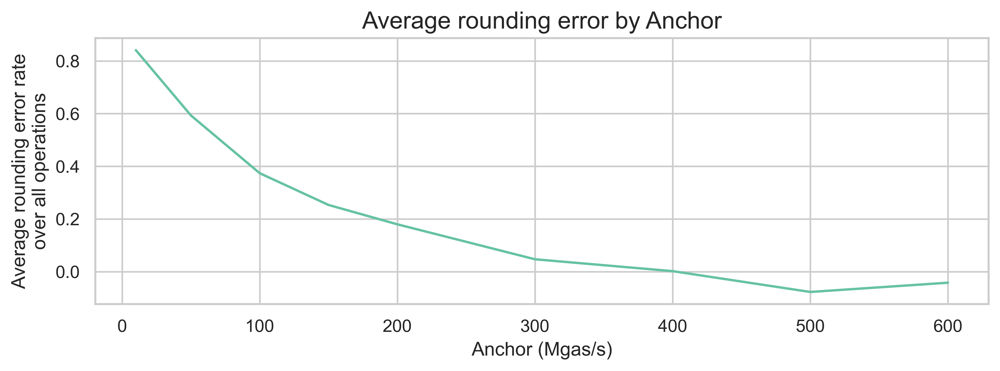
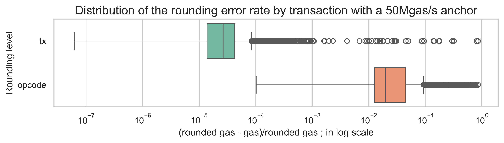

## Abstract

This proposal introduces the `milli-gas` counter as the EVM's internal gas accounting. Gas costs are defined in `milli_gas` and internal EVM gas accounting is entirely carried out in `milli_gas`. At the end of transaction execution, `milli_gas` is rounded up to `gas`. Gas limits and transaction fees are still computed and verified using the current `gas_used` counter. This new counter enables a more precise accounting of cheap compute without impacting UX.

## Motivation

Currently, most EVM compute operations (`ADD`, `SUB`, `MUL`, etc.) are significantly underpriced when compared with state operations (`SSTORE`, `SLOAD`, `CREATE`, etc.). There are two factors contributing to this mismatch. On one hand, client optimizations and hardware improvements have made pure compute operations more efficient. On the other hand, with the growing size of the Ethereum state, the performance of I/O operations touching this larger state has been deteriorating. Both of these trends are expected to continue, further worsening this mismatch.

There are a couple of proposals to reduce the cost of compute operations ([EIP-7904](./eip-7904.md)) and increase the cost of state operations ([EIP-8032](./eip-8032.md), [EIP-8037](./eip-8037.md), and [EIP-8038](./eip-8038.md)). However, given the current level of mismatch between these operations, there is an inherent trade-off in the anchor we use to reprice these operations.

If we make compute operations cheaper, we will introduce rounding errors, with most compute operations costing 1, when they should cost a fraction of that. These rounding errors impact scalability because we can now fit fewer of these cheaper operations in any given block. However, if we price all operations so that the fastest opcode is assigned 1 gas, we would need to make all other operations significantly more expensive, including both compute and state operations. Making everything more expensive would require a rebase on the concept of gas units to users, thus impacting UX.

To illustrate this point, let's focus on the pure compute operations. As compute operations impact only block execution time, the chosen anchor will induce a specific million gas per second rate on all compute opcodes. For instance, if we anchor on `EcRecover` at the current price (3000 gas units), this induces a rate of 175Mgas/s, based on the execution time estimated for this opcode on [EIP-7904's empirical analysis](../assets/eip-7904/gas-cost-estimator-report.pdf). The following plot shows the average rounding errors of compute operations for different anchors, using the same execution time estimates from EIP-7904.



As we can see, with an anchor of 50Mgas/s (which would result in a gas limit of 100Mgas, assuming a 2-second block execution limit), we would get an average rounding error of 59.3%. This means that we could be 59.3% cheaper on average per opcode if we didn't have to round to integer gas units. Only after a 400Mgas/s anchor do we get to reasonably low rounding errors. However, this level of Mgas/s would require a major rebase of the gas model, where all opcodes become significantly more expensive, and both the transaction-level and block-level gas limits increase by a factor of 100.

The way around this trade-off is to allow cheap opcodes to have fractional gas costs, thus avoiding both the scalability limits introduced by rounding errors and the significant UX change of increasing gas costs and limits 100x.

A similar argument was made in [EIP-2045](./eip-2045.md), which served as inspiration to this proposal.

## Specification

This proposal introduces a new `Uint` counter to the EVM, `milli_gas_left`. Gas costs are defined in `milli_gas` and internal EVM gas accounting is entirely carried out in `milli_gas`.

Transaction fees, transaction gas limits, and block gas limits are still computed and verified using the current `gas_used` counter. There are no changes to blob gas accounting, refunds, or call data gas accounting.

### EVM environment

The current `gas_left` variable from the internal state of the EVM is replaced by `milli_gas_left`:

```python
@dataclass
class Evm:
    """The internal state of the virtual machine."""
    pc: Uint
    stack: List[U256]
    memory: bytearray
    code: Bytes
    milli_gas_left: Uint
    valid_jump_destinations: Set[Uint]
    logs: Tuple[Log, ...]
    refund_counter: int
    running: bool
    message: Message
    output: Bytes
    accounts_to_delete: Set[Address]
    return_data: Bytes
    error: Optional[EthereumException]
    accessed_addresses: Set[Address]
    accessed_storage_keys: Set[Tuple[Address, Bytes32]]
```

All references to `evm.gas_left` are replaced by `evm.milli_gas_left`.

### End-of-transaction conversion

At the end of each transaction execution, the gas left in the transaction output is updated to

```python
tx_output.gas_left = ceil(evm.milli_gas_left / 1000)
```

At the same time, after the transaction is executed, `evm.milli_gas_used` is rounded up to `evm.gas_used = ceil(evm.milli_gas_used / 1000)`.

### Opcode costs

Opcode gas parameters as defined in the [Ethereum Execution Client Specifications](https://github.com/ethereum/execution-specs/blob/abd7612d2f4d6fcd9f628330f38884b300f0d89f/src/ethereum/forks/osaka/vm/gas.py) that are not updated at the same time or after the introduction of this proposal, are increased by 1000x:

`GAS_PARAM = GAS_PARAM * 1000`

### `GAS` opcode

The `GAS` opcode reports the available gas in `milli-gas` units.

### `*CALL` opcodes

`*CALL` opcodes receive the amount of gas to send to the sub context to execute in `gas`. `gas` is converted to `milli-gas` at the start of the call's execution:

```python
# STACK
gas = Uint(pop(evm.stack)) * 1000
```

## Rationale

### New counter vs. new variable type

A possible approach to allow for fractional gas would be to change the variable type of all gas-related variables from an integer to a float or a base fractional. Although simple in concept, the implementation of such a change in the EVM is not trivial. In addition, introducing fractional variables would make moving to a zkEVM significantly more complex.

Thus, introducing a new counter is the option that least disrupts the current EVM implementation, while allowing for expressive gas costs.

### Rounding at transaction-level

With the introduction of a new counter, there are two levels at which we could convert `milli_gas` to `gas`: at the transaction level or the block level. Conversion at the block level results in the fewest rounding errors in block utilization. However, it requires a bigger change to implement, as `milli_gas` will need to be used when computing transaction fees and limits, and `milli_gas` will need to be incorporated in the block environment.

The question is whether a conversion at the transaction level is sufficient to reduce rounding errors. To estimate this, we extracted the opcode counts per transaction for 1000 mainnet blocks and computed the new gas prices of all compute operations assuming an anchor of 50Mgas/s and the estimated execution times from [EIP-7904's empirical analysis](../assets/eip-7904/gas-cost-estimator-report.pdf). With this repricing, the fastest opcode (`JUMPDEST`) would be priced at 90 milli-gas units (i.e., 0.09 gas units). We also assumed that the non-compute operations and precompiles would have the same price, and we excluded any other transaction costs, such as intrinsic costs and calldata.

Then, we computed the rounding error of each transaction, assuming a conversion at both the transaction and opcode levels. The opcode-level conversion is equivalent to not using fractional gas and rounding all opcodes to an integer. The following plot shows the distribution for both errors. The x-axis is on a logarithmic scale.



In this sample of 1000 blocks, a transaction-level conversion has already successfully reduced the rounding errors from an average of 4% to 0.05% per transaction.

## Backwards Compatibility

This is a backwards incompatible gas repricing that requires a scheduled network upgrade.

Deployed bytecode that compares `gas_left` to constants or that uses explicit gas-limited calls will suddenly forward 1000× less gas, causing unexpected reverts or logic flip. Further analysis on how widespread this behavior is required.

## Security Considerations

<-- TODO -->

## Copyright

Copyright and related rights waived via [CC0](../LICENSE.md).
