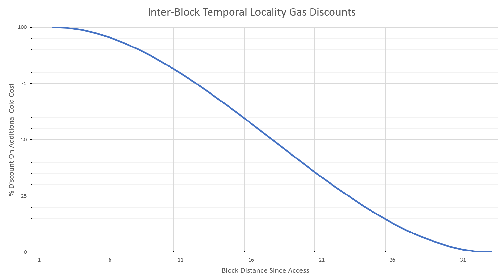

## Abstract

This proposal introduces a deterministic, multi-block discount for the first access to accounts and storage keys in a transaction. The discount depends on how many blocks have passed since the item was last accessed, decaying smoothly to zero over a fixed recent window. Intra-block warming semantics are unchanged - there is no warming across transactions within a block.

The mechanism builds on block-level access lists ([EIP-7928](./eip-7928.md)), which are committed in block headers. This allows a newly synced node to correctly price the first block it validates without replaying historical execution.

## Motivation

Current warm and cold access pricing reflects how clients manage state, but it leaves potential efficiency untapped. Clients already retain data from recent blocks in memory to handle short reorgs, so accesses to those items are cheaper in practice. Yet the gas model ignores this, only distinguishing between warm and cold accesses within a single block.

Extending the concept between transactions intra-block seems like an obvious improvement - but same-block sharing fails to deliver predictability. Any gas saving that depends on coincidental same-block accesses is effectively random and capricious from a user's perspective: they sign a transaction at a fixed price, yet may pay less only if another transaction in the same block happens to touch the same items. Such savings are both inherently not knowable or actionalable at submission and therefore do not shape behaviour.

This proposal rewards short-term temporal locality across block boundaries while preserving the familiar per-transaction warm set. The discount depends only on prior blocks, so it is deterministic at submission, predictable across builders, and behaviour-modifying in a useful direction.

As the saving depends only on publicly observable prior-block activity, it is knowable at submission time. Unlike same-block effects, it is therefore behaviour-shaping rather than incidental. It nudges workloads that naturally cluster accesses to keep doing so, matching how clients amortise repeated recent accesses.

This proposal is intentionally scoped to per-transaction warming and does not apply intra-block warming across transactions.

## Specification

### Terminology and constants

| Name | Description | Default  |
|-----------------------------|-----------------------|-----------------|
| `WINDOW_SIZE_BLOCKS`| Number of recent blocks over which a discount may apply. | `32` |
| `CURRENT_BLOCK_NUMBER`      | The block number of the transaction being executed. | - |
| `LAST_ACCESS_BLOCK_NUMBER(item)` | The most recent block number strictly less than `CURRENT_BLOCK_NUMBER` in which `item` was accessed by an executed transaction. If unknown or older than `WINDOW_SIZE_BLOCKS`, it is treated as not found. | - |
| `BLOCK_DISTANCE_IN_BLOCKS(item)` | Defined as `CURRENT_BLOCK_NUMBER - LAST_ACCESS_BLOCK_NUMBER(item)` when the latter is found, else a value greater than `WINDOW_SIZE_BLOCKS`. | - |

Gas constants from existing behaviour:

| Name                        | Value  |
|-----------------------------|-------:|
| `SLOAD_WARM_GAS_COST`       | `100`  |
| `SLOAD_COLD_SURCHARGE_GAS`  | `2100` |
| `ACCOUNT_WARM_GAS_COST`     | `100`  |
| `ACCOUNT_COLD_SURCHARGE_GAS`| `2600` |

Discount caps (this EIP treats maximum as full cold surcharge, minimum as zero):

| Name                      | Value                        |
|---------------------------|-----------------------------:|
| `DISCOUNT_MAX_SLOAD`      | `SLOAD_COLD_SURCHARGE_GAS`   |
| `DISCOUNT_MIN_SLOAD`      | `0`                          |
| `DISCOUNT_MAX_ACCOUNT`    | `ACCOUNT_COLD_SURCHARGE_GAS` |
| `DISCOUNT_MIN_ACCOUNT`    | `0`                          |

This means the closest prior-block usage allows the first access in a transaction to be charged at warm cost, and the far edge of the window trends to the normal cold-plus-warm cost.

### Scope of operations

This EIP applies the discount to the **first access in a transaction** of:

- Storage keys accessed by `SLOAD` and by any operation that first reads a slot as part of its semantics (for example, `SSTORE`'s read step).
- Account touches that incur the cold account access surcharge under the current gas schedule, including but not limited to: `BALANCE`, `EXTCODEHASH`, `EXTCODESIZE`, `EXTCODECOPY`, and the target account of `CALL`, `CALLCODE`, `DELEGATECALL`, `STATICCALL`.

Writes are affected **only** to the extent they perform an initial read or account touch that would have been charged as cold. Write-specific costs and any refund semantics are unchanged.

Precompiles remain unchanged and are always warm. Because they do not pay a cold surcharge, no discount is applied to precompile calls.

Access lists per [EIP-2930](./eip-2930.md) remain effective and, when present, pre-warm the listed addresses and storage keys at the start of the transaction. For items that are pre-warmed by an access list, this temporal discount does not apply.

### Discount function

The discount decays smoothly with block distance, using a **reversed Hermite smoothstep** interpolation over the discount window.




Mathematically:

$x = \mathrm{clamp}\left( \frac{D - 1}{W - 1}, 0, 1 \right)$

$f(D, W) = d_{\text{min}} + (d_{\text{max}} - d_{\text{min}}) 
           \cdot \left( 1 - \left( 3x^2 - 2x^3 \right) \right)$

where:

- $D$ = block distance in blocks
- $W$ = window size in blocks
- $d_{\text{min}}$, $d_{\text{max}}$ = minimum and maximum discounts

This form maps:

- $D = 1$ → full discount $(f = d_{\text{max}})$
- $D = W$ → no discount $(f = d_{\text{min}})$

Programmatic form

Reference smoothstep helper:

```python
def smoothstep(edge0: float, edge1: float, x: float) -> float:
    """Scale and clamp x to [0, 1], then apply cubic Hermite smoothstep."""
    x = max(0.0, min(1.0, (x - edge0) / (edge1 - edge0)))
    return x * x * (3.0 - 2.0 * x)
```

Calculation steps:

- `NORMALIZED_DISTANCE = (BLOCK_DISTANCE_IN_BLOCKS - 1) / (WINDOW_SIZE_BLOCKS - 1)` clamped to `[0, 1]`.  This maps distance `1` → `0` and distance `WINDOW_SIZE_BLOCKS` → `1`.
- `SMOOTHSTEP_VALUE = smoothstep(0.0, 1.0, NORMALIZED_DISTANCE)`
- `DISCOUNT_FACTOR = 1.0 - SMOOTHSTEP_VALUE` (equals `1.0` at distance `1`, and `0.0` at distance `WINDOW_SIZE_BLOCKS`)

For a given opcode family with parameters `DISCOUNT_MAX` and `DISCOUNT_MIN`, the integer discount applied to the **cold surcharge** is:

```python
if BLOCK_DISTANCE_IN_BLOCKS <= 0 or BLOCK_DISTANCE_IN_BLOCKS > WINDOW_SIZE_BLOCKS:
    DISCOUNT_GAS = 0
else:
    NORMALIZED_DISTANCE = max(
        0.0,
        min(1.0, (BLOCK_DISTANCE_IN_BLOCKS - 1.0) / (WINDOW_SIZE_BLOCKS - 1.0)),
    )
    SMOOTHSTEP_VALUE = smoothstep(0.0, 1.0, NORMALIZED_DISTANCE)
    DISCOUNT_FACTOR = 1.0 - SMOOTHSTEP_VALUE
    DISCOUNT_GAS = DISCOUNT_MIN + round(
        (DISCOUNT_MAX - DISCOUNT_MIN) * DISCOUNT_FACTOR
    )
```

All arithmetic must be implemented in **integer space** in consensus-critical code; floating point is shown here only for clarity. `round()` follows *round half up* semantics; any deterministic rule is acceptable if consistently applied across clients.

This mechanism is a **discount**, not a refund. It reduces gas charged upfront for a cold surcharge; it does not emit a rebate and does not affect refund accounting or receipts.

### Charging rules (per transaction)

For the first access to an `ITEM` **within a transaction**:

1. If `ITEM` is already warm in this transaction due to same-transaction rules or pre-warmed via a transaction access list, charge the warm cost defined today. No temporal discount applies.
2. Otherwise compute `BLOCK_DISTANCE_IN_BLOCKS(ITEM)`. If `1 <= BLOCK_DISTANCE_IN_BLOCKS(ITEM) <= WINDOW_SIZE_BLOCKS`, apply the discount to the cold surcharge:

   - Storage read first access cost:

     - `SLOAD_FIRST_ACCESS_COST = SLOAD_WARM_GAS_COST + max(0, SLOAD_COLD_SURCHARGE_GAS - DISCOUNT_SLOAD(BLOCK_DISTANCE_IN_BLOCKS))`

   - Account-touch first access cost:

     - `ACCOUNT_FIRST_ACCESS_COST = ACCOUNT_WARM_GAS_COST + max(0, ACCOUNT_COLD_SURCHARGE_GAS - DISCOUNT_ACCOUNT(BLOCK_DISTANCE_IN_BLOCKS))`

3. If `BLOCK_DISTANCE_IN_BLOCKS(ITEM) > WINDOW_SIZE_BLOCKS` or not found, charge the unmodified cold surcharge plus the warm component as today.

Subsequent accesses to the same `ITEM` within the **same transaction** are warm as per existing rules. This EIP does not introduce block-level warming across transactions.

### Initial sync and pricing with block-level access lists

This EIP requires block-level access lists in headers. Each header carries commitments to the sets of accounts and storage keys accessed during that block.

A newly synced node can price the very first block it validates as follows:

1. For a block to validate at `CURRENT_BLOCK_NUMBER`, gather the headers for the previous `WINDOW_SIZE_BLOCKS` blocks.
2. For each of those headers, obtain the committed sets of accessed accounts and storage keys from the block body or via verified proofs against the header commitments.
3. Build a local index mapping each seen `ITEM` to the most recent block number in which it appears within that window. This becomes `LAST_ACCESS_BLOCK_NUMBER(ITEM)`.
4. When validating `CURRENT_BLOCK_NUMBER`, for each first access to `ITEM`, compute
   `BLOCK_DISTANCE_IN_BLOCKS(ITEM) = CURRENT_BLOCK_NUMBER - LAST_ACCESS_BLOCK_NUMBER(ITEM)`
   when present, else treat as out-of-window. Apply the discount rules above.

Reorgs longer than `WINDOW_SIZE_BLOCKS` fall back to the same procedure as initial resync. Items not present in the new canonical window are treated as cold.

No execution of historical transactions is required to compute the discount at validation time. Stateless verifiers can price gas using the current block plus compact proofs that an item appears in one of the previous `WINDOW_SIZE_BLOCKS` access lists.

### Wallet gas estimation guidance

Wallets and RPC endpoints should not assume that a temporal discount will apply at submission, because the exact landing block is uncertain. General-purpose estimators should price as if no temporal discount applies.

Operators who can predict landing with high confidence - for example via priority fees and private order flow - may account for the exact discount, but this is an advanced path and not the default.

Motivated operators who can reliably land transactions in a specific block - for example via private order flow and appropriately set priority fees - may account for the exact discount. This is an advanced use case and should not be the default behaviour for general-purpose wallets.

Here's your section rewritten with consistent **uppercase variable names** and slightly tightened for clarity while preserving your meaning and tone:

### Implementation guidance

Clients are expected to maintain a rolling in-memory index to avoid rescanning headers for each block:

- Keep a ring buffer of `WINDOW_SIZE_BLOCKS` buckets, one per recent block. Each bucket stores first-touched accounts and first-touched storage keys for that block.
- Maintain two maps, `LAST_SEEN_ACCOUNT` and `LAST_SEEN_STORAGE_KEY`, which track the most recent block index within the window where each item was present. On block advance, drop the oldest bucket and delete items that only appeared there, or mark them as out-of-window.
- During execution, when an opcode is about to charge a cold surcharge for an item not yet warm in the current transaction, look up `BLOCK_DISTANCE_IN_BLOCKS` from the `LAST_SEEN_*` map and charge using the rules above. Then record first touches for the current block in the current bucket and update the maps.

This design keeps memory bounded by `WINDOW_SIZE_BLOCKS` multiplied by the number of distinct first touches per block, which is itself bounded by the block gas limit divided by the minimum per-item cost.

This is one practical approach; clients may also implement this via existing caches or by embedding and pruning block-distance hints in their state trie.

### Test cases

### Example parameters and results

Assume the following defaults:

| Name                         |  Value |
| ---------------------------- | -----: |
| `WINDOW_SIZE_BLOCKS`         |   `32` |
| `SLOAD_WARM_GAS_COST`        |  `100` |
| `SLOAD_COLD_SURCHARGE_GAS`   | `2100` |
| `ACCOUNT_WARM_GAS_COST`      |  `100` |
| `ACCOUNT_COLD_SURCHARGE_GAS` | `2600` |
| `DISCOUNT_MAX_SLOAD`         | `2100` |
| `DISCOUNT_MIN_SLOAD`         |    `0` |
| `DISCOUNT_MAX_ACCOUNT`       | `2600` |
| `DISCOUNT_MIN_ACCOUNT`       |    `0` |

#### Example: first storage read in a transaction

| `BLOCK_DISTANCE_IN_BLOCKS` | Discount | Charge | Notes         |
| -------------------------- | -------: | -----: | ------------- |
| `1`                        |   `2100` |  `100` | Equal to warm |
| `8`                        |   `1827` |  `373` | -             |
| `16`                       |   `1101` | `1099` | Mid-window    |
| `24`                       |    `347` | `1853` | -             |
| `32`                       |      `0` | `2200` | Window edge   |
| `>32`                      |      `0` | `2200` | Fully cold    |

#### Example: first account touch in a transaction

| `BLOCK_DISTANCE_IN_BLOCKS` | Discount | Charge | Notes         |
| -------------------------- | -------: | -----: | ------------- |
| `1`                        |   `2600` |  `100` | Equal to warm |
| `8`                        |   `2262` |  `438` | -             |
| `16`                       |   `1363` | `1337` | Mid-window    |
| `24`                       |    `430` | `2270` | -             |
| `32`                       |      `0` | `2700` | Window edge   |
| `>32`                      |      `0` | `2700` | Fully cold    |

Exact integer results are determined by the reference implementation's rounding rule (`round_to_nearest`, half-up).

### Reference implementation (Python, integer only)

This implementation is normative for rounding and scaling. It uses a power-of-two fixed-point scale so divisions by the scale are exact shifts in low-level implementations. All intermediates fit below 2**53 so a JavaScript client can mirror these steps without a big number library.

```python
# Gas constants
SLOAD_WARM_GAS_COST = 100
SLOAD_COLD_SURCHARGE_GAS = 2100
ACCOUNT_WARM_GAS_COST = 100
ACCOUNT_COLD_SURCHARGE_GAS = 2600

# Temporal discount parameters
WINDOW_SIZE_BLOCKS = 32
DISCOUNT_MAX_SLOAD = SLOAD_COLD_SURCHARGE_GAS
DISCOUNT_MIN_SLOAD = 0
DISCOUNT_MAX_ACCOUNT = ACCOUNT_COLD_SURCHARGE_GAS
DISCOUNT_MIN_ACCOUNT = 0

# Fixed-point scale (2^25 = 33,554,432)
SCALE_FACTOR = 1 << 25
HALF_SCALE = SCALE_FACTOR >> 1


def smooth_factor_scaled(block_distance_in_blocks: int,
                         window_blocks: int = WINDOW_SIZE_BLOCKS) -> int:
    """
    Returns round_to_nearest(SCALE_FACTOR * DISCOUNT_FACTOR) where:
      normalized_distance = (block_distance_in_blocks - 1) / (window_blocks - 1),
      clamped to [0, 1]
      smoothstep_value = normalized_distance^2 * (3 - 2 * normalized_distance)
      discount_factor = 1 - smoothstep_value
    The result is in [0, SCALE_FACTOR].
    """
    if block_distance_in_blocks <= 0 or block_distance_in_blocks > window_blocks:
        return 0

    # Use exact rational form to minimize scaling multiplications:
    # Let t = block_distance_in_blocks - 1, d = window_blocks - 1.
    # discount_factor = (d^3 - 3*d*t^2 + 2*t^3) / d^3
    t = block_distance_in_blocks - 1
    d = window_blocks - 1
    d3 = d * d * d
    t2 = t * t
    t3 = t2 * t
    numerator = d3 - 3 * d * t2 + 2 * t3

    # Round half up
    return (SCALE_FACTOR * numerator + (d3 // 2)) // d3


def discount_gas_units(block_distance_in_blocks: int,
                       discount_max: int,
                       discount_min: int) -> int:
    """
    Integer discount within the window using the smooth falloff.
    Returns an integer number of gas units to subtract from the cold surcharge.
    """
    if block_distance_in_blocks <= 0 or block_distance_in_blocks > WINDOW_SIZE_BLOCKS:
        return 0

    factor_scaled = smooth_factor_scaled(block_distance_in_blocks, WINDOW_SIZE_BLOCKS)
    span = discount_max - discount_min
    scaled = (span * factor_scaled + HALF_SCALE) // SCALE_FACTOR
    return discount_min + scaled


def sload_first_access_cost(block_distance_in_blocks: int) -> int:
    disc = discount_gas_units(block_distance_in_blocks,
                              DISCOUNT_MAX_SLOAD,
                              DISCOUNT_MIN_SLOAD)
    cold_part = SLOAD_COLD_SURCHARGE_GAS - disc
    if cold_part < 0:
        cold_part = 0
    return SLOAD_WARM_GAS_COST + cold_part


def account_first_access_cost(block_distance_in_blocks: int) -> int:
    disc = discount_gas_units(block_distance_in_blocks,
                              DISCOUNT_MAX_ACCOUNT,
                              DISCOUNT_MIN_ACCOUNT)
    cold_part = ACCOUNT_COLD_SURCHARGE_GAS - disc
    if cold_part < 0:
        cold_part = 0
    return ACCOUNT_WARM_GAS_COST + cold_part
```

## Rationale

- Determinism: discounts depend only on prior blocks, so users can predict costs at submission time. The block-level access lists in headers remove bootstrap ambiguity for new nodes. Intra-block dependent savings are inherently unknowable and non-actionable at submission, so they do not change behaviour; prior-block based savings do.
- Smooth curve: the chosen polynomial keeps strong incentive for very recent history and eases toward zero, aligning with how caches deliver benefit for temporal locality. Linear ramps are simpler but produce harsher edges.
- Window of 63: this captures longer-lived temporal locality without turning the feature into a long-term subsidy, and keeps proof and index sizes small.
- Discount not refund: reduces upfront charge only; does not change refund semantics or receipts.
- No correlation: simple to implement and reason about. The model is explicitly about last-access distance, not frequency.

Builder rotation and similar operational concerns are out of scope for this EIP.


### Behavioural effects

The smoothstep curve over 32 blocks is gentle. Discount remains close to maximum for roughly the first 12 to 16 blocks and decays toward zero near the far edge of the window.

#### Storage slot (SLOAD) first-access pricing

(warm = 100, cold surcharge = 2100, window = 32)

| `BLOCK_DISTANCE_IN_BLOCKS` | Discount | Charge | Notes                 |
| -------------------------- | -------: | -----: | --------------------- |
| `1`                        |   `2100` |  `100` | fully warm equivalent |
| `4`                        |   `2045` |  `155` | almost full discount  |
| `8`                        |   `1827` |  `373` |                       |
| `12`                       |   `1494` |  `706` |                       |
| `16`                       |   `1101` | `1099` | midpoint of window    |
| `18`                       |    `898` | `1302` |                       |
| `20`                       |    `700` | `1500` |                       |
| `24`                       |    `347` | `1853` |                       |
| `28`                       |     `96` | `2104` | near-cold             |
| `32`                       |      `0` | `2200` | window edge           |
| `>32`                      |      `0` | `2200` | fully cold access     |

#### Account access first-access pricing

(warm = 100, cold surcharge = 2600, window = 32)

| `BLOCK_DISTANCE_IN_BLOCKS` | Discount | Charge | Notes                 |
| -------------------------- | -------: | -----: | --------------------- |
| `1`                        |   `2600` |  `100` | fully warm equivalent |
| `4`                        |   `2532` |  `168` | almost full discount  |
| `8`                        |   `2262` |  `438` |                       |
| `12`                       |   `1850` |  `850` |                       |
| `16`                       |   `1363` | `1337` | midpoint of window    |
| `18`                       |   `1112` | `1588` |                       |
| `20`                       |    `867` | `1833` |                       |
| `24`                       |    `430` | `2270` |                       |
| `28`                       |    `119` | `2581` | near-cold             |
| `32`                       |      `0` | `2700` | window edge           |
| `>32`                      |      `0` | `2700` | fully cold access     |

#### Observations

- Accesses 1-6 blocks apart remain effectively warm, typically under 300-400 gas total.
- Around 16 blocks (≈3.2 minutes), costs reach roughly half the cold surcharge.
- By 28-32 blocks (≈5.5-6.4 minutes, one finalisation epoch), costs are nearly cold again.
- The transition is smooth and monotone; there are no cliffs or discontinuities to game.
- Both account and storage families charge exactly the warm rate for items accessed in the immediately preceding block.

As the discount depends only on **prior blocks**, users and dapps can plan around it. Unlike same-block effects, these savings are predictable: they are visible before submission and can be incorporated into automation or fee-scheduling logic.

If an operator wants to maintain most of the discount while sending as few transactions as possible, a practical cadence for items touched repeatedly is:

- Maintain about **80 percent** of the maximum discount by ensuring the item is touched again within **8-9 blocks** (around two minutes).
- Maintain about **50 percent** of the maximum discount by touching again within **16 blocks** (half an epoch).
- Beyond roughly **28 blocks**, the discount fades almost entirely; by **32 blocks**, the access is fully cold again.

In short, a **maintenance touch every 8-12 blocks** is an efficient balance: high retained discount with modest transaction frequency. Applications seeking tighter control-such as bridges, keepers, or batching relayers-can choose shorter cadences, while ordinary usage patterns will keep frequently accessed state warm naturally.

The **smooth decay curve** is important. It means missing the ideal block due to a temporary spike in gas prices or unexpected congestion doesn't abruptly forfeit the entire discount-costs rise gradually, not cliff-edge. This avoids brittle strategies that depend on exact timing and makes the mechanism more forgiving in volatile network conditions.

From a UX standpoint, humans are unlikely to act precisely within these timeframes, but automated systems can. Many popular contract surfaces-AMM reserves, token balances, or oracle feeds-stay warm simply through organic activity, letting users benefit indirectly.

Each account or storage key's discount remains **independent**. Repeated touches within the window only update the item's last-access block; they do not stack or correlate across different items.

#### Coordinated multi-EOA warm-up behaviour

Because the temporal discount depends only on **prior-block access**, a coordinated actor controlling multiple EOAs or contracts can sequence transactions to capture the maximum discount. For example, a lightweight "warm-up" transaction from one EOA in block `N` can touch a set of storage keys or accounts, allowing one or more follow-up transactions in block `N+1` to execute those same accesses at **warm-equivalent cost**.

This **inter-block pipelining** remains predictable, verifiable, and legitimate. It does not distort consensus or introduce hidden state; it simply rewards actors who cluster related work in adjacent blocks. The discount gained is bounded by the cold surcharge itself, while the overhead of coordination, additional priority fees, and builder inclusion uncertainty all limit how aggressively this pattern can be used. In practice, it is most relevant for highly automated systems-keepers, rollup bridges, or arbitrage bundles-that already coordinate sequencing across blocks.

With the **32-block window**, the value of pipelining falls off much faster. Missing a single block only slightly reduces the discount because of the smooth decay curve, but missing several in a row quickly erodes it. That makes warm-ups more predictable yet self-limiting: actors can't cheaply "bank" state heat far ahead, only maintain it across a short epoch-length horizon.

Builders and MEV searchers may still find minor advantage in chaining related operations across consecutive blocks, but this behaviour is **constructive**: it improves temporal locality in state access and lowers aggregate load on clients. The overall effect is a gentle nudge toward efficient state reuse, not a new coordination game.

If desired, protocol parameters could trim the incentive surface further-for example, by setting `DISCOUNT_MAX_*` slightly below the full cold surcharge so that even `D = 1` accesses remain marginally above the intra-transaction warm price. This specification treats that as optional tuning rather than a security necessity, accepting the small and predictable incentive as a reasonable trade-off for encouraging block-to-block efficiency.

### Relationship to block-level warming proposals

This EIP does not introduce intra-block warming across transactions. If a block-level warming proposal is active, its semantics are unchanged. The temporal discount defined here applies only to the first access to an item in a transaction based on prior-block history.

## Backwards Compatibility

This EIP changes gas charging and therefore requires a hard fork. It only decreases or equalises costs for affected opcodes and does not introduce new failure modes for existing contracts. Warm and cold cost upper bounds do not increase.

## Security Considerations

- Index growth: the number of unique items per block is limited by the block gas limit and per-item minimum costs. Bounding the window keeps memory usage proportional to a small constant factor times that number.
- Reorgs: on reorg, recompute `LAST_ACCESS_BLOCK_NUMBER` from the committed access lists of the new canonical window. Reorgs longer than the window fall back to the initial resync procedure.
- Stateless operation: pricing proofs require only the current block and membership proofs for at most one of the previous `WINDOW_SIZE_BLOCKS` access lists per item.

## Copyright

Copyright and related rights waived via [CC0](../LICENSE.md).
