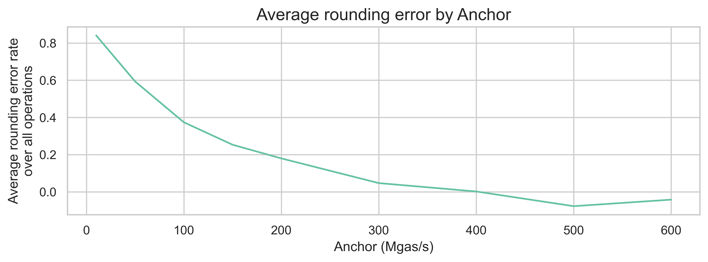

## Abstract

This proposal rebases Ethereum’s gas unit to a factor of `REBASE_FACTOR` to enable high-precision metering without introducing fractional gas. All gas-related parameters and variables are increased to a factor of `REBASE_FACTOR`. This reduces rounding errors that arise when repricing EVM operations and future-proofs gas costs as hardware improves and state access remains costly, while avoiding major changes in the internal logic of the EVM.

## Motivation

Currently, most EVM compute operations (`ADD`, `SUB`, `MUL`, etc.) are significantly underpriced when compared with state operations (`SSTORE`, `SLOAD`, `CREATE`, etc.). There are two factors contributing to this mismatch. On one hand, client optimizations and hardware improvements have made pure compute operations more efficient. On the other hand, with the growing size of the Ethereum state, the performance of I/O operations touching this larger state has been deteriorating. Both of these trends are expected to continue, further worsening this mismatch.

There are a couple of proposals to reduce the cost of compute operations ([EIP-7904](./eip-7904.md)) and increase the cost of state operations ([EIP-8032](./eip-8032.md), [EIP-8037](./eip-8037.md), and [EIP-8038](./eip-8038.md)). However, given the current level of mismatch between these operations, there is an inherent trade-off in the anchor we use to reprice these operations.

If we make compute operations cheaper, we will introduce rounding errors, with most compute operations costing 1, when they should cost a fraction of that. These rounding errors impact scalability because we can now fit fewer of these cheaper operations in any given block. However, if we price all operations so that the fastest opcode is assigned 1 gas, we would need to make all other operations significantly more expensive, including both compute and state operations. Such a level of price increases would severely reduce throughput at current block limits.

To illustrate this point, let's focus on the pure compute operations. As compute operations impact only block execution time, the chosen anchor will induce a specific million gas per second rate on all compute opcodes. For instance, if we anchor on `EcRecover` at the current price (3000 gas units), this induces a rate of 175Mgas/s, based on the execution time estimated for this opcode on [EIP-7904's empirical analysis](../assets/eip-7904/gas-cost-estimator-report.pdf). The following plot shows the average rounding errors of compute operations for different anchors, using the same execution time estimates from EIP-7904.

As we can see, with an anchor of 50Mgas/s (which would result in a gas limit of 100Mgas, assuming a 2-second block execution limit), we would get an average rounding error of 59.3%. This means that we could be 59.3% cheaper on average per opcode if we didn't have to round to integer gas units. Only after a 400Mgas/s anchor do we get to reasonably low rounding errors. Without fractional gas, which would introduce further complexity to the EVM gas calculation, this level of Mgas/s anchor requires a major rebase of the gas model, where all opcodes become significantly more expensive, and both the transaction-level and block-level gas limits increase by the same factor.

## Specification

| **Parameter** | **Value** |
|:---:|:---:|
| `REBASE_FACTOR` | 1000 |

This proposal introduces a gas rebase such that all gas-related parameters and variables are increased by a factor of `REBASE_FACTOR`.

At fork boundary, `calculate_base_fee_per_gas` is updated so that both `parent_gas_used` and `parent_base_fee_per_gas` are also scaled by a factor of `REBASE_FACTOR`.

## Rationale

A rebase factor of 1000 has two advantages:

1. It is large enough to completely remove rounding errors for compute operations now and to be future-proof. As we can see from the motivation, an anchor of 400Mgas/s would be enough to reduce these errors. Assuming a 2-second block execution time, this results in a block limit of 800M gas units, which requires an increase of 22x over the current 36M block limit.
2. It makes reasoning about the new gas unit simpler. Block limits and targets move from million units to billion units, while gas costs move from units to thousand units.

## Backwards Compatibility

This is a backwards incompatible gas repricing that requires a scheduled network upgrade.

## Security Considerations

Increasing the cost of state access operations could impact the usability of certain applications. More analysis is needed to understand the potential effects on various dApps and user behaviors.

In addition, the increase in units in `gasLimit` and `gasUsed` will increase the size of the RLP representation the block header by 2 bytes. More analysis is needed to assess the bandwidth impacts.

## Copyright

Copyright and related rights waived via [CC0](../LICENSE.md).
