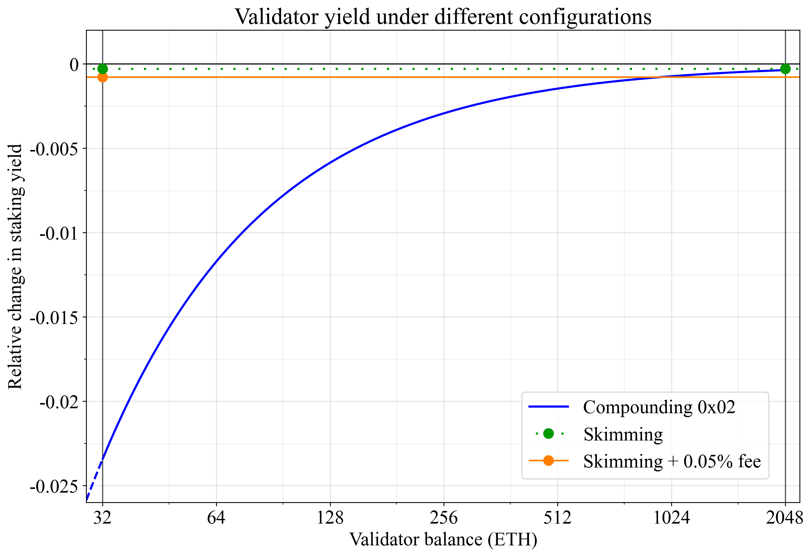
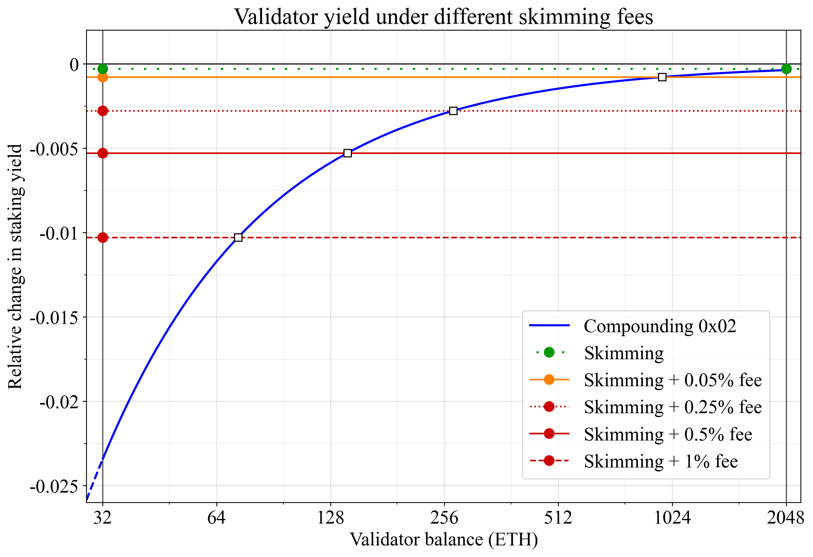

## Abstract

A fee is proposed on the partial "sweep" withdrawal of validators using `0x01` credentials, to improve stake consolidation and fairness. Ethereum's fast finality roadmap hinges on staking service providers migrating from `0x01` validators to `0x02` compounding validators. One roadblock is that `0x01` validators receive free-of-charge partial skimming withdrawals for balances exceeding 32 ETH, which consume protocol resources that are not accounted for. To address this, a 0.05% fee is imposed on the partial `0x01` sweep using a minimal modification to `process_withdrawals()`, applying the new constant `WITHDRAWAL_FEE_FRACTION = 2000`.

## Motivation

The roadmap for fast finality hinges on stake consolidation, where staking service providers (SSPs) transition from running 32-ETH validators with `0x01` credentials to compounding validators with `0x02` credentials. A roadblock to this transition is that `0x01` validators have been designed with close-to-ideal capital efficiency and free-of-charge partial withdrawals for balances exceeding 32 ETH (the "sweep" function). When factoring in switching costs, the incentives do not favor stake consolidation. At the same time, sweep withdrawals take up resources on both the consensus layer (CL) and execution layer (EL) that are not paid for. It is unsuitable to give `0x01` validators an accounting advantage over `0x02` validators when Ethereum's roadmap hinges on stakers consolidating their stake in `0x02` validators.

To improve consolidation while upholding fairness, this EIP accounts for the resource load of the `0x01` partial withdrawal sweep by imposing a small withdrawal fee for it. The proposed fee is 0.05% of the withdrawn amount, imposed via `WITHDRAWAL_FEE_FRACTION = 2000`. Since the average sweep withdrawal credits around 0.0235 ETH, the average expected fee per withdrawal is $0.0235\;\mathrm{ETH} \times 0.0005 = 11\,750\;\mathrm{Gwei}$. The total expected fee over one year for a validator is 0.00048 ETH, corresponding to around \$2 at the current ETH price. An SSP running 50,000 `0x01` validators (slightly below 5% of the stake) would thus need to pay around \$100,000 per year in withdrawal fees.

The fee approximates the EL workload imposed by the sweep, calibrated against the average base fee over the last year (4.53 gwei). The withdrawal incurs equivalent to around 2204 gas (not accounting for CL work), implying a fee of $2204 \times 4.53 = 9\,984\;\mathrm{Gwei}$ (albeit, the base fee has been lower in recent months).

The fee is taken out on the CL as a percentage, since a fixed fee could produce extreme outcomes if the number of `0x01` validators were to be drastically reduced due to consolidation. In such a scenario, the sweep will hit validators more frequently, and the fee will thus be taken out more frequently. Since validators then would also withdraw a lower balance each time, a percentage fee on the withdrawal keeps the burden on stakers fixed. The existing logic is kept intact to minimize complexity. As a result, a validator's balance will dip just below 32 ETH after skimming (as also happens when receiving a penalty just after skimming).

## Specification

### Parameters

| Constant                  | Value  |
| -                         | -      |
| `WITHDRAWAL_FEE_FRACTION` | `2000` |

### Functions

In `process_withdrawals()`, take out a fee for skimmed `0x01` validators that did not perform a full exit, burning it on the CL:

```python
def process_withdrawals(state: BeaconState, payload: ExecutionPayload) -> None:
    ...
    # In this existing for-loop, calculate a fee before decreasing the balance
    for w in expected_withdrawals:
        vi = w.validator_index
        fee = 0
        if not has_compounding_withdrawal_credential(state.validators[vi]) and w.amount != state.balances[vi]:
            fee = w.amount // WITHDRAWAL_FEE_FRACTION
        decrease_balance(state, vi, w.amount + fee)
```

## Rationale

### Fast finality

Fast finality is best realized through a reduction to the active validator set voting each round. Two paths have been envisioned. In one path referred to as Orbit SSF, the active set rotates in a weighted fashion, such that large consolidated validators always are active, and smaller validators are active less frequently. In another path, there is a fixed number of validator seats, with only the largest validators (e.g., the top 8,192) granted a seat. Both paths require consolidation to achieve a desirable stake weight and optimal performance. 

### Level of the proposed fee

The cost per validator per year under 3% CL yield becomes $32 \times 0.03 / 2000 = 0.00048$ ETH, corresponding to around \$2 at a price of \$4,167 per ETH. Table 1 summarizes outcomes under different numbers of validators. A solo staker running one `0x01` is unlikely to consider the $2 fee enough to tip the scale either way. A staking service provider (SSP) running 50,000 `0x01` validators (slightly below 5% of the stake) has at least a moderate incentive since the cost then is $100,000. Under perfect competition, the SSP will not be able to pass on this cost to their customers. The outcome under a higher fee is outlined in the Alternative specifications section.

| Validators (stake %)  | Cost (ETH/year) | Cost (USD/year) |
| -                     | -:              | -:              |
| 1 (~0.0001%)          | 0.00048         | $2              |
| 100 (~0.01%)          | 0.048           | $200            |
| 10,000 (~1%)          | 4.8             | $20,000         |
| 50,000 (~5%)          | 24              | $100,000        |
| 100,000 (~10%)        | 48              | $200,000        |

**Table 1.** Cost to stakers under the proposed withdrawal fee.

The switching cost may still be greater than the yearly fee for an SSP. Some smart contracts requiring `0x01` credentials may be frozen and others may require a full exit and entry, with associated opportunity costs. However, once the recurring fee is in place and there is a commitment from the protocol to phase out `0x01` validators for SSPs—potentially even raising the fee until such an outcome has been realized—then the switch will have to be done *eventually*. Ignoring other potential benefits of `0x01` validators, a more accurate comparison is thus between the recurring fee and the capital cost for financing the switch, which of course is lower.

### Gas accounting

The gas cost accounting is as follows: 

* 500 gas – cold touch of an account known to have no code (as specified in [EIP-2780](./eip-2780.md)), 
* 1000 gas – one account-leaf write in the account trie (as specified in [EIP-2780](./eip-2780.md)), 
* 704 gas – an [EIP-4895](./eip-4895.md) withdrawal {index:uint64, validator_index:uint64, address:bytes20, amount:uint64}, consisting of $8 + 8 + 20 + 8 = 44$ bytes, priced analogously to calldata at 16 gas/byte.

It can be noted that we are not with this accounting charging for the CL work that `0x01` validators impose due to the sweep. We are neither charging `0x02` validators for the CL work of EL-triggered partial withdrawals via [EIP-7002](./eip-7002.md), but they are charged more extensively on the EL for triggering the withdrawal. Further note that `2048`-ETH validators are exempted in the specification from the sweep withdrawal fee, to avoid harming consolidation, and as an acknowledgement that `2048` ETH is the maximum stake that the protocol currently is designed to handle.

### Capital efficiency and opportunity cost

Besides free withdrawals, another benefit of `0x01` validators is the capital efficiency. A compounding `0x02` validator will on average have 0.75 ETH sitting idle, not counting toward the effective balance (EB). This is due to the current hysteresis design, where a validator that gradually increases its balance will hold between 0.25 to 1.25 more ETH than their EB. A `0x01` validator will on average have just $0.0235/2 = 0.01175$ ETH idle, and are thus much more capital-efficient, particularly when the compounding `0x02` validator holds a moderate balance overall.

Figure 1 illustrates the change in yield relative to a baseline with a neutral EB design, where, as the balance compounds, it is on average equal to the EB. The blue line is the yield of compounding `0x02` validators, which receive a lower yield due to the on average 0.75 ETH lower EB than the balance. The green circles are the yield that skimming 32-ETH and 2048-ETH validators receive. The orange line is the fee imposed on `0x01` validators proposed in the main specification. As evident, this fee does not fully offset the loss due to yield drag for `0x02` validators at validator balances below around 1,000 ETH. 



**Figure 1.** Relative change in staking yield due to differences in capital efficiency of different validator configurations. The proposed fee is shown in orange.

[EIP-8068](./eip-8068.md) addresses differences in capital efficiency between `0x01` and `0x02` validators with a neutral EB design, where the hysteresis threshold raises the EB at +0.5. This effectively shifts the blue line, positioning all compounding validators at the black line. 

If EIP-8068 is not included in the same hardfork as this EIP, we could instead raise the withdrawal fee to compensate. The alternative specification below therefore outlines a higher fee. This will however not address the other concern addressed by EIP-8068: a `0x02` validator can leverage the hysteresis and make a partial withdrawal once having reached 33 ETH EB, such that they only need to hold 32.75 ETH while keeping 33 ETH EB. This concern can, on the other hand, also be addressed on its own for minimal complexity, as outlined in the alternative specification of EIP-8068.

### Alternative specification

If EIP-8068 is not included in the same hardfork as this EIP, it is reasonable to compensate for the lower capital efficiency of `0x02` validators by setting a higher withdrawal fee. This way, stakers will be less likely to remain on their `0x01` validators just for the better capital efficiency. Figure 2 shows three different alternative fees with red lines. The white squares illustrate equal capital efficiency between a `0x01` validator under the proposed fee and a `0x02` validator at some specific validator balance. 



**Figure 2.** Relative change in staking yield due to differences in capital efficiency of different validator configurations. The main proposed fee is shown in orange, and alternative fees are shown in red.

The main option shown by the full red line is to raise the fee from 0.05% to 0.5%, setting `WITHDRAWAL_FEE_FRACTION = 200`. This means that a 32-ETH `0x01` validator will have approximately the same capital efficiency as a 128-ETH `0x02` validator. A stronger option is to impose a 1% fee as shown by the dashed red line, setting `WITHDRAWAL_FEE_FRACTION = 100`. Under this option, consolidating to a `0x02` validator will always at least be neutral, if the staker runs more than one `0x01` validator. A less forceful option is shown by the red dotted line, instead setting `WITHDRAWAL_FEE_FRACTION = 400`.

Table 2 outlines the cost to stakers under the primary alternative specification with `WITHDRAWAL_FEE_FRACTION = 200`. Stakers then pay an additional $20 per validator. That means that an SSP running 5% of the stake would take a loss of around one million dollars per year, representing a much stronger incentive to consolidate.

| Validators (stake %) | Cost (ETH/year) | Cost (USD/year) |
| -                    | -:              | -:              |
| 1 (~0.0001%)         | 0.0048          | $20             |
| 100 (~0.01%)         | 0.48            | $2k             |
| 10k (~1%)            | 48              | $200k           |
| 50k (~5%)            | 240             | $1M             |
| 100k (~10%)          | 480             | $2M             |

**Table 2.** Cost to stakers under the alternative higher withdrawal fee of 0.5% (`WITHDRAWAL_FEE_FRACTION = 200`).

## Security Considerations

To the best of the authors' knowledge, there are no security risks associated with the proposed fee.

## Copyright

Copyright and related rights waived via [CC0](../LICENSE.md).
