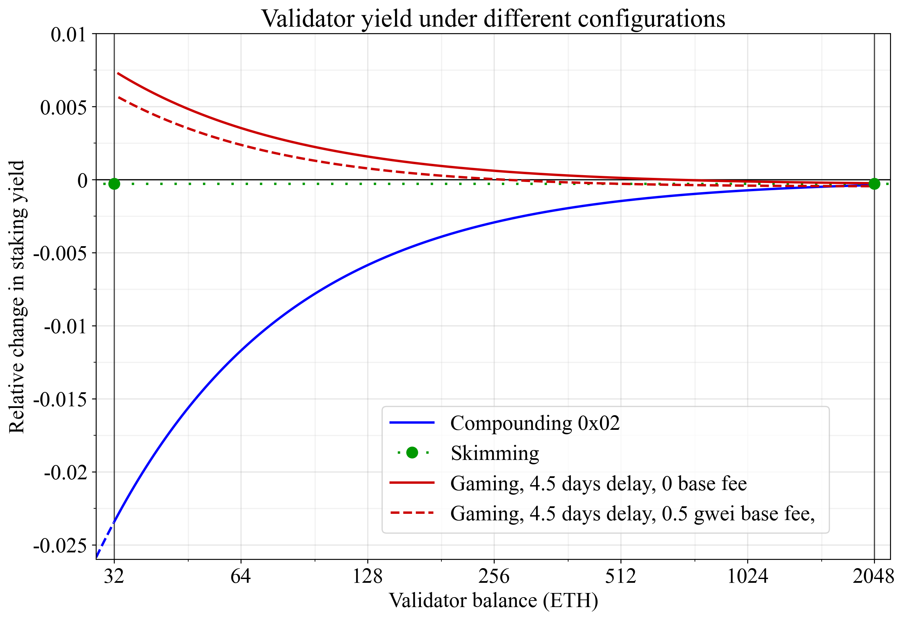

## Abstract

This EIP proposes a neutral effective balance (EB) design to ensure `0x01` (skimming) and `0x02` (compounding) validators receive equal yields. Currently, validators that compound their balance have poor capital efficiency and lower yields as their idle balance (not contributing to EB) is 0.75 ETH, significantly higher than that of skimming validators at near-zero. This disincentivizes stake consolidation critical to Ethereum's fast finality roadmap. Additionally, the current hysteresis rules allow `0x02` validators to game the hysteresis by keeping their balance below the EB. The increased profitability at lower balances could further harm consolidation. This proposal sets the EB hysteresis upward threshold to the neutral +0.5 and the downward threshold to +0.25. To prevent gaming after operations like partial withdrawals, the EB is reset to the floor of the balance, and a one-time `temporary_upward_threshold` set. This threshold is derived from an integral equation that ensures the average idle balance is zero as the validator's balance compounds up to the next integer.

## Motivation

The roadmap for fast finality hinges on stake consolidation, where staking service providers (SSPs) transition from running 32-ETH validators with `0x01` credentials to compounding validators with `0x02` credentials. A roadblock to this transition is that `0x01` validators have close-to-ideal capital efficiency, whereas `0x02` validators have poor capital efficiency during compounding. Furthermore, the optimal configuration for a `0x02` validator is to reduce its balance to 32.75 ETH and prevent it from compounding further. These incentives may lead Ethereum's fast-finality roadmap to be delayed. To prevent this, a neutral effective balance calculation is proposed, that sees all validator configurations earn the same CL yield.

A `0x02` validator that compounds its balance $b$ as intended will on average have 0.75 ETH of its balance not counting toward its effective balance (EB, or $E$ in equations). Specifically, with the current EB step bands, the idle remainder $r=b-E \in[0.25, 1.25)$ and $\bar{r}=(0.25+1.25)/2=0.75$. A `0x01` validator operating at 32 ETH has a much lower idle remainder, on average half the withdrawal sweep of $0.0235/2 = 0.01175$ ETH. A 32-ETH `0x01` validator will therefore earn around 2.3% more CL yield than a compounding `0x02` validator that grows from 32.25 ETH to 34.25 ETH over around two years.

A separate issue is that `0x02` validators can make a partial withdrawal down to 32.75 ETH when having any EB >33 ETH, leveraging the hysteresis to retain a 33 ETH EB. The surplus capital can then be deployed to increase the staking yield, running multiple 32.75-ETH validators. Assuming a 3% CL yield, recurring partial withdrawals deployed at 33 ETH to bring down the balance to 32.75 ETH, and ignoring the exit queue capital drag, the approach is more profitable than running skimming 2048-ETH validators under current base fees.

To uphold fairness while not disrupting the current operation of `0x01` validators, the following changes are made:

* The upward EB step from $E$ to $E+1$ is imposed at $E + 0.5$. During regular upward compounding, the EB is thus set as the balance rounded to the nearest integer. This leads a compounding `0x02` validator to on average have a $E=b$, just like a 32-ETH `0x01` validator.
* The downward step to $E$ is imposed at $E+0.25$ ($E_{+1}-0.75$).
* Partial withdrawals are prevented from gaming the protocol. The EB calculation is designed such that each partial withdrawal is treated neutrally: $E=b$. To achieve this, the following takes place after every partial withdrawal at epoch boundaries:
    * The EB is initiated to the integer floor of the balance: $E = \text{EB}(b_0) = \lfloor b_0 \rfloor$.
    * A new field `temporary_upward_threshold` ($t$) is stored in the beacon state.
    * This threshold is computed as $t = E + \frac{1+(b_0-E)^2}{2}$, derived from the integral equation that stipulates that the validator will on average have $E=b$ when it smoothly grows its balance up until the next integer (see the Rationale).
    * To increase the EB, the balance must satisfy both the regular upward threshold *and* the `temporary_upward_threshold`, after which `temporary_upward_threshold` is reset to `0`.

## Specification

### Parameters

Change two existing constants: 

| Constant | Value |
| - | - |
| `HYSTERESIS_DOWNWARD_MULTIPLIER` | `3` |
| `HYSTERESIS_UPWARD_MULTIPLIER`   | `2` |

### Containers

Two new fields are added to the state:

```python
class BeaconState(Container):
    ...
    temporary_upward_threshold: List[Gwei, VALIDATOR_REGISTRY_LIMIT]
    reset_eb_flags: List[boolean, VALIDATOR_REGISTRY_LIMIT]
```

On upgrade, both lists are initialized to length `len(state.validators)` with `0` and `False` respectively.

### Functions

A new helper is added for re-initializing EB and the `temporary_upward_threshold` for validators that have been marked for EB reset; this helper is invoked during epoch processing.

```python
def initiate_effective_balance_and_threshold(state: BeaconState, index: ValidatorIndex) -> None:
    v = state.validators[index]
    balance = state.balances[index]

    v.effective_balance = min(balance - balance % EFFECTIVE_BALANCE_INCREMENT, get_max_effective_balance(v))
    offset = (EFFECTIVE_BALANCE_INCREMENT + (balance - v.effective_balance)**2 // EFFECTIVE_BALANCE_INCREMENT) // 2
    state.temporary_upward_threshold[index] = v.effective_balance + offset
    state.reset_eb_flags[index] = False
```

The existing `process_effective_balance_updates()` is modified to call the new helper before updating the EB, and so that the EB update accounts for the `temporary_upward_threshold`. We show here the whole function for completeness:

```python
def process_effective_balance_updates(state: BeaconState) -> None:
    # Update effective balances with hysteresis
    for index, validator in enumerate(state.validators):
        balance = state.balances[index]
        HYSTERESIS_INCREMENT = uint64(EFFECTIVE_BALANCE_INCREMENT // HYSTERESIS_QUOTIENT)
        DOWNWARD_THRESHOLD = HYSTERESIS_INCREMENT * HYSTERESIS_DOWNWARD_MULTIPLIER
        UPWARD_THRESHOLD = HYSTERESIS_INCREMENT * HYSTERESIS_UPWARD_MULTIPLIER
        # New
        if state.reset_eb_flags[index]:
            initiate_effective_balance_and_threshold(state, ValidatorIndex(index))
            continue
        # Then, adjust the existing if-clause to account for the temporary_upward_threshold
        max_effective_balance = get_max_effective_balance(validator) 
        balance_floor = balance - balance % EFFECTIVE_BALANCE_INCREMENT
        if balance + DOWNWARD_THRESHOLD < validator.effective_balance:
            validator.effective_balance = min(balance_floor, max_effective_balance)
            state.temporary_upward_threshold[index] = 0
        elif (validator.effective_balance + UPWARD_THRESHOLD < balance 
            and balance >= state.temporary_upward_threshold[index]):
            new_eb = balance_floor
            if balance - balance_floor >= EFFECTIVE_BALANCE_INCREMENT // 2:
                new_eb = balance_floor + EFFECTIVE_BALANCE_INCREMENT
            validator.effective_balance = min(new_eb, max_effective_balance)
            state.temporary_upward_threshold[index] = 0
```

When processing partial withdrawal, the flag for reseting the EB is set.

```python
def process_withdrawals(state: BeaconState, payload: ExecutionPayload) -> None:
    ...
    for withdrawal in expected_withdrawals:
        # After this existing line
        decrease_balance(state, withdrawal.validator_index, withdrawal.amount)
        # Add a new if-clause and append withdrawals for which we reset the EB
        v = state.validators[withdrawal.validator_index]
        if v.exit_epoch == FAR_FUTURE_EPOCH and has_compounding_withdrawal_credential(v):
            state.reset_eb_flags[withdrawal.validator_index] = True
    ...
```

## Rationale

### Relative change in staking yield

The figure shows the impact of the current EB bands and hysteresis design on validator yields for different validator configuations. The relative change in staking yield is plotted against a baseline 0 which corresponds to what compounding `0x02` validators would earn if $E=b$, as in the neutral effective balance design. Note that these are relative changes, so a validator at -0.01 under a CL yield of 3% would earn $0.99 \times 3 = 2.97$% in yield.



The blue line is compounding `0x02` validators, which on average will have 0.75 ETH not counting against their EB. A staker that runs a `0x02` validator instead of a `0x01` validator then earns $100\times0.75/b$% lower staking yield. For example, at 32.25 ETH, that difference works out to 2.33%.

The red lines capture `0x02` validators that repeatedly withdraw down to the downward hysteresis threshold at $-0.25$ relative to an integer EB, thus achieving a surplus 0.25 EB relative to their actual balance. They let the balance grow until it is optimal to withdraw it, accounting for a partial withdrawal costing 84500 gas. So for example, starting at 32.75 ETH and with a 0.5 gwei base fee, that works out to making the withdrawal at around 32.80 ETH. The staker then earns 0.56% more staking yield than the baseline, factoring in a 4.5 days delay between when the withdrawn ETH stops earning yield and when it is available at the EL (dashed red line). This delay accounts for a 256 epoch withdrawal eligibility period and an average wait time until the sweep hits of 3.4 days (at a hypothetical future 770 000 active validators). Without the delay, that figure is 0.60%. When the base is 0 and there is a 4.5 days delay, the validator instead earns 0.72% more staking yield (full red line).

The green circles are sweeped `0x01` validators. They earn slightly less than the baseline due to the accruing balance in excess of 32 ETH and 2048 ETH not counting toward the EB, and being delayed by around 3.4 days.  (in this specific example where the delay )

This comparison could be nuanced further by potentially accounting for a deposit delay, but the ETH does not necessarily need to be deposited directly into the staking contract to bring value to its holder. Another nuance is that a slashing is driven by EB and not validator balance.

### Equation for the temporary upward threshold

To prevent gaming after a partial withdrawal, the EB is first reset to $E = \lfloor b_0 \rfloor$, where $b_0$ is the new balance. This creates an initial idle remainder $r_0 = b_0 - E$.

A `temporary_upward_threshold` ($t$) is then set to ensure the *average* idle balance is zero as the validator's balance compounds from $b_0$ to the next integer, $E+1$.

This threshold $t$ is calculated to solve the "zero-area" problem: the positive idle balance accumulated while $\text{EB}=E$ (from $b_0$ to $t$) must exactly cancel the negative idle balance accumulated while $\text{EB}=E+1$ (from $t$ to $E+1$). This is expressed by the integral equation:

$\int_{b_0}^{t}(b-E) db + \int_{t}^{E+1}(b-(E+1)) db = 0.$

Solving for $t$ yields the formula used in the specification:

$t = E + \frac{1+r_0^2}{2},$

where $r_0 = b_0 - E$.

### Alternative specifications

#### Simple fix of EB gaming under current bands 

An alternative minimal specification is to only fix the gaming incentive, and instead compensate for the lower yield of `0x02` validators by increasing the withdrawal fee in [EIP-8062](./eip-8062.md). Only the partial withdrawal is adjusted. For this specification, only the `pending_eb_resets` need to be stored in the `BeaconState`:

```python
class BeaconState(Container):
    ...
    pending_eb_resets: List[ValidatorIndex, PENDING_PARTIAL_WITHDRAWALS_LIMIT]
```

Append the validator index to `pending_eb_resets` in `process_withdrawals()`:

```python
def process_withdrawals(state: BeaconState, payload: ExecutionPayload) -> None:
    ...
    for withdrawal in expected_withdrawals:
        # After this existing line
        decrease_balance(state, withdrawal.validator_index, withdrawal.amount)
        # Add a new if-clause and append withdrawals for which we reset the EB
        v = state.validators[withdrawal.validator_index]
        if v.exit_epoch == FAR_FUTURE_EPOCH and has_compounding_withdrawal_credential(v):
            state.pending_eb_resets.append(withdrawal.validator_index)
    ...
```

Modify `process_effective_balance_updates()` to reset the effective balance upon a partial withdrawal. The balance is never allowed to increase during the reset.

```python
def process_effective_balance_updates(state: BeaconState) -> None:
    # Apply EB resets for executed withdrawals
    for i in state.pending_eb_resets:
        state.validators[i].effective_balance = min(
            state.balances[i] - state.balances[i] % EFFECTIVE_BALANCE_INCREMENT,
            get_max_effective_balance(state.validators[i]),
            state.validators[i].effective_balance
        )
    state.pending_eb_resets = []
    ...
```

## Security Considerations

This EIP would trigger a mass upward change of EBs at the specific hardfork boundary. The effect of this should be analyzed furher.

## Copyright

Copyright and related rights waived via [CC0](../LICENSE.md).
